```mermaid
pie
    "Sehr Gut" : 6
    "Gut" : 5
    "Befriedigend" : 13
    "Ausreichend" : 2
    "Ungenügend" : 10
```

import Tabs from '@theme/Tabs'; import TabItem from '@theme/TabItem';

## Wiederholklausur Q2 2023

- Kurse: WWIBE122 und WWIBE222
- Anzahl Klausuren: 10
- Punkteschnitt: 55,9 von 100

<Tabs>
  <TabItem value="points1" label="Punkteverteilung (1/5)" default>

  </TabItem>
  <TabItem value="points2" label="Punkteverteilung (1/3)">

  </TabItem>
  <TabItem value="points3" label="Punkteverteilung (1/2)">

  </TabItem>
  <TabItem value="grades" label="Notenverteilung">

  </TabItem>
</Tabs>

## Klausur Q4 2022

- Kurse: WWIBE122 und WWIBE222
- Anzahl Klausuren: 33
- Punkteschnitt: 62,2 von 100

<Tabs>
  <TabItem value="points1" label="Punkteverteilung (1/5)" default>

  </TabItem>
  <TabItem value="points2" label="Punkteverteilung (1/3)">

  </TabItem>
  <TabItem value="points3" label="Punkteverteilung (1/2)">

  </TabItem>
  <TabItem value="grades" label="Notenverteilung">

  </TabItem>
</Tabs>

```mermaid
pie
    "Sehr Gut" : 6
    "Gut" : 5
    "Befriedigend" : 8
    "Ausreichend" : 4
    "Ungenügend" : 10
```

## Wiederholklausur Q3 2022

- Kurse: WWIBE121 und WWIBE221
- Anzahl Klausuren: 6
- Punkteschnitt: 62,2 von 100

<Tabs>
  <TabItem value="points1" label="Punkteverteilung (1/5)" default>

  </TabItem>
  <TabItem value="points2" label="Punkteverteilung (1/3)">

  </TabItem>
  <TabItem value="points3" label="Punkteverteilung (1/2)">

  </TabItem>
  <TabItem value="grades" label="Notenverteilung">

  </TabItem>
</Tabs>

```mermaid
pie
    "Sehr Gut" : 1
    "Gut" : 0
    "Befriedigend" : 4
    "Ausreichend" : 0
    "Ungenügend" : 1
```

## Klausur Q1 2022

- Kurse: WWIBE121 und WWIBE221
- Anzahl Klausuren: 36
- Punkteschnitt: 62,9 von 100

<Tabs>
  <TabItem value="points1" label="Punkteverteilung (1/5)" default>

  </TabItem>
  <TabItem value="points2" label="Punkteverteilung (1/3)">

  </TabItem>
  <TabItem value="points3" label="Punkteverteilung (1/2)">

  </TabItem>
  <TabItem value="grades" label="Notenverteilung">

  </TabItem>
</Tabs>
