```mermaid
pie
    "Sehr Gut" : 3
    "Gut" : 16
    "Befriedigend" : 8
    "Ausreichend" : 7
    "Ungenügend" : 28
```

import Tabs from '@theme/Tabs'; import TabItem from '@theme/TabItem';

## Wiederholklausur Q4 2023

- Kurse: WWIBE122 und WWIBE222
- Anzahl Klausuren: 17
- Punkteschnitt: 24,5 von 50

<Tabs>
  <TabItem value="points1" label="Punkteverteilung (1/5)" default>

  </TabItem>
  <TabItem value="points2" label="Punkteverteilung (1/3)">

  </TabItem>
  <TabItem value="points3" label="Punkteverteilung (1/2)">

  </TabItem>
  <TabItem value="grades" label="Notenverteilung">

  </TabItem>
</Tabs>

## Klausur Q2 2023

- Kurse: WWIBE122 und WWIBE222
- Anzahl Klausuren: 63
- Punkteschnitt: 28,8 von 50

<Tabs>
  <TabItem value="points1" label="Punkteverteilung (1/5)" default>

  </TabItem>
  <TabItem value="points2" label="Punkteverteilung (1/3)">

  </TabItem>
  <TabItem value="points3" label="Punkteverteilung (1/2)">

  </TabItem>
  <TabItem value="grades" label="Notenverteilung">

  </TabItem>
</Tabs>

## Wiederholklausur Q1 2023

- Kurse: WWIBE121 und WWIBE221
- Anzahl Klausuren: 22
- Punkteschnitt: 28,2 von 50

<Tabs>
  <TabItem value="points1" label="Punkteverteilung (1/5)" default>

  </TabItem>
  <TabItem value="points2" label="Punkteverteilung (1/3)">

  </TabItem>
  <TabItem value="points3" label="Punkteverteilung (1/2)">

  </TabItem>
  <TabItem value="grades" label="Notenverteilung">

  </TabItem>
</Tabs>

```mermaid
pie
    "Sehr Gut" : 0
    "Gut" : 5
    "Befriedigend" : 8
    "Ausreichend" : 3
    "Ungenügend" : 6
```

## Klausur Q3 2022

- Kurse: WWIBE121 und WWIBE221
- Anzahl Klausuren: 62
- Punkteschnitt: 25,9 von 50

<Tabs>
  <TabItem value="points1" label="Punkteverteilung (1/5)" default>

  </TabItem>
  <TabItem value="points2" label="Punkteverteilung (1/3)">

  </TabItem>
  <TabItem value="points3" label="Punkteverteilung (1/2)">

  </TabItem>
  <TabItem value="grades" label="Notenverteilung">

  </TabItem>
</Tabs>
