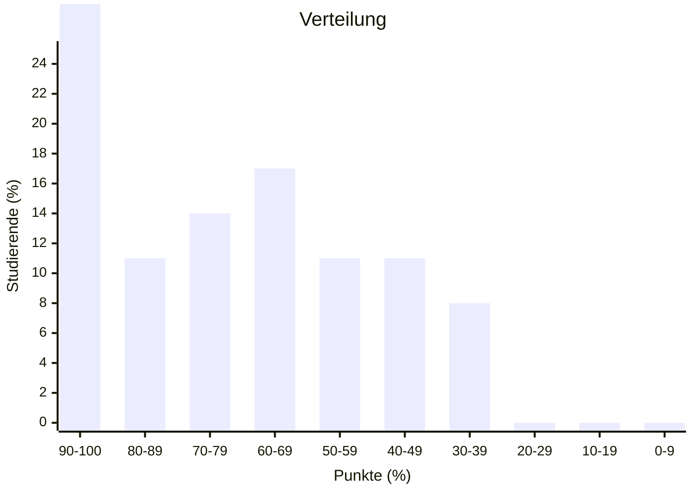
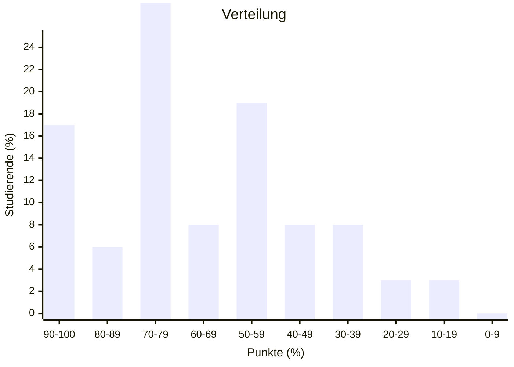
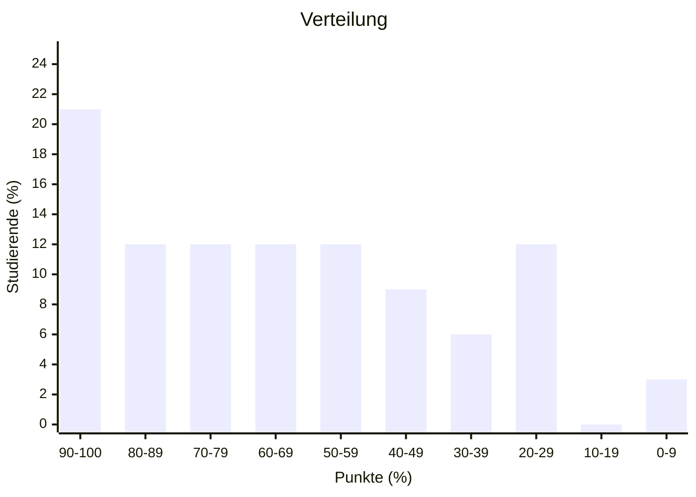
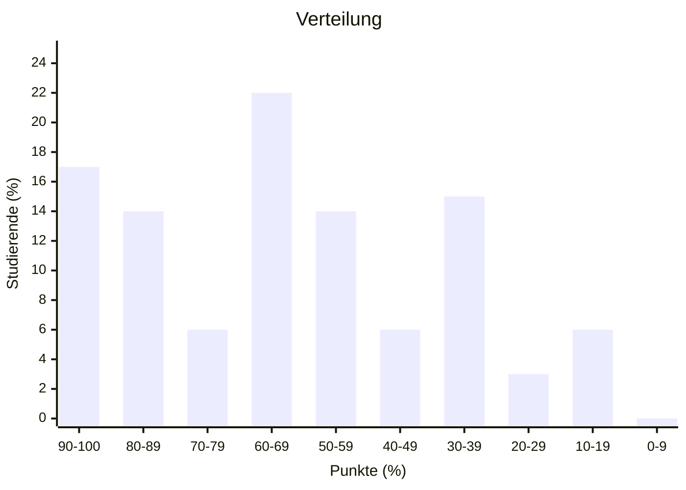

import Tabs from '@theme/Tabs'; import TabItem from '@theme/TabItem';

## Überblick

|                | Klausur Q4 2024 (WWIBE224) | Klausur Q1 2023 (WWIBE123) | Klausur Q4 2022 (WWIBE122) | Klausur Q1 2021 (WWIBE121) | Durchschnitt |
| -------------- | -------------------------- | -------------------------- | -------------------------- | -------------------------- | ------------ |
| Punkteschnitt  | 72                         | 65                         | 62                         | 63                         | 66           |
| Notenschnitt   | 2,6                        | 3,0                        | 3,1                        | 3,1                        | 3,0          |
| Durchfallquote | 19%                        | 22%                        | 30%                        | 28%                        | 25%          |

## Verteilung

<Tabs>
  <TabItem value="wwibe224" label="Klausur Q4 2024" default>

  </TabItem>
  <TabItem value="wwibe123" label="Klausur Q1 2024">

  </TabItem>
  <TabItem value="wwibe122" label="Klausur Q4 2022">

  </TabItem>
  <TabItem value="wwibe121" label="Klausur Q1 2022">

  </TabItem>
</Tabs>
