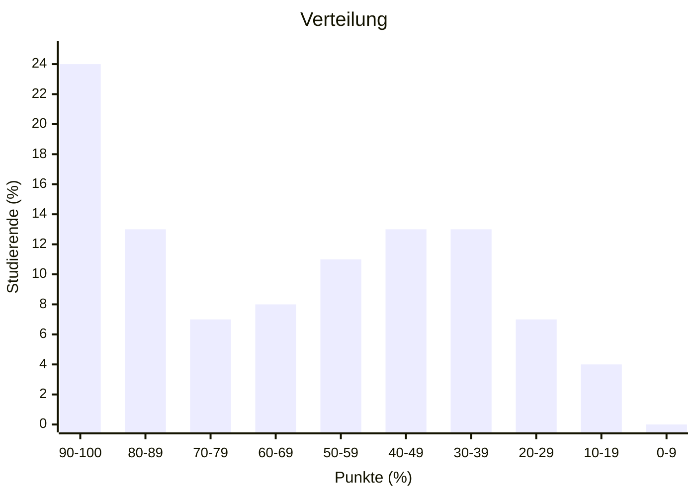
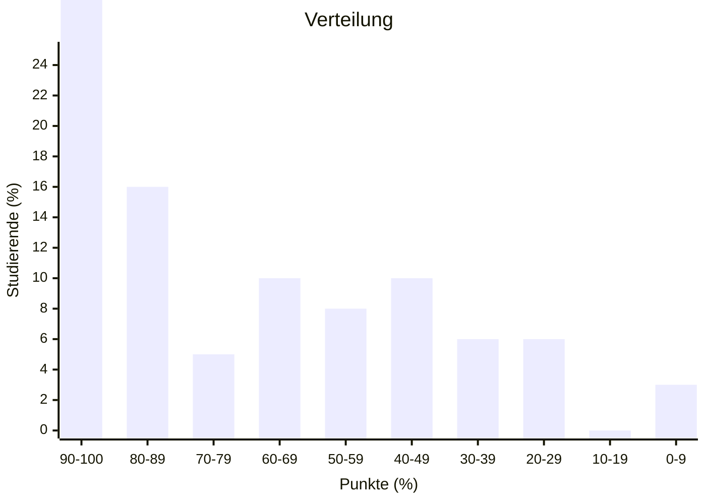
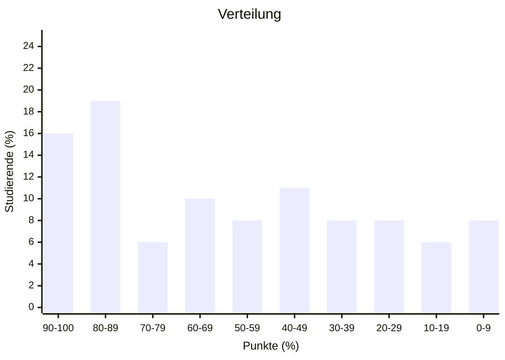
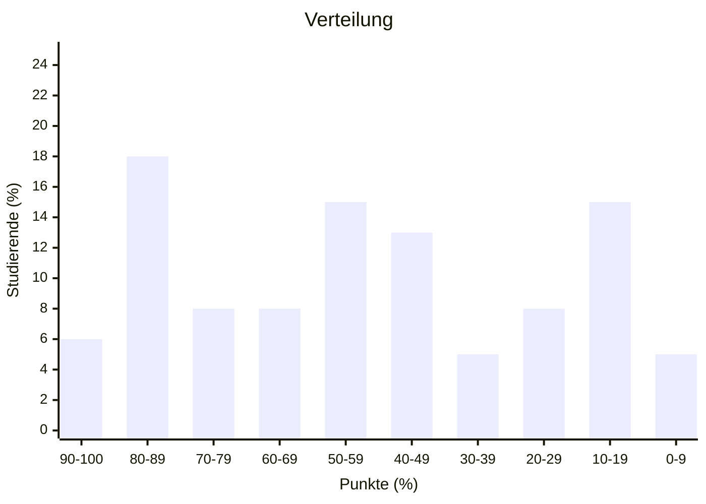

import Tabs from '@theme/Tabs'; import TabItem from '@theme/TabItem';

## Überblick

|                | Klausur Q2 2025 (WWIBE24) | Klausur Q3 2024 (WWIBE23) | Klausur Q2 2023 (WWIBE22) | Klausur Q3 2022 (WWIBE21) | Durchschnitt |
| -------------- | ------------------------- | ------------------------- | ------------------------- | ------------------------- | ------------ |
| Punkteschnitt  | 32                        | 36                        | 29                        | 26                        | 31           |
| Notenschnitt   | 3,1                       | 2,6                       | 3,3                       | 3,6                       | 3,2          |
| Durchfallquote | 37%                       | 22%                       | 38%                       | 41%                       | 35%          |

## Verteilung

<Tabs>
  <TabItem value="wwibe24" label="Klausur Q2 2025" default>

  </TabItem>
  <TabItem value="wwibe23" label="Klausur Q3 2024">

  </TabItem>
  <TabItem value="wwibe22" label="Klausur Q2 2023">

  </TabItem>
  <TabItem value="wwibe21" label="Klausur Q3 2022">

  </TabItem>
</Tabs>
