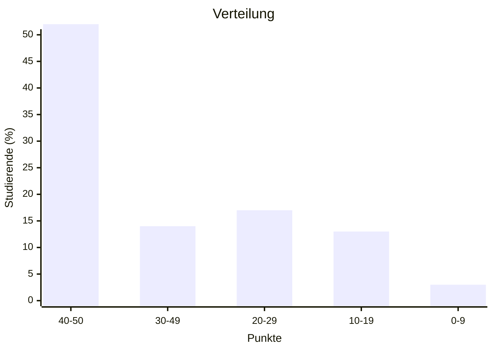
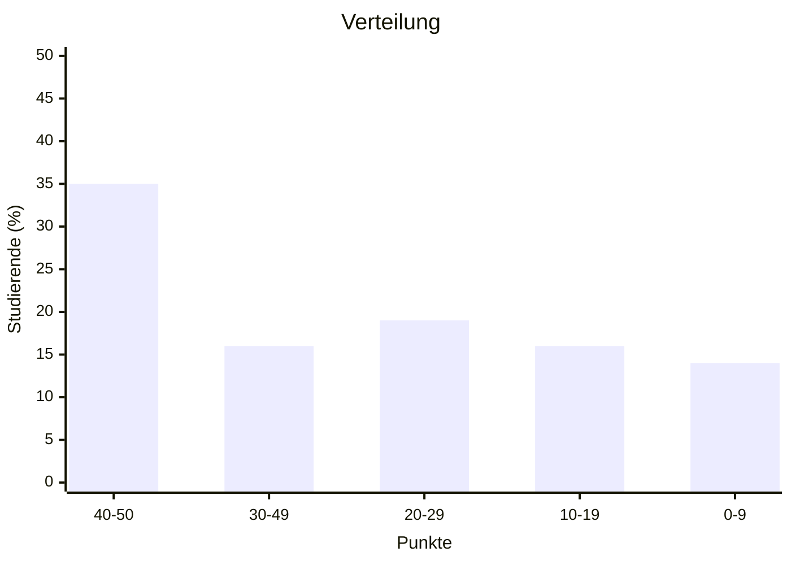
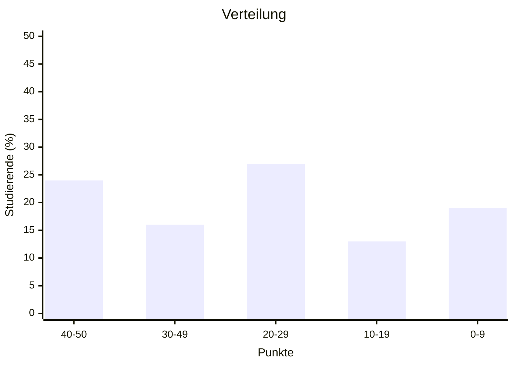

import Tabs from '@theme/Tabs'; import TabItem from '@theme/TabItem';

<Tabs>
  <TabItem value="wwibe23" label="Klausur Q3 2024" default>

- Kurse: WWIBE123 und WWIBE223
- Punkteschnitt: 36 von 50
- Notenschnitt: 2,6
- Durchfallquote: 22%

  </TabItem>
  <TabItem value="wwibe22" label="Klausur Q2 2023">

- Kurse: WWIBE122 und WWIBE222
- Punkteschnitt: 29 von 50
- Notenschnitt: 3,3
- Durchfallquote: 38%

  </TabItem>
  <TabItem value="wwibe21" label="Klausur Q3 2022">

- Kurse: WWIBE121 und WWIBE221
- Punkteschnitt: 26 von 50
- Notenschnitt: 3,6
- Durchfallquote: 41%

  </TabItem>
</Tabs>
