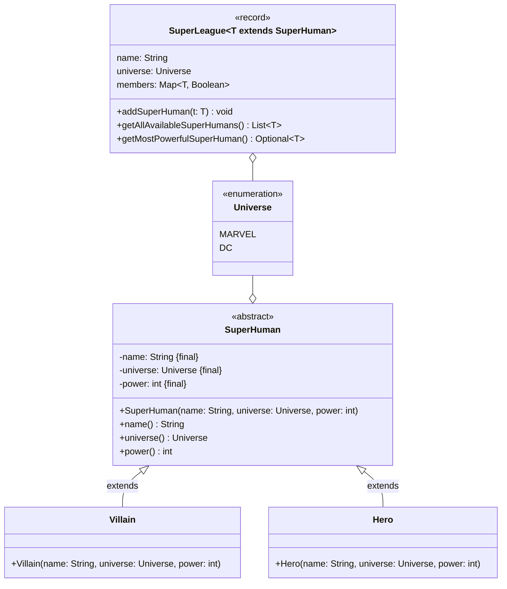
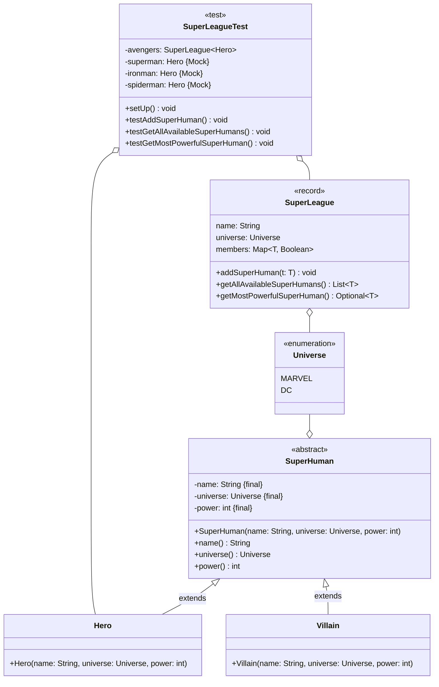
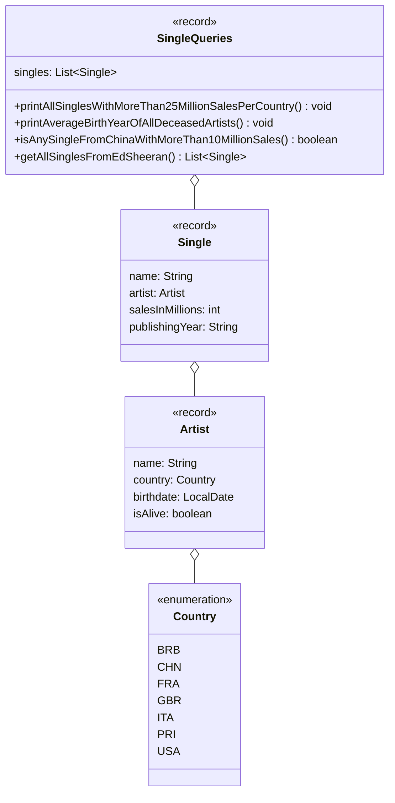

## Hinweise zur Klausur

- Die in dieser Klausur verwendeten Personenbezeichnungen beziehen sich – sofern
  nicht anders kenntlich gemacht – auf alle Geschlechter
- Pakete und Klassenimporte müssen nicht angegeben werden
- Die Klassen und Annotationen der Bibliotheken _Lombok_, _JUnit 5_ und
  _Mockito_ dürfen verwendet werden
- Es kann davon ausgegangen werden, dass sämtliche Klassen entsprechende
  Implementierungen der Object-Methoden besitzen
- So nicht anders angegeben sollen Konstruktoren, Setter, Getter sowie die
  Object-Methoden wie in der Vorlesung gezeigt implementiert werden
- Die Konsolenausgaben-Methoden der Klasse `PrintStream` dürfen sinnvoll gekürzt
  geschrieben werden (zum Beispiel _syso("Hello World")_ statt
  _System.out.println("Hello World")_)
- Methoden- und Attributsbezeichner dürfen sinnvoll gekürzt geschrieben werden
  (zum Beispiel _getLWMCP()_ statt _getLectureWithMostCreditPoints()_)

## Aufgabe 1 (16 Punkte)

Erstelle die Klasse `SuperLeague<T extends SuperHuman>` anhand des abgebildeten
Klassendiagrams.

### Klassendiagramm



### Hinweise zur Klasse _SuperLeague_

- Die Schlüssel-Werte-Paare des Assoziativspeichers beinhalten als Schlüssel die
  Übermenschen der Liga sowie als Wert deren Verfügbarkeit
- Die Methode `Optional<T> getMostPowerfulSuperHuman()` soll den stärksten
  Übermenschen der Liga zurückgeben (5,5 Punkte)
- Die Methode `void addSuperHuman(t: T)` soll der Liga den eingehenden
  Übermenschen als verfügbares Mitglied hinzufügen. Für den Fall, dass das
  Universum des eingehenden Übermenschen nicht dem Universum der Liga
  entspricht, soll die Ausnahme `WrongUniverseException` ausgelöst werden (4
  Punkte)
- Die Methode `List<T> getAllAvailableSuperHumans()` soll alle verfügbaren
  Übermenschen der Liga zurückgeben (4,5 Punkte)

### Musterlösung

```java title="SuperLeage.java" showLineNumbers
public record SuperLeague<T extends SuperHuman>(String name, Universe universe,
      Map<T, Boolean> members) { // 2

   public Optional<T> getMostPowerfulSuperHuman() { // 0,5
      T mostPowerfulSuperHuman = null; // 0,5
      int power = 0; // 0,5
      for (T t : members.keySet()) { // 1
         if (t.power() > power) { // 1
            power = t.power(); // 0,5
            mostPowerfulSuperHuman = t; // 0,5
         }
      }
      return Optional.ofNullable(mostPowerfulSuperHuman); // 1
   } // 5,5

   public void addSuperHuman(T t) throws WrongUniverseException { // 1
      if (!t.universe().equals(universe)) { // 1
         throw new WrongUniverseException(); // 1
      }
      members.put(t, true); // 1
   } // 4

   public List<T> getAllAvailableSuperHumans() { // 0,5
      List<T> allAvailableSuperHumans = new ArrayList<>(); // 0,5
      for (Entry<T, Boolean> entry : members.entrySet()) { // 1
         if (entry.getValue().equals(true)) { // 1
            allAvailableSuperHumans.add(entry.getKey()); // 1
         }
      }
      return allAvailableSuperHumans; // 0,5
   } // 4,5

} // 16
```

## Aufgabe 2 (18 Punkte)

Erstelle die JUnit-5-Testklasse `SuperLeagueTest` anhand des abgebildeten
Klassendiagramms.

### Klassendiagramm



### Hinweise zur Klasse _SuperLeagueTest_

- Die Lebenszyklus-Methode `void setUp()` soll sämtliche Mock-Objekte sowie die
  Superheldenliga _Avengers_ (Name: Avengers, Universum: MARVEL) erstellen und
  den entsprechenden Attributen zuweisen und der Superheldenliga _Avengers_ den
  Superhelden _Iron Man_ als verfügbaren sowie den Superhelden _Spider-Man_ als
  nicht verfügbaren Superhelden hinzufügen (5 Punkte)
- Die Testmethode `void testAddSuperHuman()` soll prüfen, ob beim Aufruf der
  Methode `void addSuperHuman(t: T)` mit dem Superhelden _Superman_ die Ausnahme
  `WrongUniverseException` ausgelöst wird. Hierzu soll das Mock-Objekt
  _Superman_ beim Aufruf der Methode `Universe universe()` den Wert _DC_
  zurückgeben (3 Punkte)
- Die Testmethode `void testGetAllAvailableSuperHumans()` soll prüfen, ob beim
  Aufruf der Methode `List<T> getAllAvailableSuperHumans()` eine Liste der Größe
  1 zurückgegeben wird (2,5 Punkte)
- Die Testmethode `void testGetMostPowerfulSuperHuman()` soll prüfen, ob beim
  Aufruf der Methode `Optional<T> getMostPowerfulSuperHuman()` der Superheld
  _Spider-Man_ als Optional zurückgegeben wird. Hierzu soll das Mock-Objekt
  _Iron Man_ beim Aufruf der Methode `int power()` den Wert 7 und das
  Mock-Objekt _Spider-Man_ den Wert 8 zurückgeben (3,5 Punkte)

### Musterlösung

```java title="SuperLeagueTest.java" showLineNumbers
public class SuperLeagueTest { // 0,5

   private SuperLeague<Hero> avengers; // 0,5
   @Mock // 0,5
   private Hero superman; // 0,5
   @Mock // 0,5
   private Hero ironman; // 0,5
   @Mock // 0,5
   private Hero spiderman; // 0,5

   @BeforeEach // 0,5
   void setUp() { // 0,5
      MockitoAnnotations.openMocks(this); // 1
      avengers = new SuperLeague<>("Avengers", Universe.MARVEL, new HashMap<>()); // 1
      avengers.getMembers().put(ironman, true); // 1
      avengers.getMembers().put(spiderman, false); // 1
   } // 5

   @Test // 0,5
   void testAddSuperHuman() { // 0,5
      when(superman.universe()).thenReturn(Universe.DC); // 0,5
      assertThrows(WrongUniverseException.class, () -> avengers.addSuperHuman(superman)); // 1,5
   } // 3

   @Test // 0,5
   void testGetAllAvailableSuperHumans() { // 0,5
      List<Hero> heroes = avengers.getAllAvailableSuperHumans(); // 0,5
      assertEquals(1, heroes.size()); // 1
   } // 2,5

   @Test // 0,5
   void testGetMostPowerfulSuperHuman() { // 0,5
      when(ironman.power()).thenReturn(7); // 0,5
      when(spiderman.power()).thenReturn(8); // 0,5
      assertEquals(Optional.of(spiderman), avengers.getMostPowerfulSuperHuman()); // 1,5
   } // 3,5

} // 18
```

## Aufgabe 3 (18 Punkte)

Erstelle die Klasse `SingleQueries` anhand des abgebildeten Klassendiagramms.

### Klassendiagramm



### Hinweise zur Klasse _SingleQueries_

- Die Methode `void printAllSinglesWithMoreThan25MillionSalesPerCountry()` soll
  alle Singles, die sich mehr als 25 Millionen mal verkauft haben, gruppiert
  nach dem Land in der Form _[Land des Künstlers]: [Singles]_ ausgeben (4
  Punkte)
- Die Methode `void printAverageBirthYearOfAllDeceasedArtists()` soll das
  durchschnittliche Geburtsjahr aller verstorbenen Künstler ausgeben. Für den
  Fall, dass es keinen verstorbenen Künstler gibt, soll der Wert -1 ausgegeben
  werden (5,5 Punkte)
- Die Methode `boolean isAnySingleFromChinaWithMoreThan10MillionSales()` soll
  zurückgeben, ob es eine Single eines Künstlers aus China (3,5 Punkte) gibt,
  welche sich mehr als 10 Millionen Mal verkauft hat
- Die Methode `List<Single> getAllSinglesFromEdSheeran()` soll alle Singles des
  Künstlers Ed Sheeran (Land: Großbritannien, Geburtstag: 17.02.1991, Status:
  lebendig) zurückgeben (4 Punkte)

### Musterlösung

```java title="SingleQueries" showLineNumbers
public record SingleQueries(List<Single> singles) { // 1

   public void printAllSinglesWithMoreThan25MillionSalesPerCountry() { // 0,5
      Map<Country, List<Single>> allSinglesWithMoreThan25MillionSalesPerCountry; // 0,5
      allSinglesWithMoreThan25MillionSalesPerCountry = singles.stream() // 0,5
            .filter(s -> s.salesInMillions() > 25) // 0,5
            .collect(Collectors.groupingBy(s -> s.artist().country())); // 1
      allSinglesWithMoreThan25MillionSalesPerCountry
            .forEach((c, sl) -> System.out.println(c + ": " + sl)); // 1
   } // 4

   public void printAverageBirthYearOfAllDeceasedArtists() { // 0,5
      OptionalDouble averageBirthYearOfAllDeceasedArtists; // 0,5
      averageBirthYearOfAllDeceasedArtists = singles.stream() // 0,5
            .map(Single::artist) // 0,5
            .distinct() // 0,5
            .filter(a -> !a.isAlive()) // 0,5
            .mapToInt(a -> a.birthdate().getYear()) // 1
            .average(); // 0,5
      averageBirthYearOfAllDeceasedArtists.ifPresentOrElse(System.out::println,
            () -> System.out.println(-1)); // 1
   } // 5,5

   public boolean isAnySingleFromChinaWithMoreThan10MillionSales() { // 0,5
      boolean isAnySingleFromChinaWithMoreThan10MillionSales; // 0,5
      isAnySingleFromChinaWithMoreThan10MillionSales = singles.stream() // 0,5
            .filter(s -> s.salesInMillions() > 10) // 0,5
            .anyMatch(s -> s.artist().country().equals(Country.CHN)); // 1
      return isAnySingleFromChinaWithMoreThan10MillionSales; // 0,5
   } // 3,5

   public List<Single> getAllSinglesFromEdSheeran() { // 0,5
      List<Single> allSinglesFromEdSheeran; // 0,5
      Artist sheeran = new Artist("Ed Sheeran", Country.GBR, LocalDate.of(1991, 2, 17), true); // 1
      allSinglesFromEdSheeran = singles.stream() // 0,5
            .filter(s -> s.artist().equals(sheeran)) // 0,5
            .toList(); // 0,5
      return allSinglesFromEdSheeran; // 0,5
   } // 4

} // 18
```
