import Tabs from '@theme/Tabs'; import TabItem from '@theme/TabItem';

## Klausur Q1 2024

- Kurse: WWIBE123
- Anzahl Klausuren: 36
- Punkteschnitt: 65,1 von 100

<Tabs>
  <TabItem value="points1" label="Punkteverteilung (1/5)" default>

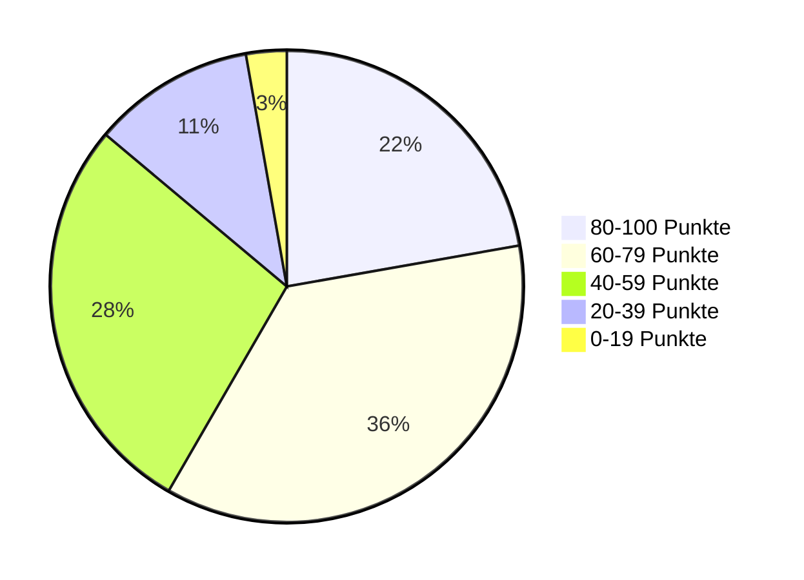

  </TabItem>
  <TabItem value="points2" label="Punkteverteilung (1/3)">

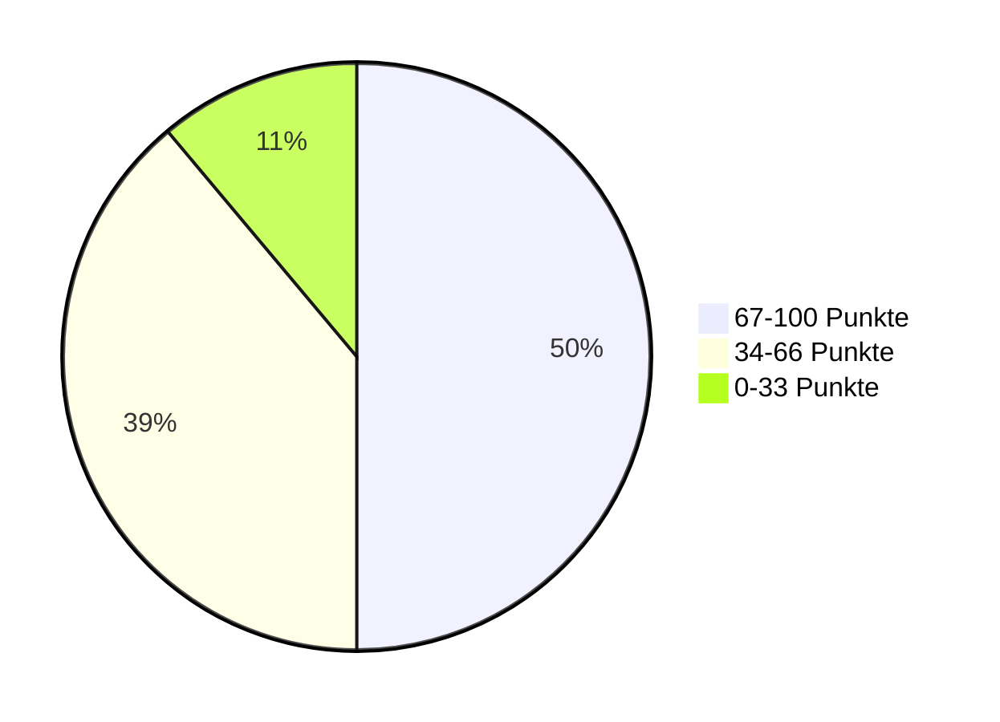

  </TabItem>
  <TabItem value="points3" label="Punkteverteilung (1/2)">

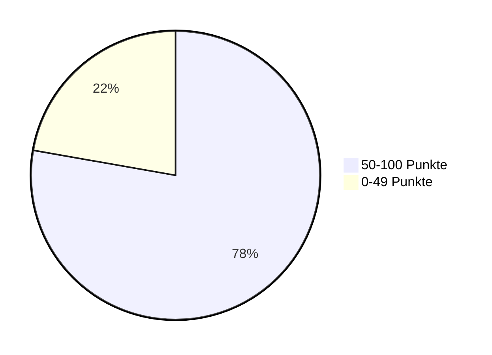

  </TabItem>
  <TabItem value="grades" label="Notenverteilung">

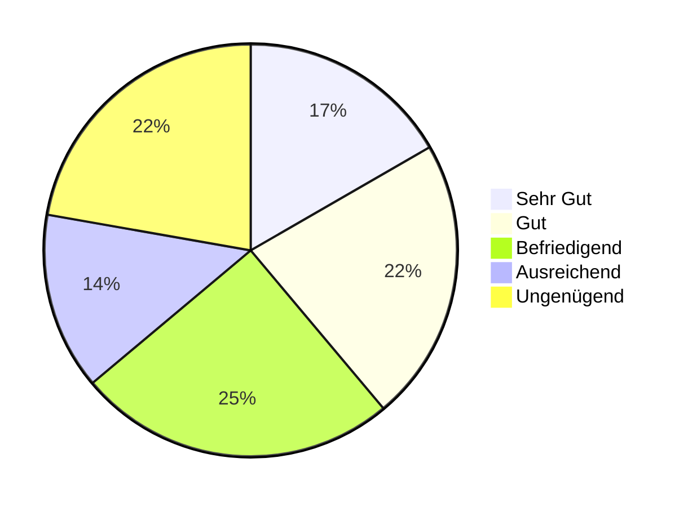

  </TabItem>
</Tabs>

## Klausur Q4 2022

- Kurse: WWIBE122
- Anzahl Klausuren: 33
- Punkteschnitt: 62,2 von 100

<Tabs>
  <TabItem value="points1" label="Punkteverteilung (1/5)" default>

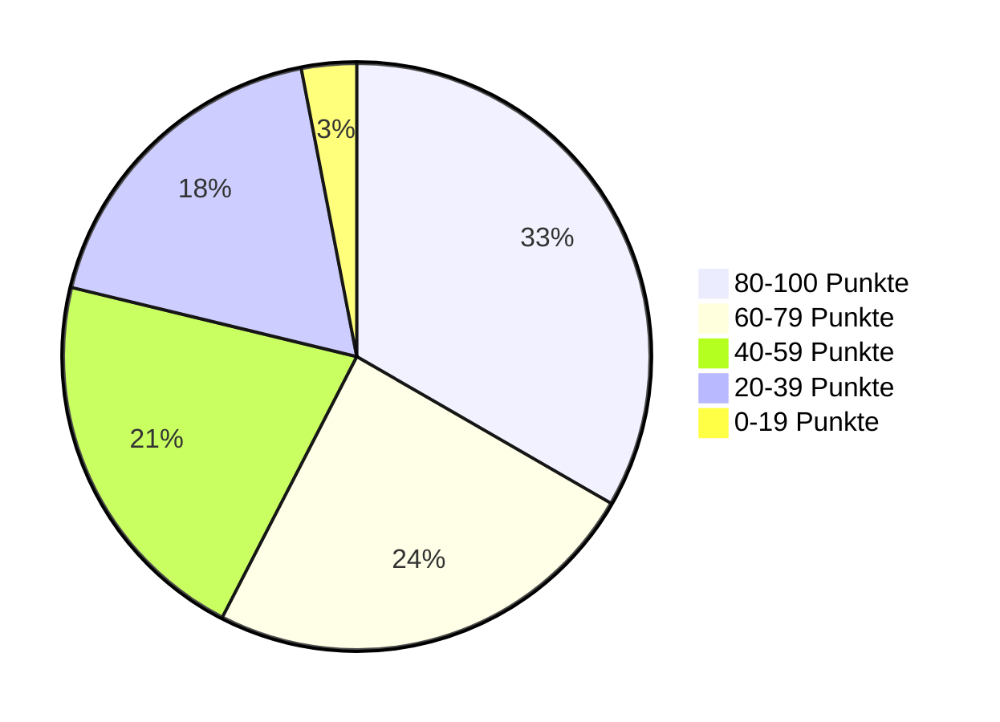

  </TabItem>
  <TabItem value="points2" label="Punkteverteilung (1/3)">

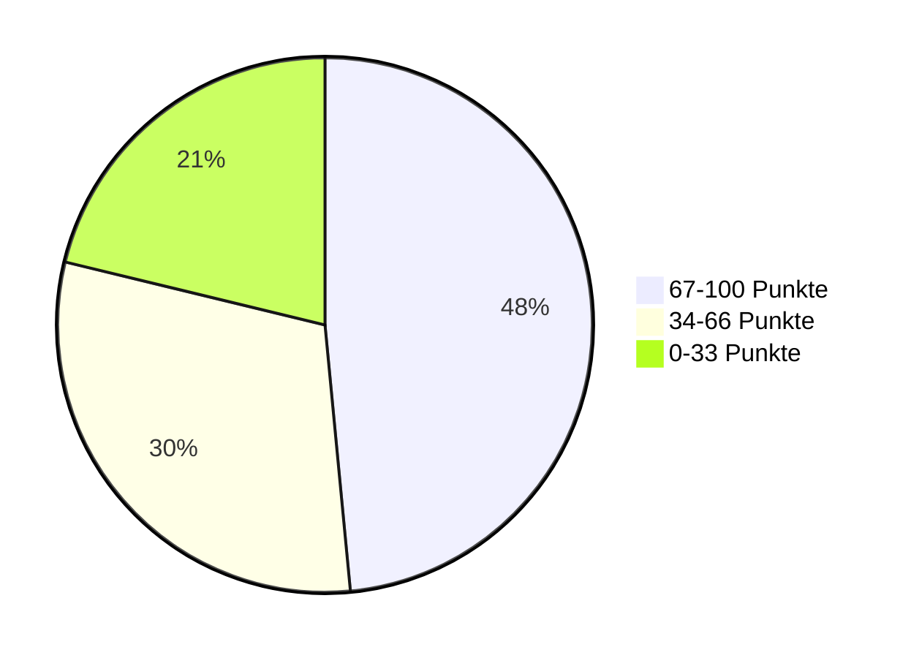

  </TabItem>
  <TabItem value="points3" label="Punkteverteilung (1/2)">

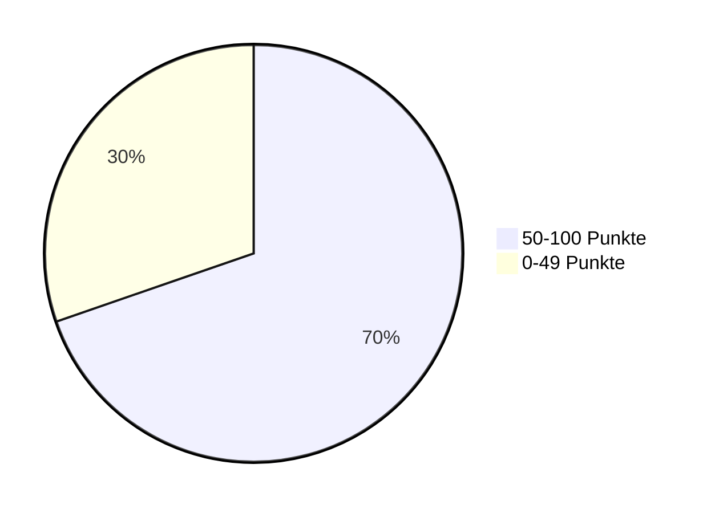

  </TabItem>
  <TabItem value="grades" label="Notenverteilung">

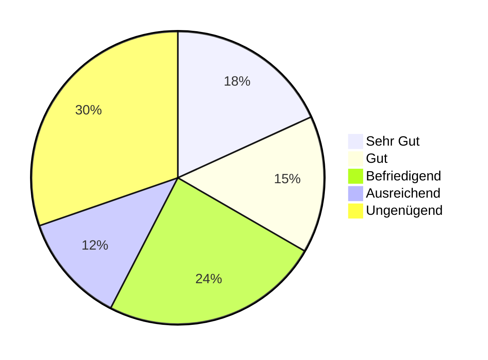

  </TabItem>
</Tabs>

## Klausur Q1 2022

- Kurse: WWIBE121
- Anzahl Klausuren: 36
- Punkteschnitt: 62,9 von 100

<Tabs>
  <TabItem value="points1" label="Punkteverteilung (1/5)" default>

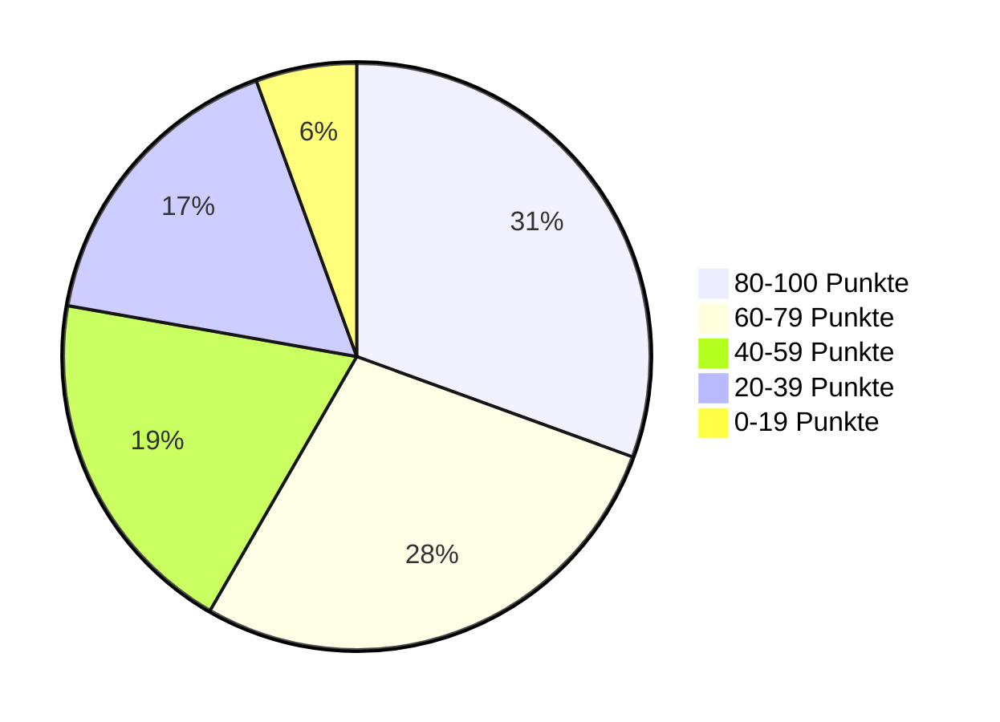

  </TabItem>
  <TabItem value="points2" label="Punkteverteilung (1/3)">

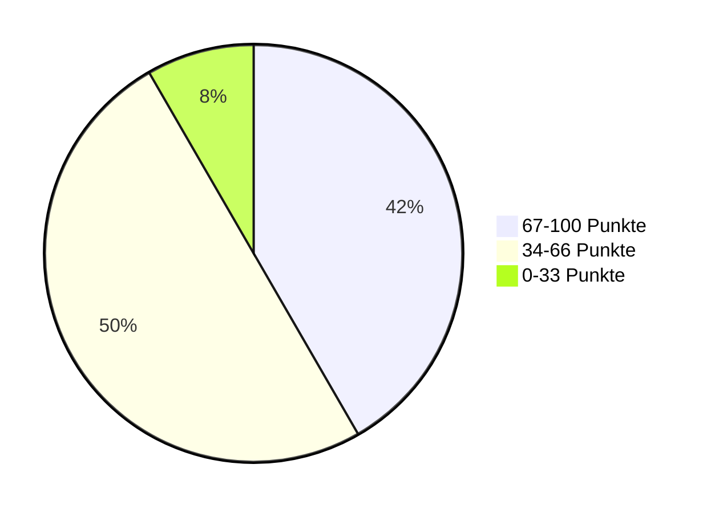

  </TabItem>
  <TabItem value="points3" label="Punkteverteilung (1/2)">

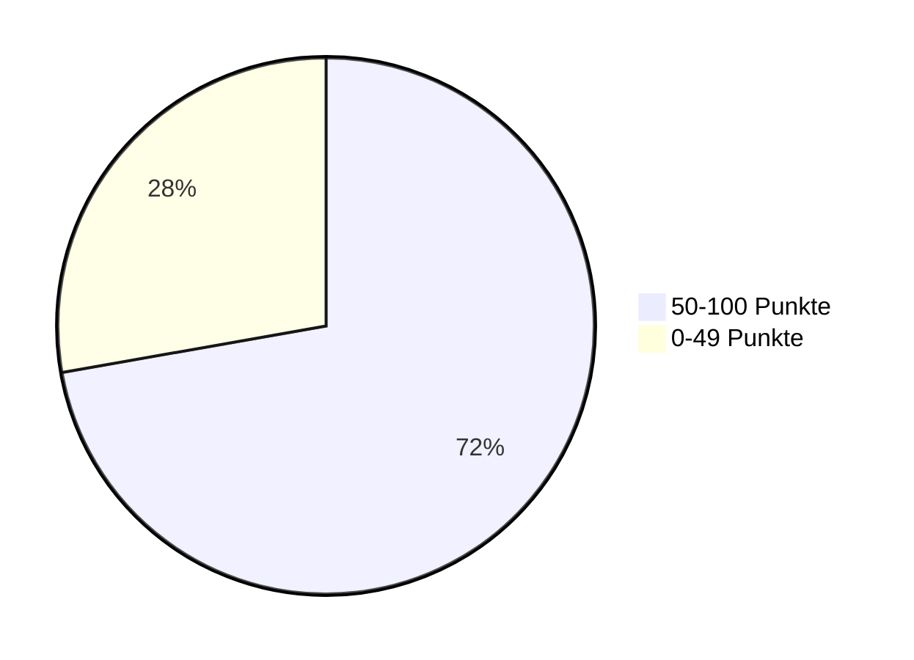

  </TabItem>
  <TabItem value="grades" label="Notenverteilung">

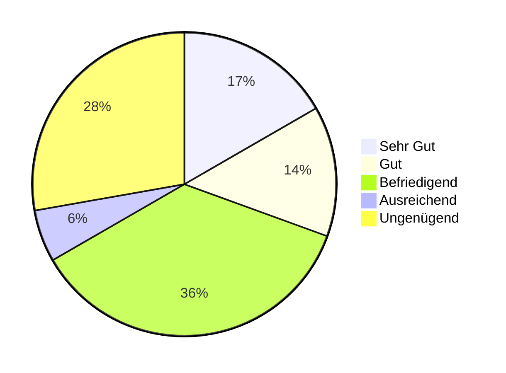

  </TabItem>
</Tabs>
