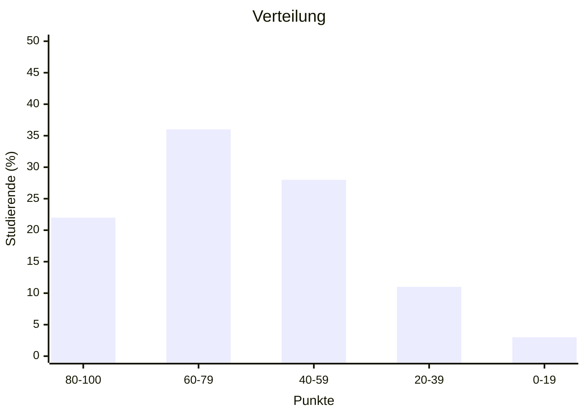
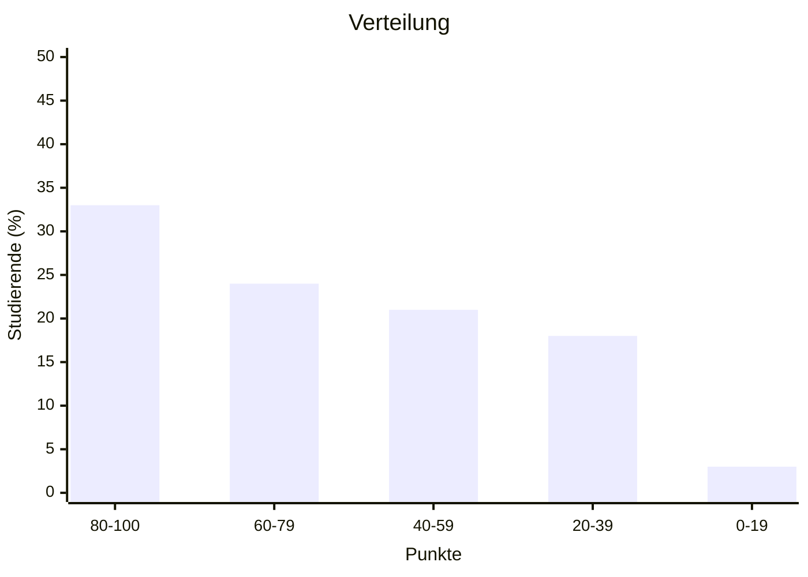
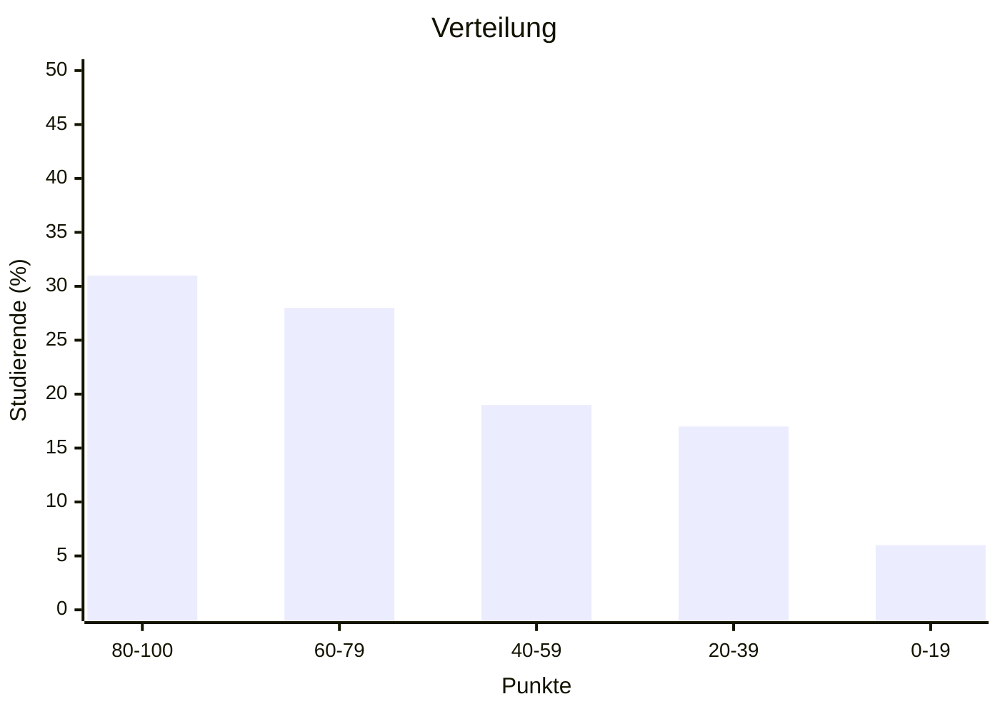

import Tabs from '@theme/Tabs'; import TabItem from '@theme/TabItem';

<Tabs>
  <TabItem value="wwibe23" label="Klausur Q1 2024 (WWIBE23)" default>

- Punkteschnitt: 65 von 100
- Durchfallquote: 22%

  </TabItem>
  <TabItem value="wwibe22" label="Klausur Q4 2024 (WWIBE22)">

- Punkteschnitt: 62 von 100
- Durchfallquote: 30%

  </TabItem>
  <TabItem value="wwibe21" label="Klausur Q1 2022 (WWIBE21)">

- Punkteschnitt: 63 von 100
- Durchfallquote: 28%

  </TabItem>
</Tabs>
