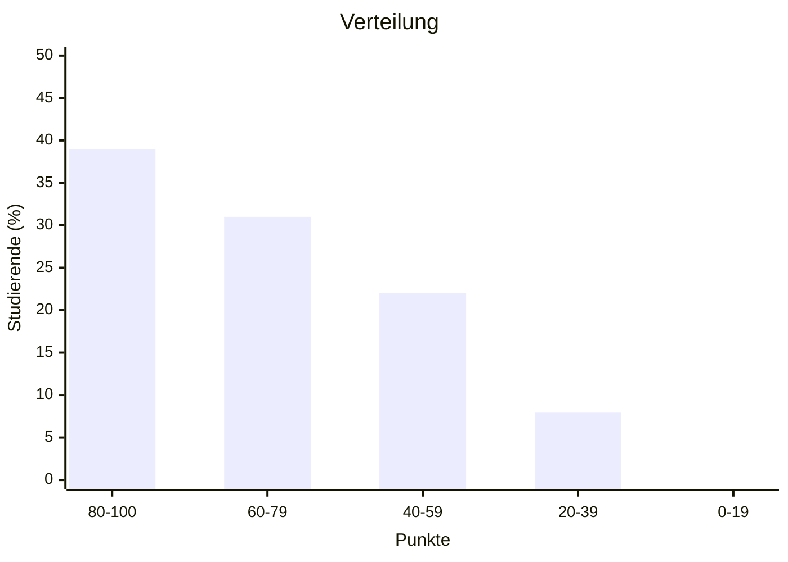
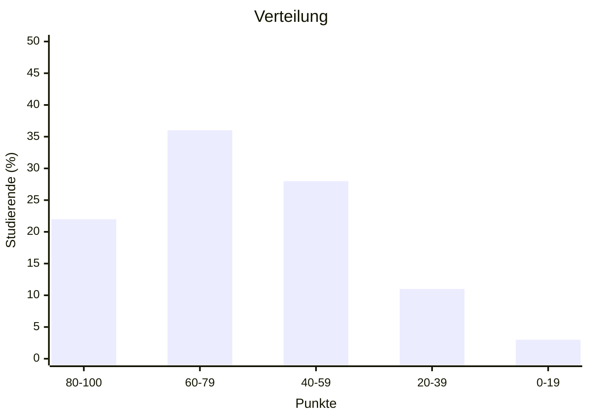
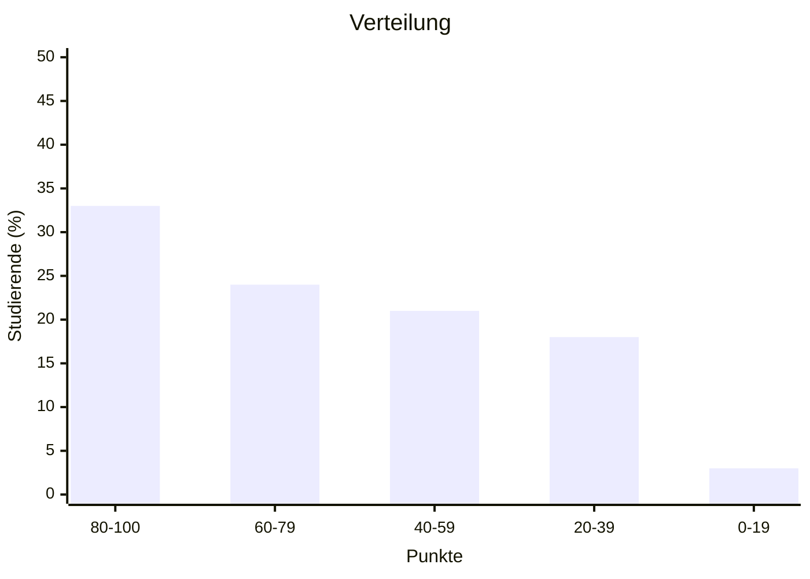
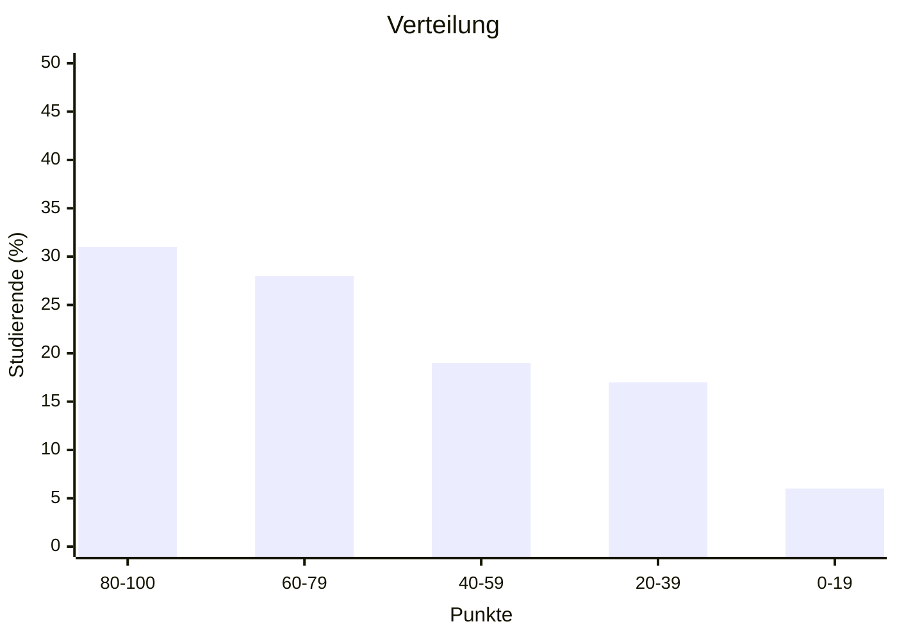

import Tabs from '@theme/Tabs'; import TabItem from '@theme/TabItem';

<Tabs>
  <TabItem value="wwibe224" label="Klausur Q4 2024" default>

- Kurs: WWIBE224
- Punkteschnitt: 72 von 100
- Notenschnitt: 2,6
- Durchfallquote: 19%

  </TabItem>
  <TabItem value="wwibe123" label="Klausur Q1 2024">

- Kurs: WWIBE123
- Punkteschnitt: 65 von 100
- Notenschnitt: 3,0
- Durchfallquote: 22%

  </TabItem>
  <TabItem value="wwibe122" label="Klausur Q4 2022">

- Kurs: WWIBE122
- Punkteschnitt: 62 von 100
- Notenschnitt: 3,1
- Durchfallquote: 30%

  </TabItem>
  <TabItem value="wwibe121" label="Klausur Q1 2022">

- Kurs: WWIBE121
- Punkteschnitt: 63 von 100
- Notenschnitt: 3,1
- Durchfallquote: 28%

  </TabItem>
</Tabs>
