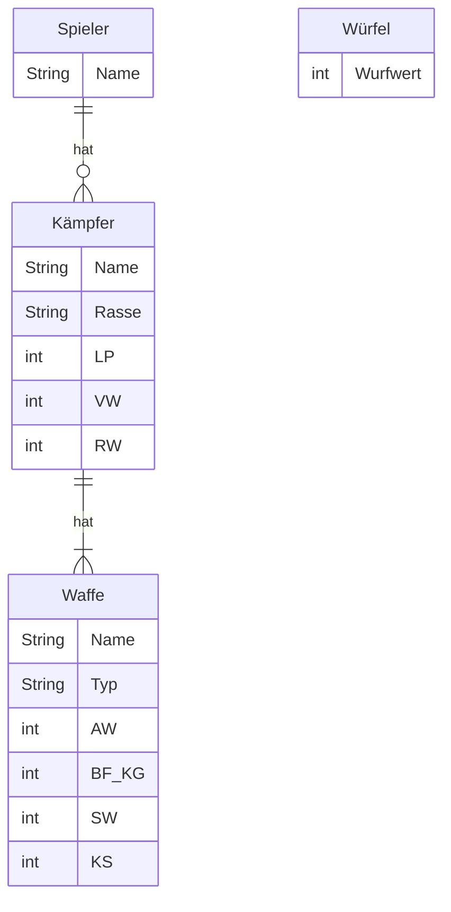

Im Rahmen der Vorlesungswiederholung soll Schritt für Schritt eine abgespeckte
Variante des Tabletop-Spiels
_[Warhammer 40,000 Kill Team](https://www.warhammer.com/en-GB/other-games-kill-team-LP)_
entwickelt werden. Bei diesem Strategiespiel für zwei Spieler kämpfen zwei
sogenannten Kill Teams mit dem Ziel gegeneinander, entsprechende Missionsziele
zu erfüllen bzw. das gegnerische Team auszulöschen.

## Spielablauf

Das Spiel soll aus mehreren Runden bestehen und solange dauern, bis ein Spieler
keine Kämpfer mehr hat. In jeder Runde sollen sich die Kämpfer der Spieler
gegenseitig abwechselnd angreifen können. Dabei soll jeder Spieler entscheiden
können, ob der eigene Kämpfer einen Fernkampfangriff oder einen Nahkampfangriff
ausführen soll. Sinken die Lebenspunkte eines Kämpfer bei einem Angriff auf Null
oder unter Null, "stirbt" der Kämpfer und steht dem Spieler nicht mehr zur
Verfügung.

## Ablauf eines Fernkampfangriffs und Ermittlung des Schadens

Der angreifende Spieler würfelt mit der Anzahl AW seiner Fernkampfwaffe, der
verteidigende Spieler würfelt mit der Anzahl VW. Anschließend wird der Schaden
berechnet und dem verteidigenden Spieler Lebenspunkte in Höhe des Schadens
abgezogen. Der Schaden berechnet sich dabei gemäß der Formel _(Anzahl Treffer -
Anzahl Blocks) x SW + (Anzahl Kritischer Treffer - Anzahl Kritischer Blocks) x
KS_. Die Anzahl Treffer ergibt sich aus der Summe der Wurfwerte des angreifenden
Spielers >= BF_KG, die Anzahl Blocks aus der Summe der Wurfwerte des
verteidigenden Spielers >= RW.

**Hinweise**

- Wurfwerte sollen zwischen 1 und 6 liegen
- Wurfwerte gleich 6 sollen Kritische Treffer bzw. Kritische Blocks darstellen

## Ablauf eines Nahkampfangriffs und Ermittlung des Schadens

Beide Spieler würfeln mit der Anzahl AW ihrer Nahkampfwaffe. Anschließend soll
jeder Spieler, beginnend beim angreifenden Spieler, abwechselnd entscheiden
können, ob eine (Kritische) Attacke als (Kritischer) Schlag oder als (Kritische)
Parade gelten soll. Die Anzahl Attacken ergibt sich aus der Summe der
Wurfwerte >= BF_KG. Bei einem (Kritischen) Schlag werdem dem gegnerischen
Spieler Lebenspunkte in Höhe SW bzw. KS abgezogen, bei einer (Kritischen) Parade
wird die Anzahl (Kritischer) Attacken des gegnerischen Spielers um 1 reduziert.

**Hinweise**

- Wurfwerte sollen zwischen 1 und 6 liegen
- Wurfwerte gleich 6 sollen Kritische Attacken darstellen

## ER-Modell

LP = Lebenspunkte, VW = Verteidigungswert, RW = Rüstungswurf, AW = Attackenwert,
BF_KG = Ballistische Fertigkeit / Kampfgeschick, SW = Schadenswert, KS =
Kritischer Schadenswert
