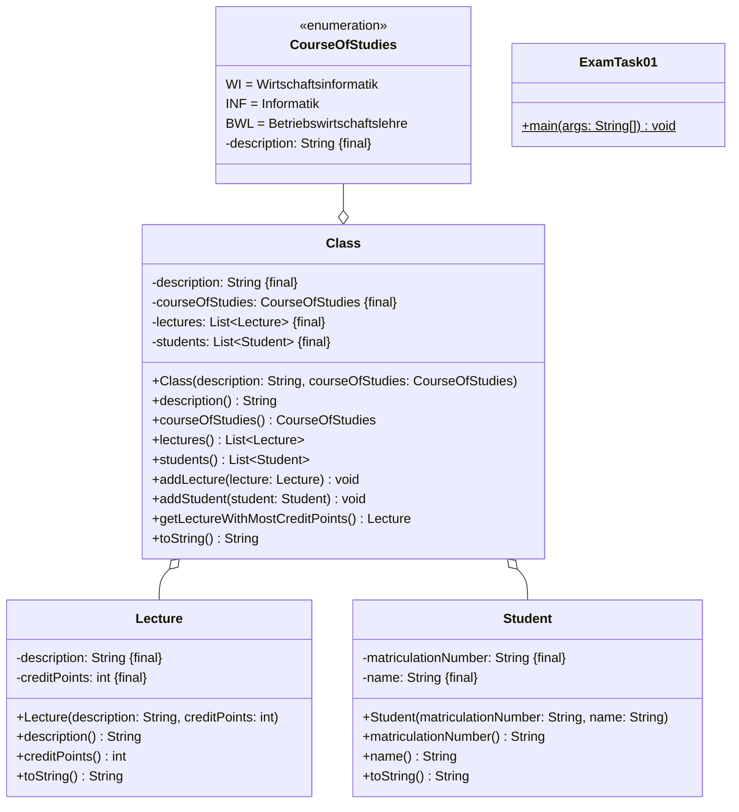
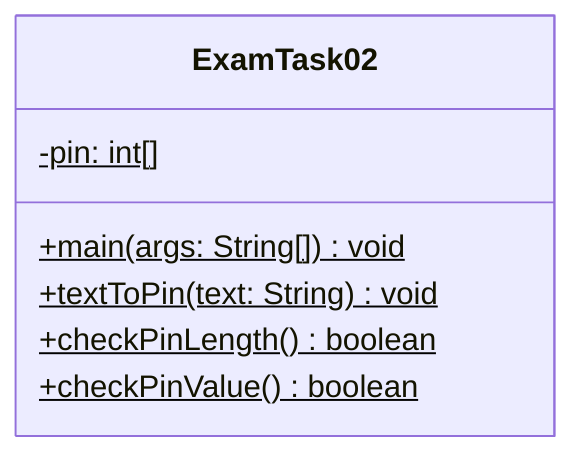
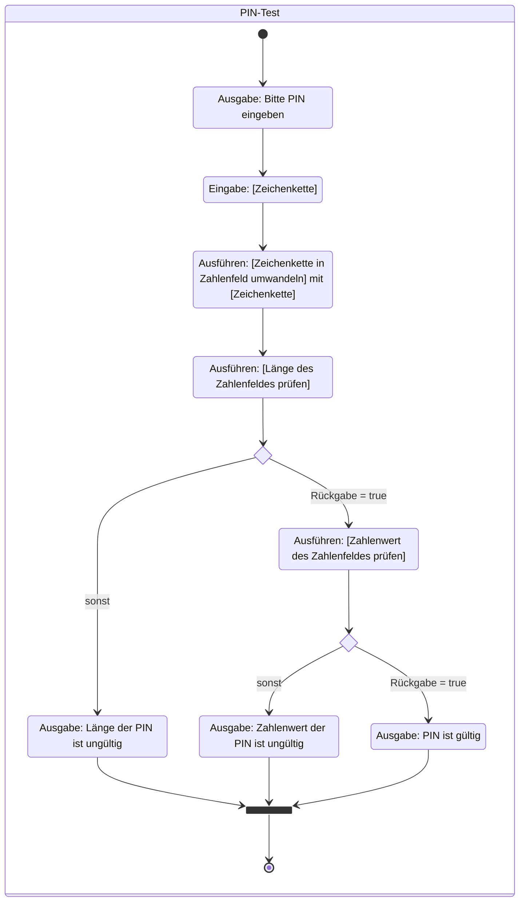
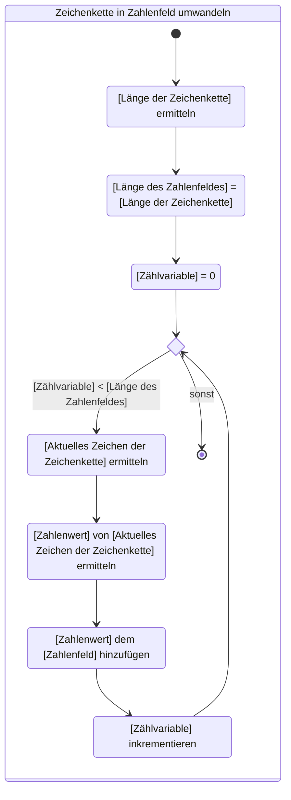
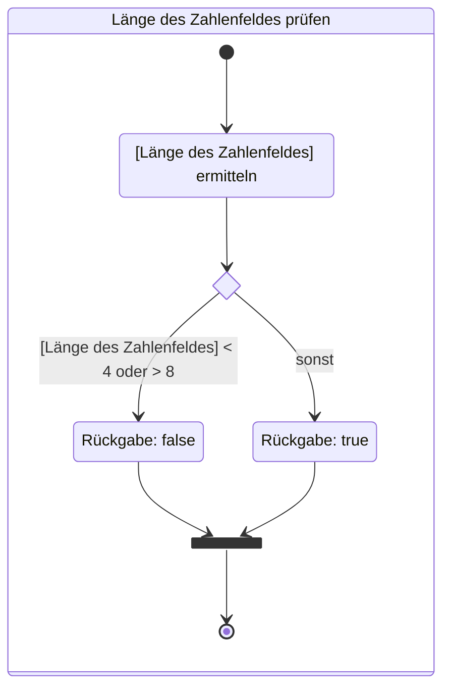
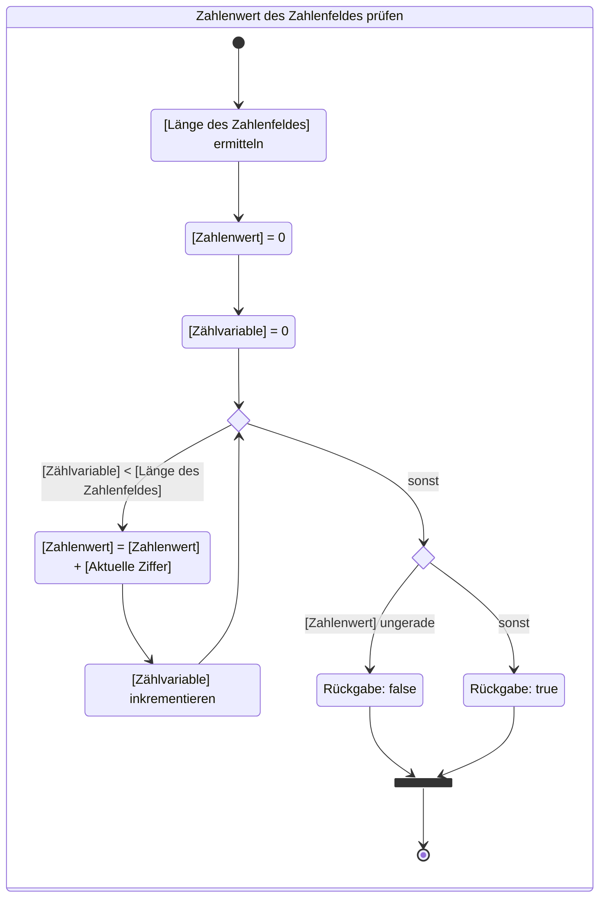
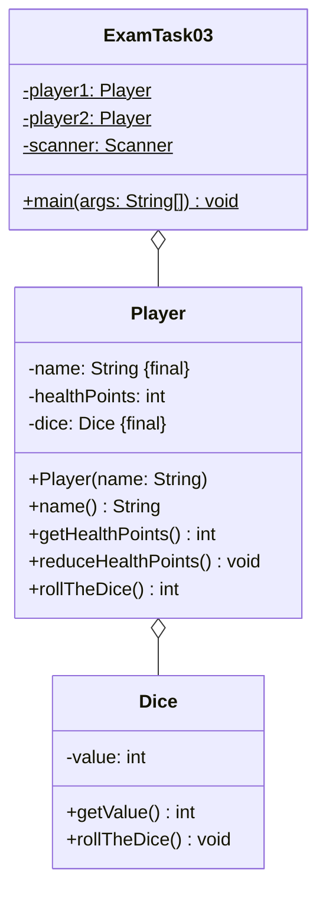
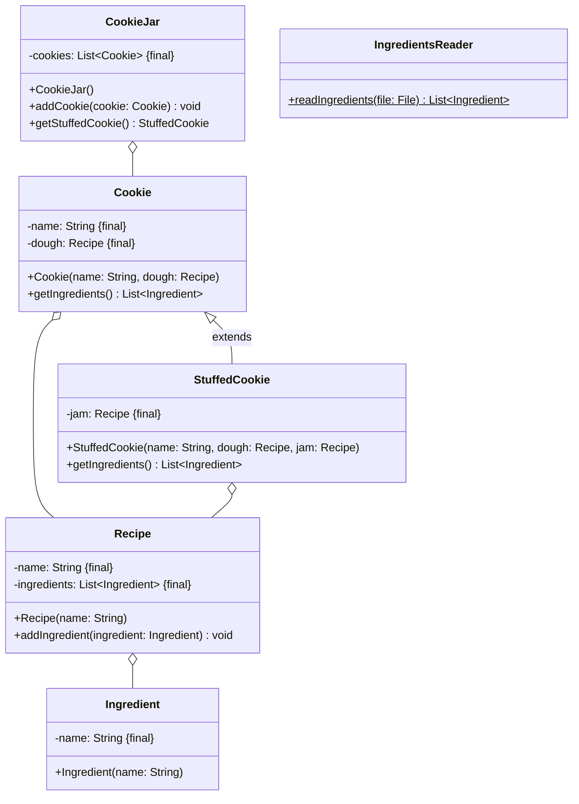

## Hinweise zur Klausur

- Die in dieser Klausur verwendeten Personenbezeichnungen beziehen sich – sofern
  nicht anders kenntlich gemacht – auf alle Geschlechter
- Pakete und Klassenimporte müssen nicht angegeben werden
- Es kann davon ausgegangen werden, dass sämtliche Klassen entsprechende
  Implementierungen der Object-Methoden besitzen
- Der Stereotyp `enumeration` impliziert, dass die Aufzählung einen passenden
  Konstruktor sowie gegebenenfalls passende Getter für alle Attribute besitzt
- So nicht anders angegeben sollen Konstruktoren, Setter, Getter sowie die
  Object-Methoden wie in der Vorlesung gezeigt implementiert werden
- Die Konsolenausgaben-Methoden der Klasse `PrintStream` dürfen sinnvoll gekürzt
  geschrieben werden (zum Beispiel _syso("Hello World")_ statt
  _System.out.println("Hello World")_)
- Methoden- und Attributsbezeichner dürfen sinnvoll gekürzt geschrieben werden
  (zum Beispiel _getLWMCP()_ statt _getLectureWithMostCreditPoints()_)

## Aufgabe 1 (26 Punkte)

- Erstelle die Klasse `Class` anhand des abgebildeten Klassendiagramms (18
  Punkte)
- Erstelle die ausführbare Klasse `ExamTask01` wie folgt (8 Punkte): Erstelle
  einen Kurs mit 2 Studierenden und 2 Vorlesungen und gib anschließend den Kurs
  sowie die Vorlesung mit den meisten Creditpoints auf der Konsole aus

### Klassendiagramm



### Hinweise zur Klasse _Class_

- Der Konstruktor soll alle Attribute initialisieren (2,5 Punkte)
- Die Methode `void addStudent(student Student)` soll der Studierendenliste
  (`students`) den eingehenden Studierenden hinzufügen (1 Punkt)
- Die Methode `void addLecture(lecture Lecture)` soll der Vorlesungsliste
  (`lectures`) die eingehende Vorlesung hinzufügen (1 Punkt)
- Die Methode `Lecture getLectureWithMostCreditPoints()` soll die Vorlesung mit
  den meisten Creditpoints zurückgeben (5 Punkte)
- Die Methode `String toString()` soll den Kurs in der Form _Class
  [description=[Beschreibung des Kurses\], courseOfStudies=[Beschreibung des
  Studiengangs\], lectures=[Vorlesungen\], students=[Studierende\]\]_
  zurückgeben (2 Punkte)

### Musterlösung

```java title="Class.java" showLineNumbers
public class Class { // 0,5

  private final String description; // 0,5
  private final CourseOfStudies courseOfStudies; // 0,5
  private final List<Lecture> lectures; // 0,5
  private final List<Student> students; // 0,5

  public Class(String description, CourseOfStudies courseOfStudies) { // 0,5
    this.description = description; // 0,5
    this.courseOfStudies = courseOfStudies; // 0,5
    lectures = new ArrayList<>(); // 0,5
    students = new ArrayList<>(); // 0,5
  } // 2,5

  public String description() { // 0,5
    return description; // 0,5
  } // 1

  public CourseOfStudies courseOfStudies() { // 0,5
    return courseOfStudies; // 0,5
  } // 1

  public List<Lecture> lectures() { // 0,5
    return lectures; // 0,5
  } // 1

  public List<Student> students() { // 0,5
    return students; // 0,5
  } // 1

  public void addLecture(Lecture lecture) { // 0,5
    lectures.add(lecture); // 0,5
  } // 1

  public void addStudent(Student student) { // 0,5
    students.add(student); // 0,5
  } // 1

  public Lecture getLectureWithMostCreditPoints() { // 0,5
    Lecture lecture = lectures.get(0); // 0,5
    int creditPoints = lecture.creditPoints(); // 0,5
    for (int i = 0; i < lectures.size(); i++) { // 1
      if (lectures.get(i).creditPoints() > creditPoints) { // 1
        lecture = lectures.get(i); // 0,5
        creditPoints = lecture.creditPoints(); // 0,5
      }
    }
    return lecture; // 0,5
  } // 5

  public String toString() { // 0,5
    return "Class [description=" + description + ", courseOfStudies=" + courseOfStudies.description()
      + ", lectures=" + lectures + ", students=" + students + "]"; // 1,5
  } // 2

}
```

```java title="ExamTask01.java" showLineNumbers
public class ExamTask01 { // 0,5

  public static void main(String[] args) { // 0,5

    Class class1 = new Class("WWIBE122", CourseOfStudies.WI); // 1
    class1.addStudent(new Student("8271625", "Hans Maier")); // 1
    class1.addStudent(new Student("9102934", "Peter Müller")); // 1
    class1.addLecture(new Lecture("Mathe", 5)); // 1
    class1.addLecture(new Lecture("Programmierung", 10)); // 1

    System.out.println(class1.toString()); // 1
    System.out.println(class1.getLectureWithMostCreditPoints()); // 1

  } // 7,5

} // 8
```

## Aufgabe 2 (24 Punkte)

Erstelle die Klasse `ExamTask02` anhand des abgebildeten Klassendiagramms sowie
anhand der abgebildeten Aktivitätsdiagramme.

### Klassendiagramm



### Aktivitätsdiagramm zur Methode _void main(args: String[])_



### Aktivitätsdiagramm zur Methode _void textToPin(text: String)_



### Aktivitätsdiagramm zur Methode _boolean checkPinLength()_



### Aktivitätsdiagramm zur Methode _boolean checkPinValue()_



### Beispielhafte Konsolenausgabe

```console
Bitte PIN eingeben: 387
Länge der PIN ist ungültig
Bitte PIN eingeben: 3871
Zahlenwert der PIN ist ungültig
Bitte PIN eingeben: 3872
PIN ist gültig
```

### Musterlösung

```java title="ExamTask02.java" showLineNumbers
public class ExamTask02 { // 0,5

  private static int[] pin; // 1

  public static void main(String[] args) { // 0,5
    @SuppressWarnings("resource")
    Scanner sc = new Scanner(System.in); // 1

    System.out.print("Bitte PIN eingeben: "); // 0,5
    String text = sc.next(); // 1
    textToPin(text); // 0,5
    if (!checkPinLength()) { // 1
      System.out.println("Länge der PIN ist ungültig"); // 0,5
    } else if (!checkPinValue()) { // 1
      System.out.println("Zahlenwert der PIN ist ungültig"); // 0,5
    } else { // 0,5
      System.out.println("PIN ist gültig"); // 0,5
    }
  } // 7,5

  private static boolean checkPinLength() { // 0,5
    int length = pin.length; // 0,5
    if (length < 4 || length > 8) { // 1,5
      return false; // 0,5
    }
    return true; // 0,5
  } // 3,5

  private static boolean checkPinValue() { // 0,5
    int length = pin.length; // 0,5
    int total = 0; // 0,5
    int i = 0; // 0,5
    while (i < length) { // 1
      int value = pin[i]; // 0,5
      total += value; // 0,5
      i++; // 0,5
    }
    if (total % 2 != 0) { // 1
      return false; // 0,5
    }
    return true; // 0,5
  } // 6,5

  private static void textToPin(String text) { // 0,5
    int length = text.length(); // 0,5
    pin = new int[length]; // 0,5
    int i = 0; // 0,5
    while (i < length) { // 1
      char c = text.charAt(i); // 0,5
      pin[i] = Integer.valueOf(c); // 1
      i++; // 0,5
    }
  } // 5

} // 24
```

## Aufgabe 3 (27 Punkte)

- Erstelle die Klasse `Player` (9 Punkte) anhand des abgebildeten
  Klassendiagramms
- Erstelle die ausführbare Klasse `ExamTask03` wie folgt (18 Punkte):
  - Zu Beginn des Spiels sollen die Spieler ihre Namen eingeben können
  - Zu Beginn einer jeder Runde soll der aktuelle Punktestand ausgegeben werden
  - Anschließend sollen beide Spieler ihre Würfel werfen
  - Der Spieler mit dem niedrigeren Wurfwert soll einen Lebenspunkt verlieren,
    bei Gleichstand soll keiner der Spieler einen Lebenspunkt verlieren
  - Das Spiel soll Enden, sobald ein Spieler keine Lebenspunkte mehr besitzt
  - Am Ende soll der Gewinner des Spiels ausgegeben werden

### Klassendiagramm



### Hinweise zur Klasse _Player_

- Der Konstruktor soll den Namen (`name`) mit dem eingehenden Namen belegen, die
  Lebenspunkte des Spielers (`healthPoints`) auf den Wert 10 setzen sowie den
  Würfel (`dice`) initialisieren (2 Punkte)
- Die Methode `int rollTheDice()` soll den Würfel des Spielers werfen und den
  Würfelwert zurückgeben (2 Punkte)
- Die Methode `void reduceHealthPoints()` soll die Lebenspunkte des Spielers
  (`healthPoints`) um 1 reduzieren (1 Punkt)

### Beispielhafte Konsolenausgabe

```console
Spieler 1, gib bitte Deinen Namen ein: Hans
Spieler 2, gib bitte Deinen Namen ein: Peter

Hans hat 10 Lebenspunkte
Peter hat 10 Lebenspunkte
Hans würfelt eine 6
Peter würfelt eine 6
…
Hans hat 4 Lebenspunkte
Peter hat 1 Lebenspunkte
Hans würfelt eine 5
Peter würfelt eine 1
Peter verliert einen Punkt

Hans gewinnt
```

### Musterlösung

```java title="Player.java" showLineNumbers
public class Player { // 0,5

  private final String name; // 0,5
  private int healthPoints; // 0,5
  private final Dice dice; // 0,5

  public Player(String name) { // 0,5
    this.name = name; // 0,5
    healthPoints = 10; // 0,5
    dice = new Dice(); // 0,5
  } // 2

  public String name() { // 0,5
    return name; // 0,5
  } // 1

  public int getHealthPoints() { // 0,5
    return healthPoints; // 0,5
  } // 1

  public int rollTheDice() { // 0,5
    dice.rollTheDice(); // 0,5
    return dice.getValue(); // 1
  } // 2

  public void reduceHealthPoints() { // 0,5
    healthPoints--; // 0,5
  } // 1

} // 9
```

```java title="ExamTask04.java" showLineNumbers
public class ExamTask03 { // 0,5

  private static Player player1; // 0,5
  private static Player player2; // 0,5
  private static Scanner scanner; // 0,5

  public static void main(String[] args) { // 0,5

    scanner = new Scanner(System.in); // 1

    System.out.print("Spieler 1, gib bitte Deinen Namen ein: "); // 0,5
    String name1 = scanner.nextLine(); // 1
    player1 = new Player(name1); // 0,5

    System.out.print("Spieler 2, gib bitte Deinen Namen ein: "); // 0,5
    String name2 = scanner.nextLine(); // 1
    player2 = new Player(name2); // 0,5

    System.out.println();

    while (player1.getHealthPoints() > 0 && player2.getHealthPoints() > 0) { // 1
      System.out.println(player1.name() + " hat " + player1.getHealthPoints() + " Lebenspunkte"); // 1
      System.out.println(player2.name() + " hat " + player2.getHealthPoints() + " Lebenspunkte"); // 1
      int value1 = player1.rollTheDice(); // 0,5
      System.out.println(player1.name() + " würfelt eine " + value1); // 0,5
      int value2 = player2.rollTheDice(); // 0,5
      System.out.println(player2.name() + " würfelt eine " + value2); // 0,5
      if (value1 > value2) { // 0,5
        player2.reduceHealthPoints(); // 0,5
        System.out.println(player2.name() + " verliert einen Punkt");// 0,5
      } else if (value2 > value1) { // 0,5
        player1.reduceHealthPoints(); // 0,5
        System.out.println(player1.name() + " verliert einen Punkt");// 0,5
      }
      System.out.println();
    }

    if (player1.getHealthPoints() > player2.getHealthPoints()) {// 1
      System.out.println(player1.name() + " gewinnt");// 0,5
    } else {// 0,5
      System.out.println(player2.name() + " gewinnt");// 0,5
    }

  } // 16

} // 18
```

## Aufgabe 4 (23 Punkte)

Erstelle die Klassen `StuffedCookie` (9 Punkte), `CookieJar` (8 Punkte) und
`IngredientsReader` (6 Punkte) anhand des abgebildeten Klassendiagramms.

### Klassendiagramm



### Hinweise zur Klasse _StuffedCookie_

- Der Konstruktor soll alle Attribute initialisieren (2 Punkte)
- Die Methode `List<Ingredient> getIngredients()` soll alle Zutaten zurückgeben.
  Doppelte Zutaten sollen dabei nur einmal zurückgegeben werden (5,5 Punkte)

### Hinweise zur Klasse _CookieJar_

- Der Konstruktor soll alle Attribute initialisieren (1 Punkt)
- Die Methode `void addCookie(cookie Cookie)` soll der Plätzchenbox ein
  Plätzchen hinzufügen (1 Punkt)
- Die Methode `StuffedCookie getStuffedCookie()` soll ein gefülltes Plätzchen
  zurückgeben und aus der Plätzchenbox entfernen. Für den Fall, dass kein
  gefülltes Plätzchen vorhanden ist, soll der Wert `null` zurückgegeben werden
  (5 Punkte)

### Hinweis zur Klasse _IngredientsReader_

Die statische Methode `List<Ingredient> readIngredients()` soll alle Zutaten der
eingehenden Zutatendatei lesen und zurückgeben (5,5 Punkte).

### Beispielhafter Aufbau der Zutatendatei

```console
Mehl
Zucker
...
```

### Musterlösung

```java title="StuffedCookie.java" showLineNumbers
public class StuffedCookie extends Cookie { // 1

  private final Recipe jam; // 0,5

  public StuffedCookie(String name, Recipe dough, Recipe jam) { // 0,5
    super(name, dough); // 1
    this.jam = jam; // 0,5
  } // 2

  public List<Ingredient> getIngredients() { // 0,5
    List<Ingredient> ingredients = super.getIngredients(); // 1
    for (int i = 0; i < jam.ingredients().size(); i++) { // 1
      Ingredient ingredient = jam.ingredients().get(i); // 1
      if (ingredients.contains(ingredient)) { // 0,5
        continue; // 0,5
      }
      ingredients.add(ingredient); // 0,5
    }
    return ingredients; // 0,5
  } // 5,5

} // 9
```

```java title="CookieJar.java" showLineNumbers
public class CookieJar { // 0,5

  private final List<Cookie> cookies; // 0,5

  public CookieJar() { // 0,5
    cookies = new ArrayList<>(); // 0,5
  } // 1

  public void addCookie(Cookie cookie) { // 0,5
    cookies.add(cookie); // 0,5
  } // 1

  public StuffedCookie getStuffedCookie() { // 0,5
    for (int i = 0; i < cookies.size(); i++) { // 1
      Cookie cookie = cookies.get(i); // 0,5
      if (cookie instanceof StuffedCookie s) { // 1,5
        cookies.remove(s); // 0,5
        return s; // 0,5
      }
    }
    return null; // 0,5
  } // 5

} // 8
```

```java title="IngredientsReader.java" showLineNumbers
public class IngredientsReader { // 0,5

  public static List<Ingredient> readIngredients(File file) throws FileNotFoundException { // 1 +0,5
    Scanner sc = new Scanner(file); // 1

    List<Ingredient> ingredients = new ArrayList<>(); // 0,5
    while (sc.hasNextLine()) { // 1
      String line = sc.nextLine(); // 0,5
      Ingredient i = new Ingredient(line); // 0,5
      ingredients.add(i); // 0,5
    }

    sc.close(); // +0,5
    return ingredients; // 0,5
  } // 5,5

} // 6
```
