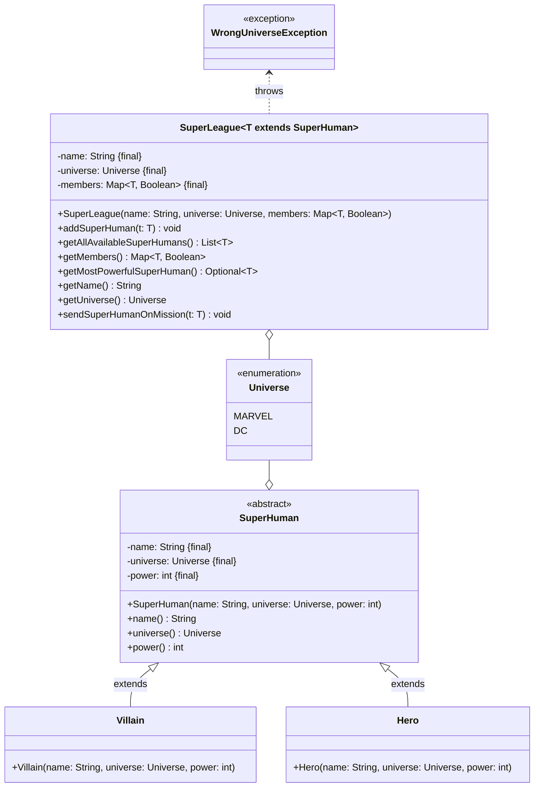
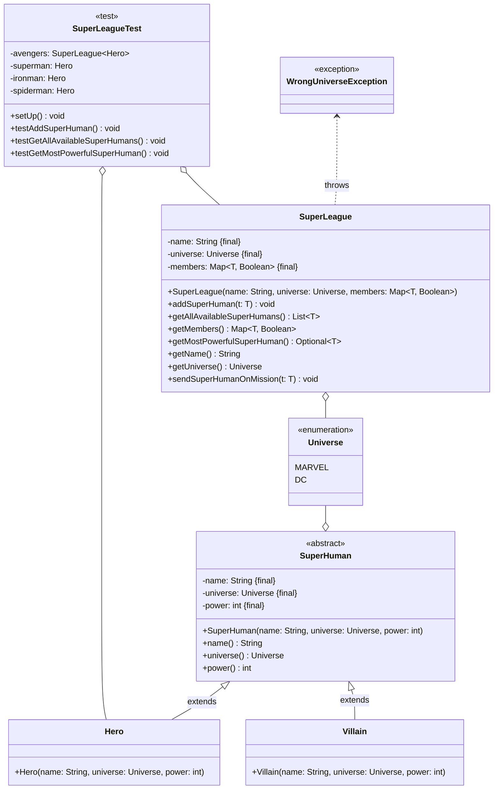
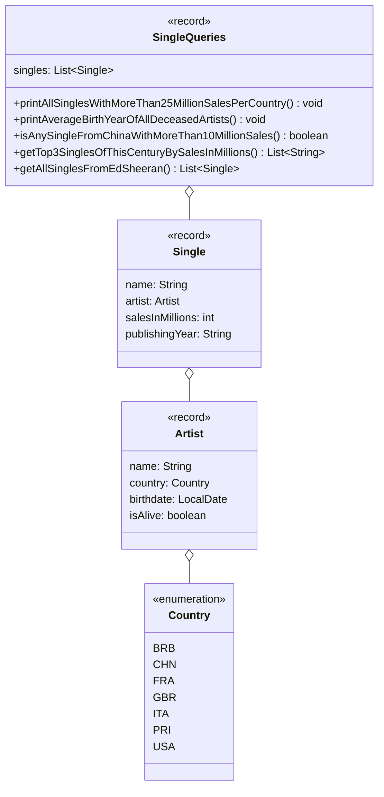

## Hinweise zur Klausur

- Die in dieser Klausur verwendeten Personenbezeichnungen beziehen sich – sofern
  nicht anders kenntlich gemacht – auf alle Geschlechter
- Pakete und Klassenimporte müssen nicht angegeben werden
- Es kann davon ausgegangen werden, dass sämtliche Klassen entsprechende
  Implementierungen der Object-Methoden besitzen
- Der Stereotyp `enumeration` impliziert, dass die Aufzählung einen passenden
  Konstruktor sowie gegebenenfalls passende Getter für alle Attribute besitzt
- Der Stereotyp `record` impliziert, dass die Datenklasse einen passenden
  Konstruktor, Getter zu allen Attributen sowie entsprechende Implementierungen
  der Object-Methoden besitzt
- So nicht anders angegeben sollen Konstruktoren, Setter, Getter sowie die
  Object-Methoden wie in der Vorlesung gezeigt implementiert werden
- Annotationen der Lombok-Bibliothek dürfen verwendet werden
- Die Konsolenausgaben-Methoden der Klasse `PrintStream` dürfen sinnvoll gekürzt
  geschrieben werden (zum Beispiel _syso("Hello World")_ statt
  _System.out.println("Hello World")_)
- Methoden- und Attributsbezeichner dürfen sinnvoll gekürzt geschrieben werden
  (zum Beispiel _getLWMCP()_ statt _getLectureWithMostCreditPoints()_)

## Aufgabe 1 (16 Punkte)

Erstelle die Klasse `SuperLeague<T extends SuperHuman>` anhand des abgebildeten
Klassendiagrams.

### Klassendiagramm



### Hinweise zur Klasse _SuperLeague_

- Die Schlüssel-Werte-Paare des Assoziativspeichers beinhalten als Schlüssel die
  Übermenschen der Liga sowie als Wert deren Verfügbarkeit
- Die Methode `Optional<T> getMostPowerfulSuperHuman()` soll den stärksten
  Übermenschen der Liga zurückgeben
- Die Methode `void addSuperHuman(t: T)` soll der Liga den eingehenden
  Übermenschen als verfügbares Mitglied hinzufügen. Für den Fall, dass das
  Universum des eingehenden Übermenschen nicht dem Universum der Liga
  entspricht, soll die Ausnahme `WrongUniverseException` ausgelöst werden
- Die Methode `List<T> getAllAvailableSuperHumans()` soll alle verfügbaren
  Übermenschen der Liga zurückgeben
- Die Methode `void sendSuperHumanOnMission(t: T)` soll die Verfügbarkeit des
  eingehenden Übermenschen auf _nicht verfügbar_ setzen

### Musterlösung

```java title="SuperLeage.java" showLineNumbers
/* Option A */
public record SuperLeague<T extends SuperHuman>
  (String name, Universe universe, Map<T, Boolean> members) { // 1
/* Option A */

/* Option B */
@Data // 0,5
public class SuperLeague<T extends SuperHuman> { // 0,125
  private final String name; // 0,125
  private final Universe universe; // 0,125
  private final Map<T, Boolean> members; // 0,125
/* Option B */

/* Option C */
public class SuperLeague<T extends SuperHuman> { // 0,125
  private final String name; // 0,125
  private final Universe universe; // 0,125
  private final Map<T, Boolean> members; // 0,125
  public SuperLeague(String name, Universe universe, Map<T, Boolean> members) {
    this.name = name;
    this.universe = universe;
    this.members = members;
  } // 0,125
  public String getName() { return name; } // 0,125
  public Universe getUniverse() { return universe; } // 0,125
  public Map<T, Boolean> getMembers() { return members; } // 0,125
/* Option C */

  public Optional<T> getMostPowerfulSuperHuman() { // 0,5
    T mostPowerfulSuperHuman = null; // 0,5
    int power = 0; // 0,5
    for (T t : members.keySet()) { // 1
      if (t.power() > power) { // 0,5
        power = t.power(); // 0,5
        mostPowerfulSuperHuman = t; // 0,5
      }
    }
    return Optional.ofNullable(mostPowerfulSuperHuman); // 1
  } // 5

  public void addSuperHuman(T t) throws WrongUniverseException { // 1
    if (!t.universe().equals(universe)) { // 1
      throw new WrongUniverseException(); // 1
    }

    members.put(t, true); // 1
  } // 4

  public List<T> getAllAvailableSuperHumans() { // 0,5
    List<T> allAvailableSuperHumans = new ArrayList<>(); // 0,5
    for (Entry<T, Boolean> entry : members.entrySet()) { // 1
      if (entry.getValue().equals(true)) { // 1
        allAvailableSuperHumans.add(entry.getKey()); // 1
      }
    }
    return allAvailableSuperHumans; // 0,5
  } // 4,5

  public void sendSuperHumanOnMission(T t) { // 0,5
    members.put(t, false); // 1
  } // 1,5

} // 16
```

## Aufgabe 2 (14 Punkte)

Erstelle die JUnit-5-Testklasse `SuperLeagueTest` anhand des abgebildeten
Klassendiagramms.

### Klassendiagramm



### Hinweise zur Klasse _SuperLeagueTest_

- Die Lebenszyklus-Methode `void setUp()` soll den Superhelden _Superman_ (Name:
  Superman, Universum: DC, Stärke: 10), den Superhelden _Iron Man_ (Name: Iron
  Man, Universum: MARVEL, Stärke: 7), den Superhelden _Spider-Man_ (Name:
  Spider-Man, Universum: MARVEL, Stärke: 8) sowie die Superheldenliga _Avengers_
  (Name: Avengers, Universum: MARVEL) erstellen und den entsprechenden
  Attributen zuweisen und die Superhelden _Iron Man_ sowie _Spider-Man_ der
  Superheldenliga _Avengers_ als verfügbare Superhelden hinzufügen
- Die Testmethode `void testAddSuperHuman()` soll prüfen, ob beim Aufruf der
  Methode `void addSuperHuman(t: T)` mit dem Superhelden _Superman_ die Ausnahme
  `WrongUniverseException` ausgelöst wird
- Die Testmethode `void testGetAllAvailableSuperHumans()` soll den Superheld
  _Spider-Man_ auf eine Mission schicken und prüfen, ob beim Aufruf der Methode
  `List<T> getAllAvailableSuperHumans()` eine Liste der Größe 1 zurückgegeben
  wird
- Die Testmethode `void testGetMostPowerfulSuperHuman()` soll prüfen, ob beim
  Aufruf der Methode `Optional<T> getMostPowerfulSuperHuman()` der Superheld
  _Spider-Man_ als Optional zurückgegeben wird

### Musterlösung

```java title="SuperLeagueTest.java" showLineNumbers
public class SuperLeagueTest { // 0,5

  private SuperLeague<Hero> avengers; // 0,25
  private Hero superman; // 0,25
  private Hero ironman; // 0,25
  private Hero spiderman; // 0,25

  @BeforeEach // 0,25
  void setUp() { throws WrongUniverseException { // 0,25 +0,5 (bei Option A)
    superman = new Hero("Superman", Universe.DC, 10); // 1
    ironman = new Hero("Iron Man", Universe.MARVEL, 7); // 1
    spiderman = new Hero("Spider-Man", Universe.MARVEL, 8); // 1
    avengers = new SuperLeague<>("Avengers", Universe.MARVEL, new HashMap<>()); // 1

    /* Option A */
    avengers.addSuperHuman(ironman); // 1
    avengers.addSuperHuman(spiderman); // 1
    /* Option A */

    /* Option B */
    avengers.members().put(ironman, true); // 1
    avengers.members().put(spiderman, true); // 1
    /* Option B */
  } // 6,5

  @Test // 0,25
  void testAddSuperHuman() { // 0,25
    assertThrows(WrongUniverseException.class, () -> avengers.addSuperHuman(superman)); // 1,5
  } // 2

  @Test // 0,25
  void testGetAllAvailableSuperHumans() { // 0,25
    avengers.sendSuperHumanOnMission(spiderman); // 0,5
    List<Hero> heroes = avengers.getAllAvailableSuperHumans(); // 0,5
    assertEquals(1, heroes.size()); // 1
  } // 2,5

  @Test // 0,25
  void testGetMostPowerfulSuperHuman() { // 0,25
    /* Option A */
    assertEquals(spiderman, avengers.getMostPowerfulSuperHuman().get()); // 1
    /* Option A */

    /* Option B */
    assertEquals(Optional.of(spiderman), avengers.getMostPowerfulSuperHuman()); // 1
    /* Option B */
  } // 1,5

} // 14
```

## Aufgabe 3 (22 Punkte)

Erstelle die Klasse `SingleQueries` anhand des abgebildeten Klassendiagramms.

### Klassendiagramm



### Hinweise zur Klasse _SingleQueries_

- Die Methode `void printAllSinglesWithMoreThan25MillionSalesPerCountry()` soll
  alle Singles, die sich mehr als 25 Millionen mal verkauft haben, gruppiert
  nach dem Land in der Form _Artist.country: [Single, Single,...]_ ausgeben
- Die Methode `void printAverageBirthYearOfAllDeceasedArtists()` soll das
  durchschnittliche Geburtsjahr aller verstorbenen Künstler bzw. aller
  verstorbenen Künstlerinnen ausgeben. Für den Fall, dass es keinen verstorbenen
  Künstler bzw. keine verstorbene Künstlerin gibt, soll der Wert -1 ausgegeben
  werden
- Die Methode `boolean isAnySingleFromChinaWithMoreThan10MillionSales()` soll
  zurückgeben, ob es eine Single eines Künstlers bzw. einer Künstlerin aus China
  gibt, welches sich mehr als 10 Millionen Mal verkauft hat
- Die Methode `List<String> getTop3SinglesOfThisCenturyBySalesInMillions()` soll
  die 3 am häufigsten verkauften Singles des jetzigen Jahrtausends sortiert nach
  der Anzahl Verkäufe in Millionen in der Form _Single.name: Artist.name,
  Single.salesInMillions Millionen_ zurückgeben
- Die Methode `List<Single> getAllSinglesFromEdSheeran()` soll alle Singles des
  Künstlers Ed Sheeran (Land: Großbritannien, Geburtstag: 17.02.1991, Status:
  lebendig) zurückgeben

### Musterlösung

```java title="SingleQueries" showLineNumbers
public record SingleQueries(List<Single> singles) { // 1

  public void printAllSinglesWithMoreThan25MillionSalesPerCountry() { // 0,5
    Map<Country, List<Single>> allSinglesWithMoreThan25MillionSalesPerCountry; // 0,25
    allSinglesWithMoreThan25MillionSalesPerCountry = singles.stream() // 0,5
      .filter(s -> s.salesInMillions() > 25) // 0,5
      .collect(Collectors.groupingBy(s -> s.artist().country())); // 1

    allSinglesWithMoreThan25MillionSalesPerCountry
      .forEach((c, sl) -> System.out.println(c + ": " + sl)); // 1,25
  } // 4

  public void printAverageBirthYearOfAllDeceasedArtists() { // 0,5
    OptionalDouble averageBirthYearOfAllDeceasedArtists; // 0,25
    averageBirthYearOfAllDeceasedArtists = singles.stream() // 0,5
      .map(Single::artist) // 0,5
      .distinct() // 0,5
      .filter(a -> !a.isAlive()) // 0,5
      .mapToInt(a -> a.birthdate().getYear()) // 1
      .average(); // 0,5

    averageBirthYearOfAllDeceasedArtists
      .ifPresentOrElse(System.out::println, () -> System.out.println(-1)); // 1,25
  } // 5,5

  public boolean isAnySingleFromChinaWithMoreThan10MillionSales() { // 0,5
    boolean isAnySingleFromChinaWithMoreThan10MillionSales; // 0,25
    isAnySingleFromChinaWithMoreThan10MillionSales = singles.stream() // 0,5
      .filter(s -> s.salesInMillions() > 10) // 0,5
      .anyMatch(s -> s.artist().country().equals(Country.CHN)); // 1
    return isAnySingleFromChinaWithMoreThan10MillionSales; // 0,25
  } // 3

  public List<String> getTop3SinglesOfThisCenturyBySalesInMillions() { // 0,5
    List<String> top3SinglesOfThisCenturyBySalesInMillions; // 0,25
    top3SinglesOfThisCenturyBySalesInMillions = singles.stream() // 0,5
      .filter(s -> s.publishingYear().compareTo("2000") >= 0) // 1
      .sorted((s1, s2) -> Integer.valueOf(s2.salesInMillions()).compareTo(s1.salesInMillions())) // 1
      .map(s -> s.name() + ": " + s.artist().name() + ", " + s.salesInMillions() + " Millionen") // 1
      .limit(3) // 0,5
      .toList(); // 0,5
    return top3SinglesOfThisCenturyBySalesInMillions; // 0,25
  } // 5

  public List<Single> getAllSinglesFromEdSheeran() { // 0,5
    List<Single> allSinglesFromEdSheeran; // 0,25
    Artist sheeran = new Artist("Ed Sheeran", Country.GBR, LocalDate.of(1991, 2, 17), true); // 1
    allSinglesFromEdSheeran = singles.stream() // 0,5
      .filter(s -> s.artist().equals(sheeran)) // 0,5
      .toList(); // 0,5
    return allSinglesFromEdSheeran; // 0,25
  } // 3,5

} // 22
```
