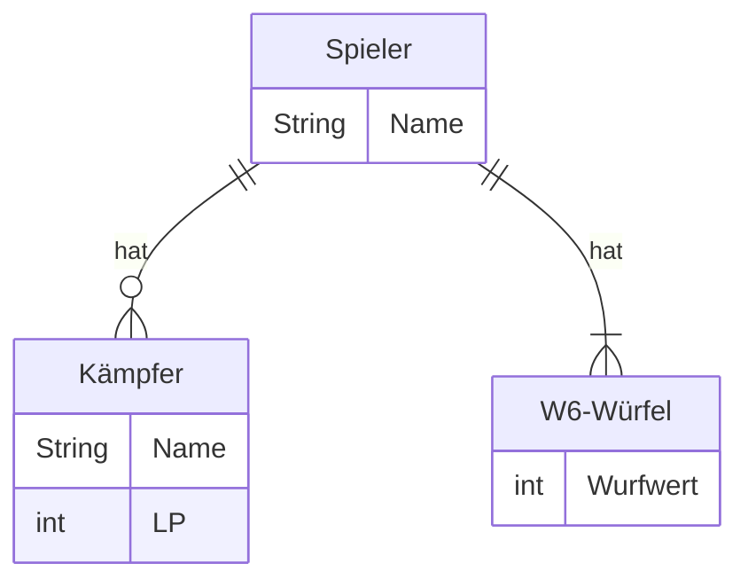
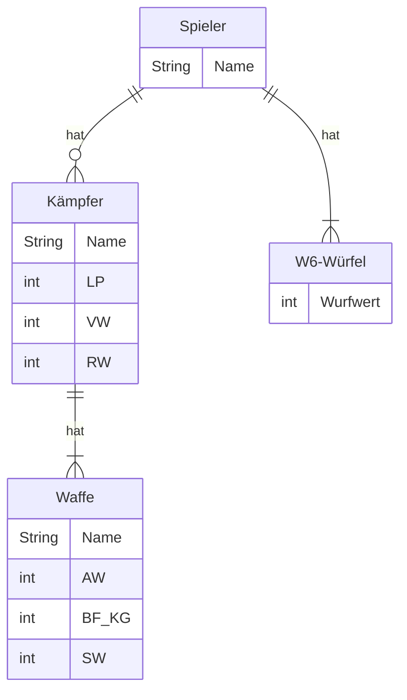

Im Rahmen der Vorlesungswiederholung soll Schritt für Schritt eine abgespeckte
Variante des Tabletop-Spiels
_[Warhammer 40,000 Kill Team](https://www.warhammer.com/en-GB/other-games-kill-team-LP)_
entwickelt werden. Bei diesem Strategiespiel für zwei Spieler kämpfen zwei
sogenannten Kill Teams mit dem Ziel gegeneinander, entsprechende Missionsziele
zu erfüllen bzw. das gegnerische Team auszulöschen.

### Version 1

Erstelle eine ausführbare Klasse wie folgt:

- Es sollen Datenobjekte für alle Eigenschaften des abgebildeten ER-Modells für
  2 Spieler, 2 Kämpfer (je einer pro Spieler) und 8 W6-Würfel (je 4 pro Spieler)
  deklariert werden
- Es soll möglich sein, den Datenobjekten für die Eigenschaften der Spieler und
  Kämpfer Werte über die Konsole zuzuweisen
- Es soll genau eine Runde umgesetzt werden

**ER-Modell**



LP = Lebenspunkte

**Ablauf einer Runde**

Zu Beginn der Runde greift zunächst der Kämpfer des ersten Spielers den Kämpfer
des zweiten Spielers mit einem einfachen Angriff an. Anschließend greift der
Kämpfer des zweiten Spielers den Kämpfer des ersten Spielers mit einem einfachen
Angriff an.

**Ablauf eines einfachen Angriffs und Ermittlung des Schadens**

Der angreifende Spieler würfelt mit 4 W6-Würfeln, der verteidigende Spieler
würfelt mit 3 W6-Würfeln. Anschließend wird der Schaden berechnet und dem
verteidigenden Spieler Lebenspunkte in Höhe des Schadens abgezogen. Der Schaden
berechnet sich dabei gemäß der Formel _Anzahl Treffer - Anzahl Blocks_. Die
Anzahl Treffer ergibt sich aus der Summe der Wurfwerte des angreifenden
Spielers, die Anzahl Blocks aus der Summe der Wurfwerte des verteidigenden
Spielers. Die Problematiken, dass ein verteidigender Spieler bei einem Angriff
"geheilt" wird (Anzahl Treffer < Anzahl Blocks) und dass ein "toter" Spieler
angreift (Schaden beim ersten Angriff >= LP), sollen aktuell noch ignoriert
werden.

**Beispielhafte Konsolenausgabe**

```console
Spieler 1, Name: Hans
Spieler 1, Kämpfer 1, Name: Gregor
Spieler 1, Kämpfer 1, LP: 8

Spieler 2, Name: Peter
Spieler 2, Kämpfer 1, Name: Bonekraka
Spieler 2, Kämpfer 1, LP: 10

*-------*
* Zug 1 *
*-------*
Kämpfer von Hans: Gregor (8 LP)
Kämpfer von Peter: Bonekraka (10 LP)

Gregor greift Bonekraka an.
Gregor würfelt 2, 2, 3 und 6.
Gregor erzielt 13 Treffer.
Bonekraka würfelt 1, 4 und 5.
Bonekraka erzielt 10 Blocks.
Bonekraka erleidet 3 Schaden und hat noch 7 LP.

*-------*
* Zug 2 *
*-------*
Kämpfer von Hans: Gregor (8 LP)
Kämpfer von Peter: Bonekraka (7 LP)

Bonekraka greift Gregor an.
Bonekraka würfelt 1, 1, 3 und 5.
Bonekraka erzielt 10 Treffer.
Gregor würfelt 2, 4 und 5.
Gregor erzielt 11 Blocks.
Gregor erleidet -1 Schaden und hat noch 9 LP.
```

### Version 2

Passe die ausführbare Klasse wie folgt an:

- Es sollen zusätzliche Datenobjekte für alle zusätzlichen Eigenschaften des
  abgebildeten ER-Modells für 2 Spieler, 2 Kämpfer (je einer pro Spieler), 2
  Waffen (je eine pro Kämpfer) und 10 W6-Würfel (je 5 pro Spieler) deklariert
  werden
- Es soll möglich sein, den neuen Datenobjekten Werte über die Konsole
  zuzuweisen (alternativ können den Datenobjekten auch statisch Werte zugewiesen
  werden)
- Es sollen mehrere Runden umgesetzt werden
- Das Spiel soll enden, sobald die Lebenspunkte eines der beiden Kämpfer auf 0
  oder unter 0 gesunken sind

**ER-Modell**



LP = Lebenspunkte, VW = Verteidigungswert, RW = Rüstungswurf, AW = Attackenwert,
BF_KG = Ballistische Fertigkeit / Kampfgeschick, SW = Schadenswert

**Ablauf einer Runde**

Zu Beginn einer jeden Runde greift zunächst der Kämpfer des ersten Spielers den
Kämpfer des zweiten Spielers mit einem erweiterten einfachen Angriff an. Sollte
der Kämpfer des zweiten Spielers diesen Angriff überleben, greift dieser
anschließend den Kämpfer des ersten Spielers mit einem erweiterten einfachen
Angriff an.

**Ablauf eines erweiterten einfachen Angriffs und Ermittlung des Schadens**

Der angreifende Spieler würfelt mit der Anzahl AW seiner Waffe, der
verteidigende Spieler würfelt mit der Anzahl VW. Anschließend wird der Schaden
berechnet und dem verteidigenden Spieler Lebenspunkte in Höhe des Schadens
abgezogen. Der Schaden berechnet sich dabei gemäß der Formel _(Anzahl Treffer -
Anzahl Blocks) x SW_. Die Anzahl Treffer ergibt sich aus der Summe der Wurfwerte
des angreifenden Spielers >= BF_KG, die Anzahl Blocks aus der Summe der
Wurfwerte des verteidigenden Spielers >= RW.

**Beispielhafte Konsolenausgabe**

```console
Spieler 1, Name eingeben: Hans
Spieler 1, Kämpfer 1, Name eingeben: Gregor
Spieler 1, Kämpfer 1, LP eingeben: 8
Spieler 1, Kämpfer 1, VW eingeben: 3
Spieler 1, Kämpfer 1, RW eingeben: 5
Spieler 1, Kämpfer 1, Waffe 1, Name eingeben: Boltpistole
Spieler 1, Kämpfer 1, Waffe 1, AW eingeben: 4
Spieler 1, Kämpfer 1, Waffe 1, BF_KG eingeben: 3
Spieler 1, Kämpfer 1, Waffe 1, SW eingeben: 2

Spieler 2, Name eingeben: Peter
Spieler 2, Kämpfer 1, Name eingeben: Bonekraka
Spieler 2, Kämpfer 1, LP eingeben: 10
Spieler 2, Kämpfer 1, VW eingeben: 3
Spieler 2, Kämpfer 1, RW eingeben: 5
Spieler 2, Kämpfer 1, Waffe 1, Name eingeben: Spalta
Spieler 2, Kämpfer 1, Waffe 1, AW eingeben: 4
Spieler 2, Kämpfer 1, Waffe 1, BF_KG eingeben: 4
Spieler 2, Kämpfer 1, Waffe 1, SW eingeben: 3

*----------------*
* Runde 1, Zug 1 *
*----------------*
Kämpfer von Hans: Gregor (8 LP)
Kämpfer von Peter: Bonekraka (10 LP)

Gregor greift Bonekraka mit Boltpistole an.
Gregor würfelt 6, 4, 3 und 2.
Gregor erzielt 3 Treffer.
Bonekraka würfelt 4, 1 und 5.
Bonekraka erzielt 1 Blocks.
Bonekraka erleidet 4 Schaden und hat noch 6 LP.

*----------------*
* Runde 1, Zug 2 *
*----------------*
Kämpfer von Hans: Gregor (8 LP)
Kämpfer von Peter: Bonekraka (6 LP)

Bonekraka greift Gregor mit Spalta an.
Bonekraka würfelt 2, 4, 3 und 2.
Bonekraka erzielt 1 Treffer.
Gregor würfelt 3, 5 und 5.
Gregor erzielt 2 Blocks.
Gregor erleidet 0 Schaden und hat noch 8 LP.

*----------------*
* Runde 2, Zug 1 *
*----------------*
Kämpfer von Hans: Gregor (8 LP)
Kämpfer von Peter: Bonekraka (6 LP)

Gregor greift Bonekraka mit Boltpistole an.
Gregor würfelt 1, 5, 5 und 3.
Gregor erzielt 3 Treffer.
Bonekraka würfelt 5, 4 und 2.
Bonekraka erzielt 1 Blocks.
Bonekraka erleidet 4 Schaden und hat noch 2 LP.

*----------------*
* Runde 2, Zug 2 *
*----------------*
Kämpfer von Hans: Gregor (8 LP)
Kämpfer von Peter: Bonekraka (2 LP)

Bonekraka greift Gregor mit Spalta an.
Bonekraka würfelt 6, 4, 6 und 1.
Bonekraka erzielt 3 Treffer.
Gregor würfelt 4, 2 und 4.
Gregor erzielt 0 Blocks.
Gregor erleidet 9 Schaden und stirbt.
```

### Version 3

Überführe den bisherigen imperativen Programmentwurf in einen objektorientierten
Programmentwurf. Erweitere zudem den objektorientierten Programmentwurf so, dass
zu Beginn einer jeden Runde per "Münzwurf" darüber entschieden wird, welcher
Spieler den ersten Angriff in der jeweiligen Runde ausführen darf.
