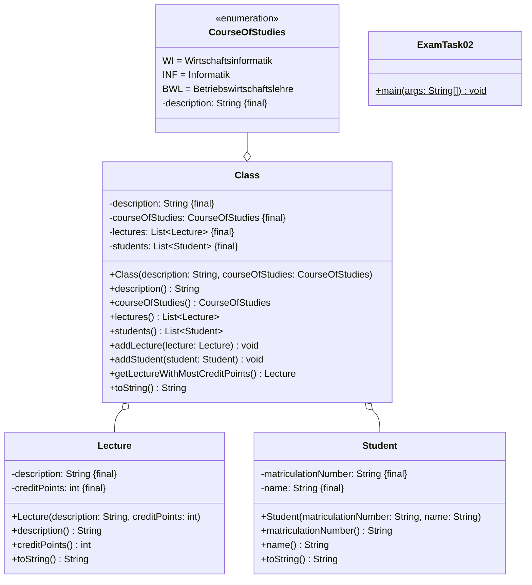
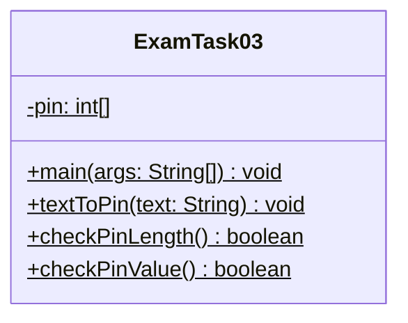
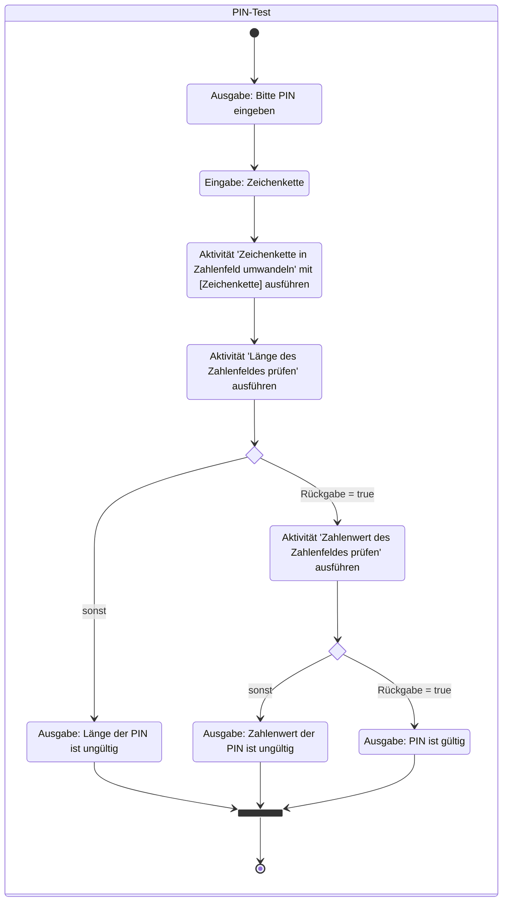
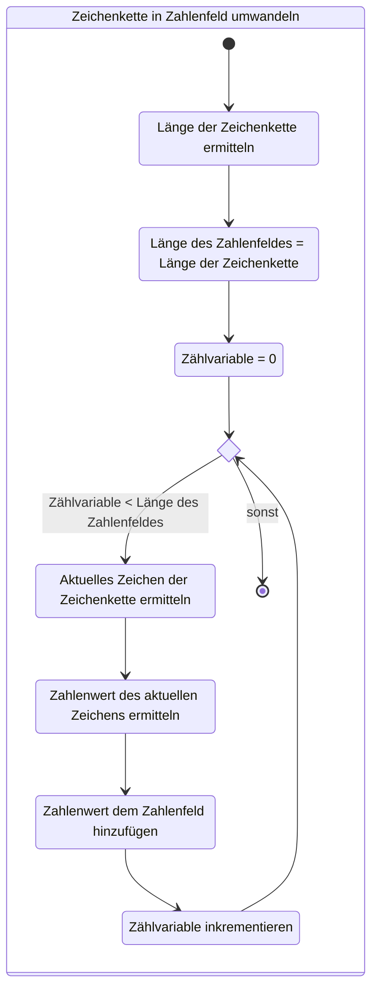
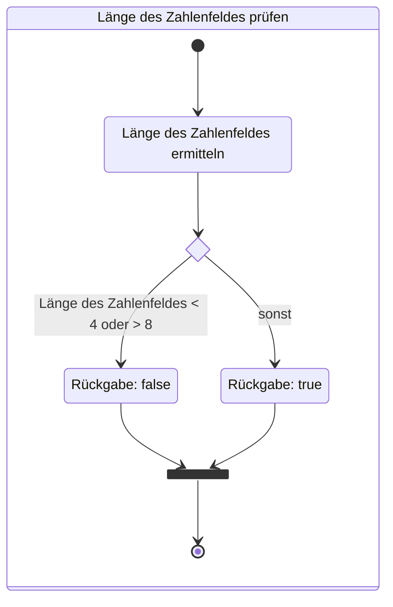
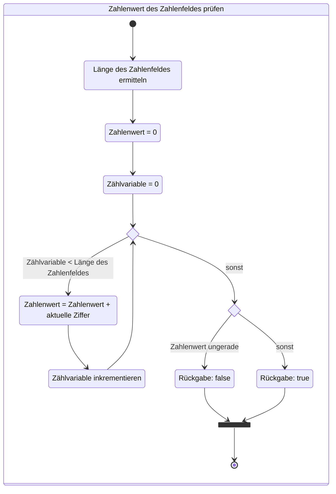
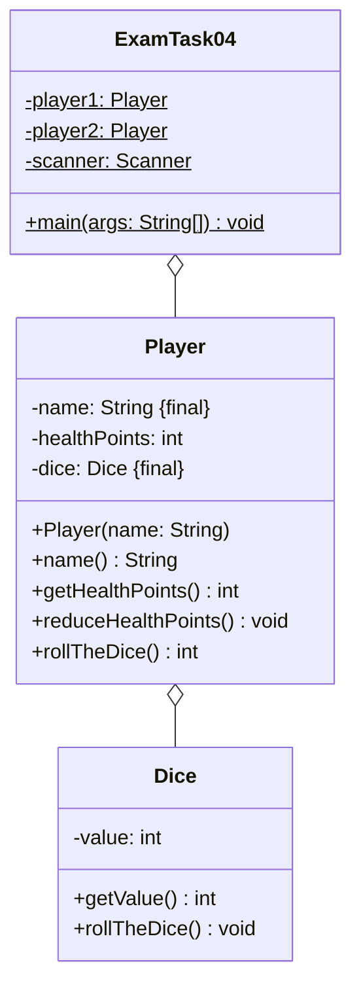
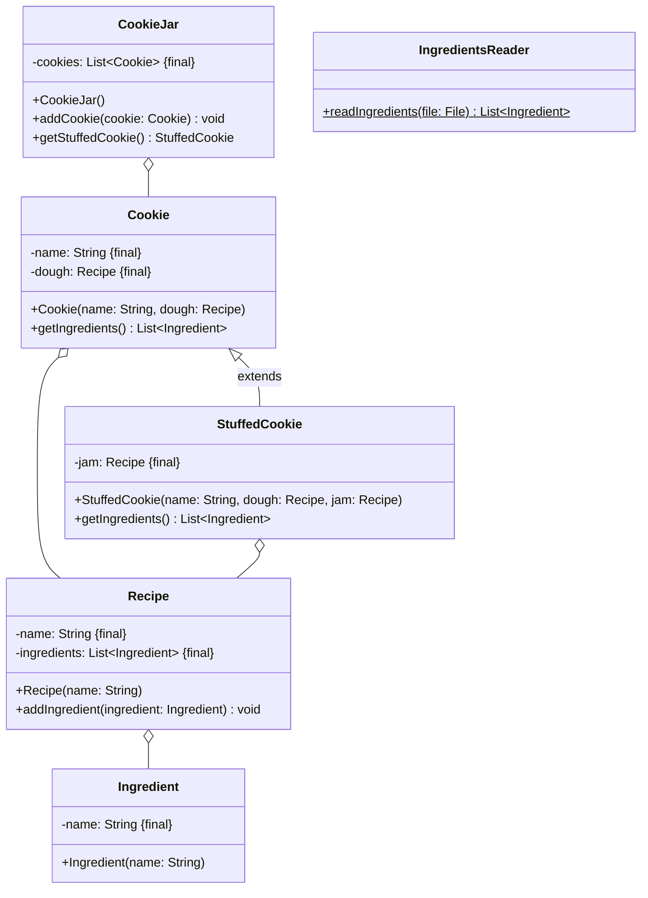

## Hinweise zur Klausur

- Die in dieser Klausur verwendeten Personenbezeichnungen beziehen sich – sofern
  nicht anders kenntlich gemacht – auf alle Geschlechter
- Pakete und Klassenimporte müssen nicht angegeben werden
- Es kann davon ausgegangen werden, dass sämtliche Klassen entsprechende
  Implementierungen der Object-Methoden besitzen
- Der Stereotyp `enumeration` impliziert, dass die Aufzählung einen passenden
  Konstruktor sowie gegebenenfalls passende Getter für alle Attribute besitzt
- So nicht anders angegeben sollen Konstruktoren, Setter, Getter sowie die
  Object-Methoden wie in der Vorlesung gezeigt implementiert werden
- Die Konsolenausgaben-Methoden der Klasse `PrintStream` dürfen sinnvoll gekürzt
  geschrieben werden (zum Beispiel `syso("Hello World")` statt
  `System.out.println("Hello World")`)
- Methoden- und Attributsbezeichner dürfen sinnvoll gekürzt geschrieben werden
  (Beispiel `getLWMCP()` statt `getLectureWithMostCreditPoints()`)

## Aufgabe 1 (20 Punkte)

- Welche Konsolenausgabe erzeugen die Methoden `void a()`, `void b()` und
  `void c()` der abgebildeten Klasse `ExamTask01` (10 Punkte)?
- Beschreibe kurz alle Syntaxfehler der Methode `String d()` (inklusive
  Zeilennummer) (5 Punkte)
- Notiere jeweils Bezeichner sowie Zeilennummer der Deklaration und Zeilennummer
  der Initialisierung aller Datenobjekte der Methode `void e(size: int)` der
  abgebildeten Klasse `ExamTask01` (5 Punkte)

### Quellcode zur Klasse _ExamTask01_

```java title="ExamTask01.java" showLineNumbers
public class ExamTask01 {

  private static String textA, textB;
  private String name;

  private static void a() {
    byte byte1 = (byte) 0b11011010;
    byte byte2 = 0b01101110;
    System.out.println("byte1: " + byte1);
    System.out.println("byte2: " + byte2);
  }

  private static void b() {
    String[] strings = {"java", "c++", "python", "abap"};
    int int1 = strings[1].length();
    char char1 = int1 > 3 ? int1 == 4 ? 'x' : 'y' : 'z';
    int int2 = (int) (1.1 + 0.8);
    String string1 = strings[int2];
    char char2 = strings[strings.length - 1].charAt(0);
    System.out.println(char1 + string1 + 2 + 4 + char2);
  }

  private static void c() {
    char x = 'X';
    for (int i = 0; i < 3; i++) {
      System.out.print(i + ": ");
      for (int j = 3 - i - 1; j > 0; j--) {
        System.out.print(x);
      }
      System.out.println();
    }
  }

  private static String d() {
    int i;
    string name2 = new String("Max");
    name = "Peter";
    for (int x = 0; x > 0; x--) {
      System.out.println(x);
    }
    System.out.println(i);
    System.out.println(x);
  }

  private static void e(int size) {
    textA = "Text A";
    textB = "Text B";
    boolean boolean1;
    for (int i = 0; i < size; i++) {
      boolean1 = (textA == textB) ? true : false;
    }
  }

  public static void main(String[] args) {
    e(5);
  }

}
```

### Musterlösung

**Konsolenausgabe**

```console
byte1: -38
byte2: 110
zc++24a
0: XX
1: X
2:
```

**Syntaxfehler**

- Zeile 34: Die Methode müsste eine Zeichenkette zurückgeben
- Zeile 36: Der primitive Datentyp `string` existiert nicht
- Zeile 37: In einer statischen Methode kann nur auf andere statische Elemente
  zugegriffen werden
- Zeile 41: Die Variable `i` wird vor Verwendung nicht initialisiert
- Zeile 42: Die Sichtbarkeit der Variablen `x` ist auf die for-Schleife begrenzt

**Deklarationen und Initialisierungen**

| Bezeichner | Deklaration | Initialisierung |
| ---------- | ----------- | --------------- |
| `size`     | 45          | 55              |
| `textA`    | 3           | 46              |
| `textB`    | 3           | 47              |
| `boolean1` | 48          | 50              |
| `i`        | 49          | 49              |

## Aufgabe 2 (20 Punkte)

- Erstelle die Klasse `Class` anhand des abgebildeten Klassendiagramms (15
  Punkte)
- Erstelle die ausführbare Klasse `ExamTask02` wie folgt (5 Punkte): Erstelle
  einen Kurs mit 2 Studierenden und 2 Vorlesungen und gib anschließend den Kurs
  sowie die Vorlesung mit den meisten Creditpoints auf der Konsole aus

### Klassendiagramm



### Hinweise zur Klasse _Class_

- Der Konstruktor soll alle Attribute initialisieren
- Die Methode `void addStudent(student Student)` soll der Studierendenliste
  (`students`) den eingehenden Studierenden hinzufügen
- Die Methode `void addLecture(lecture Lecture)` soll der Vorlesungsliste
  (`lectures`) die eingehende Vorlesung hinzufügen
- Die Methode `Lecture getLectureWithMostCreditPoints()` soll die Vorlesung mit
  den meisten Creditpoints zurückgeben
- Die Methode `String toString()` soll den Kurs in der Form _Class
  [description=[Beschreibung des Kurses\], courseOfStudies=[Beschreibung des
  Studiengangs\], lectures=[Vorlesungen\], students=[Studierende\]\]_
  zurückgeben

### Musterlösung

```java title="Class.java" showLineNumbers
public class Class { // 0,5

  private final String description; // 0,25
  private final CourseOfStudies courseOfStudies; // 0,25
  private final List<Lecture> lectures; // 0,25
  private final List<Student> students; // 0,25

  public Class(String description, CourseOfStudies courseOfStudies) { // 0,5
    this.description = description; // 0,25
    this.courseOfStudies = courseOfStudies; // 0,25
    lectures = new ArrayList<>(); // 0,25
    students = new ArrayList<>(); // 0,25
  }

  public String description() { // 0,5
    return description; // 0,5
  }

  public CourseOfStudies courseOfStudies() { // 0,5
    return courseOfStudies; // 0,5
  }

  public List<Lecture> lectures() { // 0,5
    return lectures; // 0,5
  }

  public List<Student> students() { // 0,5
    return students; // 0,5
  }

  public void addLecture(Lecture lecture) { // 0,5
    lectures.add(lecture); // 0,5
  }

  public void addStudent(Student student) { // 0,5
    students.add(student); // 0,5
  }

  public Lecture getLectureWithMostCreditPoints() { // 0,5
    Lecture lecture = lectures.get(0); // 0,5
    int creditPoints = lecture.creditPoints(); // 0,5
    for (int i = 0; i < lectures.size(); i++) { // 0,5
      if (lectures.get(i).creditPoints() > creditPoints) { // 1
        lecture = lectures.get(i); // 0,5
        creditPoints = lecture.creditPoints(); // 0,5
      }
    }
    return lecture; // 0,5
  }

  public String toString() { // 0,5
    return "Class [description=" + description + ", courseOfStudies=" + courseOfStudies.description()
      + ", lectures=" + lectures + ", students=" + students + "]"; // 1,25
  }

}
```

```java title="ExamTask02.java" showLineNumbers
public class ExamTask02 { // 0,5

  public static void main(String[] args) { // 0,5

    Class class1 = new Class("WWIBE122", CourseOfStudies.WI); // 1
    class1.addStudent(new Student("8271625", "Hans Maier")); // 0,5
    class1.addStudent(new Student("9102934", "Peter Müller")); // 0,5
    class1.addLecture(new Lecture("Mathe", 5)); // 0,5
    class1.addLecture(new Lecture("Programmierung", 10)); // 0,5

    System.out.println(class1.toString()); // 0,5
    System.out.println(class1.getLectureWithMostCreditPoints()); // 0,5

  }

}
```

## Aufgabe 3 (21 Punkte)

Erstelle die Klasse `ExamTask03` anhand des abgebildeten Klassendiagramms sowie
anhand der abgebildeten Aktivitätsdiagramme.

### Klassendiagramm



### Aktivitätsdiagramm zur Methode _void main(args: String[])_



### Aktivitätsdiagramm zur Methode _void textToPin(text: String)_



### Aktivitätsdiagramm zur Methode _boolean checkPinLength()_



### Aktivitätsdiagramm zur Methode _boolean checkPinValue()_



### Beispielhafte Konsolenausgabe

```console
Bitte PIN eingeben: 387
Länge der PIN ist ungültig
Bitte PIN eingeben: 3871
Zahlenwert der PIN ist ungültig
Bitte PIN eingeben: 3872
PIN ist gültig
```

### Musterlösung

```java title="ExamTask03.java" showLineNumbers
public class ExamTask03 { // 0,5

  private static int[] pin; // 0,5

  public static void main(String[] args) { // 0,5
    @SuppressWarnings("resource")
    Scanner sc = new Scanner(System.in); // 1

    System.out.print("Bitte PIN eingeben: "); // 0,5
    String text = sc.next(); // 0,5
    textToPin(text); // 0,5
    if (!checkPinLength()) { // 0,5
      System.out.println("Länge der PIN ist ungültig"); // 0,5
    } else if (!checkPinValue()) { // 0,5
      System.out.println("Zahlenwert der PIN ist ungültig"); // 0,5
    } else { // 0,5
      System.out.println("PIN ist gültig"); // 0,5
    }
  }

  private static boolean checkPinLength() { // 0,5
    int length = pin.length; // 0,5
    if (length < 4 || length > 8) { // 1
      return false; // 0,5
    }
    return true; // 0,5
  }

  private static boolean checkPinValue() { // 0,5
    int length = pin.length; // 0,5
    int total = 0; // 0,5
    int i = 0; // 0,5
    while (i < length) { // 1
      int value = pin[i]; // 0,5
      total += value; // 0,5
      i++; // 0,5
    }
    if (total % 2 != 0) { // 1
      return false; // 0,5
    }
    return true; // 0,5
  }

  private static void textToPin(String text) { // 0,5
    int length = text.length(); // 0,5
    pin = new int[length]; // 0,5
    int i = 0; // 0,5
    while (i < length) { // 0,5
      char c = text.charAt(i); // 0,5
      pin[i] = Integer.valueOf(c); // 1
      i++; // 0,5
    }
  }

}
```

## Aufgabe 4 (21 Punkte)

- Erstelle die Klasse `Player` (7 Punkte) anhand des abgebildeten
  Klassendiagramms
- Erstelle die ausführbare Klasse `ExamTask04` wie folgt (14 Punkte):
  - Zu Beginn des Spiels sollen die Spieler ihre Namen eingeben können
  - Zu Beginn einer jeder Runde soll der aktuelle Punktestand ausgegeben werden
  - Anschließend sollen beide Spieler ihre Würfel werfen
  - Der Spieler mit dem niedrigeren Wurfwert soll einen Lebenspunkt verlieren,
    bei Gleichstand soll keiner der Spieler einen Lebenspunkt verlieren
  - Das Spiel soll Enden, sobald ein Spieler keine Lebenspunkte mehr besitzt
  - Am Ende soll der Gewinner des Spiels ausgegeben werden

### Klassendiagramm



### Hinweis zur Klasse _Player_

- Der Konstruktor soll den Namen (`name`) mit dem eingehenden Namen belegen, die
  Lebenspunkte des Spielers (`healthPoints`) auf den Wert 10 setzen sowie den
  Würfel (`dice`) initialisieren
- Die Methode `int rollTheDice()` soll den Würfel des Spielers werfen und den
  Würfelwert zurückgeben
- Die Methode `void reduceHealthPoints()` soll die Lebenspunkte des Spielers
  (`healthPoints`) um 1 reduzieren

### Beispielhafte Konsolenausgabe

```console
Spieler 1, gib bitte Deinen Namen ein: Hans
Spieler 2, gib bitte Deinen Namen ein: Peter

Hans hat 10 Lebenspunkte
Peter hat 10 Lebenspunkte
Hans würfelt eine 6
Peter würfelt eine 6
…
Hans hat 4 Lebenspunkte
Peter hat 1 Lebenspunkte
Hans würfelt eine 5
Peter würfelt eine 1
Peter verliert einen Punkt

Hans gewinnt
```

### Musterlösung

```java title="Player.java" showLineNumbers
public class Player { // 0,5

  private final String name; // 0,25
  private int healthPoints; // 0,25
  private final Dice dice; // 0,25

  public Player(String name) { // 0,5
    this.name = name; // 0,25
    healthPoints = 10; // 0,5
    dice = new Dice(); // 0,5
  }

  public String name() { // 0,5
    return name; // 0,5
  }

  public int getHealthPoints() { // 0,5
    return healthPoints; // 0,5
  }

  public int rollTheDice() { // 0,5
    dice.rollTheDice(); // 0,25
    return dice.getValue(); // 0,25
  }

  public void reduceHealthPoints() { // 0,5
    healthPoints--; // 0,5
  }

}
```

```java title="ExamTask04.java" showLineNumbers
public class ExamTask04 { // 0,5

  private static Player player1; // 0,25
  private static Player player2; // 0,25
  private static Scanner scanner; // 0,25

  public static void main(String[] args) { // 0,5

    scanner = new Scanner(System.in); // 0,25

    System.out.print("Spieler 1, gib bitte Deinen Namen ein: "); // 0,5
    String name1 = scanner.nextLine(); // 0,5
    player1 = new Player(name1); // 0,5

    System.out.print("Spieler 2, gib bitte Deinen Namen ein: "); // 0,5
    String name2 = scanner.nextLine(); // 0,5
    player2 = new Player(name2); // 0,5

    System.out.println();

    while (player1.getHealthPoints() > 0 && player2.getHealthPoints() > 0) { // 1
      System.out.println(player1.name() + " hat " + player1.getHealthPoints() + " Lebenspunkte"); // 0,5
      System.out.println(player2.name() + " hat " + player2.getHealthPoints() + " Lebenspunkte"); // 0,5
      int value1 = player1.rollTheDice(); // 0,5
      System.out.println(player1.name() + " würfelt eine " + value1); // 0,5
      int value2 = player2.rollTheDice(); // 0,5
      System.out.println(player2.name() + " würfelt eine " + value2); // 0,5
      if (value1 > value2) { // 0,5
        player2.reduceHealthPoints(); // 0,5
        System.out.println(player2.name() + " verliert einen Punkt");// 0,5
      } else if (value2 > value1) { // 0,5
        player1.reduceHealthPoints(); // 0,5
        System.out.println(player1.name() + " verliert einen Punkt");// 0,5
      }
      System.out.println();
    }

    if (player1.getHealthPoints() > player2.getHealthPoints()) {// 0,5
      System.out.println(player1.name() + " gewinnt");// 0,5
    } else {// 0,5
      System.out.println(player2.name() + " gewinnt");// 0,5
    }

  }

}
```

## Aufgabe 5 (21 Punkte)

Erstelle die Klassen `StuffedCookie` (8 Punkte), `CookieJar` (7 Punkte) und
`IngredientsReader` (6 Punkte) anhand des abgebildeten Klassendiagramms.

### Klassendiagramm



### Hinweise zur Klasse _StuffedCookie_

- Der Konstruktor soll alle Attribute initialisieren
- Die Methode `List<Ingredient> getIngredients()` soll alle Zutaten zurückgeben.
  Doppelte Zutaten sollen dabei nur einmal zurückgegeben werden

### Hinweise zur Klasse _CookieJar_

- Der Konstruktor soll alle Attribute initialisieren
- Die Methode `void addCookie(cookie Cookie)` soll der Plätzchenbox ein
  Plätzchen hinzufügen
- Die Methode `StuffedCookie getStuffedCookie()` soll ein gefülltes Plätzchen
  zurückgeben und aus der Plätzchenbox entfernen. Für den Fall, dass kein
  gefülltes Plätzchen vorhanden ist, soll der Wert `null` zurückgegeben werden

### Hinweis zur Klasse _IngredientsReader_

Die statische Methode `List<Ingredient> readIngredients()` soll alle Zutaten der
eingehenden Zutatendatei lesen und zurückgeben.

### Beispielhafter Aufbau der Zutatendatei

```console
Mehl
Zucker
...
```

### Musterlösung

```java title="StuffedCookie.java" showLineNumbers
public class StuffedCookie extends Cookie { // 1

  private final Recipe jam; // 0,25

  public StuffedCookie(String name, Recipe dough, Recipe jam) { // 0,5
    super(name, dough); // 1
    this.jam = jam; // 0,25
  }

  public List<Ingredient> getIngredients() { // 0,5
    List<Ingredient> ingredients = super.getIngredients(); // 0,5
    for (int i = 0; i < jam.ingredients().size(); i++) { // 1
      Ingredient ingredient = jam.ingredients().get(i); // 1
      if (ingredients.contains(ingredient)) { // 0,5
        continue; // 0,5
      }
      ingredients.add(ingredient); // 0,5
    }
    return ingredients; // 0,5
  }

}
```

```java title="CookieJar.java" showLineNumbers
public class CookieJar { // 0,5

  private final List<Cookie> cookies; // 0,25

  public CookieJar() { // 0,5
    cookies = new ArrayList<>(); // 0,25
  }

  public void addCookie(Cookie cookie) { // 0,5
    cookies.add(cookie); // 0,5
  }

  public StuffedCookie getStuffedCookie() { // 0,5
    for (int i = 0; i < cookies.size(); i++) { // 0,5
      Cookie cookie = cookies.get(i); // 0,5
      if (cookie instanceof StuffedCookie s) { // 1,5
        cookies.remove(s); // 0,5
        return s; // 0,5
      }
    }
    return null; // 0,5
  }

}
```

```java title="IngredientsReader.java" showLineNumbers
public class IngredientsReader { // 0,5

  public static List<Ingredient> readIngredients(File file) throws FileNotFoundException { // 1
    Scanner sc = new Scanner(file); // 1

    List<Ingredient> ingredients = new ArrayList<>(); // 0,5
    while (sc.hasNextLine()) { // 1
      String line = sc.nextLine(); // 0,5
      Ingredient i = new Ingredient(line); // 0,5
      ingredients.add(i); // 0,5
    }

    sc.close();
    return ingredients; // 0,5
  }

}
```

## Cheatsheet

### Java API

| Klasse        | Methode                                                             | Statisch | Rückgabetyp  |
| ------------- | ------------------------------------------------------------------- | -------- | ------------ |
| Aufzählung    | `valueOf(arg0: String)`                                             | X        | Aufzählung   |
| Aufzählung    | `values()`                                                          | X        | Aufzählung[] |
| `Boolean`     | `valueOf(s: String)`, `valueOf(b: boolean)`                         | X        | `Boolean`    |
| `Double`      | `valueOf(s: String)`, `valueOf(d: double)`                          | X        | `Double`     |
| `Integer`     | `valueOf(s: String)`, `valueOf(i: int)`                             | X        | `Integer`    |
| `LocalDate`   | `getDayOfMonth()`, `getDayOfYear()`, `getMonthValue()`, `getYear()` |          | `int`        |
| `LocalDate`   | `now()`                                                             | X        | `LocalDate`  |
| `LocalDate`   | `of(year: int, month: int, dayOfMonth: int)`                        | X        | `LocalDate`  |
| `LocalTime`   | `getHour()`, `getMinute()`, `getSecond()`                           |          | `int`        |
| `LocalTime`   | `now()`                                                             | X        | `LocalTime`  |
| `LocalTime`   | `of(hour: int, minute: int, second: int)`                           | X        | `LocalTime`  |
| `Object`      | `equals(object: Object)`                                            |          | `boolean`    |
| `Object`      | `hashCode()`                                                        |          | `int`        |
| `Object`      | `toString()`                                                        |          | `String`     |
| `PrintStream` | `print(obj: Object)`, `println()`, `println(x: Object)`             |          | `void`       |
| `Random`      | `nextInt(bound: int)`, `nextInt(origin: int, bound: int)`           |          | `int`        |
| `Scanner`     | `hasNextLine()`                                                     |          | `boolean`    |
| `Scanner`     | `next()`                                                            |          | `String`     |
| `Scanner`     | `nextBoolean()`                                                     |          | `boolean`    |
| `Scanner`     | `nextDouble()`                                                      |          | `double`     |
| `Scanner`     | `nextInt()`                                                         |          | `int`        |
| `Scanner`     | `nextLine()`                                                        |          | `String`     |
| `String`      | `charAt(index: int)`                                                |          | `char`       |
| `String`      | `length()`                                                          |          | `int`        |
| `String`      | `split(regex: String)`                                              |          | `String[]`   |
| `String`      | `toLowerCase()`, `toUpperCase()`                                    |          | `String`     |
| `System`      | `currentTimeMillis()`                                               | X        | `long`       |

### Java Collections Framework

| Klasse         | Methode                       | Statisch | Rückgabetyp |
| -------------- | ----------------------------- | -------- | ----------- |
| `ArrayList<E>` | `add(e: E)`                   |          | `boolean`   |
| `ArrayList<E>` | `add(index: int, element: E)` |          | `void`      |
| `ArrayList<E>` | `contains(o: Object)`         |          | `boolean`   |
| `ArrayList<E>` | `get(index: int)`             |          | `E`         |
| `ArrayList<E>` | `remove(index: int)`          |          | `E`         |
| `ArrayList<E>` | `remove(o: Object)`           |          | `boolean`   |
| `ArrayList<E>` | `size()`                      |          | `int`       |
| `List<E>`      | `of(elements: E...)`          | X        | `List<E>`   |
