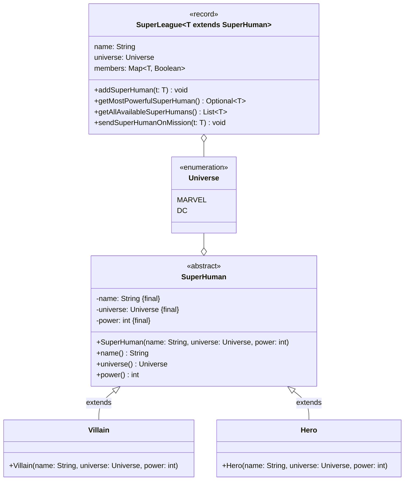
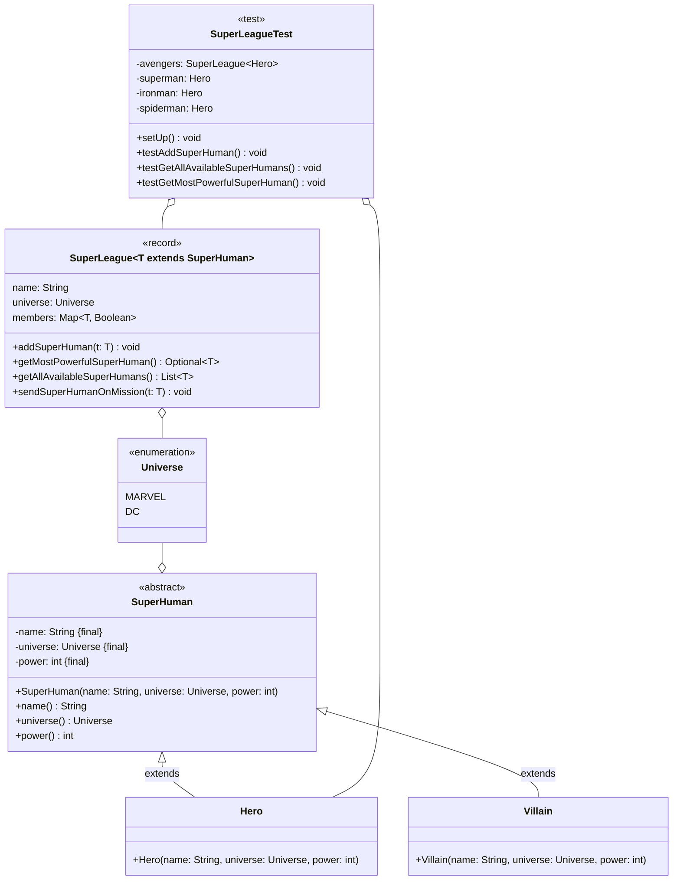
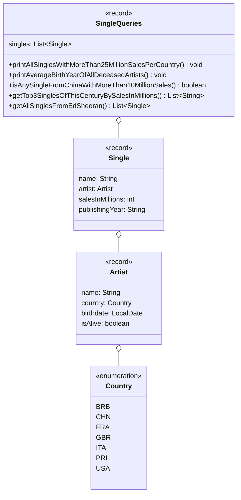

## Hinweise zur Klausur

- Die in dieser Klausur verwendeten Personenbezeichnungen beziehen sich – sofern
  nicht anders kenntlich gemacht – auf alle Geschlechter
- Pakete und Klassenimporte müssen nicht angegeben werden
- Es kann davon ausgegangen werden, dass sämtliche Klassen entsprechende
  Implementierungen der Object-Methoden besitzen
- Der Stereotyp `enumeration` impliziert, dass die Aufzählung einen passenden
  Konstruktor sowie gegebenenfalls passende Getter für alle Attribute besitzt
- Der Stereotyp `record` impliziert, dass die Datenklasse einen passenden
  Konstruktor, Getter zu allen Attributen sowie entsprechende Implementierungen
  der Object-Methoden besitzt
- So nicht anders angegeben sollen Konstruktoren, Setter, Getter sowie die
  Object-Methoden wie in der Vorlesung gezeigt implementiert werden
- Annotationen der Lombok-Bibliothek dürfen verwendet werden
- Die Konsolenausgaben-Methoden der Klasse `PrintStream` dürfen sinnvoll gekürzt
  geschrieben werden (zum Beispiel _syso("Hello World")_ statt
  _System.out.println("Hello World")_)
- Methoden- und Attributsbezeichner dürfen sinnvoll gekürzt geschrieben werden
  (zum Beispiel _getLWMCP()_ statt _getLectureWithMostCreditPoints()_)

## Aufgabe 1 (16 Punkte)

Erstelle die Klasse `SuperLeague<T extends SuperHuman>` anhand des abgebildeten
Klassendiagrams.

### Klassendiagramm



### Hinweise zur Klasse _SuperLeague_

- Die Schlüssel-Werte-Paare des Assoziativspeichers beinhalten als Schlüssel die
  Übermenschen der Liga sowie als Wert deren Verfügbarkeit
- Die Methode `Optional<T> getMostPowerfulSuperHuman()` soll den stärksten
  Übermenschen der Liga zurückgeben
- Die Methode `void addSuperHuman(t: T)` soll der Liga den eingehenden
  Übermenschen als verfügbares Mitglied hinzufügen. Für den Fall, dass das
  Universum des eingehenden Übermenschen nicht dem Universum der Liga
  entspricht, soll die Ausnahme `WrongUniverseException` ausgelöst werden
- Die Methode `List<T> getAllAvailableSuperHumans()` soll alle verfügbaren
  Übermenschen der Liga zurückgeben
- Die Methode `void sendSuperHumanOnMission(t: T)` soll die Verfügbarkeit des
  eingehenden Übermenschen auf _nicht verfügbar_ setzen

### Musterlösung

```java title="SuperLeage.java" showLineNumbers
public record SuperLeague<T extends SuperHuman>
  (String name, Universe universe, Map<T, Boolean> members) { // 1

  public Optional<T> getMostPowerfulSuperHuman() { // 0,5
    T mostPowerfulSuperHuman = null; // 0,5
    int power = 0; // 0,5
    for (T t : members.keySet()) { // 1
      if (t.power() > power) { // 0,5
        power = t.power(); // 0,5
        mostPowerfulSuperHuman = t; // 0,5
      }
    }
    return Optional.ofNullable(mostPowerfulSuperHuman); // 1
  }

  public void addSuperHuman(T t) throws WrongUniverseException { // 1
    if (!t.universe().equals(universe)) { // 1
      throw new WrongUniverseException(); // 1
    }

    members.put(t, true); // 1
  }

  public List<T> getAllAvailableSuperHumans() { // 0,5
    List<T> allAvailableSuperHumans = new ArrayList<>(); // 0,5
    for (Entry<T, Boolean> entry : members.entrySet()) { // 1
      if (entry.getValue().equals(true)) { // 1
        allAvailableSuperHumans.add(entry.getKey()); // 1
      }
    }
    return allAvailableSuperHumans; // 0,5
  }

  public void sendSuperHumanOnMission(T t) { // 0,5
    members.put(t, false); // 1
  }

}
```

## Aufgabe 2 (14 Punkte)

Erstelle die JUnit-5-Testklasse `SuperLeagueTest` anhand des abgebildeten
Klassendiagramms.

### Klassendiagramm



### Hinweise zur Klasse _SuperLeagueTest_

- Die Lebenszyklus-Methode `void setUp()` soll den Superhelden _Superman_ (Name:
  Superman, Universum: DC, Stärke: 10), den Superhelden _Iron Man_ (Name: Iron
  Man, Universum: MARVEL, Stärke: 7), den Superhelden _Spider-Man_ (Name:
  Spider-Man, Universum: MARVEL, Stärke: 8) sowie die Superheldenliga _Avengers_
  (Name: Avengers, Universum: MARVEL) erstellen und den entsprechenden
  Attributen zuweisen, die Superhelden _Iron Man_ und _Spider-Man_ der
  Superheldenliga _Avengers_ als verfügbare Superhelden hinzugefügen und den
  Superheld _Spider-Man_ auf eine Mission schicken
- Die Testmethode `void testAddSuperHuman()` soll prüfen, ob beim Aufruf der
  Methode `void addSuperHuman(t: T)` mit dem Superhelden _Superman_ die Ausnahme
  `WrongUniverseException` ausgelöst wird
- Die Testmethode `void testGetAllAvailableSuperHumans()` soll prüfen, ob beim
  Aufruf der Methode `List<T> getAllAvailableSuperHumans()` eine Liste der Größe
  1 zurückgegeben wird
- Die Testmethode `void testGetMostPowerfulSuperHuman()` soll prüfen, ob beim
  Aufruf der Methode `Optional<T> getMostPowerfulSuperHuman()` der Superheld
  _Spider-Man_ als Optional zurückgegeben wird

### Musterlösung

```java title="SuperLeagueTest.java" showLineNumbers
public class SuperLeagueTest { // 0,5

  private SuperLeague<Hero> avengers; // 0,25
  private Hero superman; // 0,25
  private Hero ironman; // 0,25
  private Hero spiderman; // 0,25

  @BeforeEach // 0,25
  void setUp() throws WrongUniverseException { // 0,75
    superman = new Hero("Superman", Universe.DC, 10); // 1
    ironman = new Hero("Iron Man", Universe.MARVEL, 7); // 1
    spiderman = new Hero("Spider-Man", Universe.MARVEL, 8); // 1
    avengers = new SuperLeague<>("Avengers", Universe.MARVEL, new HashMap<>()); // 1
    avengers.addSuperHuman(ironman); // 1
    avengers.addSuperHuman(spiderman); // 1
    avengers.sendSuperHumanOnMission(spiderman); // 0,5
  }

  @Test // 0,25
  void testAddSuperHuman() { // 0,25
    assertThrows(WrongUniverseException.class, () -> avengers.addSuperHuman(superman)); // 1
  }

  @Test // 0,25
  void testGetAllAvailableSuperHumans() { // 0,25
    assertEquals(1, avengers.getAllAvailableSuperHumans().size()); // 1
  }

  @Test // 0,25
  void testGetMostPowerfulSuperHuman() { // 0,25
    assertEquals(spiderman, avengers.getMostPowerfulSuperHuman().get()); // 1,5
  }

}
```

## Aufgabe 3 (22 Punkte)

Erstelle die Klasse `SingleQueries` anhand des abgebildeten Klassendiagramms.

### Klassendiagramm



### Hinweise zur Klasse _SingleQueries_

- Die Methode `void printAllSinglesWithMoreThan25MillionSalesPerCountry()` soll
  alle Singles, die sich mehr als 25 Millionen mal verkauft haben, gruppiert
  nach dem Land in der Form _Artist.country: [Single, Single,...]_ ausgeben
- Die Methode `void printAverageBirthYearOfAllDeceasedArtists()` soll das
  durchschnittliche Geburtsjahr aller verstorbenen Künstler bzw. aller
  verstorbenen Künstlerinnen ausgeben. Für den Fall, dass es keinen verstorbenen
  Künstler bzw. keine verstorbene Künstlerin gibt, soll der Wert -1 ausgegeben
  werden
- Die Methode `boolean isAnySingleFromChinaWithMoreThan10MillionSales()` soll
  zurückgeben, ob es eine Single eines Künstlers bzw. einer Künstlerin aus China
  gibt, welches sich mehr als 10 Millionen Mal verkauft hat
- Die Methode `List<String> getTop3SinglesOfThisCenturyBySalesInMillions()` soll
  die 3 am häufigsten verkauften Singles des jetzigen Jahrtausends sortiert nach
  der Anzahl Verkäufe in Millionen in der Form _Single.name: Artist.name,
  Single.salesInMillions Millionen_ zurückgeben
- Die Methode `List<Single> getAllSinglesFromEdSheeran()` soll alle Singles des
  Künstlers Ed Sheeran (Land: Großbritannien, Geburtstag: 17.02.1991, Status:
  lebendig) zurückgeben

### Musterlösung

```java title="SingleQueries" showLineNumbers
public record SingleQueries(List<Single> singles) { // 1

  public void a() { // 0,5
    Map<Country, List<Single>> tmp = singles.stream() // 1
      .filter(a -> a.salesInMillions() > 25) // 0,5
      .collect(Collectors.groupingBy(a -> a.artist().country())); // 1

    tmp.forEach((c, sl) -> System.out.println(c + ": " + sl); // 1
    }
  }

  public void b() { // 0,5
    OptionalDouble tmp = singles.stream() // 1
      .map(a -> a.artist()) // 0,5
      .distinct() // 0,5
      .filter(a -> !a.isAlive()) // 0,5
      .mapToInt(a -> a.birthdate().getYear()) // 1
      .average(); // 0,5

    tmp.ifPresentOrElse(System.out::println, () -> System.out.println(-1)); // 1
  }

  public boolean c() { // 0,5
    return singles.stream() // 1
      .anyMatch(a -> a.salesInMillions() > 10 // 0,5
        && a.artist().country().equals(Country.CHN)); // 1
  }

  public List<String> d() { // 0,5
    return singles.stream() // 1
      .filter(a -> a.publishingYear().compareTo("2000") > 0) // 1
      .sorted((a1, a2) -> Integer.valueOf(a2.salesInMillions()).compareTo(a1.salesInMillions())) // 1
      .map(a -> a.name() + ": " + a.artist().name() + ", " + a.salesInMillions() + " Millionen") // 1
      .limit(3) // 0,5
      .toList(); // 0,5
  }

  public List<Single> e() { // 0,5
    return singles.stream() // 1
      .filter(a -> a.artist().equals(
        new Artist("Ed Sheeran", Country.GBR, LocalDate.of(1991, 2, 17), true))) // 1
      .toList(); // 0,5
  }

}
```

## Cheatsheet

### Java API

| Klasse           | Methode                                                             | Statisch | Rückgabetyp      |
| ---------------- | ------------------------------------------------------------------- | -------- | ---------------- |
| Aufzählung       | `valueOf(arg0: String)`                                             | X        | Aufzählung       |
| Aufzählung       | `values()`                                                          | X        | Aufzählung[]     |
| `Boolean`        | `compare(x: boolean, y: boolean)`                                   | X        | `int`            |
| `Boolean`        | `valueOf(s: String)`, `valueOf(b: boolean)`                         | X        | `Boolean`        |
| `Double`         | `compare(d1: double, d2: double)`                                   | X        | `int`            |
| `Double`         | `valueOf(s: String)`, `valueOf(d: double)`                          | X        | `Double`         |
| `Integer`        | `compare(x: int, y: int)`                                           | X        | `int`            |
| `Integer`        | `valueOf(s: String)`, `valueOf(i: int)`                             | X        | `Integer`        |
| `LocalDate`      | `getDayOfMonth()`, `getDayOfYear()`, `getMonthValue()`, `getYear()` |          | `int`            |
| `LocalDate`      | `now()`                                                             | X        | `LocalDate`      |
| `LocalDate`      | `of(year: int, month: int, dayOfMonth: int)`                        | X        | `LocalDate`      |
| `LocalTime`      | `getHour()`, `getMinute()`, `getSecond()`                           |          | `int`            |
| `LocalTime`      | `now()`                                                             | X        | `LocalTime`      |
| `LocalTime`      | `of(hour: int, minute: int, second: int)`                           | X        | `LocalTime`      |
| `Object`         | `equals(object: Object)`                                            |          | `boolean`        |
| `Object`         | `hashCode()`                                                        |          | `int`            |
| `Object`         | `toString()`                                                        |          | `String`         |
| `Optional<T>`    | `empty()`                                                           |          | `Optional<T>`    |
| `Optional<T>`    | `get()`                                                             |          | `T`              |
| `Optional<T>`    | `ifPresent(action: Consumer<T>)`                                    |          | `void`           |
| `Optional<T>`    | `ifPresentOrElse(action: Consumer<T>, emptyAction: Runnable)`       |          | `void`           |
| `Optional<T>`    | `isPresent()`                                                       |          | `boolean`        |
| `Optional<T>`    | `of(t: T), ofNullable(t: T)`                                        | X        | `Optional<T>`    |
| `Optional<T>`    | `orElse(other: T)`                                                  |          | `T`              |
| `OptionalDouble` | `empty()`                                                           | X        | `OptionalDouble` |
| `OptionalDouble` | `getAsDouble()`                                                     |          | `double`         |
| `OptionalDouble` | `ifPresent(action: DoubleConsumer)`                                 |          | `void`           |
| `OptionalDouble` | `ifPresentOrElse(action: DoubleConsumer, emptyAction: Runnable)`    |          | `void`           |
| `OptionalDouble` | `isPresent()`                                                       |          | `boolean`        |
| `OptionalDouble` | `of(value: double)`                                                 | X        | `OptionalDouble` |
| `OptionalDouble` | `orElse(other: double)`                                             |          | `double`         |
| `PrintStream`    | `print(obj: Object)`, `println()`, `println(x: Object)`             |          | `void`           |
| `Random`         | `nextInt(bound: int)`, `nextInt(origin: int, bound: int)`           |          | `int`            |
| `Scanner`        | `hasNextLine()`                                                     |          | `boolean`        |
| `Scanner`        | `next()`                                                            |          | `String`         |
| `Scanner`        | `nextBoolean()`                                                     |          | `boolean`        |
| `Scanner`        | `nextDouble()`                                                      |          | `double`         |
| `Scanner`        | `nextInt()`                                                         |          | `int`            |
| `Scanner`        | `nextLine()`                                                        |          | `String`         |
| `String`         | `charAt(index: int)`                                                |          | `char`           |
| `String`         | `length()`                                                          |          | `int`            |
| `String`         | `split(regex: String)`                                              |          | `String[]`       |
| `String`         | `toLowerCase()`, `toUpperCase()`                                    |          | `String`         |
| `System`         | `currentTimeMillis()`                                               | X        | `long`           |

### Java Collections Framework

| Klasse          | Methode                                                        | Statisch | Rückgabetyp        |
| --------------- | -------------------------------------------------------------- | -------- | ------------------ |
| `ArrayList<E>`  | `add(e: E)`                                                    |          | `boolean`          |
| `ArrayList<E>`  | `add(index: int, element: E)`                                  |          | `void`             |
| `ArrayList<E>`  | `contains(o: Object)`                                          |          | `boolean`          |
| `ArrayList<E>`  | `forEach(action: Consumer<T>)`                                 |          | `void`             |
| `ArrayList<E>`  | `get(index: int)`                                              |          | `E`                |
| `ArrayList<E>`  | `remove(index: int)`                                           |          | `E`                |
| `ArrayList<E>`  | `remove(o: Object)`                                            |          | `boolean`          |
| `ArrayList<E>`  | `size()`                                                       |          | `int`              |
| `Collections`   | `sort(list: List<T>)`, `sort(list: List<T>, c: Comparator<T>)` | X        | `void`             |
| `Entry<K, V>`   | `getKey()`                                                     |          | `K`                |
| `Entry<K, V>`   | `getValue()`                                                   |          | `V`                |
| `HashMap<K, V>` | `containsKey(key: Object)`, `containsValue(value: Object)`     |          | `boolean`          |
| `HashMap<K, V>` | `entrySet()`                                                   |          | `Set<Entry<K, V>>` |
| `HashMap<K, V>` | `forEach(action: BiConsumer<K, V>)`                            |          | `void`             |
| `HashMap<K, V>` | `get(key: Object)`                                             |          | `V`                |
| `HashMap<K, V>` | `keySet()`                                                     |          | `Set<K>`           |
| `HashMap<K, V>` | `put(key: K, value: V)`, `putIfAbsent(key: K, value: V)`       |          | `V`                |
| `HashMap<K, V>` | `values()`                                                     |          | `Collection<V>`    |
| `List<E>`       | `of(elements: E...)`                                           | X        | `List<E>`          |

### Funktionale Schnittstellen

| Klasse                   | Methode                   | Statisch | Rückgabetyp |
| ------------------------ | ------------------------- | -------- | ----------- |
| `BiConsumer`             | `accept(t: T, u: U)`      |          | `void`      |
| `Comparable<T>`          | `compareTo(o: T)`         |          | `int`       |
| `Comparator<T>`          | `compare(o1: T, o2: T)`   |          | `int`       |
| `Consumer<T>`            | `accept(t: T)`            |          | `void`      |
| `DoubleConsumer`         | `accept(value: double)`   |          | `void`      |
| `Executable`             | `execute()`               |          | `void`      |
| `Function<T, R>`         | `apply(t: T)`             |          | `R`         |
| `Predicate<T>`           | `test(t: T)`              |          | `boolean`   |
| `ToDoubleFunction<T, R>` | `applyAsDouble(value: T)` |          | `double`    |
| `ToIntFunction<T, R>`    | `applyAsInt(value: T)`    |          | `int`       |

### Java Stream API

| Klasse         | Methode                                                                                                        | Statisch | Rückgabetyp                        |
| -------------- | -------------------------------------------------------------------------------------------------------------- | -------- | ---------------------------------- |
| `Collectors`   | `groupingBy(classifier: Function<T, K>)`                                                                       | X        | `Collector<T, ?, Map<K, List<T>>>` |
| `Collectors`   | `toMap(keyMapper: Function<T, K>, valueMapper: Function<T, U>)`                                                | X        | `Collector<T, ?, Map<K, U>`        |
| `DoubleStream` | `average()`                                                                                                    |          | `OptionalDouble`                   |
| `DoubleStream` | `sum()`                                                                                                        |          | `double`                           |
| `IntStream`    | `average()`                                                                                                    |          | `OptionalDouble`                   |
| `IntStream`    | `sum()`                                                                                                        |          | `int`                              |
| `Stream<T>`    | `allMatch(predicate: Predicate<T>)`, `anyMatch(predicate: Predicate<T>)`, `noneMatch(predicate: Predicate<T>)` |          | `boolean`                          |
| `Stream<T>`    | `collect(collector: Collector<T, A, R>)`                                                                       |          | `R`                                |
| `Stream<T>`    | `count()`                                                                                                      |          | `long`                             |
| `Stream<T>`    | `distinct()`                                                                                                   |          | `Stream<T>`                        |
| `Stream<T>`    | `filter(predicate: Predicate<T>)`                                                                              |          | `Stream<T>`                        |
| `Stream<T>`    | `findAny()`, `findFirst()`                                                                                     |          | `Optional<T>`                      |
| `Stream<T>`    | `forEach(action: Consumer<T>)`                                                                                 |          | `void`                             |
| `Stream<T>`    | `limit(maxSize: long)`                                                                                         |          | `Stream<T>`                        |
| `Stream<T>`    | `map(mapper: Function<T, R>)`                                                                                  |          | `Stream<R>`                        |
| `Stream<T>`    | `mapToDouble(mapper: ToDoubleFunction<T, R>)`                                                                  |          | `DoubleStream`                     |
| `Stream<T>`    | `mapToInt(mapper: ToIntFunction<T, R>)`                                                                        |          | `IntStream`                        |
| `Stream<T>`    | `max(comparator: Comparator<T>)`, `min(comparator: Comparator<T>)`                                             |          | `Optional<T>`                      |
| `Stream<T>`    | `skip(n: long)`                                                                                                |          | `Stream<T>`                        |
| `Stream<T>`    | `sorted()`, `sorted(comparator: Comparator<T>)`                                                                |          | `Stream<T>`                        |
| `Stream<T>`    | `toList()`                                                                                                     |          | `List<T>`                          |

### JUnit 5

| Klasse       | Methode                                                                                               | Statisch | Rückgabetyp |
| ------------ | ----------------------------------------------------------------------------------------------------- | -------- | ----------- |
| `Assertions` | `assertEquals(expected: Object, actual: Object)`, `assertNotEquals(expected: Object, actual: Object)` | X        | `void`      |
| `Assertions` | `assertNull(actual: Object)`, `assertNotNull(actual: Object)`                                         | X        | `void`      |
| `Assertions` | `assertSame(expected: Object, actual: Object)`, `assertNotSame(expected: Object, actual: Object)`     | X        | `void`      |
| `Assertions` | `assertThrows(expectedType: Class<T>, executable: Executable)`                                        | X        | `T`         |
| `Assertions` | `assertTrue(condition: boolean)`, `assertFalse(condition: boolean)`                                   | X        | `void`      |
