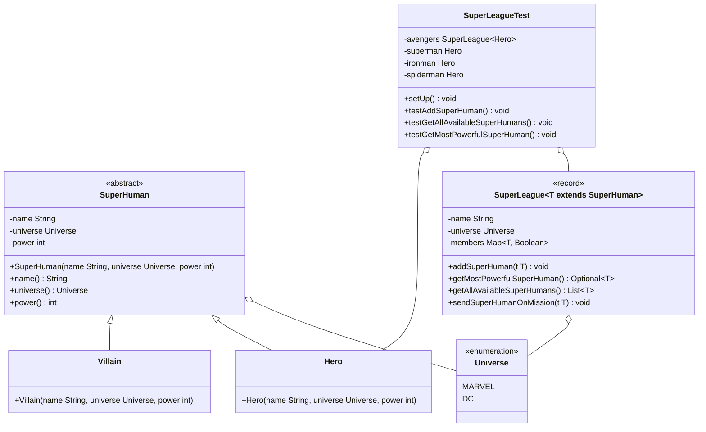
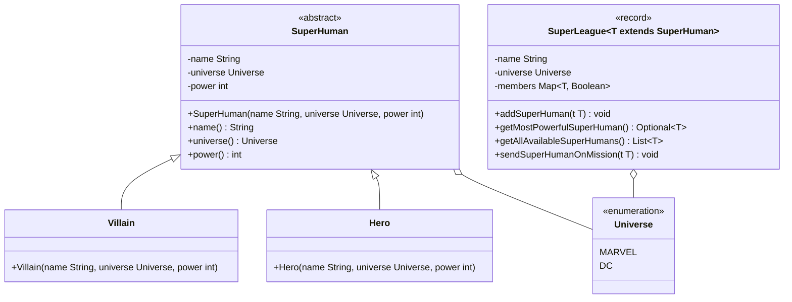

## Hinweise zur Klausur

- Der Stereotyp `record` impliziert, dass die Datenklasse einen entsprechenden Konstruktor, Getter zu allen Attributen sowie entsprechende Implementierungen für die Object-Methoden besitzt
- Der Stereotyp `enumeration` impliziert, dass die Aufzählung einen passenden, privaten Konstruktor sowie ggbfs. passende Setter und Getter besitzt
- Pakete und Klassenimporte müssen nicht angegeben werden
- Für die Konsolenausgabe kann das Kürzel `sysout` verwendet werden
- Methoden- und Attributsbezeichner dürfen gekürzt geschrieben werden (Beispiel `testGMPSH()` statt `testGetMostPowerfulSuperHuman()`)

## Aufgabe 1 (14 Punkte)

Erstelle die JUnit-5-Testklasse `SuperLeagueTest` anhand des abgebildeten Klassendiagramms.

### Klassendiagramm



### Hinweise zur Testklasse SuperLeagueTest

- Die Lebenszyklus-Methode `void setUp()` soll das nachfolgende Testszenario aufbauen:
    - Es soll ein DC-Superheld mit dem Namen _Superman_ und der Stärke 10 erstellt und dem Attribut `superman` zugewiesen werden
    - Es soll ein MARVEL-Superheld mit dem Namen _Iron Man_ und der Stärke 7 erstellt und dem Attribut `ironman` zugewiesen werden
    - Es soll ein MARVEL-Superheld mit dem Namen _Spider-Man_ und der Stärke 8 erstellt und dem Attribut `spiderman` zugewiesen werden
    - Es soll eine MARVEL-Superheldenliga mit dem Namen _Avengers_ erstellt und dem Attribut `avengers` zugewiesen werden
    - Die Superhelden Iron Man und Spider-Man sollen den Avengers als verfügbaren Superhelden hinzugefügt werden. Es muss dabei berücksichtigt werden, dass die Methode `void addSuperHuman(t: T)` die Ausnahme `WrongUniverseException` auslösen kann
    - Der Superheld mit dem Namen Spider-Man soll auf eine Mission geschickt werden
- Die Testmethode `void testAddSuperHuman()` soll den nachfolgenden Testfall abdecken: Beim Aufruf der Methode `void addSuperHuman(t: T)` auf das Attribut `avengers` mit dem Wert `superman` wird die Ausnahme `WrongUniverseException` erwartet
- Die Testmethode `void testGetAllAvailableSuperHumans()` soll den nachfolgenden Testfall abdecken: Beim Aufruf der Methode `List<T> getAllAvailableSuperHumans()` auf das Attribut `avengers` wird als Rückgabe eine Liste der Größe 1 erwartet
- Die Testmethode `void testGetMostPowerfulSuperHuman()` soll den nachfolgenden Testfall abdecken: Beim Aufruf der Methode `Optional<T> getMostPowerfulSuperHuman()` auf das Attribut `avengers` wird als Rückgabe der Superheld mit dem Namen _Spider-Man_ als Optional erwartet

### Musterlösung

```java title="SuperLeagueTest.java" showLineNumbers
public class SuperLeagueTest { // 0,5

  private SuperLeague<Hero> avengers; // 0,25
  private Hero superman; // 0,25
  private Hero ironman; // 0,25
  private Hero spiderman; // 0,25

  @BeforeEach // 0,25
  void setUp() throws WrongUniverseException { // 0,75
    superman = new Hero("Superman", Universe.DC, 10); // 1
    ironman = new Hero("Iron Man", Universe.MARVEL, 7); // 1
    spiderman = new Hero("Spider-Man", Universe.MARVEL, 8); // 1
    avengers = new SuperLeague<>("Avengers", Universe.MARVEL, new HashMap<>()); // 1
    avengers.addSuperHuman(ironman); // 1
    avengers.addSuperHuman(spiderman); // 1
    avengers.sendSuperHumanOnMission(spiderman); // 0,5
  }

  @Test // 0,25
  void testAddSuperHuman() { // 0,25
    assertThrows(WrongUniverseException.class, () -> avengers.addSuperHuman(superman)); // 1
  }

  @Test // 0,25
  void testGetAllAvailableSuperHumans() { // 0,25
    assertEquals(1, avengers.getAllAvailableSuperHumans().size()); // 1
  }

  @Test // 0,25
  void testGetMostPowerfulSuperHuman() { // 0,25
    assertEquals(spiderman, avengers.getMostPowerfulSuperHuman().get()); // 1,5
  }

}
```

## Aufgabe 2 (16 Punkte)

Erstelle die Klasse `SuperLeague<T extends SuperHuman>` anhand des abgebildeten Klassendiagrams.

### Klassendiagramm



### Hinweise zur Klasse SuperLeague<T extends SuperHuman\>

- Der Assoziativspeicher `members` beinhaltet als Schlüssel alle Übermenschen der Liga sowie als Wert deren Verfügbarkeit (verfügbar: `true`, nicht verfügbar: `false`)
-	Die Methode `Optional<T> getMostPowerfulSuperHuman()` soll den stärksten Übermenschen der Liga als Optional zurückgeben
-	Die Methode `void addSuperHuman(t: T)` soll der Liga den eingehenden Übermenschen als verfügbares Mitglied hinzufügen. Für den Fall, dass das Universum des eingehenden Übermenschen nicht dem Universum der Liga entspricht, soll die Ausnahme `WrongUniverseException` ausgelöst werden
-	Die Methode `List<T> getAllAvailableSuperHumans()` soll alle verfügbaren Übermenschen der Liga als Liste zurückgeben
-	Die Methode `void sendSuperHumanOnMission(t: T)` soll die Verfügbarkeit des eingehenden Übermenschen auf nicht verfügbar setzen

### Musterlösung

```java title="SuperLeage.java" showLineNumbers
public record SuperLeague<T extends SuperHuman>(String name, Universe universe, HashMap<T, Boolean> members) { // 1

  public Optional<T> getMostPowerfulSuperHuman() { // 0,5
    T mostPowerfulSuperHuman = null; // 0,5
    int power = 0; // 0,5
    for (T t : members.keySet()) { // 1
      if (t.power() > power) { // 0,5
        power = t.power(); // 0,5
        mostPowerfulSuperHuman = t; // 0,5
      }
    }
    return Optional.ofNullable(mostPowerfulSuperHuman); // 1
  }

  public void addSuperHuman(T t) throws WrongUniverseException { // 1
    if (!t.universe().equals(universe)) { // 1
      throw new WrongUniverseException(); // 1
    }

    members.put(t, true); // 1
  }

  public List<T> getAllAvailableSuperHumans() { // 0,5
    List<T> allAvailableSuperHumans = new ArrayList<>(); // 0,5
    for (Entry<T, Boolean> entry : members.entrySet()) { // 1
      if (entry.getValue().equals(true)) { // 1
        allAvailableSuperHumans.add(entry.getKey()); // 1
      }
    }
    return allAvailableSuperHumans; // 0,5
  }

  public void sendSuperHumanOnMission(T t) { // 0,5
    members.put(t, false); // 1
  }

}
```

## Aufgabe 3 (22 Punkte)

Erstelle die Klasse `SingleQueries` anhand des abgebildeten Klassendiagramms.

### Klassendiagramm


### Hinweise zur Klasse SingleQueries

-	Die statische Methode `void printAllSinglesWithMoreThan25MillionSalesPerCountry()` soll alle Singles, die sich mehr als 25 Millionen mal verkauft haben, gruppiert nach dem Land in der Form _[Land\]: [[Single\], [Single\],...\]_ ausgeben
-	Die statische Methode `void printAverageBirthYearOfAllDeceasedArtists()` soll das durchschnittliche Geburtsjahr aller verstorbenen Künstler bzw. aller verstorbenen Künstlerinnen ausgeben. Für den Fall, dass es keinen verstorbenen Künstler bzw. keine verstorbene Künstlerin gibt, soll der Wert -1 ausgegeben werden
-	Die statische Methode `boolean isAnySingleFromChinaWithMoreThan10MillionSales()` soll zurückgeben, ob es eine Single eines Künstlers bzw. einer Künstlerin aus China gibt, welches sich mehr als 10 Millionen Mal verkauft hat
-	Die statische Methode `List<String> getTop3SinglesOfThisCenturyBySalesInMillions()` soll die 3 am häufigsten verkauften Singles des jetzigen Jahrtausends sortiert nach der Anzahl Verkäufe in Millionen in der Form _[Name der Single\]: [Name des Künstlers bzw. Name der Künstlerin\], [Verkäufe in Millionen\] Millionen_ zurückgeben
-	Die statische Methode `List<Single> getAllSinglesFromEdSheeran()` soll alle Singles des Künstlers Ed Sheeran (Land: Großbritannien, Geburtstag: 17.02.1991, Status: lebendig) zurückgeben

### Beispielhafte Konsolenausgabe

```console
printAllSinglesWithMoreThan25MillionSalesPerCountry:
CHN: [Single[name=Spotlight, artist=Artist[name=Xiao Zhan, country=CHN, birthdate=1991-10-05,
isAlive=true], salesInMillion=33, publishingYear=2020],...]
GBR: [Single[name=Shape of You, artist=Artist[name=Ed Sheeran, country=GBR, birthdate=1991-02-17,
isAlive=true], salesInMillion=42, publishingYear=2017],...]
...

printAverageBirthYearOfAllDeceasedArtists:
1915.75

isAnySingleFromChinaWithMoreThan10MillionSales:
true

getTop3SinglesOfThisCenturyBySalesInMillions:
[Shape of You: Ed Sheeran, 42 Millionen, Despacito: Luis Fonsi, 36 Millionen, Spotlight: Xiao Zhan, 33 Millionen,...]

getAllSinglesFromEdSheeran:
[Single[name=Shape of You, artist=Artist[name=Ed Sheeran, country=GBR, birthdate=1991-02-17, isAlive=true], salesInMillions=42, publishingYear=2017], Single[name=Perfect, artist=Artist[name=Ed Sheeran, country=GBR, birthdate=1991-02-17, isAlive=true], salesInMillions=21, publishingYear=2017],...]
```

### Musterlösung

```java title="SingleQueries" showLineNumbers
public class SingleQueries { // 0,5

  private static ArrayList<Single> singles = Singles.getSingles(); // 0,5

  private static void a() { // 0,5
    Map<Country, List<Single>> x = singles.stream() // 1
        .filter(a -> a.salesInMillions() > 25) // 0,5
        .collect(Collectors.groupingBy(a -> a.artist().country())); // 1

    x.forEach((c, sl) -> System.out.println(c + ": " + sl); // 1
    }
  }

  private static void b() { // 0,5
    OptionalDouble x = singles.stream() // 1
     .map(a -> a.artist()) // 0,5
     .distinct() // 0,5
     .filter(a -> !a.isAlive()) // 0,5
     .mapToInt(a -> a.birthdate().getYear()) // 1
     .average(); // 0,5

    x.ifPresentOrElse(System.out::println, () -> System.out.println(-1)); // 1
  }

  private static boolean c() { // 0,5
    return singles.stream() // 1
        .anyMatch(a -> a.salesInMillions() > 10 // 0,5
          && a.artist().country().equals(Country.CHN)); // 1
  }

  private static List<String> d() { // 0,5
    return singles.stream() // 1
      .filter(a -> a.publishingYear().compareTo("2000") > 0) // 1
      .sorted((a1, a2) -> Integer.valueOf(a2.salesInMillions()).compareTo(a1.salesInMillions())) // 1
      .map(a -> a.name() + ": " + a.artist().name() + ", " + a.salesInMillions() + " Millionen") // 1
      .limit(3) // 0,5
      .collect(Collectors.toList()); // 0,5
  }

  private static List<Single> e() { // 0,5
    return singles.stream() // 1
        .filter(a -> a.artist().equals(new Artist("Ed Sheeran", Country.GBR, LocalDate.of(1991, 2, 17),
          true))) // 1
        .collect(Collectors.toList()); // 0,5
  }

}
```
