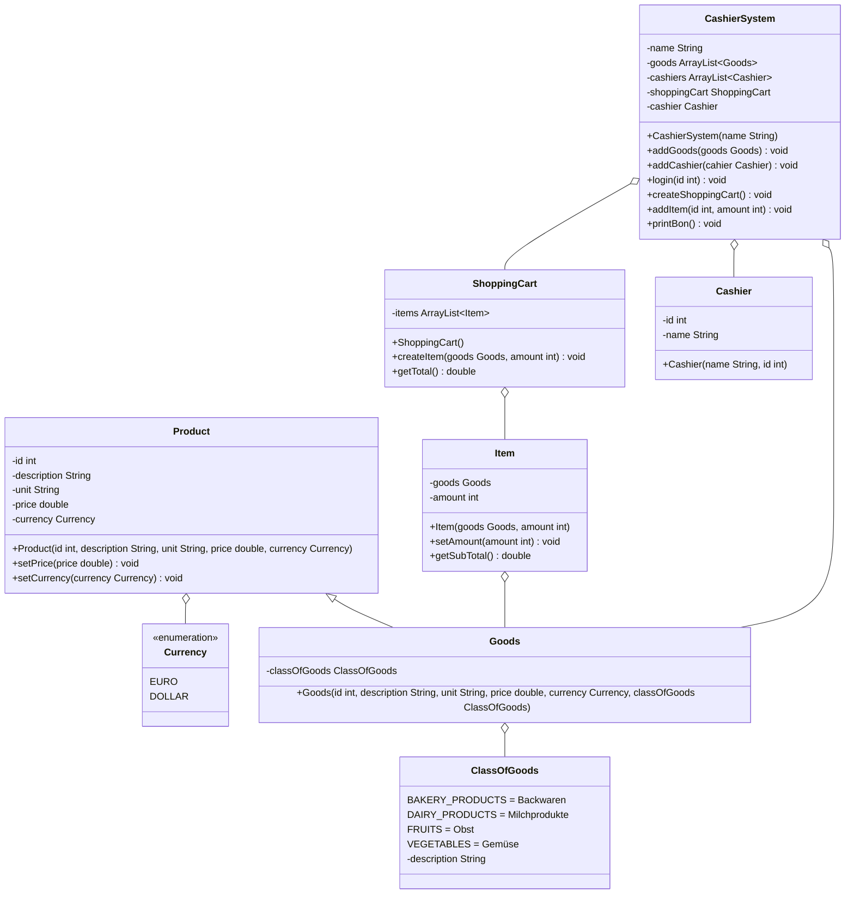

Setze das abgebildete Klassendiagramm vollständig um. Erstelle zum Testen eine ausführbare Klasse.

## Klassendiagramm

## Allgemeine Hinweise

- Aus Gründen der Übersicht werden im Klassendiagramm keine Getter und Object-Methoden dargestellt
- So nicht anders angegeben, sollen Konstruktoren, Setter, Getter sowie die Object-Methoden wie gewohnt implementiert werden

## Hinweis zur Klasse Item

Die Methode `double getSubTotal()` soll die Zwischensumme gemäß der Formel _Anzahl \* Preis_ zurückgeben

## Hinweise zur Klasse ShoppingCart

- Die Methode `void createItem(goods: Goods, amount: int)` soll den Einträgen des Warenkorbs (`items`) die eingehende Ware und die eingehende Anzahl als Eintrag hinzufügen
- Die Methode `double getTotal()` soll die Gesamtsumme zurückgeben

## Hinweise zur Klasse CashierSystem

- Die Methode `void addGoods(goods: Goods)` soll der Warenliste (`goods`) die eingehende Ware hinzufügen
- Die Methode `void addCashier(cashier: Cashier)` soll der Kassiererliste (`cashiers`) den eingehenden Kassierer hinzufügen
- Die Methode `void login(id: int)` soll den Kassierer zur eingehenden Kassierernummer an der Kasse "registrieren"
- Die Methode `void createShoppingCart()` soll an der Kasse einen neuen Warenkorb erstellen
- Die Methode `void addItem(id: int, amount: int)` soll dem Warenkorb (`shoppingCart`) anhand der eingehenden Produktnummer und anhand der eingehenden Anzahl
  einen neuen Warenkorbeintrag hinzufügen
- Die Methode `void printBon()` soll alle relevanten Informationen zum Warenkorb auf der Konsole ausgeben
