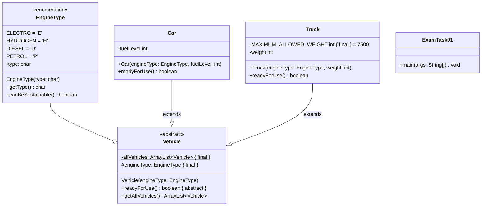
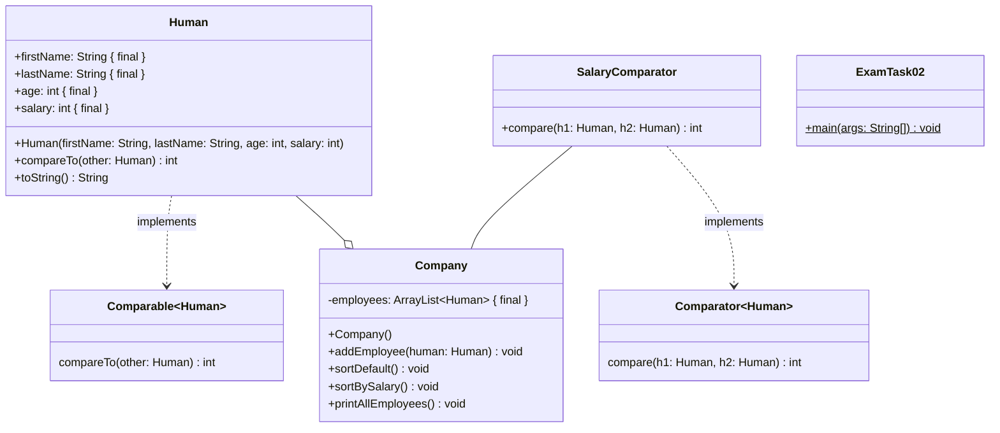

## Aufgabe 1

Erstelle die Klassen **EngineType** (6 Punkte), **Vehicle** (4 Punkte), **Car**
(3 Punkte), **Truck** (4 Punkte) und **ExamTask01** (7 Punkte) anhand des
abgebildeten Klassendiagramms.

### Hinweise zur Klasse EngineType

- Erstelle die vier Konstanten Elektro, Wasserstoff, Diesel und Benzin für die
  Arten eines Motors.
- Der Konstruktor soll alle Attribute initialisieren.
- Die Methode **getType** soll den Typ der Motorart zurückgeben.
- Die Methode **canBeSustainable** soll true zurückgeben, wenn es ein Elektro-
  oder Wasserstoffmotor ist.

### Hinweise zur Klasse Vehicle

- Der Konstruktor soll engineType initialisieren und das erstellte Vehicle der
  ArrayList allVehicles hinzufügen.
- Die Methode **getAllVehicles** soll die Liste der erstellten Fahrzeuge
  zurückgeben.

### Hinweise zur Klasse Car

- Der Konstruktor soll alle Attribute initialisieren.
- Die Methode **readyForUse** soll true zurückgeben, wenn der Tank nicht leer
  ist.

### Hinweise zur Klasse Truck

- Der Konstruktor soll alle Attribute initialisieren.
- Die Methode **readyForUse** soll true zurückgeben, wenn das Gewicht des Trucks
  das maximal erlaubte Gewicht nicht überschreitet.

### Hinweise zur Klasse ExamTask04

Erzeuge ein Elektroauto mit leerem Akku und ein Benzinauto mit einem Tanklevel
von 50. Erzeuge ein Dieseltruck mit einem Gewicht von 6000 und ein
Wasserstofftruck der 1500 wiegt.

Überprüfe alle erzeugten Fahrzeuge mithilfe einer Schleife und ermittle die
Anzahl der betriebsbereiten Autos. Gib die Anzahl in der Konsole aus.

## Aufgabe 2

Erstelle die Klassen **Human** (8 Punkte), **Company** (6.5 Punkte),
**SalaryComparator** (2.5 Punkte), **ExamTask02** (4 Punkte) anhand des
abgebildeten Klassendiagramms.

### Hinweise zur Klasse Human

- Der Konstruktor soll alle Attribute initialisieren.

- Die Methode **compareTo** soll die natürliche Ordnung der Klasse Human
  definieren. Hierbei sollen die Menschen aufsteigend nach ihrem Alter sortiert
  werden. Sind zwei Menschen gleich alt, sollen die Menschen absteigend nach dem
  Gehalt sortiert werden.

- Die Methode **toString** soll die Werte eines Objektes als String zurückgeben.

  Bsp: "Human \[Fullname=Steffen Merk\] \[age=28\] \[salary=1000\]"

### Hinweise zur Klasse SalaryComparator

- Der SalaryComparator soll das Comparator Interface implementieren und Menschen
  absteigend nach Gehalt sortieren.

### Hinweise zur Klasse Company

- Der Konstruktor soll alle Attribute initialisieren.

- Die Methode **addEmployee** soll den eingehenden Menschen der Mitarbeiterliste
  hinzufügen.

- Die Methode **sortDefault** soll die Mitarbeiterliste der natürlichen Ordnung
  nach sortieren.

- Die Methode **sortBySalary** soll die Mitarbeiterliste absteigend nach Gehalt
  sortieren.

- Die Methode **printAllEmployees** soll jeden Mitarbeiter in der Konsole
  ausgeben.

### Hinweise zur Klasse ExamTask02

Erzeuge eine Firma und füge dieser 2 Mitarbeiter hinzu. Der erste Mitarbeiter
heißt Steffen Merk, ist 24 Jahre alt und hat ein Gehalt von 1000. Die zweite
Mitarbeiterin heißt Marianna, ist 28 Jahre alt und hat ein Gehalt von 2000.

Sortiere die Mitarbeiter zuerst nach dem Gehalt und anschließend nach der
natürlichen Ordnung. Gebe nach jeder Sortierung alle Mitarbeiter der Firma aus.
