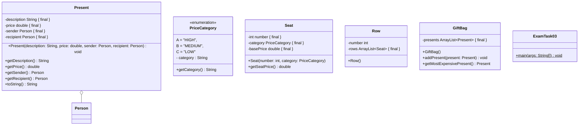
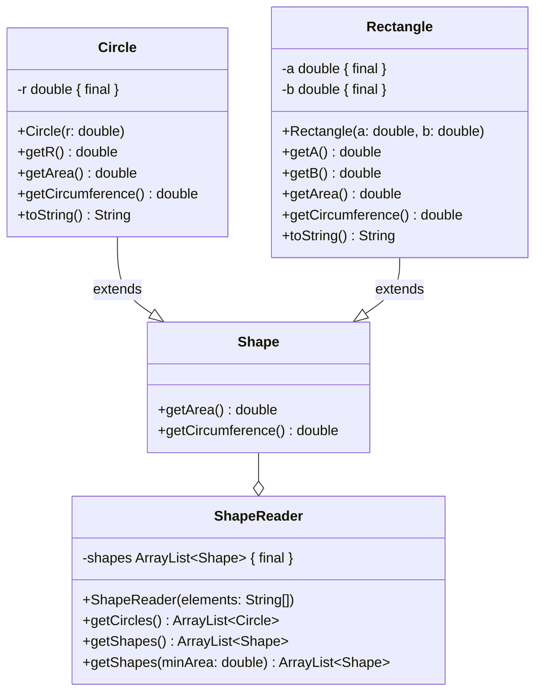
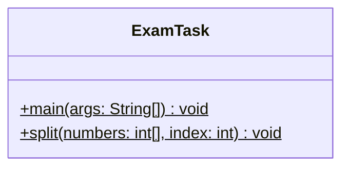
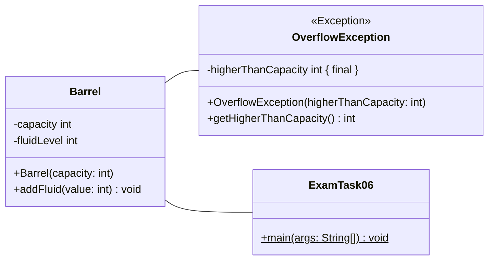
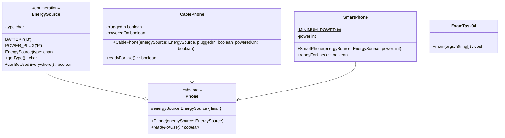
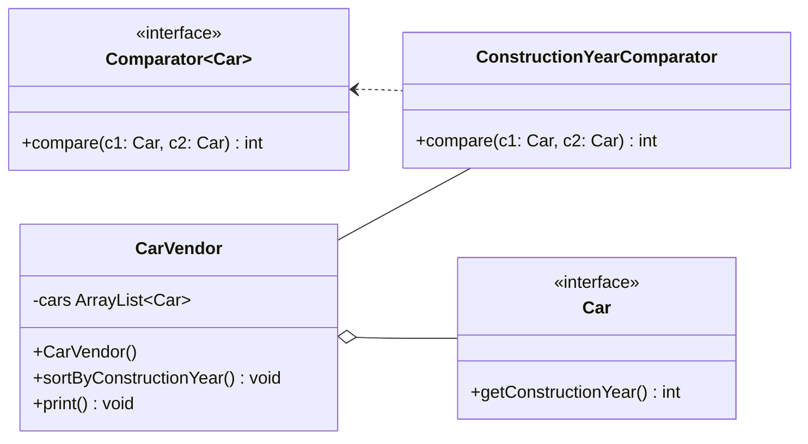

## Aufgabe 3

Erstelle die Klassen **Present** (9 Punkte), **GiftBag** (7 Punkte) und
**ExamTask02** (4 Punkte) anhand des abgebildeten Klassendiagramms.



### Hinweise zur Klasse ExamTask02

- Erzeuge einen Geschenkesack (GiftBag) mit zwei unterschiedlichen Geschenken
  (Present) für ein und dieselbe Person (Person).
- Gib anschließend das teuerste Geschenk des Geschenkesacks auf der Konsole aus

**Beispielhafte Konsolenausgabe:**
`Present[description=PS5, price=499.0, sender=Hans, recipient=Lisa]`

### Hinweise zur Klasse Present

- Der Konstruktor soll alle Attribute initialisieren
- Die Methode **toString** soll alle Attribute in nachfolgender Form
  zurückgeben.
  `Present [description=[Beschreibung], price=[Preis], sender=[Name des Senders], recipient=[Name des Empfängers]]`

### Hinweise zur Klasse GiftBag

- Der Konstruktor soll alle Attribute initialisieren
- Die Methode **addPresent** soll dem Geschenkesack (Giftbag) das eingehende
  Geschenk (Present) hinzufügen.
- Die Methode **getMostExpensivePresent** soll das teuerste Geschenk
  zurückgeben.

## Aufgabe 4

Erstelle die Klassen **Circle** (6 Punkte) und **ShapeReader** (14 Punkte)
anhand des abgebildeten Klassendiagramms.



### Hinweise zur Klasse Circle

- Der Konstruktor soll alle Attribute initialisieren
- Die Methode **getArea** soll den Flächeninhalt eines Kreises (πr²) zurückgeben
- Die Methode **getCircumference** soll den Umfang eines Kreises (2πr)
  zurückgeben
- Die Methode **toString** soll alle Attribute in nachfolgender Form
  zurückgeben. `Circle [r=[Wert von r]]`

### Hinweise zur Klasse ShapeReader

- Der Konstruktor soll für jedes Element des eingehenden Arrays ein Objekt der
  Klasse Circle oder Rectangle erzeugen und der Formenliste (shapes) hinzugefügt
  werden.

  Die Elemente des eingehenden Arrays haben folgende Struktur:

  ```text
  Circle;2
  Rectangle;1;4
  Circle;1
  Circle;6
  Rectangle;2;2
  ```

- Die Methode **getCircles** soll alle Kreise (Circle) der Formenliste (shapes)
  als Liste zurückgeben.
- Die Methode **getShape** soll den spezifischen Konstruktor **getShape(minArea:
  double)** aufrufen und alle Formen (Shape) zurückgeben.
- Die Methode **getShape(minArea: double)** soll alle Formen mit einem
  Flächeninhalt der größer oder gleich dem eingehenden Flächeninhalt (minArea)
  ist als Liste zurückgeben.

## Aufgabe 5



### Hinweise zur Methode split

Die Methode **split** soll ein Array vom Typ int so verarbeiten, dass ein neues
Array erstellt wird, was alle Elemente des eingehenden Arrays bis zum
angegebenen Index enthält. Das neu erstellte Array soll anschließend
zurückgegeben werden.

Verwende keine ArrayList!

Bsp.: Der Parameter numbers enthält die Elemente 10, 8, 3, 22 & 1 der Parameter
index ist gleich 2. Zurückgegeben werden soll ein neues Array, das die Elemente
10, 8 & 3 enthält.

### Hinweise zur Methode main

In der Methode main soll ein Arrays erstellt werden, dass die Ganzzahlen 10, 8,
3, 22 & 1 enthält. Erstelle mithilfe der Methode split ein neues Array, dass die
ersten drei Elemente des ersten Arrays enthalten soll. Gib mithilfe einer
For-Schleife alle Elemente des neu erstellten Arrays aus.

## Aufgabe 6



### Hinweise zur Klasse OverflowException

- Der Konstruktor soll alle Attribute initialisieren.
- Die Methode **getHigherThanCapacity** soll die zu viel hinzugefügte
  Flüssigkeit zurückgeben.

### Hinweise zur Klasse Barrel

- Der Konstruktor soll alle Attribute initialisieren. Das Fass ist Anfangs immer
  leer.
- Die Methode **addFluid** soll die OverflowException auslösen, wenn die Summe
  der eingehenden Flüssigkeit und der im Fass befindenden Flüssigkeit die
  Kapazität überschreitet. Übergebe der Ausnahme den Wert, um wieviel die
  maximale Kapazität überschritten wurde. Wenn die maximale Kapazität nicht
  überschritten wird, soll die eingehende Flüssigkeit dem Fass hinzugefügt
  werden

### Hinweise zur Klasse ExamTask06

Erstelle ein neues Fass, das die maximale Kapazität von 100 hat. Versuche
anschließend das Fass auf 101 zu füllen und fange die Ausnahme ab. Gib in der
Konsole aus, um wieviel die maximale Kapazität überschritten wurde.

Bsp. Konsolenausgabe: `Es wäre um 1 zu viel befüllt worden.`

## Aufgabe 7



### Hinweise zur Klasse EnergySource

- Erstelle die zwei Konstanten Batterie und Steckdose für die Arten einer
  Energiequelle.
- Der Konstruktor soll alle Attribute initialisieren.
- Die Methode **getType** soll den Typ der Energiequelle zurückgeben.
- Die Methode **canBeUsedEverywhere** soll true zurückgeben, wenn die
  Energiequelle eine Batterie ist.

### Hinweise zur Klasse Phone

- Der Konstruktor soll alle Attribute initialisieren.

### Hinweise zur Klasse CablePhone

- Der Konstruktor soll alle Attribute initialisieren.
- Die Methode readyForUse soll true zurückgeben, wenn das Kabeltelefon
  eingesteckt und eingeschalten ist.

### Hinweise zur Klasse SmartPhone

- Die minimale Energie soll 200 betragen.
- Der Konstruktor soll alle Attribute initialisieren.
- Die Methode readyForUse soll true zurückgeben, wenn die Energie des
  Smartphones die minimal erforderliche Energie überschreitet.

### Hinweise zur Klasse ExamTask04

Erzeuge ein Kabeltelefon mit Akku und eines, dass an die Steckdose angeschlossen
ist. Erzeuge ein leeres Smartphone und eines das halb voll ist. Speichere alle
erzeugten Fahrzeuge in einer ArrayList. Ermittle mithilfe einer Schleife die
Anzahl der betriebsbereiten Telefone. Gib die Anzahl in der Konsole aus.

## Aufgabe 8



### Hinweise zur Klasse CarVendor

- Der Konstruktor soll alle Attribute initialisieren.
- Die Methode sortByConstructionYear soll die Autos absteigend nach Baujahr
  sortieren.
- Die Methode print soll das Baujahr aller Autos in der Konsole ausgeben.

### Hinweise zur Klasse ConstructionYearComparator

- Der ConstructionYearComparator soll das Comparator Interface implementieren
  und Autos absteigend nach Baujahr sortieren.
