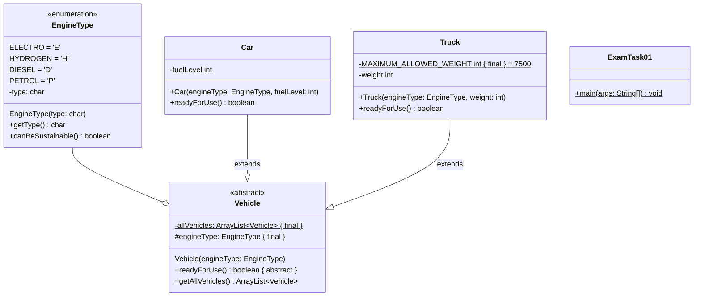
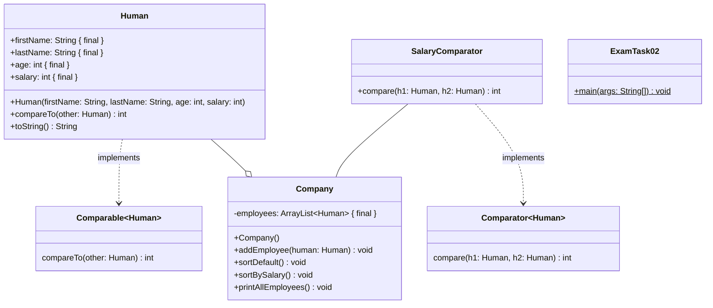

## Aufgabe 1

Erstelle die Klassen **EngineType** (6 Punkte), **Vehicle** (4 Punkte), **Car**
(3 Punkte), **Truck** (4 Punkte) und **ExamTask01** (7 Punkte) anhand des
abgebildeten Klassendiagramms.



### Hinweise zur Klasse EngineType

- Erstelle die vier Konstanten Elektro, Wasserstoff, Diesel und Benzin für die
  Arten eines Motors.
- Der Konstruktor soll alle Attribute initialisieren.
- Die Methode **getType** soll den Typ der Motorart zurückgeben.
- Die Methode **canBeSustainable** soll true zurückgeben, wenn es ein Elektro-
  oder Wasserstoffmotor ist.

### Hinweise zur Klasse Vehicle

- Der Konstruktor soll engineType initialisieren und das erstellte Vehicle der
  ArrayList allVehicles hinzufügen.
- Die Methode **getAllVehicles** soll die Liste der erstellten Fahrzeuge
  zurückgeben.

### Hinweise zur Klasse Car

- Der Konstruktor soll alle Attribute initialisieren.
- Die Methode **readyForUse** soll true zurückgeben, wenn der Tank nicht leer
  ist.

### Hinweise zur Klasse Truck

- Der Konstruktor soll alle Attribute initialisieren.
- Die Methode **readyForUse** soll true zurückgeben, wenn das Gewicht des Trucks
  das maximal erlaubte Gewicht nicht überschreitet.

### Hinweise zur Klasse ExamTask04

Erzeuge ein Elektroauto mit leerem Akku und ein Benzinauto mit einem Tanklevel
von 50. Erzeuge ein Dieseltruck mit einem Gewicht von 6000 und ein
Wasserstofftruck der 1500 wiegt.

Überprüfe alle erzeugten Fahrzeuge mithilfe einer Schleife und ermittle die
Anzahl der betriebsbereiten Autos. Gib die Anzahl in der Konsole aus.

### Lösungen

#### EngineType

```java
public enum EngineType {
    ELECTRO('E'),
    HYDROGEN('H'),
    DIESEL('D'),
    PETROL('P');

    private char type;

    EngineType(char type) {
        this.type = type;
    }

    public char getType() {
        return type;
    }

    public boolean canBeSustainable() {
        return this == EngineType.ELECTRO || this == EngineType.HYDROGEN;
    }
}
```

#### Vehicle

```java
public abstract class Vehicle {
    private final static ArrayList<Vehicle> allVehicles = new ArrayList<>();
    protected final EngineType engineType;

    Vehicle(EngineType engineType) {
        this.engineType = engineType;
        Vehicle.allVehicles.add(this);
    }

    public abstract boolean readyForUse();

    public static ArrayList<Vehicle> getAllVehicles() {
        return Vehicle.allVehicles;
    }
}
```

#### Car

```java
public class Car extends Vehicle {
    private int fuelLevel;

    public Car(EngineType engineType, int fuelLevel) {
        super(engineType);
        this.fuelLevel = fuelLevel;
    }

    public boolean readyForUse() {
        return fuelLevel > 0;
    }
}
```

#### Truck

```java
public class Truck extends Vehicle {
    private final static int MAXIMUM_ALLOWED_WEIGHT = 7500;
    private int weight;

    public Truck(EngineType engineType, int weight) {
        super(engineType);
        this.weight = weight;
    }

    public boolean readyForUse() {
        return weight <= Truck.MAXIMUM_ALLOWED_WEIGHT;
    }
}
```

#### ExamTask01

```java
public class ExamTask01 {
    public static void main(String[] args) {
        new Car(EngineType.ELECTRO, 0);
        new Car(EngineType.PETROL, 50);
        new Truck(EngineType.DIESEL, 6000);
        new Truck(EngineType.HYDROGEN, 1500);

        int readyVehicles = 0;
        for (Vehicle vehicle : Vehicle.getAllVehicles()) {
            if (vehicle instanceof Car && vehicle.readyForUse()) {
                readyVehicles++;
            }
        }

        System.out.println(readyVehicles);
    }
}
```

## Aufgabe 2

Erstelle die Klassen **Human** (8 Punkte), **Company** (6.5 Punkte),
**SalaryComparator** (2.5 Punkte), **ExamTask02** (4 Punkte) anhand des
abgebildeten Klassendiagramms.



### Hinweise zur Klasse Human

- Der Konstruktor soll alle Attribute initialisieren.

- Die Methode **compareTo** soll die natürliche Ordnung der Klasse Human
  definieren. Hierbei sollen die Menschen aufsteigend nach ihrem Alter sortiert
  werden. Sind zwei Menschen gleich alt, sollen die Menschen absteigend nach dem
  Gehalt sortiert werden.

- Die Methode **toString** soll die Werte eines Objektes als String zurückgeben.

  Bsp: "Human \[Fullname=Steffen Merk\] \[age=28\] \[salary=1000\]"

### Hinweise zur Klasse SalaryComparator

- Der SalaryComparator soll das Comparator Interface implementieren und Menschen
  absteigend nach Gehalt sortieren.

### Hinweise zur Klasse Company

- Der Konstruktor soll alle Attribute initialisieren.

- Die Methode **addEmployee** soll den eingehenden Menschen der Mitarbeiterliste
  hinzufügen.

- Die Methode **sortDefault** soll die Mitarbeiterliste der natürlichen Ordnung
  nach sortieren.

- Die Methode **sortBySalary** soll die Mitarbeiterliste absteigend nach Gehalt
  sortieren.

- Die Methode **printAllEmployees** soll jeden Mitarbeiter in der Konsole
  ausgeben.

### Hinweise zur Klasse ExamTask02

Erzeuge eine Firma und füge dieser 2 Mitarbeiter hinzu. Der erste Mitarbeiter
heißt Steffen Merk, ist 24 Jahre alt und hat ein Gehalt von 1000. Die zweite
Mitarbeiterin heißt Marianna, ist 28 Jahre alt und hat ein Gehalt von 2000.

Sortiere die Mitarbeiter zuerst nach dem Gehalt und anschließend nach der
natürlichen Ordnung. Gebe nach jeder Sortierung alle Mitarbeiter der Firma aus.

### Lösungen

#### Human

```java
public class Human implements Comparable<Human> {
    public final String firstName;
    public final String lastName;
    public final int age;
    public final int salary;

    public Human(String firstName, String lastName, int age, int salary) {
        this.firstName = firstName;
        this.lastName = lastName;
        this.age = age;
        this.salary = salary;
    }

    public int compareTo(Human other) {
        if (age > other.age) {
            return 1;
        } else if (age < other.age) {
            return -1;
        } else {
            if (salary > other.salary) {
                return -1;
            } else if (salary < other.salary) {
                return 1;
            } else {
                return 0;
            }
        }
    }

    public String toString() {
        return "Human [Fullname=" + firstName + " " + lastName + "] [age=" + age + "] [salary=" + salary + "]";
    }
}
```

#### SalaryComparator

```java
public class SalaryComparator implements Comparator<Human> {
    public int compare(Human h1, Human h2) {
        if (h1.salary > h2.salary) {
            return -1;
        } else if (h1.salary < h2.salary) {
            return 1;
        } else {
            return 0;
        }
    }
}
```

#### Company

```java
public class Company {
    private final ArrayList<Human> employees;

    public Company() {
        employees = new ArrayList<>();
    }

    public void addEmployee(Human human) {
        employees.add(human);
    }

    public void sortDefault() {
        Collections.sort(employees);
    }

    public void sortSortBySalary() {
        Collections.sort(employees, new SalaryComparator());
    }

    public void printAllEmployees() {
        for (Human employee : employees) {
            System.out.println(employee.toString());
        }
    }
}
```

#### ExamTask02

```java
public class ExamTask02 {
    public static void main(String[] args) {
        Company c = new Company();
        c.addEmployee(new Human("Steffen", "Merk", 24, 1000));
        c.addEmployee(new Human("Marianna", "Maglio", 28, 2000));

        c.sortSortBySalary();
        c.printAllEmployees();
        c.sortDefault();
        c.printAllEmployees();
    }
}
```

## Aufgabe 3 (Probeklausur Moodle)

- [Klausur](/pdf/steffen/2024/klausur.pdf)
- [Klassendiagramm](/pdf/steffen/2024/klassendiagramm.pdf)
- [API](/pdf/steffen/2024/api.pdf)

### Rentable

```java
public interface Rentable { // 0.5
  public void rent(Person person) throws NotRentableException, TooLowBudgetException; // 1.5
}
```

### NotRentableException

```java
public class NotRentableException extends Exception { // 0.5
  public NotRentableException() { // 0.5
    super(); // 0.5
  }
}
```

### TooLowBudgetException

```java
public class TooLowBudgetException extends Exception { // 0.5
  final double missingMoney; // 0.25

  public TooLowBudgetException(double missingMoney) { // 0.5
    super(); // 0.5
    this.missingMoney = missingMoney; // 0.25
  }
}
```

### Flat

```java
public class Flat implements Rentable { // 0.5

  public double fee; // 0.25
  private Person renter; // 0.25

  public Flat(double fee) { // 0.5
    this.fee = fee; // 0.25
    this.renter = null; // 0.25
  }

  public boolean isFree() { // 0.5
    return renter == null; // 0.5
  }

  public boolean isRentable() { // 0.5
    return fee > 0; // 0.5
  }

  public void rent(Person person) throws NotRentableException, TooLowBudgetException { // 1.0
    if (!isRentable() || !isFree()) { // 0.5
      throw new NotRentableException(); // 0.5
    } else if (fee > person.budget) { // 0.5
      throw new TooLowBudgetException(fee - person.budget); // 0.5
    } else {
      this.renter = person; // 0.5
    }
  }
}
```

### House

```java
public class House implements Rentable, Comparable<House> { // 1.0
  private final int number; // 0.25
  public final double fee; // 0.25
  private Person renter; // 0.25
  public final ArrayList<Flat> flats; // 0.25

  public House(int number, int numberOfFlats) { // 0.5
    this(number, numberOfFlats, 0); // 0.5
  }

  public House(int number, int numberOfFlats, double fee) { // 0.5
    this.number = number; // 0.25
    this.fee = fee; // 0.25
    this.flats = new ArrayList<>(); // 0.25
    this.renter = null; // 0.25
    double flatFee = 500; // 0.25
    for (int i = 0; i < number; i++) { // 0.5
      this.flats.add(new Flat(flatFee)); // 0.5
      flatFee += 100; // 0.25
    }
  }

  public int getNumber() { // 0.5
    return number; // 0.5
  }

  public boolean isRentable() { // 0.5
    return fee > 0 && renter == null; // 0.5
  }

  public void rent(Person person) throws NotRentableException, TooLowBudgetException { // 1.0
    if (!isRentable()) { // 0.5
      throw new NotRentableException(); // 1
    } else if (fee > person.budget) { // 0.5
      throw new TooLowBudgetException(fee - person.budget); // 1
    } else {
      this.renter = person; // 0.5
    }
  }

  public int compareTo(House o) { // 0.5
    if (number > o.getNumber()) { // 0.5
      return 1; // 0.25
    } else {
      return -1; // 0.25
    }
  }
}
```

### HouseFeeComparator

```java
public class HouseFeeComparator implements Comparator<House> { // 0.5

  public int compare(House h1, House h2) { // 0.5
    if (h1.fee > h2.fee) { // 0.5
      return 1; // 0.25
    } else if (h1.fee < h2.fee) { // 0.5
      return -1; // 0.25
    } else {
      return 0; // 0.25
    }
  }
}
```

### Street

```java
public class Street { // 0.5
  public final ArrayList<House> houses; // 0.25

  public Street(int numberOfHouses) { // 0.5
    this.houses = new ArrayList<>(); // 0.25
    for (int i = 0; i < numberOfHouses; i++) { // 0.5
      int houseNumber = i + 1; // 0.25
      if (houseNumber % 2 == 0) { // 0.5
        this.houses.add(new House(houseNumber, 5)); // 0.5
      } else {
        this.houses.add(new House(houseNumber, 0, 2000)); // 0.5
      }
    }
  }

  public void rentHouse(Person person) { // 0.5
    for (House house : houses) { // 0.5
      try { // 0.25
        house.rent(person); // 0.5
        break; // 0.25
      } catch (Exception e) { // 0.5
        if (e instanceof TooLowBudgetException l) { // 0.5
          System.out.println("Es wird " + l.missingMoney + " mehr Geld gebraucht"); // 0.5
        }
        if (e instanceof NotRentableException) { // 0.5
          System.out.println(
              "Die Hausnummer " + house.getNumber() + " kann nicht gemietet werden."); // 0.5
        }
      }
    }
  }

  public boolean rentFlat(Person person) { // 0.5
    for (House house : houses) { // 0.5
      for (int i = 0; i < house.flats.size(); i++) { // 0.5
        Flat flat = house.flats.get(i); // 0.5
        try { // 0.25
          flat.rent(person); // 0.5
          return true; // 0.5
        } catch (TooLowBudgetException e) { // 0.5
          System.out.println("Zu wenig Geld für Wohnung. Gebühr: " + flat.fee); // 0.5
        } catch (NotRentableException e) { // 0.5
          System.out.println("Wohnung " + (i + 1) + " nicht Mietbar."); // 0.5
        }
      }
    }
    return false; // 0.5
  }

  public void sortByFee() { // 0.5
    Collections.sort(this.houses, new HouseFeeComparator()); // 0.5
  }

  public void sort() { // 0.5
    Collections.sort(this.houses); // 0.5
  }
}
```

### ExamTask01

```java
public class ExamTask01 { // 0.5
  public static void main(String[] args) { // 0.5
    Street s = new Street(20); // 0.5
    s.sortByFee(); // 0.5
    Flat cheapestFlat = null; // 0.25
    for (House h : s.houses) { // 0.5
      for (Flat flat : h.flats) { // 0.5
        if (cheapestFlat == null) { // 0.5
          cheapestFlat = flat; // 0.25
        } else if (flat.fee < cheapestFlat.fee) { // 0.5
          cheapestFlat = flat; // 0.25
        }
      }
    }
    System.out.println(cheapestFlat.fee); // 0.5
  }
}
```
