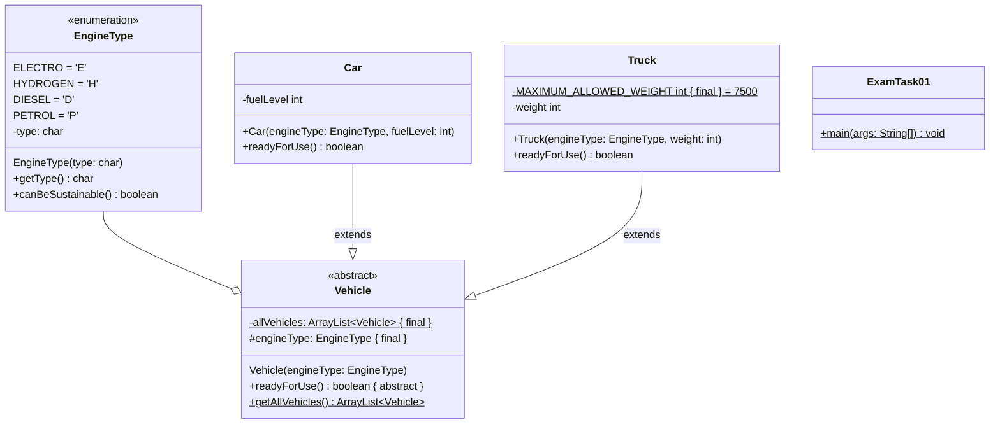

## Aufgabe 1

Erstelle die Klassen **EngineType (6 Punkte)**, **Vehicle (4 Punkte)**, **Car (3
Punkte)**, **Truck (4 Punkte)** und **ExamTask01 (7 Punkte)** anhand des
abgebildeten Klassendiagramms.

### Hinweise zur Klasse EngineType

- Erstelle die vier Konstanten Elektro, Wasserstoff, Diesel und Benzin für die
  Arten eines Motors.
- Der Konstruktor soll alle Attribute initialisieren.
- Die Methode **getType** soll den Typ der Motorart zurückgeben.
- Die Methode **canBeSustainable** soll true zurückgeben, wenn es ein Elektro-
  oder Wasserstoffmotor ist.

### Hinweise zur Klasse Vehicle

- Der Konstruktor soll engineType initialisieren und das erstellte Vehicle der
  ArrayList allVehicles hinzufügen.
- Die Methode **getAllVehicles** soll die Liste der erstellten Fahrzeuge
  zurückgeben.

### Hinweise zur Klasse Car

- Der Konstruktor soll alle Attribute initialisieren.
- Die Methode **readyForUse** soll true zurückgeben, wenn der Tank nicht leer
  ist.

### Hinweise zur Klasse Truck

- Der Konstruktor soll alle Attribute initialisieren.
- Die Methode **readyForUse** soll true zurückgeben, wenn das Gewicht des Trucks
  das maximal erlaubte Gewicht nicht überschreitet.

### Hinweise zur Klasse ExamTask04

Erzeuge ein Elektroauto mit leerem Akku und ein Benzinauto mit einem Tanklevel
von 50. Erzeuge ein Dieseltruck mit einem Gewicht von 6000 und ein
Wasserstofftruck der 1500 wiegt.

Überprüfe alle erzeugten Fahrzeuge mithilfe einer Schleife und ermittle die
Anzahl der betriebsbereiten Autos. Gib die Anzahl in der Konsole aus.
