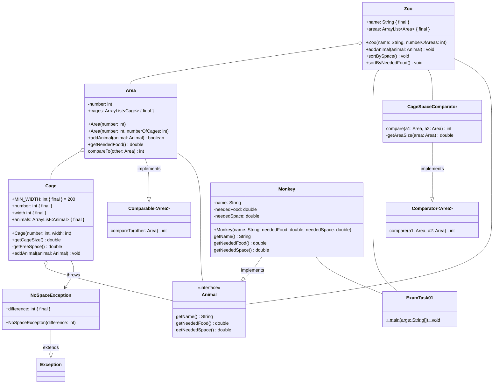

## Probeklausur Moodle

### Aufgabe 1

- [Klausur](/pdf/steffen/2025/exam.pdf)
- [Aufgabe 1](/pdf/steffen/2025/task-1.pdf)
- [Klassendiagramm Aufgabe 1](/pdf/steffen/2025/task-1-diagram.pdf)
- [Aufgabe 2](/pdf/steffen/2025/task-2.pdf)
- [Klassendiagramm Aufgabe 2](/pdf/steffen/2025/task-2-diagram.pdf)
- [Aufgabe 3](/pdf/steffen/2025/task-3.pdf)
- [Java Api](/pdf/steffen/2025/java-api.pdf)

### Lösung Aufgabe 2

#### ExamTask02

```java
public class ExamTask02 {
  public static void main(String[] args) {
    new Phone(OperatingSystem.ANDROID, false);
    new Phone(OperatingSystem.IOS, false);
    new Laptop(OperatingSystem.LINUX, 11);
    new Laptop(OperatingSystem.WINDOWS, 11);
    int securePhones = 0;
    int secureLaptops = 0;
    for (Device device : Device.getAllDevices()) {
      if (device.isSecure()) {
        if (device instanceof Laptop) {
          secureLaptops++;
        } else {
          securePhones++;
        }
      }
    }
    System.out.println("Laptops: " + secureLaptops + "Phones: " + securePhones);
  }
}

```

#### OperatingSystem

```java
public enum OperatingSystem {
  WINDOWS('W'),
  ANDROID('A'),
  MACOS('M'),
  IOS('I'),
  LINUX('L');

  private char name;

  OperatingSystem(char name) {
    this.name = name;
  }

  public char getName() {
    return name;
  }

  public boolean isMobile() {
    return this == OperatingSystem.ANDROID || this == OperatingSystem.IOS;
  }
}
```

#### Device

```java
public abstract class Device {

  private static final ArrayList<Device> allDevices = new ArrayList<>();
  protected final OperatingSystem os;

  public Device(OperatingSystem os) {
    this.os = os;
    Device.allDevices.add(this);
  }

  public abstract boolean isSecure();

  public abstract String toString();

  public static ArrayList<Device> getAllDevices() {
    return Device.allDevices;
  }
}
```

#### Phone

```java
public abstract class Device {

  private static final ArrayList<Device> allDevices = new ArrayList<>();
  protected final OperatingSystem os;

  public Device(OperatingSystem os) {
    this.os = os;
    Device.allDevices.add(this);
  }

  public abstract boolean isSecure();

  public abstract String toString();

  public static ArrayList<Device> getAllDevices() {
    return Device.allDevices;
  }
}
```

#### Laptop

```java
public class Laptop extends Device {
  private static int MINIMUM_VERSION = 22;
  private int version;

  public Laptop(OperatingSystem os, int version) {
    super(os);
    this.version = version;
  }

  public boolean isSecure() {
    return os != OperatingSystem.WINDOWS || version > Laptop.MINIMUM_VERSION;
  }

  public String toString() {
    return "Laptop [version="
        + version
        + "] [isSecure="
        + isSecure()
        + "] [os="
        + os.getName()
        + "]";
  }
}
```

## Klausur Moodle

### Aufgabenstellung

#### Aufgabe 1 (45 Punkte)

Implementiere die Klassen **Animal** (2.5 Punkte), **NoSpaceException** (2
Punkte), **Cage** (8.5 Punkte), **Area** (13 Punkte), **CageSpaceComparator** (6
Punkte), **Zoo** (7 Punkte) und **ExamTask01** (6 Punkte) entsprechend dem
Klassendiagramm. Befolge alle Hinweise bei der Implementierung!

##### Glossar

| Englisch         | Deutsch             |
| ---------------- | ------------------- |
| animal           | Tier                |
| area             | Bereich             |
| cage             | Käfig               |
| difference       | Unterschied         |
| free             | frei                |
| food             | Essen               |
| height           | Höhe                |
| level            | Ebene               |
| MIN_WIDTH        | minimale Breite     |
| space            | Platz               |
| NoSpaceException | Kein-Platz-Ausnahme |
| width            | Breite              |

##### Klassendiagramm



##### Hinweise zur Klasse NoSpaceException

- Der Konstruktor soll alle Attribute initialisieren und die Nachricht mit "Kein
  Platz" initialisieren.

##### Hinweise zur Klasse Cage

- Der Konstruktor soll alle Attribute initialisieren.

- Die Methode **getCageSize** soll die Größe des Käfigs berechnen. Die Fläche
  eines Käfigs ist immer quadratisch.

- Die Methode **getFreeSpace** soll den freien Platz im Käfig berechnen. Der
  freie Platz berechnet sich aus der Größe des Käfigs abzüglich des benötigten
  Platzes aller Tiere im Käfig.

- Die Methode **addAnimal** soll das eingehende Tier dem Käfig hinzufügen.

  Benötigt das eingehende Tier mehr Platz als im Käfig vorhanden ist, soll eine
  NoSpaceException geworfen werden, welche die Differenz des eingehenden Tieres
  und des Käfigs enthält.

  Ist genügend Platz für das Tier vorhanden, darf es dem Käfig zugewiesen
  werden.

##### Hinweise zur Klasse Area

- Die Konstruktoren sollen alle Attribute initialisieren. Rufe im unspezifischen
  Konstruktor den spezifischen Konstruktor so auf, dass immer 2 Käfige erzeugt
  werden.

  Der spezifische Konstruktor soll nach der Initialisierung aller Attribute N
  Käfige erzeugen. N entspricht numberOfCages. Die Käfige sollen beginnend mit 1
  aufsteigend nummeriert werden. Der erste Käfig soll die kleinstmögliche Breite
  (MIN_WIDTH) haben. Jeder weitere generierte Käfig soll 10 Einheiten breiter
  sein.

  Alle generierten Käfige sollen dem Bereich hinzugefügt werden.

- Die Methode **addAnimal** soll das eingehende Tier im Bereich unterbringen.

  Das Tier soll im ersten freien Käfig untergebracht werden. Käfige, deren
  Gesamtgröße kleiner als der benötigte Platz des Tieres ist, sollen ignoriert
  werden. Kann ein Tier in einem Käfig untergebracht werden soll der Name des
  Tieres, die Nummer des Bereichs und die Nummer des Käfigs in der Konsole
  ausgegeben werden. Gib anschließend true zurück.

  Bsp: "Charly added. Area: 2 Cage: 3"

  Falls das Tier in einem Käfig nicht untergebracht werden konnte, soll die
  Differenz, die Nummer des Bereichs und die Nummer des Käfigs in der Konsole
  ausgegeben werden.

  Bsp: "Cage um 20 zu klein. Area: 2 Cage: 3"

  Konnte das Tier in keinem Käfig untergebracht werden, soll false zurückgegeben
  werden.

- Die Methode **getNeededFood** soll das benötigte Futter einer Area berechnen.
  Hierbei soll das benötigte Futter aller Tiere in allen Käfigen des Bereichs
  berücksichtigt werden.

- Die Methode **compareTo** soll die natürliche Ordnung der Klasse Area
  definieren. Hierbei soll nach dem benötigten Futter absteigend sortiert
  werden.

##### Hinweise zur Klasse CageSpaceComparator

- Der CageSpaceComparator soll das Comparator Interface implementieren und
  Bereiche absteigend nach Bereichsgröße sortieren.

- Die Methode **getAreaSize** soll die Größe eines Bereichs berechnen. Dieser
  setzt sich aus der Summe aller Käfiggrößen zusammen.

##### Hinweise zur Klasse Zoo

- Der Konstruktor soll alle Attribute initialisieren.

  Der Konstruktor soll nach der Initialisierung aller Attribute N Bereiche
  erzeugen. N entspricht numberOfAreas. Die Bereiche sollen beginnend mit 0 als
  Bereich aufsteigend nummeriert werden.

  Alle erzeugten Bereiche sollen dem Zoo hinzugefügt werden.

- Die Methode **addAnimal** soll das eingehende Tier in einem Bereich
  unterbringen. Konnte das Tier in einem Bereich untergebracht werden, soll die
  Suche in weiteren Bereichen abgebrochen werden.

- Die Methode **sortBySpace** soll die Bereiche nach Größe absteigend sortieren.

- Die Methode **sortByNeededFood** soll die Bereiche nach ihrer natürlichen
  Ordnung sortieren.

##### Hinweise zur Klasse ExamTask01

Es soll der Zoo "Steffens Affenparadies" mit fünf Bereichen erstellt werden.
Anschließend sollen folgende Affen darin untergebracht werden:

| Name     | benötigtes Futter | benötigter Platz |
| -------- | ----------------- | ---------------- |
| "Charly" | 100               | 200              |
| "Apu"    | 200               | 300              |

Finde anschließend den größten Käfig in dem Bereich, welcher am meisten Futter
benötigt. Gib die Größe des Käfigs abschließend aus.

#### Aufgabe 2 (5 Punkte)

Für die Fallunterscheidung gibt es zwei Möglichkeiten. Nenne **beide** Arten und
erläutere die wesentlichen Unterschiede.

#### Java API

| Klasse    | Methode                                      | Statisch | Rückgabetyp |
| --------- | -------------------------------------------- | -------- | ----------- |
| `Boolean` | `valueOf(s: String)`                         | X        | `Boolean`   |
| `Boolean` | `valueOf(b: boolean)`                        | X        | `Boolean`   |
| `Double`  | `valueOf(s: String)`                         | X        | `Double`    |
| `Double`  | `valueOf(d: double)`                         | X        | `Double`    |
| `Integer` | `valueOf(s: String)`                         | X        | `Integer`   |
| `Integer` | `valueOf(i: int)`                            | X        | `Integer`   |
| `String`  | `charAt(index: int)`                         |          | `char`      |
| `String`  | `length()`                                   |          | `int`       |
| `String`  | `split(regex: String)`                       |          | `String[]`  |
| `String`  | `toLowerCase()`                              |          | `String`    |
| `String`  | `toUpperCase()                             ` |          | `String`    |

#### Java Collections Framework

| Klasse         | Methode                                 | Statisch | Rückgabetyp |
| -------------- | --------------------------------------- | -------- | ----------- |
| `ArrayList<T>` | `add(element: T)`                       |          | `boolean`   |
| `ArrayList<T>` | `add(index: int, element: T)`           |          | `void`      |
| `ArrayList<T>` | `contains(element: T)`                  |          | `boolean`   |
| `ArrayList<T>` | `get(index: int)`                       |          | `T`         |
| `ArrayList<T>` | `remove(index: int)`                    |          | `T`         |
| `ArrayList<T>` | `remove(element: T)`                    |          | `boolean`   |
| `ArrayList<T>` | `size()`                                |          | `int`       |
| `Collections`  | `sort(list: List<T>)`                   | X        | `void`      |
| `Collections`  | `sort(list: List<T>, c: Comparator<T>)` | X        | `void`      |

#### Schnittstellen

| Klasse          | Methode                                | Statisch | Rückgabetyp |
| --------------- | -------------------------------------- | -------- | ----------- |
| `Comparable<T>` | `compareTo(o: T)`                      |          | `int`       |
| `Comparator<T>` | `compare(o1: T, o2: T)               ` |          | `int`       |

### Lösungsvorschlag

#### Aufgabe 1 (45 Punkte)

##### Animal (2.5 Punkte)

```java
public interface Animal {
  public String getName();
  public double getNeededFood();
  public double getNeededSpace();
}
```

##### Cage (8.5 Punkte)

```java
public class Cage {
  public static final int MIN_WIDTH = 200;
  public final int number;
  public final int width;
  public final ArrayList<Animal> animals;

  public Cage(int number, int width) {
    this.number = number;
    this.width = width;
    this.animals = new ArrayList<>();
  }

  public void addAnimal(Animal animal) throws NoSpaceException {
    if (animal.getNeededSpace() > getFreeSpace()) {
      throw new NoSpaceException(animal.getNeededSpace() - getFreeSpace());
    } else {
      this.animals.add(animal);
    }
  }


  public double getCageSize() {
    return width * width;
  }

  private double getFreeSpace() {
    double usedSpace = 0;
    for (Animal animal : animals) {
      usedSpace += animal.getNeededSpace();
    }
    return getCageSize() - usedSpace;
  }
}
```

##### NoSpaceException (2 Punkte)

```java
public class NoSpaceException extends Exception {
  public final double difference;

  public NoSpaceException(double difference) {
    super("Kein Platz");
    this.difference = difference;
  }
}
```

##### Area (13 Punkte)

```java
public class Area implements Comparable<Area> {
  private int number;
  public final ArrayList<Cage> cages;

  public Area(int number) {
    this(number, 2);
  }

  public Area(int number, int numberOfCages) {
    this.number = number;
    this.cages = new ArrayList<>();
    int width = Cage.MIN_WIDTH;
    for (int i = 0; i < numberOfCages; i++) {
      this.cages.add(new Cage(i + 1, width));
      width = width + 10;
    }
  }

  public boolean addAnimal(Animal animal) {
    for (Cage cage : cages) {
      if (cage.getCageSize() > animal.getNeededSpace()) {
        try {
          cage.addAnimal(animal);
          System.out.println(
              animal.getName()
                  + " added. Area Nr: "
                  + number
                  + " Cage Nr: "
                  + cage.number);
          return true;
        } catch (NoSpaceException e) {
          System.out.println(
              "Cage um "
                  + e.difference
                  + " zu klein. Area Nr: "
                  + number
                  + " Cage Nr: "
                  + cage.number);
        }
      }
    }
    return false;
  }

  @Override
  public int compareTo(Area other) {
    if (other.getNeededFood() > this.getNeededFood()) {
      return -1;
    } else if(other.getNeededFood() < this.getNeededFood()) {
      return 1;
    } else {
      return 0;
    }
  }

  public double getNeededFood() {
    double neededFood = 0;
    for (Cage cage : cages) {
      for (Animal animal : cage.animals) {
        neededFood += animal.getNeededFood();
      }
    }
    return neededFood;
  }
}
```

##### CageSpaceComparator (6 Punkte)

```java
public class CageSpaceComparator implements Comparator<Area> {

  @Override
  public int compare(Area area1, Area area2) {
    double v1 = getAreaSize(area1);
    double v2 = getAreaSize(area2);
    if (v1 > v2) {
      return -1;
    } else if (v2 > v1) {
      return 1;
    } else {
      return 0;
    }
  }

  private double getAreaSize(Area area) {
    double value = 0;
    for (Cage cage : area.cages) {
      value += cage.getCageSize();
    }
    return value;
  }
}
```

##### Zoo (7 Punkte)

```java
public class Zoo {
  public final String name;
  public final ArrayList<Area> areas;

  public Zoo(String name, int numberOfAreas) {
    this.name = name;
    this.areas = new ArrayList<>();
    for (int i = 0; i < numberOfAreas; i++) {
      this.areas.add(new Area(i));
    }
  }

  public void addAnimal(Animal animal) {
    for (Area area : areas) {
      if (area.addAnimal(animal)) {
        break;
      }
    }
  }

  public void sortBySpace() {
    Collections.sort(areas, new CageSpaceComparator());
  }

  public void sortByNeededFood() {
    Collections.sort(areas);
  }
}
```

##### ExamTask01 (6 Punkte)

```java
public class ExamTask01 {
  public static void main(String[] args) {
    Zoo zoo = new Zoo("Steffens Affenparadies", 5);
    zoo.addAnimal(new Monkey("Charly", 100, 200));
    zoo.addAnimal(new Monkey("Apu", 200, 300));
    zoo.sortByNeededFood();
    Area firstArea = zoo.areas.get(0);
    double value = 0;
    for (Cage cage : firstArea.cages) {
      if (cage.getCageSize() > value) {
        value = cage.getCageSize();
      }
    }
    System.out.println("Größter Käfig im hungrigsten Bereich: " + value);
  }
}
```
