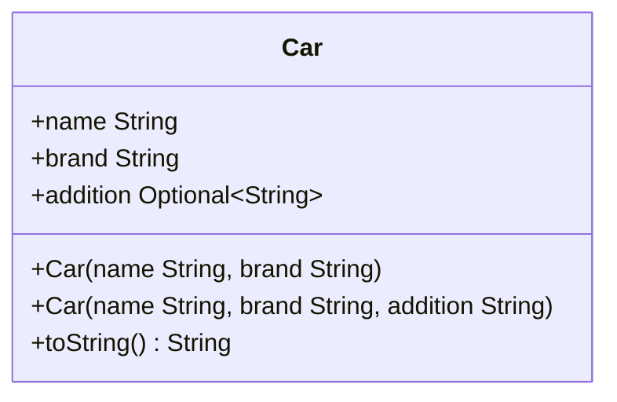
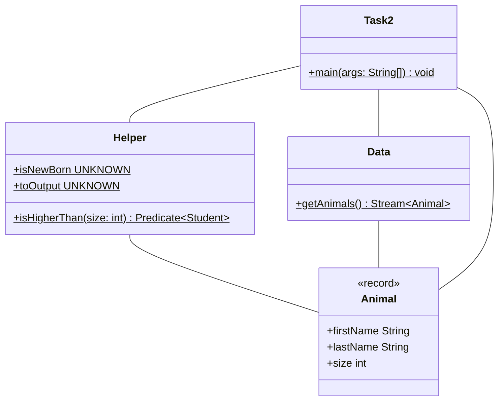
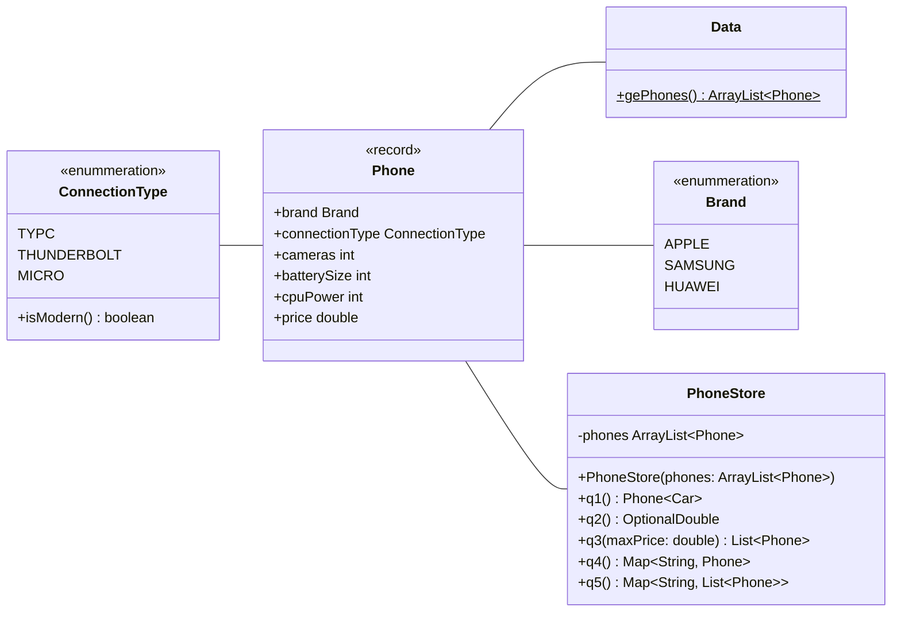

[Cheatsheet Java II](/pdf/java-cheat-sheet.pdf)

1. Altklausuren 2022 Q3 - Klausur Java 2 Aufgabe 3

```java
public class PlanetQueries {

    public static ArrayList<Planet> planets = Planet.getPlantes();

    public static void a() {
        PlanetQueries.planets.stream()
          .filter(p -> p.moons() > 5)
          .forEach(p -> {
              System.out.println(p.name() + ": " + p.moons());
          });
    }

    public static OptionalDouble b() {
        return PlanetQueries.planets.stream()
          .filter(p -> p.type() == Type.GAS_PLANET)
          .mapToDouble(p -> p.diameter())
          .average();
    }

    public static List<Planet> c() {
        return PlanetQueries.planets.stream()
          .sorted((p1, p2) -> Double.compare(p2.mass(), p1.mass()))
          .toList();
    }

    public static boolean d() {
        return PlanetQueries.planets.stream()
          .allMatch(p -> p.moons() > 0);
    }

    public static void e() {
        Map<Type, List<Planet>> planetsMap = PlanetQueries.planets.stream()
          .collect(Collectors.groupingBy(p -> p.type()));
        planetsMap.entrySet()
          .stream()
          .forEach(entry -> {
            System.out.println(entry.getKey() + ":" + entry.getValue());
          });
    }
}
```

2. Altklausuren 2022 Q3 - Probeklausur Java 2 Klausur Aufgabe 3
3. Altklausuren 2023 Q1 - Wiederholklausur 2 Java 2 Klausur Aufgabe 3
4. Altklausuren 2023 Q1 - Wiederholklausur Java 2 Klausur Aufgabe 3

## Aufgabe Optionals

### Klassendiagramm



** Hinweise zu den Konstruktoren** <br/> Die Konstruktoren sollen alle Attribute
initialisieren.

** Hinweise zur Methode toString ** <br/> Die Methode toString soll die
Attribute brand, model und addition zurückgeben. Die Attribute sollen durch eine
Leertaste getrennt sein. Falls addition keinen Wert besitz, soll dieser
ignoriert werden.

Erstelle eine ausführbare Klasse in der ein Auto mit der Marke "Mercedes", dem
Modell "CLA45" und dem Zusatz "AMG" initialisiert wird. Gib das Auto in der
Konsole aus. Entferne den Zusatz von dem Auto und gebe das Auto erneut in der
Konsole aus.

```java
public class Car {
    public String name;
    public String brand;
    public Optional<String> addition;

    public Car(String name, String brand) {
        this.name = name;
        this.brand = brand;
        this.addition = Optional.empty();
    }

    public Car(String name, String brand, String addition) {
        this.name = name;
        this.brand = brand;
        this.addition = Optional.ofNullable(addition);
    }

    public String toString() {
        if (addition.isPresent()) {
            return brand + " " + name + addition.get();
        } else {
            return brand + " " + name;
        }
    }
}
```

```java
public class Main {
    public static void main(String[] args) {
        Car benz = new Car("CLA45", "Mercedes", "AMG");
        System.out.println(benz.toString());
        benz.addition = Optional.empty();
        System.out.println(benz.toString());
    }
}
```

## Aufgabe Lambdafunktionen

### Klassendiagramm



** Hinweise zur Klasse Helper** <br/> Im Klassendiagramm sind keine
Rückgabetypen für die statischen Attribute angegeben. Gib für jedes Attribut den
geeigneten Typ an.

- Das Attribut **isNewBorn** soll eine Lambdafunktion enthalten die ermittelt,
  ob ein Tier jünger als 1 Jahr alt ist.
- Das Attribut **toOutput** soll eine Lambdafunktion enthalten, die ein Tier in
  folgenden String konvertiert: "firstName lastName ist size Zentimeter groß."
- Die Methode **isHigherThan** soll eine Lambdafunktion zurückgeben, die
  abhängig vom Parameter size überprüft, ob ein Tier größer als die angegebene
  Größe ist.

**Hinweise zur Klasse Data** <br/>

- Die Methode **getAnimals** soll einen Stream von einem einzelnen Tier mit den
  Werten deiner Wahl zurückgeben.

**Hinweise zur Klasse Task2** <br/> Verwende für die nachfolgende Abfolge die
Methoden der Klassen Data und Helper. Erzeuge einen Stream von Tieren und
filtere jene heraus, die Größer als 50 Zentimeter sind. Gib anschließend den
vollen Namen und die Größe der Tiere in der Konsole aus.

```java
public record Animal(String firstName, String lastName, int age, int size) {}
```

```java
public class Data {
    public static Stream<Animal> getAnimals() {
        return Stream.of(new Animal("Steffen", "Merk", 28, 170));
    }
}
```

```java
public class Helper {
    public static Predicate<Animal> isNewBorn = animal -> animal.age() < 1;
    public static Function<Animal, String> toOutput = animal -> animal.firstName()
            + " " + animal.lastName() + " ist " + animal.size() + " Zentimeter groß";

    public static Predicate<Animal> isHigherThan(int size) {
        return animal -> animal.size() > size;
    }
}
```

```java
public class Task2 {
    public static void main(String[] args) {
        Data.getAnimals()
                .filter(Helper.isHigherThan(50))
                .map(Helper.toOutput)
                .forEach(System.out::println);
    }
}
```

## Aufgabe Streams

### Klassendiagramm



```java
public class PhoneStore {
  private ArrayList<Phone> phones;

  public PhoneStore(ArrayList<Phone> phones) {
    this.phones = phones;
  }

  public List<Phone> q1() {
    return phones.stream()
        .filter(p -> p.brand() == Brand.HUAWEI)
        .filter(p -> p.cameras() > 3)
        .sorted((p1, p2) -> Integer.compare(p2.cpuPower(), p1.cpuPower()))
        .limit(3)
        .sorted((p1, p2) -> Double.compare(p2.price(), p1.price()))
        .toList();
  }

  public OptionalDouble q2() {
    return phones.stream()
        .filter(p -> p.batterySize() > 2500)
        .mapToInt(p -> p.cameras())
        .average();
  }

  public List<Phone> q3(double maxPrice) {
    return phones.stream()
        .filter(p -> p.price() <= maxPrice)
        .filter(p -> p.connectionType().isModern())
        .filter(p -> p.cpuPower() < 2400)
        .sorted((p1, p2) -> Double.compare(p1.price(), p2.price()))
        .toList();
  }

  public Map<String, Phone> q4() {
    return phones.stream()
        .collect(Collectors.toMap(
            p -> p.brand().name() + p.connectionType().name(),
            p -> p));
  }

  public Map<ConnectionType, List<Phone>> q5() {
    return phones.stream()
        .collect(Collectors.groupingBy(p -> p.connectionType()));
  }

}
```

## Hinweise zur Klasse PhoneStore

- Der Konstruktor soll alle Attribute initialisieren.
- Die Methode **q1** soll die drei Leistungsstärksten (CPU Power) Smart Phones
  der Marke Huawei, absteigend nach dem Preis zurückgeben, welche mehr als 3
  Kameras haben.
- Die Methode **q2** soll die durchschnittliche Kameraanzahl aller Smart Phones
  zurückgeben, die einen Akku von 2500 oder mehr haben.
- Die Methode **q3** soll die Smart Phones aufsteigend nach Preis zurückgeben,
  die den **maxPrice** nicht überschreiten, einen modernen Anschlusstyp haben
  und weniger als 2400 Leistung (CPU Power) haben.
- Die Methode **q4** soll eine Map zurückgeben. Der Schlüssel soll aus dem
  Markennamen und dem Anschlusstyp zusammengesetzt werden. Als Wert soll das
  Auto zurückgegeben werden.
- Die Methode **q5** soll eine Map zurückgeben, welche alle Smart Phones nach
  Anschlusstyp gruppiert.
