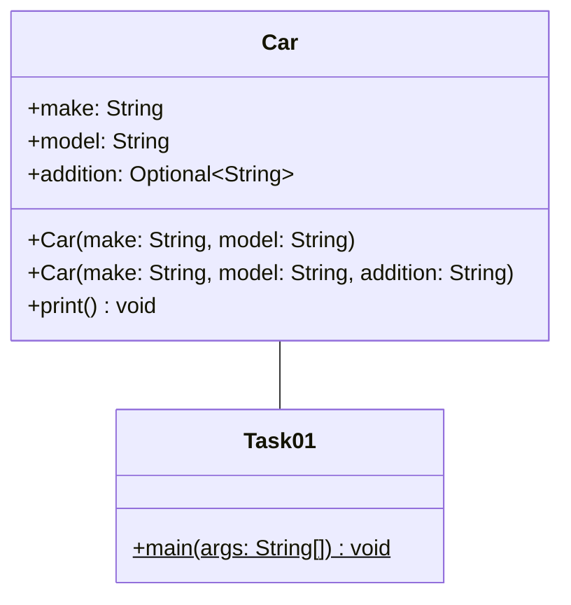
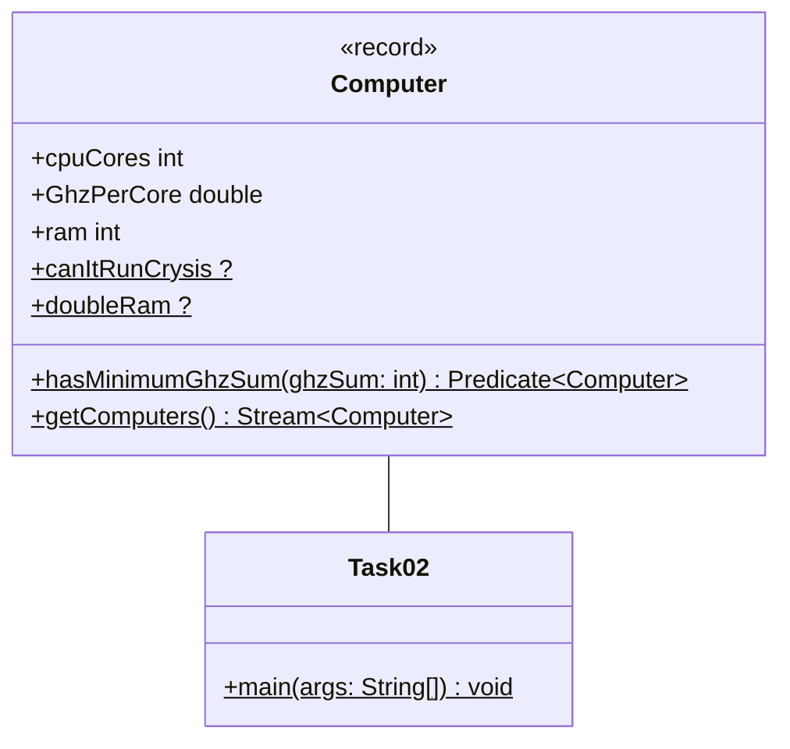
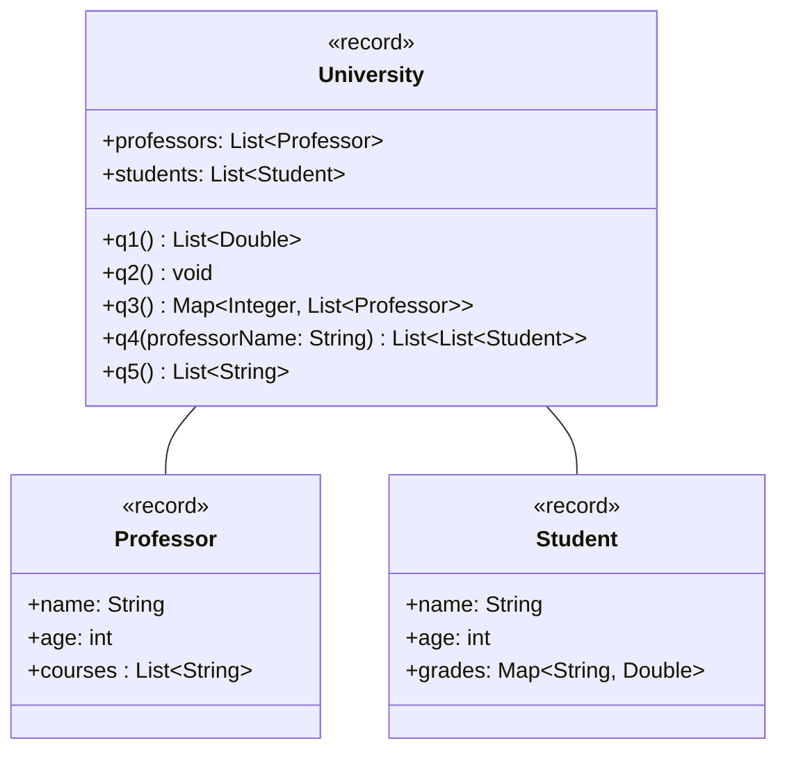

Für die Klausur am PC mit IDE gibt es kein Cheatsheet mehr.

## Aufgabe 1 - Optional

### Klassendiagramm



### Hinweise zur Klasse Car

- Die Konstruktoren sollen alle Attribute initialisieren. Verwende die korrekten
  Methoden der Optional Klasse, sodass kein Fehler ausgelöst wird, falls eine
  Null Referenz für addition übergeben wird.

- Die Methode **print** soll das Objekt auf der Konsole ausgeben. Ist eine
  addition vorhanden soll diese berücksichtigt werden, andernfalls soll nur die
  Marke und der Name ausgegeben werden.

  Beispiel:

  ```
  BMW 320i
  Mercedes-Benz G63 AMG
  ```

Erstelle eine ausführbare Klasse in der ein Auto mit der Marke "BMW", dem Modell
"440i" und dem Zusatz "M" initialisiert wird. Gib das Auto in der Konsole aus.
Entferne den Zusatz von dem Auto und gebe das Auto erneut in der Konsole aus.

### Lösung

```java
public class Car {
    public String make;
    public String model;
    public Optional<String> addition;

    public Car(String make, String model) {
        this.make = make;
        this.model = model;
        this.addition = Optional.empty();
    }

    public Car(String make, String model, String addition) {
        this.make = make;
        this.model = model;
        this.addition = Optional.ofNullable(addition);
    }

    public void print() {
        if (addition.isPresent()) {
            System.out.println(make + " " + model + " " + addition.get());
        } else {
            System.out.println(make + " " + model);
        }
    }
}

public class ExamTask01 {
    public static void main(String[] args) {
        Car beamer = new Car("BMW", "440i", "M");
        beamer.print();
        beamer.addition = Optional.empty();
        beamer.print();
    }
}
```

## Aufgabe 2 - Lambdafunktionen

### Klassendiagramm



Im Klassendiagramm sind nicht alle Datentypen angegeben. Verwende für alle
fehlenden Datentypen eine adequates funktionales Interface.

- Das Attribut **canItRunCrysis** soll eine Lambdafunktion enthalten die
  ermittelt, ob ein Computer mindestens 4 Kerne und 16 GB RAM hat, damit das
  Spiel Crysis ausgeführt werden kann.

- Das Attribut **doubleRam** soll eine Lambdafunktion enthalten, die ein
  bestehenden Computer in einen verbesserten Computer umwandelt. Bei der
  Umwandlung soll der RAM verdoppelt werden.

- Die Methode **hasMinimumGhzSum** soll eine Lambdafunktion zurückgeben, welche
  ermittelt, ob die Gigaherzsumme dem Parameter entspricht. Die Gigaherzsumme
  ist das Produkt von CPU Kernen und Gigaherz je Kern.

- Die Methode **getComputers** soll einen Stream von einem einzelnen Computer
  mit frei gewählten Werten zurückgeben.

### Hinweise zur Klasse ExamTask02

Verwende für die nachfolgende Abfolge die Methoden der Klasse Computer.

Erzeuge einen Stream von Computern und verdopple den RAM. Verwende einen Filter,
sodass nur Computer übrig bleiben, welche Crysis ausführen können und mindestens
eine Gigaherzsumme von 12 haben.

### Lösung

```java
public record Computer(int cpuCores, double ghzPerCore, int ram) {

    public static Predicate<Computer> canItRunCrysis = computer -> computer.cpuCores() >= 4
            && computer.ram() >= 16;

    public static Function<Computer, Computer> doubleRam = computer -> new Computer(computer.cpuCores(),
            computer.ghzPerCore(), computer.ram() * 2);

    public static Predicate<Computer> hasMinimumGhzSum(int ghzSum) {
        return c -> c.cpuCores() * c.ghzPerCore() >= ghzSum;
    }

    public static Stream<Computer> getComputers() {
        return Stream.of(new Computer(0, 0, 0));
    }

}

public class Task02 {
    public static void main(String[] args) {
        Computer.getComputers()
                .map(Computer.doubleRam)
                .filter(Computer.canItRunCrysis)
                .filter(Computer.hasMinimumGhzSum(12));
    }
}
```

## Aufgabe 3 - Streams

### Klassendiagramm



### Hinweise zur Klasse Professor

Jeder Professor kann durch einen Namen, das Alter und eine Liste von
Vorlesungen, welche er hält beschrieben werden.

### Hinweise zur Klasse Student

Jeder Student kann durch einen Namen, das Alter und seine Noten beschrieben
werden. Der Schlüssel entspricht dem Kurs und der Wert der Map der Note die er
in diesem Kurs erreicht hat.

### Hinweise zur Klasse University

Die Universität enthält Professoren (professors) und Studenten (students).
Benutze die Java Stream API, um die Anforderungen des Rektors zu erfüllen.

- **q1** Der Rektor möchte wissen, was für eine Durchschnittsnote seine
  Studenten haben.

  Die Methode soll die Durchschnittsnote je Student ermitteln.

- **q2** Der Rektor ist in People & Culture Laune und will seinen 3 ältesten
  Mathe-Professoren die Big Bang Theory Blu Ray Sammlung schenken.

  Die Methode soll die drei ältesten Mathe-Professoren ermitteln und für jeden
  Professor folgenden Gruß auf der Konsole ausgeben:

  ```
  6138 Minuten Bazinga Spaß an dich Steffen.
  ```

  Ein Professor gilt als Mathe-Professor, sofern er eine Vorlesung in "Math"
  gibt.

- **q3** Der Rektor leidet unter Kontrollwahn. Er will wissen wie viele
  Professoren nur zwei oder weniger Vorlesungen halten und nach Alter
  gruppieren. Er glaubt, dass Boomer Professoren wenig machen.

  Die Methode soll ermittlen, wieviele Professoren wenig Vorlesungen halten und
  diese nach Alter gruppieren.

- **q4** Der Rektor leidet immer noch unter Kontrollwahn und möchte eine
  abhänging vom Parameter professorName für jeden Professor herausfinden, welche
  Studenten seine Vorlesung besucht haben.

  Die Methode soll eine Liste von Listen zurückgeben. Zuerst sollen jene
  **Professoren** ermittelt werden, die dem Parameter professorName entsprechen.
  Anschließend soll für jeden Professor eine Liste von Studenten ermittelt
  werden, welche seine Vorlesung besucht haben.

- **q5** Der Rektor leidet nun zusätzlich unter Größenwahn und will seine
  Universität in eine Elite Universität umwandeln. Alle Studenten, die eine Note
  von 1,5 oder schlechter haben sollen exmatrikuliert werden.

  Die Methode soll alle Studenten ermitteln, welche in irgendeinem Kurs eine
  Note von 1,5 oder schlechter haben und deren Namen in Kleinbuchstaben
  zurückgeben. Die Liste soll keine doppelten Werte enthalten.

### Lösung

```java
public record University(List<Professor> professors, List<Student> students) {
    public List<Double> q1Long() {
        return students().stream()
                .map(student -> {
                    List<Double> grades = student.grades().values().stream().toList();
                    var averageGrade = grades.stream().mapToDouble(Double::valueOf).average();
                    if (averageGrade.isPresent()) {
                        return averageGrade.getAsDouble();
                    } else {
                        return 0.0;
                    }
                })
                .toList();
    }

    public List<Double> q1Short() {
        return students().stream()
                .map(student -> student.grades().values().stream()
                        .mapToDouble(grade -> grade).average().orElse(0))
                .toList();
    }

    public void q2() {
        professors().stream()
                .filter(p -> p.courses().stream().anyMatch(c -> c.equalsIgnoreCase("Math")))
                .sorted((p1, p2) -> Integer.compare(p2.age(), p1.age()))
                .limit(3)
                .forEach(p -> System.out.println("6138 Minuten Bazinga Spaß an dich " + p.name() + "."));
    }

    public Map<Integer, List<Professor>> q3() {
        return professors.stream()
                .filter(p -> p.courses().size() <= 2)
                .collect(Collectors.groupingBy(p -> p.age()));
    }

    public List<List<Student>> q4(String professorName) {
        return professors.stream()
                .filter(professor -> professor.name().equals(professorName))
                .map(professor -> students.stream()
                        .filter(student -> student.grades().keySet().stream()
                                .anyMatch(studentCourses -> professor.courses().stream()
                                        .anyMatch(professorCourses -> studentCourses.equals(professorCourses))))
                        .toList())
                .toList();
    }

    public List<String> q5() {
        return students.stream()
                .filter(s -> s.grades().values().stream().anyMatch(grade -> grade >= 1.5))
                .map(s -> s.name().toLowerCase())
                .distinct().toList();
    }

}

public record Professor(String name, int age, List<String> courses) {}

public record Student(String name, int age, Map<String, Double> grades) {}
```
