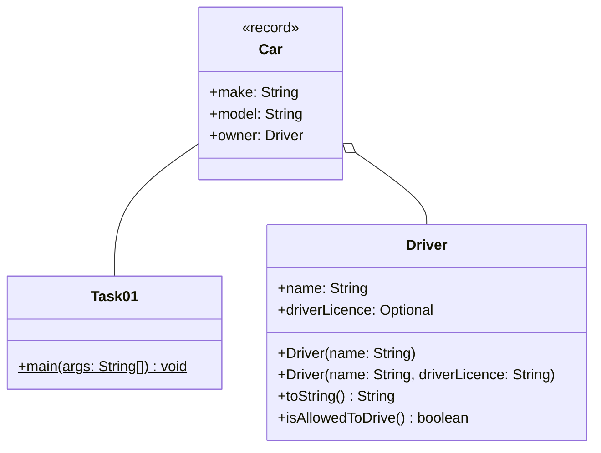
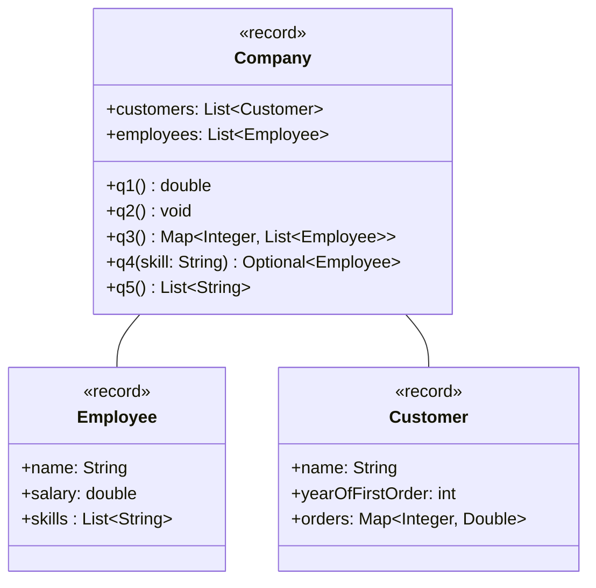

## Aufgabe 1 - Optional

Implementiere die Klassen Driver und Task01.

### Klassendiagramm



```java
public record Car (String make, String model, String owner) {}
```

### Hinweise zur Klasse Driver

- Die Konstruktoren sollen alle Attribute initialisieren. Verwende die korrekten
  Methoden der Optional Klasse, sodass ein Fehler ausgelöst wird, falls eine
  Null Referenz für driverLicence übergeben wird.

- Die Methode **toString** soll das Objekt als String zurückgeben. Es sollen nur
  die Attribute berücksichtigt werden, welche einen Wert haben. Haben beide
  Attribute einen Wert, sollen die Werte durch ein Leerzeichen getrennt werden.
  Es sollen ausschließlich die **Werte** ausgegeben werden.

  Beispiel:

  ```
  Steffen
  Steffen B
  ```

- Die Methode **isAllowedToDrive** soll ermitteln, ob der Fahrer die
  Führerscheinklasse B hat.

### Hinweise zur Klasse Task01

Es soll ein Auto der Marke BMW und dem Modell 320i erstellt werden. Der
Eigentümer des Autos soll den Namen "Steffen" haben, der keinen Führerschein
hat. Gib anschließend den **Eigentümer** des Autos in der Konsole aus. Lege die
Führerscheinklasse des zuvor angelegten Eigentümers auf "B" fest. Falls der
Fahrer anschließend das Auto fahren darf, soll das Auto auf der Konsole
ausgegeben werden.

### Lösung

```java

```

## Aufgabe 2 - Lambdafunktionen

Implementiere die Klassen Game und Task02.

### Klassendiagramm


```java
import java.util.List;

public enum Usk {
    ZERO,
    SIX,
    TWELVE,
    SIXTEEN,
    EIGHTEEN;


    public static List<Usk> getChildUsks() {
        return List.of(Usk.ZERO, Usk.SIX);
    }
}
```

Im Klassendiagramm sind nicht alle Datentypen angegeben. Verwende für alle
fehlenden Datentypen ein passendes funktionales Interface.

- Das Attribut **isForChilds** soll eine Lambdafunktion enthalten, die
  ermittelt, ob die Usk eines Spiels für Kinder ist. Die Usk Klasse definiert
  alle Child Usk.

- Das Attribut **makeRemaster** soll eine Lambdafunktion enthalten, die ein
  bestehendes Spiel in eine Remaster Version umwandelt. Bei der Umwandlung soll
  der Titel "Remastered" als Suffix enthalten und der Preis um 50% erhöht
  werden.

- Die Methode **isCheaperThan** soll eine Lambdafunktion zurückgeben, die
  abhängig von den Parametern überprüft, ob ein Spiel günstiger als der
  Parameter ist.

- Die Methode **getGames** soll einen Stream von einem einzelnen Game mit frei
  gewählten Werten zurückgeben.

### Hinweise zur Klasse Task02

Verwende für die nachfolgende Abfolge die Methoden der Klasse Game.

Erzeuge einen Stream von Spielen und mache Sie zu Remastered Versionen. Verwende
einen Filter, sodass nur Spiele übrig bleiben, welche für Kinder geeignet sind
und günstiger als 70 sind.

### Lösung

```java

```

## Aufgabe 3 - Streams

### Klassendiagramm



### Hinweise zur Klasse Employee

Jeder Mitarbeiter kann durch einen Namen, das Jahresgehalt und seine Skills
beschrieben werden.

### Hinweise zur Klasse Customer

Jeder Kunde kann durch einen Namen, das Jahr der ersten Bestellung und seine
Bestellungen beschrieben werden. Der Schlüssel entspricht der Bestellnummer und
der Wert der Map der Bestellsumme.

### Hinweise zur Klasse Company

Das Unternehmen enthält Mitarbeiter (employees) und Kunden (customers). Benutze
die Java Stream API, um die Anforderungen des CEO's zu erfüllen.

- **q1** Der CEO möchte wissen, was für ein Durchschnittsgehalt seine Entwickler
  für Smartphones haben.

  Die Methode soll das Durchschnittsgehalt der Mitarbeiter ermitteln, welche
  "Java", "Kotlin" oder "Swift" als Skill haben.

- **q2** Der CEO ist in Boni Laune und will seinen 3 "besten" "Mitarbeitern"
  eine Reise auf die Malediven schenken.

  Die Methode soll die drei Sales-Mitarbeiter ermitteln, welche am besten
  Verdienen und einen persönlichn Gruß auf der Konsole ausgeben:

  Beispiel:

  ```
  Ein kleines Danke Mirco! Viel Spaß in der Sonne.
  ```

  Ein Mitarbeiter gilt als Sales-Mitarbeiter, sofern er den Skill "Sales" hat.

- **q3** Der CEO leidet unter Kontrollwahn. Er will wissen wie viele Mitarbeiter
  "KI" nicht kennen und nach Alter gruppieren. Er glaubt, dass Boomer KI nicht
  nutzen.

  Die Methode soll ermittlen, wieviele Mitarbeiter den Skill "KI" nicht haben
  und diese nach Alter gruppieren.

- **q4** Der CEO ist in Kündigungslaune und möchte Experten herausfinden, welche
  durch KI ersetzt werden können. Abhänging vom Parameter skill soll der
  Mitarbeiter mit der teuersten Salary/Skill Ratio gefunden werden.

  Die Methode soll einen Mitarbeiter zurückgeben. Zuerst sollen jene
  **Mitarbeiter** ermittelt werden, die den Parameter skill haben. Anschließend
  soll der teuerste Mitarbeiter ermittelt werden. Der Wert des Mitarbeiters wird
  wie folgt berechnet: Jahresgehalt / Anzahl an Skills.

- **q5** Der CEO will kurzfristig die Dividende erhöhen und will sein
  Unternehmen in ein Premiumunternehmen umwandeln. Alle Kunden, die eine
  Bestellung mit einer geringen Summe haben sollen gesperrt werden.

  Die Methode soll alle Kunden ermitteln, welche eine Bestellung haben deren
  Bestellsumme geringer als 100 ist und deren Namen in Großbuchstaben
  zurückgeben. Die Liste soll keine doppelten Werte enthalten.

### Lösung

```java

```
