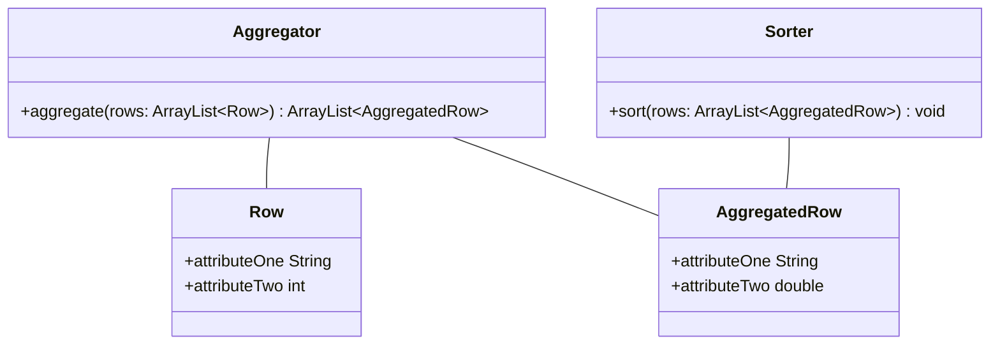

## Termine

- 30.04.2025 23:59 Abgabe der Problemstellung und Daten in **Moodle**
- 30.05.2025 23:59 Abgabe des Projektberichts in **Moodle**

## Inhalte

### Problemstellung und Daten

Die Aufgabe der Studierenden ist es ein **Problem zu finden**. Die
Problemstellung muss nicht mit dem Partnerunternehmen zusammenhängen. Es sind
**keine doppelten Themen** erlaubt. Dies muss selbstorganisiert im Kurs
abgesprochen werden. Weiter müssen **Daten** zu der Problemstellung gefunden
werden, welche miteinander **verknüpft** sind.

Folgende Problemstellungen sind nicht möglich:
 - Kohlenhydrate in einer Mahlzeit (Mahlzeit &rarr; Produkte)

Folgende Inhalte müssen am 30.04.2025 abgegeben werden:

- Problemstellung, welche das Problem und die relevanten Daten erläutert in Form
  einer Textdatei.
- CSV Datei mit mindestens 20 Datensätzen. Die erste Zeile soll die
  Überschriften enthalten.

### Projektbericht

Der Projektbericht ist eine fünfseitige Ausarbeitung zu einem Problem, welche
vom Dozenten gestellt wird. Diese besteht aus vier Teilen:

- Einleitung
- Vorstellung Sortieralgorithmen und Auswahl
- Implementierung der Lösung
- Schluss

#### Problemstellung des Projektberichts

Die **konkrete** Problemstellung ist als Kommentar in eurer Abgabe vom
30.04.2024 in Moodle hinterlegt. Sie lässt sich in zwei Teilprobleme
unterteilen. Zuerst müssen Daten aggregiert und anschließend sortiert werden.

Für die Implementierung der Aggregation soll die Aggregator Klasse implementiert
werden. Diese soll die Datensätze in eine aggregierte Liste umwandeln. Für die
Sortierung der aggregierten Daten soll die Sorter Klasse implementiert werden.
Die Klasse **Row** soll alle **relevanten** Attribute eines Datensatzes
enthalten, welche für die Aggregation benötigt werden. Die Klasse
**AggregatedRow** soll alle Attribute enthalten, welche eine aggregierte Zeile
eines Datensatzes enthält.

Für die Implementierung der Sortierung ist ein Sortieralgorithmus auszuwählen,
welcher in der Vorlesung behandelt wurde. Für die Auswahl gelten nachfolgende
Anforderungen. Die Anzahl der aggregierten Zeilen wird mindestens eine Milliarde
Einträge enthalten. Der ausgewählte Algorithmus soll theoretisch in der Lage
sein, die Sortierung parallel zu verarbeiten.

## Klassendiagramm

### Hinweis zum Klassendiagramm

Die Klassen **AggregatedRow** und **Row** enthalten nur beispielhafte Attribute.
Die Attribute müssen abhängig von der Problemstellung definiert werden.

## Anforderungen an die Implementierung

Die Klassen **Row** und **AggregatedRow** sollen nur public Attribute enthalten.
Getter und Setter sollen nicht implementiert werden.

Die Klassen **Aggregator** und **Sorter** können mehrere private Methoden
enthalten, um den Code übersichtlicher zu gestalten.

Für die Implementierung, dürfen keine externen Frameworks oder Bibliotheken
verwendet werden.

Für die Implementierung darf die Stream API von Java nicht verwendet werden.

Für die Implementierung darf keine Sort API von Java verwendet werden, z.B.
Collections.sort.

# Inhalte des Projektberichts

## Einleitung

Die Einleitung soll die eigene Problemstellung und die vom Dozenten gestellte
Problemstellung enthalten.

## Vorstellung Sortieralgorithmen

Im zweiten Teil sollen die in der Vorlesung behandelten Sortieralgorithmen in
eigenen Worten vorgestellt und verglichen werden. Anschließend soll ein
Sortieralgorithmus ausgewählt werden, welcher für die nachfolgende
Implementierung verwendet wird. Die Auswahlentscheidung soll begründet werden.

## Implementierung Lösung

Im dritten Teil soll die Lösung für die individuelle Problemstellung
implementiert werden. Es sind vier Klassen entsprechend dem oben angegebenen
Klassendiagramm zu implementieren. Der Quellcode in der Dokumentation soll keine
imports und package Definitionen enthalten. Kommentare sind nur sparsam zu
verwenden, falls erklärt wird, **warum** etwas gemacht wurde.

## Schluss

Der Schluss soll prägnant das Problem, die Vorgehensweise mit
Zwischenergebnissen und das Ergebnis zusammenfassen.
