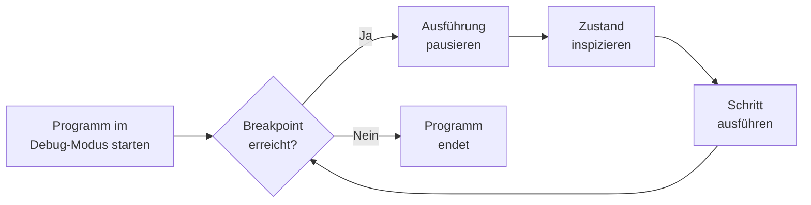

import Tabs from '@theme/Tabs';
import TabItem from '@theme/TabItem';

Debugging bezeichnet den Prozess des Auffindens und Behebens von Fehlern
(_Bugs_) in einem Programm. Fehler lassen sich in drei Kategorien einteilen:
_Syntaxfehler_ werden bereits beim Kompilieren erkannt, _Laufzeitfehler_ treten
erst während der Programmausführung auf (z.B. eine `NullPointerException`), und
_logische Fehler_ führen zu einem falschen Ergebnis, ohne dass das Programm
abstürzt. Während Syntaxfehler direkt von der IDE gemeldet werden, erfordern
Laufzeit- und logische Fehler den Einsatz eines _Debuggers_.

Ein Debugger ermöglicht es, ein Programm kontrolliert auszuführen, an beliebigen
Stellen anzuhalten und den Zustand von Variablen sowie den Programmfluss zu
inspizieren. [Eclipse](https://eclipseide.org/) verfügt über einen integrierten
Debugger.

## Weiterführende Links

Die folgenden Ressourcen bieten eine vertiefte Einführung in das Debugging mit
Eclipse.

- [Eclipse Debugging Guide](https://www.eclipse.org/community/eclipse_newsletter/2017/june/article1.php)
- [Visualizing Execution with Java Visualizer](https://pythontutor.com/java.html)

## Breakpoints

Ein _Breakpoint_ (Haltepunkt) markiert eine Zeile im Quellcode, an der die
Programmausführung pausiert werden soll. Sobald der Debugger die markierte Zeile
erreicht, hält er an – noch bevor die Anweisung in dieser Zeile ausgeführt wird.
Anschließend lassen sich Variablenwerte und der Aufrufstack inspizieren.



## Debug-Ansichten

Beim Debuggen stehen in der IDE mehrere spezialisierte Ansichten zur Verfügung,
die gemeinsam ein vollständiges Bild des aktuellen Programmzustands liefern.

| Ansicht     | Beschreibung                                                                 |
| ----------- | ---------------------------------------------------------------------------- |
| Variables   | Zeigt alle aktuell sichtbaren Variablen und deren Werte                      |
| Breakpoints | Listet alle gesetzten Breakpoints und ermöglicht das Aktivieren/Deaktivieren |
| Call Stack  | Zeigt die aktuelle Aufrufhierarchie der Methoden                             |
| Console     | Gibt die Standardausgabe des laufenden Programms aus                         |
| Expressions | Wertet beliebige Ausdrücke im aktuellen Kontext aus                          |

## Schrittweise Ausführung

Nach dem Pausieren an einem Breakpoint stehen verschiedene Schritt-Befehle zur
Verfügung, um die Programmausführung gezielt fortzusetzen und den Kontrollfluss
zu verfolgen.

<Tabs>
  <TabItem value="a" label="Step Over" default>

**Step Over** (`F6`) führt die aktuelle Zeile vollständig aus und hält in der
nächsten Zeile derselben Methode an. Methodenaufrufe werden dabei als ein
Schritt behandelt – der Debugger springt nicht in die aufgerufene Methode
hinein.

```java title="Beispiel" showLineNumbers
int a = 5;       // <- Debugger hält hier an
int b = add(a);  // Step Over: add() wird ausgeführt, aber nicht betreten
int c = b * 2;   // <- Debugger hält hier an nach Step Over
```

  </TabItem>
  <TabItem value="b" label="Step Into">

**Step Into** (`F5`) springt in den Rumpf des Methodenaufrufs in der aktuellen
Zeile hinein, sodass dessen Ausführung Schritt für Schritt verfolgt werden kann.

```java title="Beispiel" showLineNumbers
int a = 5;       // <- Debugger hält hier an
int b = add(a);  // Step Into: Debugger springt in add() hinein
int c = b * 2;
```

  </TabItem>
  <TabItem value="c" label="Step Return">

**Step Return** (`F7`) führt die restliche aktuelle Methode vollständig aus und
hält nach der Rückkehr in der aufrufenden Methode an. Dieser Befehl wird
typischerweise eingesetzt, wenn man versehentlich in eine Methode
hineingesprungen ist.

  </TabItem>
  <TabItem value="d" label="Resume">

**Resume** (`F8`) setzt die Programmausführung fort, bis der nächste Breakpoint
erreicht wird oder das Programm regulär endet.

  </TabItem>
</Tabs>

## Bedingte Breakpoints

Ein _bedingter Breakpoint_ pausiert die Ausführung nur dann, wenn eine
angegebene Bedingung wahr ist. Das ist besonders nützlich, wenn ein Fehler nur
unter bestimmten Umständen auftritt – etwa bei einem konkreten
Schleifendurchlauf oder einem bestimmten Parameterwert.

```java title="Beispiel: Fehler tritt nur bei i == 42 auf" showLineNumbers
for (int i = 0; i < 100; i++) {
   process(i); // <- bedingter Breakpoint: i == 42
}
```

In Eclipse wird ein bedingter Breakpoint über **Rechtsklick auf den Breakpoint →
Breakpoint Properties → Enable Condition** gesetzt.

## Häufige Fehler und deren Ursachen

Die folgende Tabelle listet häufig auftretende Laufzeitausnahmen in Java und
deren typische Ursachen auf, um die Fehlersuche zu beschleunigen.

| Ausnahme                         | Typische Ursache                                             |
| -------------------------------- | ------------------------------------------------------------ |
| `NullPointerException`           | Zugriff auf ein Objekt, das `null` ist                       |
| `ArrayIndexOutOfBoundsException` | Zugriff auf einen Index außerhalb der Array-Grenzen          |
| `ClassCastException`             | Ungültige Typumwandlung zur Laufzeit                         |
| `StackOverflowError`             | Unendliche Rekursion                                         |
| `NumberFormatException`          | Ungültige Zeichenkette beim Parsen (z.B. `Integer.parseInt`) |
