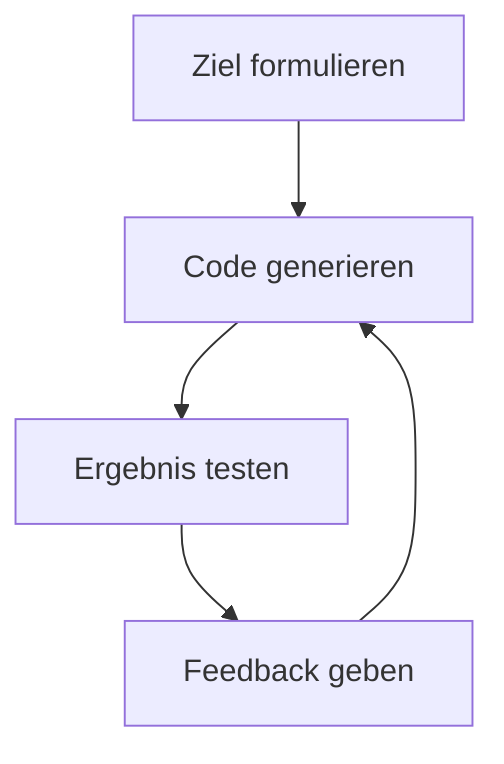

import Tabs from '@theme/Tabs'; import TabItem from '@theme/TabItem';

Generative KI (GenAI) bezeichnet KI-Systeme, die auf Grundlage neuronaler Netze
Inhalte wie Texte, Bilder, Videos, Musik, Quellcode etc. generieren können.
GenAI bildet damit die Grundlage für moderne Chatbots wie ChatGPT, Gemini oder
LeChat. Im Gegensatz zu "traditionellen" KI-Systemen, deren Aufgaben i.d.R.
darin bestehen, Muster zu erkennen, Daten zu klassifizieren oder Zusammenhänge
zu erkennen, kann GenAI mittels statistischer Wahrscheinlichkeiten und
tiefgreifender Mustererkennung neuartige Inhalte erzeugen, die nicht Teil der
Trainingsdaten waren. Schlüsselmodelle sind hierbei _Large Language Models_
(LLMs) für Texte sowie Diffunsionsmodelle und _Generative Adversarial Networks_
(GANs) für Bilder und Videos. Moderne Chatbots simulieren menschliche
Konversationen über Text und Sprache und nutzen dabei LLMs, um dynamisch,
kontextabhängig und zusammenhängend zu antworten. KI-gestützte Assistenzsysteme
(Co-Pilots) wie Microsoft 365 Copilot und GitHub Copilot dagegen sind direkt in
eine Anwendung (z.B. Textverarbeitungsprogramm, Tabellenkalkulationsprogramm,
IDE) integriert und unterstützen den menschlichen Anwender aktiv, ohne dabei die
Kontrolle zu übernehmen. Sie arbeiten quasi _parallel_ zum Anwender.

## Prompt Engineering

Prompt Engineering ist die Disziplin der Entwicklung und Optimierung von
Eingaben (Prompts) mit dem Ziel, vorhersagbare, präzise und qualitativ
hochwertige Ausgaben von generativen Modellen zu bekommen, die den spezifischen
Anforderungen entsprechen. Die Grundprinzipien eines guten Prompts sind
Klarheit, Kontext und Struktur. Um die Qualität von Prompts zu erhöhen und damit
bessere, präzisere und zuverlässigere Ausgaben zu erhalten, können
unterschiedliche Techniken verwendet werden.

<Tabs>
  <TabItem value="a" label="Delimiter-Prompting" default>

Beim Delimiter-Prompting dienen Trennzeichen wie Rauten und Gravis dazu,
Anweisungen klar vom eigentlichen Eingabetext zu trennen. Dies erhöht die
Zuverlässigkeit der Verarbeitung.

```
Fasse den mit 3 Rauten umschlossenen Text in einem Satz zusammen.
###
Prompt Engineering ist...
###
```

  </TabItem>
  <TabItem value="b" label="Few-Shot-Prompting" >

Beim Few-Shot-Prompting werden der KI einige Beispiele für Eingabe und die
gewünschte Ausgabe im Prompt vorangestellt. Dadurch wird dem Modell der
gewünschte Stil, die Struktur sowie das Format der Ausgabe vorgegeben.

```
**Beispiel 1, Input** Hund
**Beispiel 1, Output** Tier
**Beispiel 2, Input** Apfel
**Beispiel 2, Output** Frucht
**Neue Anfrage, Input** Auto
**Neue Anfrage, Output**
```

  </TabItem>
  <TabItem value="c" label="Zero-Shot-Prompting">

Beim Zero-Shot-Prompting wird bewusst auf jegliche Beispiele verzichtet. Die
Qualität der Ausgabe hängt ausschließlich von der Klarheit und Präzision der
Anweisung der Eingabe ab. Um diese zu erhöhen, werden der Eingabe detaillierte
Vorgaben (Constraints) hinzugefügt, um Format, Länge, Zielgruppe oder
spezifische inhaltliche Anforderungen der Ausgabe exakt zu steuern.

```
Schreibe einen Aufsatz in deutscher Sprache über das Thema **Generative KI**.
Der Aufsatz soll mindestens 500 Wörter umfassen. Verzichte auf Abkürzungen.
```

  </TabItem>
  <TabItem value="d" label="Rollenbasiertes Prompting">

Beim Rollenbasiertes Prompting wird der KI eine spezifische Rolle zugewiesen
(z.B. Experte, Jurist, Kritiker). Diese Rolle definiert den Kontext des Wissens,
den Tonfall sowie den Stil der generierten Ausgabe.

```
Du bist ein erfahrener Börsenanalyst. Erkläre in einfachen Worten, warum die Inflation steigt.
```

  </TabItem>
  <TabItem value="e" label="Chain-of-Thoughts-Prompting">

Chain-of-Thoughts-Prompting ist essenziell für komplexe Aufgaben. Die KI wird
aktiv gezwungen, eine logische Abfolge von Gedanken oder Zwischenschritten zu
simulieren ("Schritt für Schritt denken"). Dies führt zu transparenten,
nachvollziehbaren und oft deutlich besseren Ergebnissen.

```
Der Zug fährt um 8:00 Uhr in A ab.
Die Fahrt nach B dauert 3 Stunden und 15 Minuten.
Wenn der Zug 20 Minuten Verspätung hat, wann kommt er in B an?
**Denke Schritt für Schritt**
```

  </TabItem>
</Tabs>

## Vibe Coding

Vibe Coding beschreibt eine neuartige Methode der Softwareentwicklung, bei der
ein LLM zur Generierung des benötigten Quellcodes genutzt wird. Der Begriff
wurde maßgeblich von OpenAI-Mitbegründer Andrej Karpathy geprägt und beschreibt
die entspannte Zusammenarbeit mit der KI, bei der sich der Softwareentwickler
voll und ganz auf den positiven Workflow und die inspirierende Atmosphäre mit
der KI einlässt. Im Unterschied zur herkömmlichen Softwareentwicklung, bei der
der Softwareentwickler selbst für das Erzeugen des Quellcodes zuständig ist,
steht beim Vibe Coding die klare Beschreibung der Funktionalität in natürlicher
Sprache durch Prompts im Vordergrund. Der konkrete Quellcode dagegen wird von
der LLM erzeugt. Es handelt sich daher im Kern um eine Anwendung des Prompt
Engineerings auf die Softwareentwicklung. Einsatzgebiete sind unter Anderem das
Rapid Prototyping, die Erstellung von _Minimal Viable Products_ (MVPs) sowie das
automatische Erzeugen von Boilerplate-Code. Nachteil von Vibe Coding ist vor
allem eine stark schwankende Softwarequalität und ein damit verbundener erhöhter
Wartungsaufwand. Es eignet sich daher nur bedingt für komplexe
Softwareanwendungen oder Softwareanwendungen mit einem hohen Qualitätsanspruch.



Im Beispiel soll ein einfacher Taschenrechner mit Hilfe von JavaFX entwickelt
werden.

<Tabs>
  <TabItem value="a" label="Iteration 1" default>

**Eingabe**

```
Ich möchte einen einfachen Taschenrechner mit Hilfe von JavaFX erstellen.
Der Taschenrechner soll die 4 Grundrechenoperationen für 2 Zahlen ermöglichen.
Starte mit dem Grundgerüst (Startklasse und Fenster).
```

**Ausgabe**

```java title="CalculatorApp.java (Ausschnitt)" showLineNumbers
public class CalculatorApp extends Application {

   @Override
   public void start(Stage primaryStage) {
      BorderPane root = new BorderPane();
      Scene scene = new Scene(root, 400, 300);
      primaryStage.setTitle("Einfacher Taschenrechner");
      primaryStage.setScene(scene);
      primaryStage.show();
   }

}
```

  </TabItem>
  <TabItem value="b" label="Iteration 2">

**Eingabe**

```
Füge die benötigten Elemente hinzu:
- Zwei Eingabefelder für die Zahlen
- Schaltflächen für die Operatoren (+, -, \*, /)
- ein Ausgabefeld für das Ergebnis
Verwende ein Raster-Layout.
```

**Ausgabe**

```java title="CalculatorApp.java (Ausschnitt)" showLineNumbers
public class CalculatorApp extends Application {

   private TextField number1Field;
   private TextField number2Field;
   private Label resultLabel;

   @Override
   public void start(Stage primaryStage) {
      GridPane root = new GridPane();
      root.setAlignment(Pos.CENTER);
      root.setHgap(10);
      root.setVgap(10);
      root.setPadding(new Insets(25, 25, 25, 25));

      number1Field = new TextField();
      number1Field.setPromptText("Erste Zahl");
      root.add(new Label("Zahl 1:"), 0, 0);
      root.add(number1Field, 1, 0, 4, 1);

      number2Field = new TextField();
      number2Field.setPromptText("Zweite Zahl");
      root.add(new Label("Zahl 2:"), 0, 1);
      root.add(number2Field, 1, 1, 4, 1);

      Button addButton = new Button("+");
      Button subtractButton = new Button("-");
      Button multiplyButton = new Button("*");
      Button divideButton = new Button("/");
      root.add(addButton, 1, 2);
      root.add(subtractButton, 2, 2);
      root.add(multiplyButton, 3, 2);
      root.add(divideButton, 4, 2);

      root.add(new Label("Ergebnis:"), 0, 3);
      resultLabel = new Label("0,00");
      root.add(resultLabel, 1, 3, 4, 1);
      ...
   }
   ...
}
```

  </TabItem>
  <TabItem value="c" label="Iteration 3">

**Eingabe**

```
Implementiere nun die Funktionalität.
Wenn ein Operator-Button geklickt wird, sollen:
- die beiden Zahlen aus den Eingabefeldern ausgelesen werden
- die entsprechende Operation durchgeführt werden
- das Ausgabefeld für das Ergebnis aktualisiert werden
Verwende für die Berechnung den Datentyp **double**.
Falls die Eingabe keine Zahl ist, zeige einen Nachrichtendialog mit einer Fehlermeldung an.
```

**Ausgabe**

```java title="CalculatorApp.java (Ausschnitt)" showLineNumbers
public class CalculatorApp extends Application {
   ...
   @Override
   public void start(Stage primaryStage) {
      ...
      addButton.setOnAction(e -> calculateAndDisplay("+"));
      subtractButton.setOnAction(e -> calculateAndDisplay("-"));
      multiplyButton.setOnAction(e -> calculateAndDisplay("*"));
      divideButton.setOnAction(e -> calculateAndDisplay("/"));
      ...
   }

   private void calculateAndDisplay(String operator) {
      try {
         double num1 = Double.parseDouble(number1Field.getText());
         double num2 = Double.parseDouble(number2Field.getText());
         double result = 0.0;

         switch (operator) {
            case "+":
               result = num1 + num2;
               break;
            case "-":
               result = num1 - num2;
               break;
            case "*":
               result = num1 * num2;
               break;
            case "/":
               if (num2 == 0) {
                  showErrorDialog("Division durch Null", "Division durch Null ist nicht erlaubt.");
                  return;
               }
               result = num1 / num2;
               break;
         }
         resultLabel.setText(String.format("%.2f", result));
      } catch (NumberFormatException e) {
         showErrorDialog("Ungültige Eingabe", "Bitte numerische Werte eingeben.");
      }
   }

   private void showErrorDialog(String title, String message) {
      Alert alert = new Alert(Alert.AlertType.ERROR);
      alert.setTitle("Fehler: " + title);
      alert.setHeaderText(null);
      alert.setContentText(message);
      alert.showAndWait();
   }
   ...
}
```

  </TabItem>
  <TabItem value="d" label="Iteration 4">

**Eingabe**

```
Füge eine CSS-Datei hinzu, die sich am Google Material Design orientiert.
```

**Ausgabe**

```java title="CalculatorApp.java (Ausschnitt)" showLineNumbers
public class CalculatorApp extends Application {
   ...
   @Override
   public void start(Stage primaryStage) {
      ...
      addButton.setId("operator-button");
      subtractButton.setId("operator-button");
      multiplyButton.setId("operator-button");
      divideButton.setId("operator-button");
      ...
      scene.getStylesheets().add(getClass().getResource("calculator.css").toExternalForm());
      ...
   }
   ...
}
```

```css title="calculator.css (Ausschnitt)" showLineNumbers
.root {
    -fx-font-family: "Roboto", sans-serif;
    -fx-background-color: #f8f9fa;
}

#operator-button {
    -fx-background-color: #4285f4;
    -fx-text-fill: white;
}

#operator-button:hover {
    -fx-background-color: #3b76d0;
}
...
```

  </TabItem>
</Tabs>
