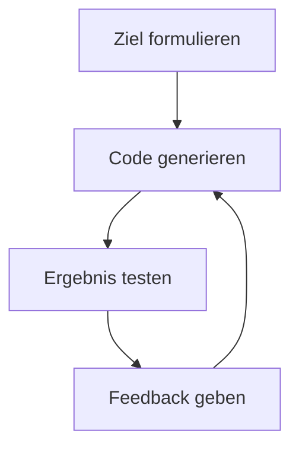

import Tabs from '@theme/Tabs'; import TabItem from '@theme/TabItem';

Generative KI (GenAI) bezeichnet KI-Systeme, die auf Basis neuronaler Netze
Inhalte wie Texte, Bilder, Videos, Musik oder Quellcode erzeugen. Im Unterschied
zu "traditionellen" KI-Systemen, die Muster erkennen oder Daten klassifizieren,
kann GenAI mittels statistischer Wahrscheinlichkeiten neuartige Inhalte
generieren, die nicht Teil der Trainingsdaten waren. Schlüsseltechnologien sind
_Large Language Models_ (LLMs) für Texte sowie Diffusionsmodelle und _Generative
Adversarial Networks_ (GANs) für Bilder und Videos. Moderne Chatbots wie
ChatGPT, Gemini oder LeChat nutzen LLMs, um kontextabhängig und zusammenhängend
zu antworten. KI-gestützte Assistenzsysteme (Co-Pilots) wie Microsoft 365
Copilot oder GitHub Copilot sind dagegen direkt in eine Anwendung integriert und
unterstützen den Anwender aktiv, ohne die Kontrolle zu übernehmen. Eine neuere
Entwicklungsstufe sind _Agentic AI_-Systeme, die eigenständig mehrschrittige
Aufgaben planen und ausführen, indem sie Werkzeuge aufrufen, Code schreiben und
ausführen sowie auf ihr Ergebnis reagieren. Ein Beispiel ist Claude Code — ein
KI-gestützter Assistent, der direkt im Terminal läuft, eine ganze Codebasis
analysiert und komplexe Entwicklungsaufgaben wie Refactoring, Fehleranalyse oder
das Schreiben von Tests selbstständig durchführt.

## Prompt Engineering

Prompt Engineering ist die Disziplin der gezielten Formulierung von Eingaben
(Prompts), um von einem generativen Modell vorhersagbare, präzise und
hochwertige Ausgaben zu erhalten. Ein guter Prompt zeichnet sich durch Klarheit,
Kontext und Struktur aus. Die folgenden Techniken helfen dabei, die Qualität von
Prompts zu verbessern.

<Tabs>
  <TabItem value="a" label="Delimiter-Prompting" default>

Beim Delimiter-Prompting dienen Trennzeichen wie Rauten und Gravis dazu,
Anweisungen klar vom eigentlichen Eingabetext zu trennen. Dies erhöht die
Zuverlässigkeit der Verarbeitung.

```
Fasse den mit 3 Rauten umschlossenen Text in einem Satz zusammen.
###
Prompt Engineering ist...
###
```

  </TabItem>
  <TabItem value="b" label="Few-Shot-Prompting" >

Beim Few-Shot-Prompting werden der KI einige Beispiele für Eingabe und die
gewünschte Ausgabe im Prompt vorangestellt. Dadurch wird dem Modell der
gewünschte Stil, die Struktur sowie das Format der Ausgabe vorgegeben.

```
**Beispiel 1, Input** Hund
**Beispiel 1, Output** Tier
**Beispiel 2, Input** Apfel
**Beispiel 2, Output** Frucht
**Neue Anfrage, Input** Auto
**Neue Anfrage, Output**
```

  </TabItem>
  <TabItem value="c" label="Zero-Shot-Prompting">

Beim Zero-Shot-Prompting wird bewusst auf jegliche Beispiele verzichtet. Die
Qualität der Ausgabe hängt ausschließlich von der Klarheit und Präzision der
Anweisung der Eingabe ab. Um diese zu erhöhen, werden der Eingabe detaillierte
Vorgaben (Constraints) hinzugefügt, um Format, Länge, Zielgruppe oder
spezifische inhaltliche Anforderungen der Ausgabe exakt zu steuern.

```
Schreibe einen Aufsatz in deutscher Sprache über das Thema **Generative KI**.
Der Aufsatz soll mindestens 500 Wörter umfassen. Verzichte auf Abkürzungen.
```

  </TabItem>
  <TabItem value="d" label="Rollenbasiertes Prompting">

Beim Rollenbasiertes Prompting wird der KI eine spezifische Rolle zugewiesen
(z.B. Experte, Jurist, Kritiker). Diese Rolle definiert den Kontext des Wissens,
den Tonfall sowie den Stil der generierten Ausgabe.

```
Du bist ein erfahrener Börsenanalyst. Erkläre in einfachen Worten, warum die Inflation steigt.
```

  </TabItem>
  <TabItem value="e" label="Chain-of-Thoughts-Prompting">

Chain-of-Thoughts-Prompting ist essenziell für komplexe Aufgaben. Die KI wird
aktiv gezwungen, eine logische Abfolge von Gedanken oder Zwischenschritten zu
simulieren ("Schritt für Schritt denken"). Dies führt zu transparenten,
nachvollziehbaren und oft deutlich besseren Ergebnissen.

```
Der Zug fährt um 8:00 Uhr in A ab.
Die Fahrt nach B dauert 3 Stunden und 15 Minuten.
Wenn der Zug 20 Minuten Verspätung hat, wann kommt er in B an?
**Denke Schritt für Schritt**
```

  </TabItem>
</Tabs>

## Context Engineering

Context Engineering bezeichnet die Disziplin, den Kontext eines LLMs so präzise
und vollständig wie möglich zu gestalten, damit das Modell eine Aufgabe korrekt
lösen kann. Während Prompt Engineering primär die Formulierung einzelner
Eingaben optimiert, geht Context Engineering einen Schritt weiter: Es steuert
systematisch, welche Informationen dem Modell überhaupt zur Verfügung stehen —
also welche Dokumente, Codeausschnitte, Gesprächsverläufe oder
Werkzeugdefinitionen in das Kontextfenster geladen werden. Besondere Bedeutung
kommt Context Engineering bei Agentic AI-Systemen zu, da diese über viele
Interaktionsschritte hinweg konsistente und fundierte Entscheidungen treffen
müssen.

Das Kontextfenster (_Context Window_) eines LLMs ist der Bereich, in dem alle
für eine Anfrage relevanten Informationen abgelegt werden. Es umfasst die
Systemnachricht, den bisherigen Gesprächsverlauf, Werkzeugdefinitionen sowie
abgerufene externe Inhalte. Da das Kontextfenster in seiner Größe begrenzt ist,
entscheidet die Auswahl und Aufbereitung der enthaltenen Informationen
maßgeblich über die Qualität der Modellausgabe.

<Tabs>
  <TabItem value="a" label="Systemnachricht" default>

Die Systemnachricht (_System Prompt_) ist eine vom Entwickler festgelegte
Anweisung, die dem Modell vor dem eigentlichen Gespräch übergeben wird. Sie legt
Rolle, Verhalten, Tonfall und Rahmenbedingungen des Assistenten fest.

```
Du bist ein erfahrener Java-Tutor. Antworte ausschließlich auf Fragen zur
Java-Programmierung. Erkläre Konzepte in einfacher Sprache und illustriere
sie immer mit einem kurzen Codebeispiel.
```

  </TabItem>
  <TabItem value="b" label="Gesprächsverlauf">

Der Gesprächsverlauf (_Conversation History_) enthält alle bisherigen
Nachrichten zwischen Nutzer und Modell. Er ermöglicht dem Modell, Bezug auf
frühere Aussagen zu nehmen und Widersprüche zu vermeiden. Bei langen Gesprächen
kann eine Zusammenfassung älterer Nachrichten helfen, das Kontextfenster nicht
zu überfüllen.

```
Nutzer:  Was ist eine abstrakte Klasse in Java?
Assistent: Eine abstrakte Klasse kann nicht direkt instanziiert werden ...
Nutzer:  Und wie unterscheidet sie sich von einem Interface?
```

  </TabItem>
  <TabItem value="c" label="Retrieval-Augmented Generation">

Bei _Retrieval-Augmented Generation_ (RAG) werden zur Laufzeit relevante
Dokumente oder Codeausschnitte aus einer externen Wissensbasis gesucht und in
das Kontextfenster eingefügt. Dadurch kann das Modell auf aktuelles oder
domänenspezifisches Wissen zurückgreifen, das nicht Teil seiner Trainingsdaten
ist.

```
[Abgerufenes Dokument]
Klasse BankAccount: Felder balance, owner; Methoden deposit(), withdraw().

[Nutzerfrage]
Füge der Klasse BankAccount eine Methode transfer() hinzu.
```

  </TabItem>
  <TabItem value="d" label="Werkzeuge">

Agentic AI-Systeme erhalten im Kontext eine Liste verfügbarer Werkzeuge
(_Tools_), z.B. Datei lesen, Code ausführen oder eine API aufrufen. Das Modell
entscheidet eigenständig, welches Werkzeug es für den nächsten Schritt
verwendet, und erhält das Ergebnis als weiteren Kontexteintrag zurück.

```
Verfügbare Werkzeuge: read_file, write_file, run_tests, search_codebase

Aufgabe: Finde alle Klassen, die das Interface Comparable implementieren,
         und schreibe einen Unittest für die compareTo()-Methode.
```

  </TabItem>
</Tabs>

## Vibe Coding

Vibe Coding ist eine Methode der Softwareentwicklung, bei der ein LLM den
Quellcode auf Basis natürlichsprachlicher Beschreibungen generiert. Der Begriff
wurde von OpenAI-Mitbegründer Andrej Karpathy geprägt. Im Unterschied zur
herkömmlichen Softwareentwicklung steht nicht das Schreiben von Code im
Vordergrund, sondern die klare Beschreibung der gewünschten Funktionalität durch
Prompts — das LLM übernimmt die Implementierung. Vibe Coding ist damit im Kern
eine Anwendung des Prompt Engineerings auf die Softwareentwicklung.
Einsatzgebiete sind unter anderem Rapid Prototyping, die Erstellung von _Minimal
Viable Products_ (MVPs) und das Erzeugen von Boilerplate-Code. Nachteil ist eine
oft schwankende Softwarequalität und ein erhöhter Wartungsaufwand — Vibe Coding
eignet sich daher nur bedingt für komplexe oder qualitätskritische Anwendungen.


```mermaid
flowchart
   a[Ziel formulieren]
   b[Code generieren]
   c[Ergebnis testen]
   d[Feedback geben]

   a --> b --> c --> d --> b
```

Im Beispiel soll ein einfacher Taschenrechner mit JavaFX entwickelt werden.

<Tabs>
  <TabItem value="a" label="Iteration 1" default>

**Eingabe**

```
Ich möchte einen einfachen Taschenrechner mit Hilfe von JavaFX erstellen.
Der Taschenrechner soll die 4 Grundrechenoperationen für 2 Zahlen ermöglichen.
Starte mit dem Grundgerüst (Startklasse und Fenster).
```

**Ausgabe**

```java title="CalculatorApp.java (Ausschnitt)" showLineNumbers
public class CalculatorApp extends Application {

   @Override
   public void start(Stage primaryStage) {
      BorderPane root = new BorderPane();
      Scene scene = new Scene(root, 400, 300);
      primaryStage.setTitle("Einfacher Taschenrechner");
      primaryStage.setScene(scene);
      primaryStage.show();
   }

}
```

  </TabItem>
  <TabItem value="b" label="Iteration 2">

**Eingabe**

```
Füge die benötigten Elemente hinzu:
- Zwei Eingabefelder für die Zahlen
- Schaltflächen für die Operatoren (+, -, \*, /)
- ein Ausgabefeld für das Ergebnis
Verwende ein Raster-Layout.
```

**Ausgabe**

```java title="CalculatorApp.java (Ausschnitt)" showLineNumbers
public class CalculatorApp extends Application {

   private TextField number1Field;
   private TextField number2Field;
   private Label resultLabel;

   @Override
   public void start(Stage primaryStage) {
      GridPane root = new GridPane();
      root.setAlignment(Pos.CENTER);
      root.setHgap(10);
      root.setVgap(10);
      root.setPadding(new Insets(25, 25, 25, 25));

      number1Field = new TextField();
      number1Field.setPromptText("Erste Zahl");
      root.add(new Label("Zahl 1:"), 0, 0);
      root.add(number1Field, 1, 0, 4, 1);

      number2Field = new TextField();
      number2Field.setPromptText("Zweite Zahl");
      root.add(new Label("Zahl 2:"), 0, 1);
      root.add(number2Field, 1, 1, 4, 1);

      Button addButton = new Button("+");
      Button subtractButton = new Button("-");
      Button multiplyButton = new Button("*");
      Button divideButton = new Button("/");
      root.add(addButton, 1, 2);
      root.add(subtractButton, 2, 2);
      root.add(multiplyButton, 3, 2);
      root.add(divideButton, 4, 2);

      root.add(new Label("Ergebnis:"), 0, 3);
      resultLabel = new Label("0,00");
      root.add(resultLabel, 1, 3, 4, 1);
      ...
   }
   ...
}
```

  </TabItem>
  <TabItem value="c" label="Iteration 3">

**Eingabe**

```
Implementiere nun die Funktionalität.
Wenn ein Operator-Button geklickt wird, sollen:
- die beiden Zahlen aus den Eingabefeldern ausgelesen werden
- die entsprechende Operation durchgeführt werden
- das Ausgabefeld für das Ergebnis aktualisiert werden
Verwende für die Berechnung den Datentyp **double**.
Falls die Eingabe keine Zahl ist, zeige einen Nachrichtendialog mit einer Fehlermeldung an.
```

**Ausgabe**

```java title="CalculatorApp.java (Ausschnitt)" showLineNumbers
public class CalculatorApp extends Application {
   ...
   @Override
   public void start(Stage primaryStage) {
      ...
      addButton.setOnAction(e -> calculateAndDisplay("+"));
      subtractButton.setOnAction(e -> calculateAndDisplay("-"));
      multiplyButton.setOnAction(e -> calculateAndDisplay("*"));
      divideButton.setOnAction(e -> calculateAndDisplay("/"));
      ...
   }

   private void calculateAndDisplay(String operator) {
      try {
         double num1 = Double.parseDouble(number1Field.getText());
         double num2 = Double.parseDouble(number2Field.getText());
         double result = 0.0;

         switch (operator) {
            case "+":
               result = num1 + num2;
               break;
            case "-":
               result = num1 - num2;
               break;
            case "*":
               result = num1 * num2;
               break;
            case "/":
               if (num2 == 0) {
                  showErrorDialog("Division durch Null", "Division durch Null ist nicht erlaubt.");
                  return;
               }
               result = num1 / num2;
               break;
         }
         resultLabel.setText(String.format("%.2f", result));
      } catch (NumberFormatException e) {
         showErrorDialog("Ungültige Eingabe", "Bitte numerische Werte eingeben.");
      }
   }

   private void showErrorDialog(String title, String message) {
      Alert alert = new Alert(Alert.AlertType.ERROR);
      alert.setTitle("Fehler: " + title);
      alert.setHeaderText(null);
      alert.setContentText(message);
      alert.showAndWait();
   }
   ...
}
```

  </TabItem>
  <TabItem value="d" label="Iteration 4">

**Eingabe**

```
Füge eine CSS-Datei hinzu, die sich am Google Material Design orientiert.
```

**Ausgabe**

```java title="CalculatorApp.java (Ausschnitt)" showLineNumbers
public class CalculatorApp extends Application {
   ...
   @Override
   public void start(Stage primaryStage) {
      ...
      addButton.setId("operator-button");
      subtractButton.setId("operator-button");
      multiplyButton.setId("operator-button");
      divideButton.setId("operator-button");
      ...
      scene.getStylesheets().add(getClass().getResource("calculator.css").toExternalForm());
      ...
   }
   ...
}
```

```css title="calculator.css (Ausschnitt)" showLineNumbers
.root {
    -fx-font-family: "Roboto", sans-serif;
    -fx-background-color: #f8f9fa;
}

#operator-button {
    -fx-background-color: #4285f4;
    -fx-text-fill: white;
}

#operator-button:hover {
    -fx-background-color: #3b76d0;
}
...
```

  </TabItem>
</Tabs>

## Agentic AI

Agentic AI-Systeme erweitern klassische LLMs um die Fähigkeit, selbstständig
mehrschrittige Aufgaben zu planen und auszuführen. Dazu kombinieren sie ein
Sprachmodell mit Werkzeugen (z.B. Dateisystem, Terminal, externe APIs) und einem
Entscheidungs-Loop: Das Modell wählt das nächste Werkzeug, wertet dessen
Ergebnis aus und entscheidet, wie es weiter vorgeht — bis die Aufgabe
abgeschlossen ist. Claude Code ist ein Beispiel für ein solches System: Es läuft
direkt im Terminal, analysiert eine Codebasis und führt Aufgaben wie
Refactoring, Fehleranalyse oder das Schreiben von Tests eigenständig durch. Die
Interaktion mit Agentic AI-Systemen erfolgt über Commands, Skills und Hooks.

<Tabs>
  <TabItem value="a" label="Commands" default>

Commands sind vordefinierte Slash-Befehle, die häufig benötigte Aufgaben mit
einer kurzen Eingabe auslösen. Sie sind im Agenten fest eingebaut und decken
typische Entwicklungsaufgaben ab — von der Versionsverwaltung bis zur
Codeüberprüfung.

```
> /commit
> /review
> /fix
```

  </TabItem>
  <TabItem value="b" label="Skills">

Skills sind benutzerdefinierte Befehle, die als Markdown-Dateien im Verzeichnis
`.claude/commands/` hinterlegt werden. Sie erweitern den Agenten um
projektspezifische Workflows und lassen sich wie eingebaute Commands aufrufen.

```markdown title=".claude/commands/review-pr.md"
---
description: Führe ein Code-Review für den aktuellen Pull Request durch
---

Analysiere alle geänderten Dateien im aktuellen Pull Request. Prüfe auf:
Codequalität, fehlende Tests, Sicherheitsprobleme. Erstelle eine strukturierte
Zusammenfassung der Befunde.
```

  </TabItem>
  <TabItem value="c" label="Hooks">

Hooks sind Shell-Befehle, die automatisch bei bestimmten Ereignissen im
Agenten-Lifecycle ausgeführt werden — etwa bevor ein Werkzeug aufgerufen wird
oder nachdem der Agent seine Arbeit beendet hat. Sie werden in der Konfiguration
`settings.json` definiert.

```json title="settings.json (Ausschnitt)"
{
  "hooks": {
    "Stop": [
      {
        "matcher": "",
        "hooks": [
          {
            "type": "command",
            "command": "npx prettier . --write --end-of-line crlf"
          }
        ]
      }
    ]
  }
}
```

  </TabItem>
</Tabs>
