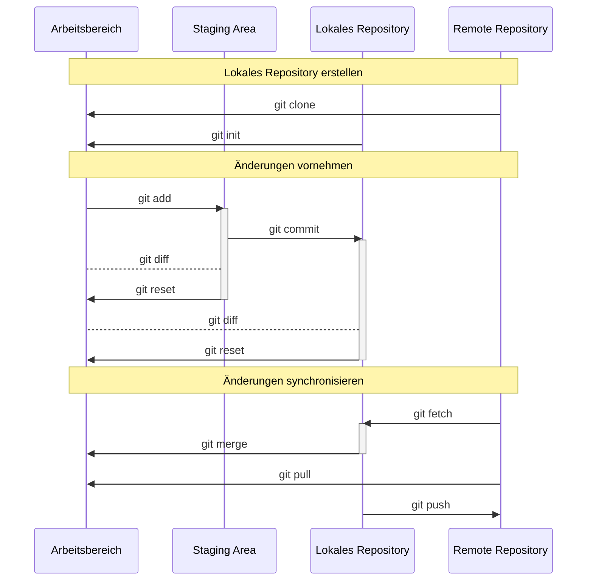

import Tabs from '@theme/Tabs';
import TabItem from '@theme/TabItem';

Git ist eine Software zur verteilten Versionskontrolle von Dateien. Entwickelt
wurde Git unter anderem von Linus Torvalds, dem Erfinder von Linux. Die
Versionskontrolle ermöglicht den Zugriff auf ältere Entwicklungsstände, ohne
dabei den aktuellen Stand zu verlieren. Dateien werden an sogenannten
_Repositorys_ abgelegt — entweder lokal auf dem eigenen Rechner oder auf einem
Remote-Server. Onlinedienste wie GitHub basieren auf Git und stellen
Speicherplatz für Remote-Repositorys bereit.

## Git Workflows

Ein Git Workflow ist eine Vereinbarung im Team darüber, wie Git genutzt wird. Er
legt fest, wann Commits erstellt, welche Branch-Strategien eingesetzt und wie
Änderungen synchronisiert werden. Einheitliche Workflows sind Voraussetzung für
eine effiziente und fehlerarme Zusammenarbeit.

## Git Befehle

Git wird über Kommandozeilen-Befehle gesteuert. Die vollständige Dokumentation
aller Befehle und Optionen ist auf der offiziellen
[Git-Homepage](https://git-scm.com/docs) verfügbar. Mit `git --help` lässt sich
eine Kurzübersicht direkt in der Kommandozeile ausgeben.

<Tabs>
  <TabItem value="a" label="Git einrichten" default>

| Git-Befehl                                          | Beschreibung             |
| --------------------------------------------------- | ------------------------ |
| `git config --global user.name`                     | Benutzername ausgeben    |
| `git config --global user.name "[Benutzername]"`    | Benutzername festlegen   |
| `git config --global user.email`                    | E-Mail-Adresse ausgeben  |
| `git config --global user.email "[E-Mail-Adresse]"` | E-Mail-Adresse festlegen |

  </TabItem>
  <TabItem value="b" label="Lokales Repository erstellen">

| Git-Befehl                      | Beschreibung                 |
| ------------------------------- | ---------------------------- |
| `git clone [Remote Repository]` | Remote Repository klonen     |
| `git init [Lokales Repository]` | Lokales Repository erstellen |

  </TabItem>
  <TabItem value="c" label="Änderungen versionieren">

| Git-Befehl                    | Beschreibung                                                         |
| ----------------------------- | -------------------------------------------------------------------- |
| `git status`                  | Neue und geänderte Dateien ausgeben                                  |
| `git diff`                    | Noch nicht indizierte Änderungen ausgeben                            |
| `git add [Datei]`             | Datei für die Versionierung indizieren                               |
| `git diff --staged`           | Änderungen zwischen dem indizierten und dem aktuellen Stand ausgeben |
| `git reset [Datei]`           | Datei vom Index nehmen                                               |
| `git commit -m "[Nachricht]"` | Alle indizierten Dateien versionieren                                |

  </TabItem>
  <TabItem value="d" label="Änderungen gruppieren">

| Git-Befehl               | Beschreibung                                     |
| ------------------------ | ------------------------------------------------ |
| `git branch`             | Alle Branches ausgeben                           |
| `git branch [Branch]`    | Branch erstellen                                 |
| `git switch [Branch]`    | Branch wechseln und Arbeitsbereich aktualisieren |
| `git merge [Branch]`     | Branches zusammenführen                          |
| `git branch -d [Branch]` | Branch löschen                                   |

  </TabItem>
  <TabItem value="e" label="Änderungen synchronisieren">

| Git-Befehl                                      | Beschreibung                                    |
| ----------------------------------------------- | ----------------------------------------------- |
| `git fetch [Remote Repository]`                 | Versionshistorie vom remote Repository laden    |
| `git merge [Remote Repository]/[Remote Branch]` | Branches zusammenführen                         |
| `git pull`                                      | git fetch + git merge                           |
| `git push [Remote Repository] [Branch]`         | Versionshistorie ins remote Repository schieben |

  </TabItem>
</Tabs>
