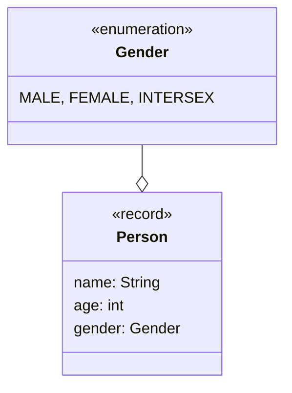
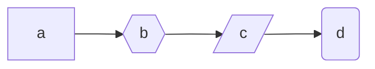
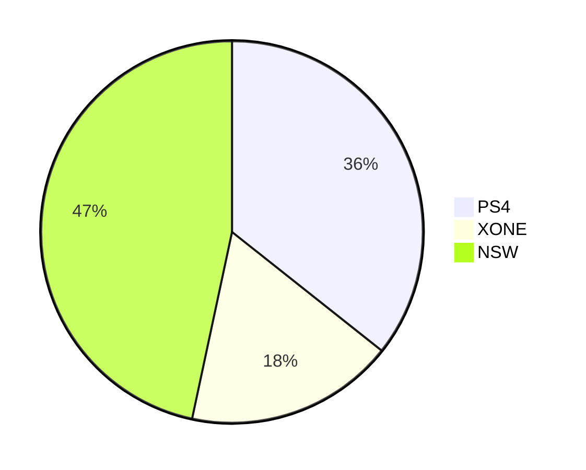

import Tabs from '@theme/Tabs';
import TabItem from '@theme/TabItem';

Markdown stellt eine einfache Auszeichnungssprache dar, mit der man Text leicht
formatieren kann. Sie wird häufig für Dokumentationen, README-Dateien und Blogs
verwendet, weil sie leicht zu schreiben ist und sich mit Hilfe einer
Konvertierungssoftware gut in HTML umwandeln lässt. Plattformen wie GitHub
erweitern dabei oftmals die Standard-Syntax um hilfreiche Funktionen wie z.B.
Tabellen, Nachrichtenblöcke und Code-Highlighting. Auch der Webseiten-Generator
[Docusaurus](https://docusaurus.io), mit dem diese Webseite erstellt wurde,
sowie die meisten GenAI-Chatbots verwenden Markdown.

## Hilfreiche Links

- [Tabellengenerator](https://www.tablesgenerator.com/)
- [Emoji-Cheat-Sheet](https://github.com/ikatyang/emoji-cheat-sheet/)
- [Quellcode-Formatierer](https://prettier.io/)
- [Mermaid](https://mermaid.js.org)

## Textformatierungen

| Syntax                         | Ergebnis        |
| ------------------------------ | --------------- |
| `*Text*` oder `_Text_`         | _Text_          |
| `**Text**` oder ` __Text__`    | **Text**        |
| `***Text***` oder `___Text___` | **_Text_**      |
| `~~Text~~` oder `~Text~`       | ~~Text~~        |
| `<ins>Text</ins>`              | <ins>Text</ins> |
| `<sup>Text</sup>`              | <sup>Text</sup> |
| `<sub>Text</sub>`              | <sub>Text</sub> |
| `` `Codezeile` ``              | `Codezeile`     |
| `:heart:`                      | :heart:         |

## Überschriften

<Tabs>
  <TabItem value="a" label="Syntax" default>

```
# Überschrift 1
## Überschrift 2
### Überschrift 3
```

  </TabItem>
  <TabItem value="b" label="Ergebnis">

# Überschrift 1

## Überschrift 2

### Überschrift 3

  </TabItem>
</Tabs>

## Links und Abbildungen

<Tabs>
  <TabItem value="a" label="Syntax" default>

```
[Markdown](https://de.wikipedia.org/wiki/Markdown)


```

  </TabItem>
  <TabItem value="b" label="Ergebnis">

[Markdown](https://de.wikipedia.org/wiki/Markdown)


  </TabItem>
</Tabs>

## Listen

<Tabs>
  <TabItem value="a" label="Syntax" default>

```
**Ungeordnete Liste**
- Java
- Python
- C++

**Aufgabenliste**
- [ ] Wäsche waschen
- [X] Zimmer aufräumen
- [ ] Rasen mähen

**Geordnete Liste**
1. Freiburg
2. Hamburg
3. Berlin
```

  </TabItem>
  <TabItem value="b" label="Ergebnis">

**Ungeordnete Liste**

- Java
- Python
- C++

**Aufgabenliste**

- [ ] Wäsche waschen
- [x] Zimmer aufräumen
- [ ] Rasen mähen

**Geordnete Liste**

1. Freiburg
2. Hamburg
3. Berlin

  </TabItem>
</Tabs>

## Tabellen

<Tabs>
  <TabItem value="a" label="Syntax" default>

```
| Name  | Alter | Geschlecht |
| ----- | ----- | ---------- |
| Hans  | 27    | m          |
| Lisa  | 31    | w          |
| Peter | 19    | m          |
```

  </TabItem>
  <TabItem value="b" label="Ergebnis">

| Name  | Alter | Geschlecht |
| ----- | ----- | ---------- |
| Hans  | 27    | m          |
| Lisa  | 31    | w          |
| Peter | 19    | m          |

  </TabItem>
</Tabs>

## Codeblöcke

<Tabs>
  <TabItem value="a" label="Syntax" default>

````
```java
public class MainClass {
   public static void main() {
      System.out.println("Hello World");
   }
}
```
````

  </TabItem>
  <TabItem value="b" label="Ergebnis">

```java
public class MainClass {
   public static void main() {
      System.out.println("Hello World");
   }
}
```

  </TabItem>
</Tabs>

## Zitatblöcke

<Tabs>
  <TabItem value="a" label="Syntax" default>

```
> "C makes it easy to shoot yourself in the foot;
> C++ makes it harder, but when you do, it blows away your whole leg."
> (Bjarne Stroustrup)
```

  </TabItem>
  <TabItem value="b" label="Ergebnis">

> "C makes it easy to shoot yourself in the foot; C++ makes it harder, but when
> you do, it blows away your whole leg." (Bjarne Stroustrup)

  </TabItem>
</Tabs>

## Nachrichtenblöcke

<Tabs>
  <TabItem value="a" label="Syntax" default>

```
**GitHub-Flavored-Markdown**

> [!NOTE]
> Ein einfacher Hinweis

> [!TIP]
> Ein hilfreicher Hinweis

> [!IMPORTANT]
> Ein wichtiger Hinweis

> [!WARNING]
> Eine Warnung

> [!CAUTION]
> Eine deutliche Warnung

**Docusaurus**

:::note Hinweis
Ein einfacher Hinweis
:::

:::tip Tipp
Ein hilfreicher Hinweis
:::

:::info Information
Eine einfache Information
:::

:::warning Warnung
Eine Warnung
:::

:::danger Warnung
Eine deutliche Warnung
:::
```

  </TabItem>
  <TabItem value="b" label="Ergebnis">

**GitHub-Flavored-Markdown**

> [!NOTE] Ein einfacher Hinweis

> [!TIP] Ein hilfreicher Hinweis

> [!IMPORTANT] Ein wichtiger Hinweis

> [!WARNING] Eine Warnung

> [!CAUTION] Eine deutliche Warnung

**Docusaurus**

:::note Hinweis

Ein einfacher Hinweis

:::

:::tip Tipp

Ein hilfreicher Hinweis

:::

:::info Information

Eine einfache Information

:::

:::warning Warnung

Eine Warnung

:::

:::danger Warnung

Eine deutliche Warnung

:::

  </TabItem>
</Tabs>

## Mermaid-Diagramme

<Tabs>
  <TabItem value="a" label="Syntax" default>

````
**Klassendiagram**

````

````
**Flussdiagram**

````

````
**Kuchendiagramm**

````

  </TabItem>
  <TabItem value="b" label="Ergebnis">

**Klassendiagram**


**Flussdiagram**


**Kuchendiagramm**


  </TabItem>
</Tabs>

:::info Hinweis

[Mermaid](https://mermaid.js.org) ist eine Auszeichnungssprache, die es
ermöglicht, Diagramme (z.B. Klassendiagramme und Flussdiagramme) aus Code zu
erstellen.

:::

## Fußnoten

<Tabs>
  <TabItem value="a" label="Syntax" default>

```
Markdown [^1]

[^1]: Eine einfache Auszeichnungssprache (vg. https://de.wikipedia.org/wiki/Markdown)
```

  </TabItem>
  <TabItem value="b" label="Ergebnis">

Markdown [^1]

[^1]:
    Eine einfache Auszeichnungssprache (vgl.
    https://de.wikipedia.org/wiki/Markdown)

  </TabItem>
</Tabs>

## Horizontale Linien

<Tabs>
  <TabItem value="a" label="Syntax" default>

```
---
```

  </TabItem>
  <TabItem value="b" label="Ergebnis">

---

  </TabItem>
</Tabs>
