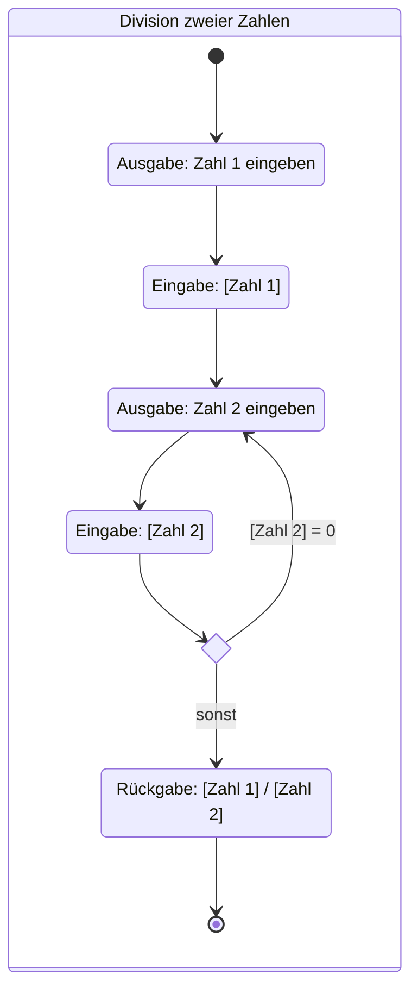

Aktivitätsdiagramme sind ein Diagrammtyp der UML und gehören zu den
Verhaltensdiagrammen. Sie modellieren den Ablauf von Aktivitäten mit Fokus auf
dem Kontroll- und Datenfluss. Eine Aktivität ist ein gerichteter Graph aus
Knoten und Kanten:

- Aktionen sind elementare Bausteine für benutzerdefiniertes Verhalten.
- Kontrollknoten steuern den Ablauf:
  - Startknoten legen den Beginn der Aktivität fest.
  - Endknoten legen das Ende der Aktivität fest.
  - Ablaufendknoten legen das Ende eines einzelnen Ablaufzweigs fest.
  - Verzweigungsknoten ermöglichen das Aufteilen von Abläufen.
  - Zusammenführungsknoten führen Abläufe wieder zusammen.
- Datenknoten dienen als ein- oder ausgehende Parameter einer Aktion.
- Kontroll- und Datenflüsse verbinden Vorgänger- und Nachfolgeknoten.

