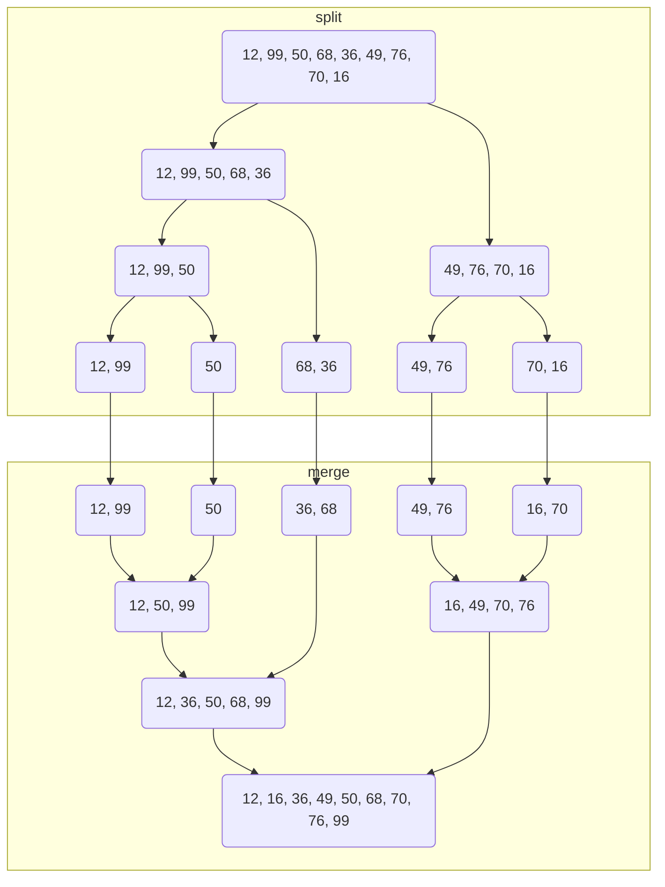

import Tabs from '@theme/Tabs';
import TabItem from '@theme/TabItem';

:::danger Hinweis

ToDo

:::

## Suchalgorithmen

Suchalgorithmen sollen innerhalb einer Datensammlung einen oder mehrere
Datensätze mit bestimmten Eigenschaften finden. Zu den wichtigen Suchalgorithmen
zählen die Linearsuche, die Binärsuche sowie die Interpolationssuche.

<Tabs>
  <TabItem value="linearSearch" label="Linearsuche" default>

Bei der Linearsuche werden alle Einträge einer Datensammlung nacheinander
durchlaufen, d.h. eine Suche kann im besten Fall (Best Case) beim ersten Eintrag
und im schlechtesten Fall beim letzten Eintrag beendet sein. Bei einer
erfolglosen Suche müssen alle Einträge durchlaufen werden.

Im nachfolgenden Beispiel wird die Zahlenfolge
`12, 16, 36, 49, 50, 68, 70, 76, 99` nach dem Wert 70 durchsucht.

| Index | 1      | 2      | 3      | 4      | 5      | 6      | 7      |
| ----- | ------ | ------ | ------ | ------ | ------ | ------ | ------ |
| 0     | **12** | **12** | **12** | **12** | **12** | **12** | **12** |
| 1     | 16     | **16** | **16** | **16** | **16** | **16** | **16** |
| 2     | 36     | 36     | **36** | **36** | **36** | **36** | **36** |
| 3     | 49     | 49     | 49     | **49** | **49** | **49** | **49** |
| 4     | 50     | 50     | 50     | 50     | **50** | **50** | **50** |
| 5     | 68     | 68     | 68     | 68     | 68     | **68** | **68** |
| 6     | 70     | 70     | 70     | 70     | 70     | 70     | **70** |
| 7     | 76     | 76     | 76     | 76     | 76     | 76     | 76     |
| 8     | 99     | 99     | 99     | 99     | 99     | 99     | 99     |

:::note Hinweis

Durch vorheriges Sortieren der Sammlung kann die Leistung des Algorithmus
verbessert werden.

:::

  </TabItem>
  <TabItem value="binarySearch" label="Binärsuche">

Bei der Binärsuche wird die sortierte Sammlung schrittweise halbiert.
Anschließend wird nur noch in der jeweils passenden Hälfte weitergesucht. Die
Binärsuche folgt damit dem Teile-und-Herrsche-Prinzip und ist i.d.R. schneller
als die Linearsuche, setzt aber eine sortierte Sammlung voraus.

Im nachfolgenden Beispiel wird die Zahlenfolge
`12, 16, 36, 49, 50, 68, 70, 76, 99` nach dem Wert 70 durchsucht.

| Index | 1    | 2      |
| ----- | ---- | ------ |
| 0     | 12   | **12** |
| 1     | 16   | **16** |
| 2     | 36   | **36** |
| 3     | 49   | **49** |
| 4     | [50] | **50** |
| 5     | 68   | 68     |
| 6     | 70   | [70]   |
| 7     | 76   | 76     |
| 8     | 99   | 99     |

| Durchlauf | l   | r   | m   |
| --------- | --- | --- | --- |
| 1         | 0   | 8   | 4   |
| 2         | 5   | 8   | 6   |

:::note Legende

l = linke Grenze, r = rechte Grenze, m = Mitte

:::

:::note Hinweis

Bei der Ermittlung der Mitte wird i.d.R. die Abrundungsfunktion verwendet, d.h.
zu einer reellen Zahl wird die größte ganze Zahl, die kleiner als die reelle
Zahl ist, verwendet.

:::

  </TabItem>
  <TabItem value="interpolationSearch" label="Interpolationsuche">

Die Interpolationssuche basiert auf der Binärsuche, halbiert die Sammlung aber
nicht, sondern versucht, durch Interpolation, einen geeigneteren Teiler zu
ermitteln. Dieser wird mit Hilfe der Formel
`t = ⌊𝑙 + ((𝑠 − 𝑑[𝑙]) / (𝑑[𝑟] − 𝑑[𝑙])) ∗ (𝑟 − 𝑙)⌋` ermittelt.

Im nachfolgenden Beispiel wird die Zahlenfolge
`12, 16, 36, 49, 50, 68, 70, 76, 99` nach dem Wert 70 durchsucht.

| Index | 1    | 2      |
| ----- | ---- | ------ |
| 0     | 12   | **12** |
| 1     | 16   | **16** |
| 2     | 36   | **36** |
| 3     | 49   | **49** |
| 4     | 50   | **50** |
| 5     | [68] | **68** |
| 6     | 70   | [70]   |
| 7     | 76   | 76     |
| 8     | 99   | 99     |

| Durchlauf | s   | l   | r   | d[l] | d[r] | t   |
| --------- | --- | --- | --- | ---- | ---- | --- |
| 1         | 70  | 0   | 8   | 12   | 99   | 5   |
| 2         | 70  | 6   | 8   | 70   | 99   | 6   |

:::note Legende

𝑠 = Schlüssel, 𝑙 = linke Grenze, 𝑟 = rechte Grenze, 𝑑 = Datensammlung, t =
Teiler, ⌊ ⌋ = untere Gaußklammer

:::

  </TabItem>
</Tabs>

## Sortieralgorithmen

Sortieralgorithmen sollen eine möglichst effiziente Speicherung von Daten und
deren Auswertung ermöglichen. Man unterscheidet dabei zwischen einfachen und
rekursiven Sortieralgorithmen.

<Tabs>
  <TabItem value="bubbleSort" label="Bubblesort" default>

Der Bubblesort verfolgt die Idee, das größere Blasen schneller aufsteigen als
kleinere. Dementsprechend werden beim Bubblesort Nachbarelemente miteinander
verglichen und gegebenenfalls vertauscht, so dass am Ende eines Durchlaufs das
jeweils größte Element am Ende des noch unsortierten Teils steht.

| Index | 0   | 1      | 2      | 3      | 4      | 5      | 6      | 7      | 8      | 9      |
| ----- | --- | ------ | ------ | ------ | ------ | ------ | ------ | ------ | ------ | ------ |
| 0     | 12  | 12     | 12     | 12     | 12     | 12     | 12     | 12     | 12     | **12** |
| 1     | 99  | 50     | 50     | 36     | 36     | 36     | 36     | 16     | **16** | **16** |
| 2     | 50  | 68     | 36     | 49     | 49     | 49     | 16     | **36** | **36** | **36** |
| 3     | 68  | 36     | 49     | 50     | 50     | 16     | **49** | **49** | **49** | **49** |
| 4     | 36  | 49     | 68     | 68     | 16     | **50** | **50** | **50** | **50** | **50** |
| 5     | 49  | 76     | 70     | 16     | **68** | **68** | **68** | **68** | **68** | **68** |
| 6     | 76  | 70     | 16     | **70** | **70** | **70** | **70** | **70** | **70** | **70** |
| 7     | 70  | 16     | **76** | **76** | **76** | **76** | **76** | **76** | **76** | **76** |
| 8     | 16  | **99** | **99** | **99** | **99** | **99** | **99** | **99** | **99** | **99** |

  </TabItem>
  <TabItem value="insertSort" label="Insertsort">

Beim Insertsort (auch Insertion Sort) wird dem unsortierten Teil der
Ausgangsdaten ein beliebiges Element entnommen (z.B. das jeweils erste) und an
der richtigen Stelle im sortierten Teil wieder eingefügt. Beim Einfügen wird das
entnommene Element mit den bereits sortierten Elementen verglichen.

| Index | 0   | 1      | 2      | 3      | 4      | 5      | 6      | 7      | 8      | 9      |
| ----- | --- | ------ | ------ | ------ | ------ | ------ | ------ | ------ | ------ | ------ |
| 0     | 12  | **12** | **12** | **12** | **12** | **12** | **12** | **12** | **12** | **12** |
| 1     | 99  | 99     | **99** | **50** | **50** | **36** | **36** | **36** | **36** | **16** |
| 2     | 50  | 50     | 50     | **99** | **68** | **50** | **49** | **49** | **49** | **36** |
| 3     | 68  | 68     | 68     | 68     | **99** | **68** | **50** | **50** | **50** | **49** |
| 4     | 36  | 36     | 36     | 36     | 36     | **99** | **68** | **68** | **68** | **50** |
| 5     | 49  | 49     | 49     | 49     | 49     | 49     | **99** | **76** | **70** | **68** |
| 6     | 76  | 76     | 76     | 76     | 76     | 76     | 76     | **99** | **76** | **70** |
| 7     | 70  | 70     | 70     | 70     | 70     | 70     | 70     | 70     | **99** | **76** |
| 8     | 16  | 16     | 16     | 16     | 16     | 16     | 16     | 16     | 16     | **99** |

  </TabItem>
  <TabItem value="selectSort" label="Selectsort">

Beim Selectsort (auch Selection Sort) wird dem unsortierten Teil der
Ausgangsdaten das jeweils kleinste Element entnommen und dem sortierten Teil
angehängt.

| Index | 0   | 1      | 2      | 3      | 4      | 5      | 6      | 7      | 8      | 9      |
| ----- | --- | ------ | ------ | ------ | ------ | ------ | ------ | ------ | ------ | ------ |
| 0     | 12  | **12** | **12** | **12** | **12** | **12** | **12** | **12** | **12** | **12** |
| 1     | 99  | 99     | **16** | **16** | **16** | **16** | **16** | **16** | **16** | **16** |
| 2     | 50  | 50     | 99     | **36** | **36** | **36** | **36** | **36** | **36** | **36** |
| 3     | 68  | 68     | 50     | 99     | **49** | **49** | **49** | **49** | **49** | **49** |
| 4     | 36  | 36     | 68     | 50     | 99     | **50** | **50** | **50** | **50** | **50** |
| 5     | 49  | 49     | 36     | 68     | 50     | 99     | **68** | **68** | **68** | **68** |
| 6     | 76  | 76     | 49     | 49     | 68     | 68     | 99     | **70** | **70** | **70** |
| 7     | 70  | 70     | 76     | 76     | 76     | 76     | 76     | 99     | **76** | **76** |
| 8     | 16  | 16     | 70     | 70     | 70     | 70     | 70     | 76     | 99     | **99** |

  </TabItem>
  <TabItem value="quickSort" label="Quicksort">

Beim Quicksort wird die jeweilige Sammlung anhand eines beliebigen Elements
(i.d.R. das mittlere Element) in zwei Hälften aufgeteilt: eine Hälfte mit
Elementen kleiner oder gleich dem Teiler-Element und eine Hälfte mit Elementen
größer dem Teiler-Element. Der Quicksort setzt folglich auf das
Teile-und-Herrsche-Prinzip.

| Index | 0    | 1    | 2      | 3      | 4      | 5      | 6      |
| ----- | ---- | ---- | ------ | ------ | ------ | ------ | ------ |
| 0     | 12   | 12   | **12** | **12** | **12** | **12** | **12** |
| 1     | 99   | [16] | **16** | **16** | **16** | **16** | **16** |
| 2     | 50   | 36   | **36** | **36** | **36** | **36** | **36** |
| 3     | 68   | _68_ | 68     | **49** | **49** | **49** | **49** |
| 4     | [36] | _50_ | 50     | 50     | 50     | **50** | **50** |
| 5     | 49   | _49_ | [49]   | 68     | [68]   | **68** | **68** |
| 6     | 76   | _76_ | 76     | [76]   | 70     | **70** | **70** |
| 7     | 70   | _70_ | 70     | 70     | _76_   | [76]   | **76** |
| 8     | 16   | _99_ | 99     | 99     | _99_   | 99     | **99** |

| Durchlauf | l   | r   | m   | d[m] | i   | j   | l-j | i-r |
| --------- | --- | --- | --- | ---- | --- | --- | --- | --- |
| 1         | 0   | 8   | 4   | 36   | 3   | 2   | 0-2 | 3-8 |
| 2         | 0   | 2   | 1   | 16   | 2   | 0   | 0-0 | 2-2 |
| 3         | 3   | 8   | 5   | 49   | 4   | 3   | 3-3 | 4-8 |
| 4         | 4   | 8   | 6   | 76   | 7   | 6   | 4-6 | 7-8 |
| 5         | 4   | 6   | 5   | 68   | 6   | 4   | 4-4 | 6-6 |
| 6         | 7   | 8   | 7   | 76   | 8   | 6   | 7-6 | 8-8 |

:::note Legende

l = linke Grenze, r = rechte Grenze, m = Mitte, d = Datensammlung, i = linker
Index, j = rechter Index

:::

:::note Hinweis

Bei der Ermittlung der Mitte wird i.d.R. die Abrundungsfunktion verwendet, d.h.
zu einer reellen Zahl wird die größte ganze Zahl, die kleiner als die reelle
Zahl ist, verwendet.

:::

  </TabItem>
  <TabItem value="mergeSort" label="Mergesort">

Beim Mergesort wird die Ausgangsliste zunächst in kleinere Listen zerlegt, die
anschließend im Reißverschlussverfahren wieder zusammengefügt bzw. verschmolzen
werden.

  </TabItem>
</Tabs>

## Komplexität von Algorithmen

Da der Zeitaufwand von Algorithmen aufgrund unterschiedlicher Faktoren
(Hardware, parallele Verarbeitung, Eingabereihenfolge,…) nicht genau ermittelt
werden kann, wird diese mit Hilfe der Landau-Notation dargestellt. Diese teilt
Algorithmen in unterschiedliche Komplexitätsklassen (logarithmisch, linear,
polynomial,…) ein. Die Komplexität einer Klasse ergibt sich dabei aus der Anzahl
der Schritte, die abhängig von der Größe der Eingangsvariablen ausgeführt werden
müssen.

| Algorithmus         | Best Case        | Average Case     | Worst Case       |
| ------------------- | ---------------- | ---------------- | ---------------- |
| Linearsuche         | 𝒪(1)             | 𝒪(𝑛)             | 𝒪(𝑛)             |
| Binärsuche          | 𝒪(1)             | 𝒪(𝑙𝑜𝑔 ⁡𝑛)        | 𝒪(𝑙𝑜𝑔 ⁡𝑛)        |
| Interpolationssuche | 𝒪(1)             | 𝒪(𝑙𝑜𝑔 𝑙𝑜𝑔 ⁡𝑛)    | 𝒪(𝑛)             |
| Bubblesort          | 𝒪(𝑛2) | 𝒪(𝑛2) | 𝒪(𝑛2) |
| Insertsort          | 𝒪(𝑛)             | 𝒪(𝑛2) | 𝒪(𝑛2) |
| Selectsort          | 𝒪(𝑛2) | 𝒪(𝑛2) | 𝒪(𝑛2) |
| Quicksort           | 𝒪(𝑛 𝑙𝑜𝑔 ⁡𝑛)      | 𝒪(𝑛 𝑙𝑜𝑔 ⁡𝑛)      | 𝒪(𝑛2) |
| Mergesort           | 𝒪(𝑛 𝑙𝑜𝑔 ⁡𝑛)      | 𝒪(𝑛 𝑙𝑜𝑔 ⁡𝑛)      | 𝒪(𝑛 𝑙𝑜𝑔 ⁡𝑛)      |

:::note Hinweis

Das Landau-Symbol 𝒪 steht für _Ordnung von_.

:::
