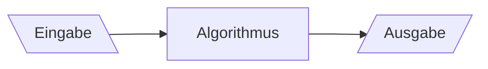
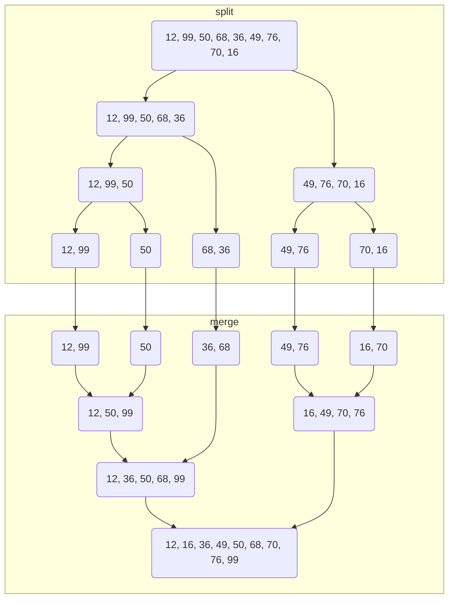
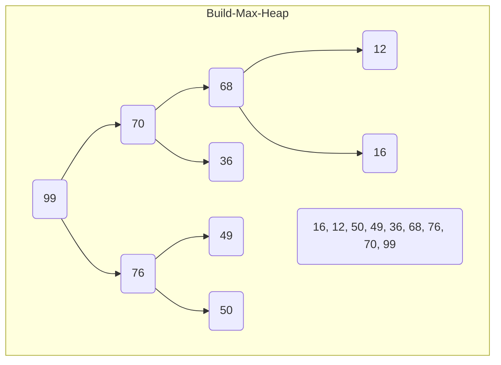
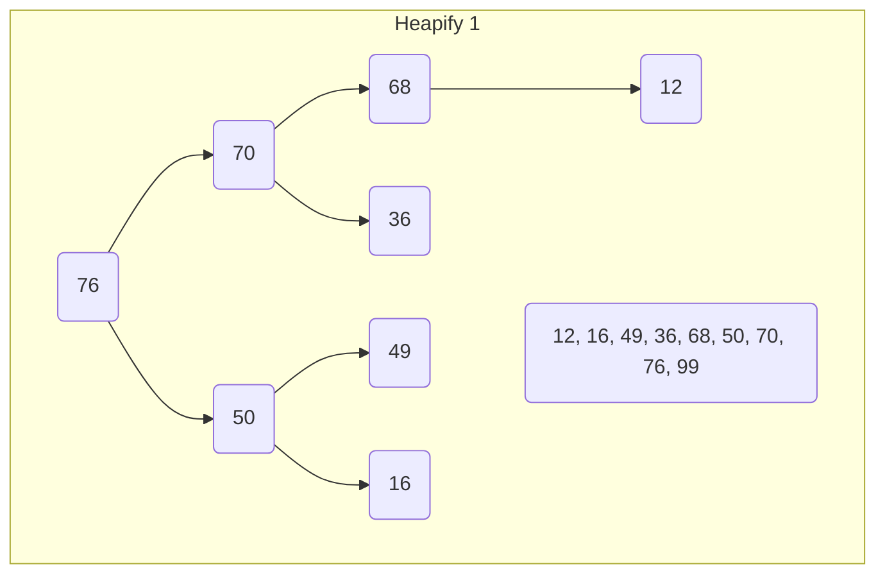
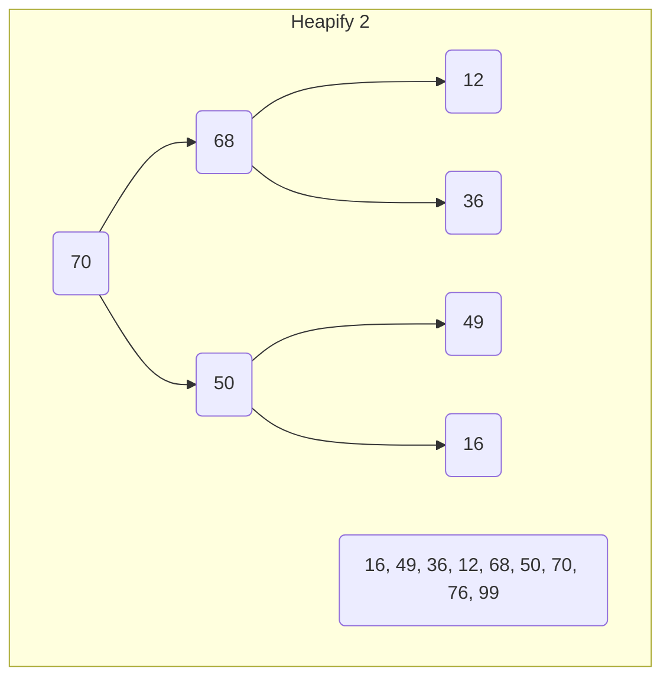
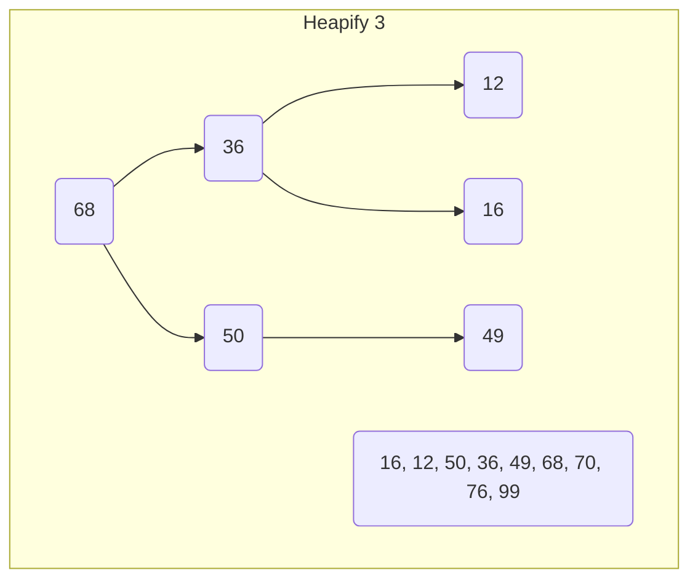
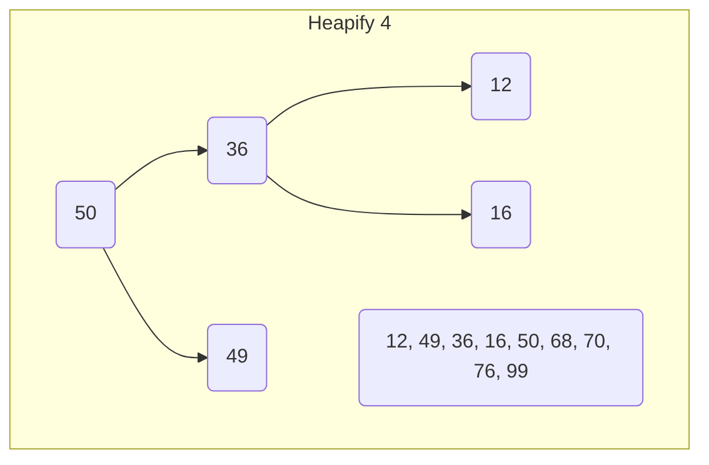
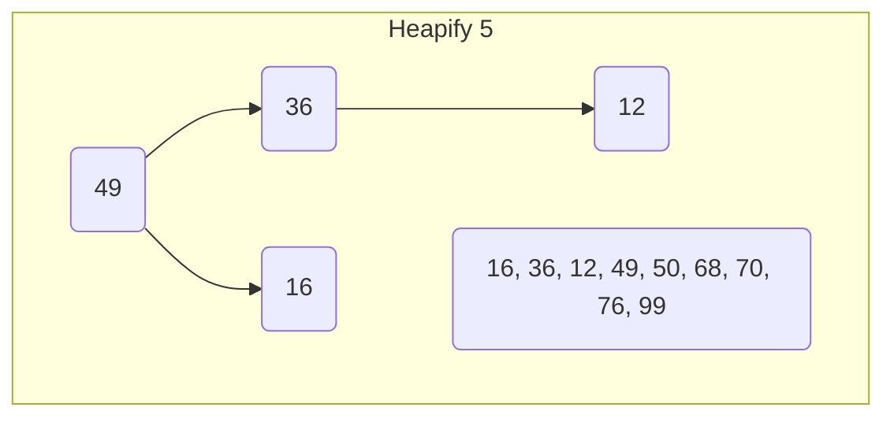
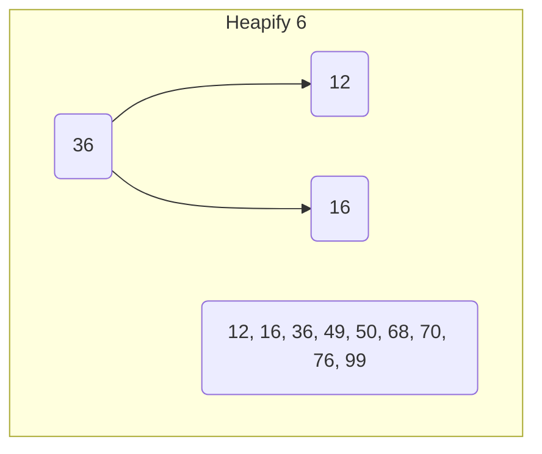
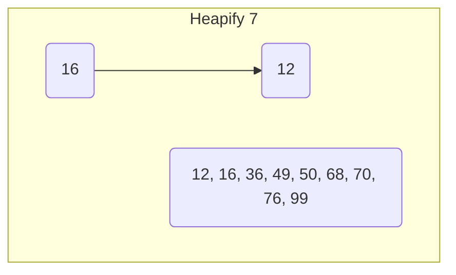

import Tabs from '@theme/Tabs';
import TabItem from '@theme/TabItem';

Ein Algorithmus ist ein schrittweises Verfahren zur Lösung eines Problems mit
einer endlichen Anzahl klar definierter Anweisungen. Er nimmt eine Eingabe
entgegen und liefert eine entsprechende Ausgabe. Alltagsbeispiele für
Algorithmen sind Kochrezepte, Aufbauanleitungen oder Beipackzettel.

```mermaid
flowchart LR
   input --> algorithm --> output
   input[Eingabe]@{ shape: lean-l }
   algorithm[Algorithmus]
   output[Ausgabe]@{ shape: lean-r }
```

Das nachfolgende Rezept beschreibt die Zubereitung von Pancakes:

1. 3 Eiweiß zu festem Eischnee verarbeiten
2. 3 Eigelb und 50 g Zucker schaumig rühren
3. 300 g Mehl, 300 g Milch, 1 TL Backpulver und etwas Salz unter die
   Eigelb-Zuckermasse rühren
4. Sollte der Teig zu fest sein, zusätzlich Milch unterrühren
5. Den Eischnee unter den Teig heben
6. Eine Pfanne mit etwas Fett erhitzen
7. Die Pancakes goldgelb ausbacken
8. Die Pancakes mit Puderzucker und Ahornsirup servieren

:::info

Die Überführung einer formalen Anleitung, also ein Algorithmus, in ein
ausführbares Programm bezeichnet man als Programmierung.

:::

## Eigenschaften von Algorithmen

Damit ein Verfahren als Algorithmus gilt, muss es die folgenden Eigenschaften
erfüllen:

- Determiniertheit: Bei gleicher Eingabe und gleichen Rahmenbedingungen führt
  der Algorithmus immer zum gleichen Ergebnis.
- Determinismus (Eindeutigkeit): Die Schrittfolge ist eindeutig festgelegt und
  führt immer zu einem eindeutigen Ergebnis.
- Terminiertheit (Endlichkeit): Der Algorithmus endet nach einer endlichen
  Anzahl von Schritten.
- Korrektheit: Der Algorithmus liefert für alle gültigen Eingaben das richtige
  Ergebnis.

## Komplexität von Algorithmen

Da die Laufzeit eines Algorithmus von Faktoren wie Hardware, paralleler
Verarbeitung oder der Eingabereihenfolge abhängt, wird sie nicht absolut
gemessen, sondern mit der Landau-Notation 𝒪 (_Ordnung von_) beschrieben. Diese
teilt Algorithmen in Komplexitätsklassen ein (z.B. logarithmisch, linear,
polynomial) und gibt an, wie viele Schritte der Algorithmus in Abhängigkeit von
der Eingabegröße benötigt.

## Suchalgorithmen

Suchalgorithmen finden innerhalb einer Datensammlung einen oder mehrere Einträge
mit bestimmten Eigenschaften.

| Algorithmus         | Komplexität Best Case | Komplexität Average Case | Komplexität Worst Case |
| ------------------- | --------------------- | ------------------------ | ---------------------- |
| Linearsuche         | 𝒪(1)                  | 𝒪(𝑛)                     | 𝒪(𝑛)                   |
| Binärsuche          | 𝒪(1)                  | 𝒪(𝑙𝑜𝑔 ⁡𝑛)                | 𝒪(𝑙𝑜𝑔 ⁡𝑛)              |
| Interpolationssuche | 𝒪(1)                  | 𝒪(𝑙𝑜𝑔 𝑙𝑜𝑔 ⁡𝑛)            | 𝒪(𝑛)                   |

<Tabs>
  <TabItem value="a" label="Linearsuche" default>

Bei der Linearsuche werden alle Einträge der Datensammlung nacheinander
durchlaufen. Im besten Fall wird das gesuchte Element beim ersten Zugriff
gefunden, im schlechtesten Fall erst beim letzten. Bei einer erfolglosen Suche
werden alle Einträge durchlaufen.

Im nachfolgenden Beispiel wird die Zahlenfolge
`12, 16, 36, 49, 50, 68, 70, 76, 99` nach dem Wert 70 durchsucht.

| Index | 1    | 2      | 3      | 4      | 5      | 6      | 7      |
| ----- | ---- | ------ | ------ | ------ | ------ | ------ | ------ |
| 0     | [12] | **12** | **12** | **12** | **12** | **12** | **12** |
| 1     | 16   | [16]   | **16** | **16** | **16** | **16** | **16** |
| 2     | 36   | 36     | [36]   | **36** | **36** | **36** | **36** |
| 3     | 49   | 49     | 49     | [49]   | **49** | **49** | **49** |
| 4     | 50   | 50     | 50     | 50     | [50]   | **50** | **50** |
| 5     | 68   | 68     | 68     | 68     | 68     | [68]   | **68** |
| 6     | 70   | 70     | 70     | 70     | 70     | 70     | [70]   |
| 7     | 76   | 76     | 76     | 76     | 76     | 76     | 76     |
| 8     | 99   | 99     | 99     | 99     | 99     | 99     | 99     |

:::info

Durch vorheriges Sortieren der Sammlung kann die Leistung des Algorithmus
verbessert werden.

:::

  </TabItem>
  <TabItem value="b" label="Binärsuche">

Bei der Binärsuche wird die sortierte Sammlung schrittweise halbiert, und die
Suche wird nur in der passenden Hälfte fortgesetzt. Dieses Teile-und-Herrsche-
Prinzip macht die Binärsuche deutlich schneller als die Linearsuche, setzt aber
eine sortierte Sammlung voraus.

Im nachfolgenden Beispiel wird die Zahlenfolge
`12, 16, 36, 49, 50, 68, 70, 76, 99` nach dem Wert 70 durchsucht.

| Index | 1    | 2      |
| ----- | ---- | ------ |
| 0     | 12   | **12** |
| 1     | 16   | **16** |
| 2     | 36   | **36** |
| 3     | 49   | **49** |
| 4     | [50] | **50** |
| 5     | 68   | 68     |
| 6     | 70   | [70]   |
| 7     | 76   | 76     |
| 8     | 99   | 99     |

| Durchlauf | l   | r   | m   |
| --------- | --- | --- | --- |
| 1         | 0   | 8   | 4   |
| 2         | 5   | 8   | 6   |

:::info

l = linke Grenze, r = rechte Grenze, m = Mitte. Bei der Ermittlung der Mitte
wird die Abrundungsfunktion verwendet, d.h. es wird die größte ganze Zahl
kleiner als die reelle Zahl verwendet.

:::

  </TabItem>
  <TabItem value="c" label="Interpolationsuche">

Die Interpolationssuche basiert auf der Binärsuche, berechnet den Teilungspunkt
jedoch nicht als Mitte, sondern durch Interpolation mit der Formel
`t = ⌊𝑙 + ((𝑠 − 𝑑[𝑙]) / (𝑑[𝑟] − 𝑑[𝑙])) ∗ (𝑟 − 𝑙)⌋`. Dadurch kann sie bei
gleichmäßig verteilten Daten schneller konvergieren.

Im nachfolgenden Beispiel wird die Zahlenfolge
`12, 16, 36, 49, 50, 68, 70, 76, 99` nach dem Wert 70 durchsucht.

| Index | 1    | 2      |
| ----- | ---- | ------ |
| 0     | 12   | **12** |
| 1     | 16   | **16** |
| 2     | 36   | **36** |
| 3     | 49   | **49** |
| 4     | 50   | **50** |
| 5     | [68] | **68** |
| 6     | 70   | [70]   |
| 7     | 76   | 76     |
| 8     | 99   | 99     |

| Durchlauf | s   | l   | r   | d[l] | d[r] | t   |
| --------- | --- | --- | --- | ---- | ---- | --- |
| 1         | 70  | 0   | 8   | 12   | 99   | 5   |
| 2         | 70  | 6   | 8   | 70   | 99   | 6   |

:::info

𝑠 = Schlüssel, 𝑙 = linke Grenze, 𝑟 = rechte Grenze, 𝑑 = Datensammlung, t =
Teiler, ⌊ ⌋ = untere Gaußklammer

:::

  </TabItem>
</Tabs>

## Sortieralgorithmen

Sortieralgorithmen bringen eine Datensammlung in eine definierte Reihenfolge.
Man unterscheidet zwischen einfachen und rekursiven Verfahren sowie zwischen
stabilen (gleichwertige Elemente behalten ihre ursprüngliche Reihenfolge) und
nicht-stabilen Verfahren. Arbeitet ein Algorithmus ohne zusätzlichen
Speicherplatz aus, bezeichnet man ihn als _in-place_, andernfalls als
_out-of-place_.

| Algorithmus   | Komplexität Best Case | Komplexität Average Case | Komplexität Worst Case | Stabil | In-Place |
| ------------- | --------------------- | ------------------------ | ---------------------- | ------ | -------- |
| Bubblesort    | 𝒪(𝑛2)      | 𝒪(𝑛2)         | 𝒪(𝑛2)       | ja     | ja       |
| Insertionsort | 𝒪(𝑛)                  | 𝒪(𝑛2)         | 𝒪(𝑛2)       | ja     | ja       |
| Selectionsort | 𝒪(𝑛2)      | 𝒪(𝑛2)         | 𝒪(𝑛2)       | nein   | ja       |
| Quicksort     | 𝒪(𝑛 𝑙𝑜𝑔 ⁡𝑛)           | 𝒪(𝑛 𝑙𝑜𝑔 ⁡𝑛)              | 𝒪(𝑛2)       | nein   | ja       |
| Mergesort     | 𝒪(𝑛 𝑙𝑜𝑔 ⁡𝑛)           | 𝒪(𝑛 𝑙𝑜𝑔 ⁡𝑛)              | 𝒪(𝑛 𝑙𝑜𝑔 ⁡𝑛)            | ja     | nein     |
| Heapsort      | 𝒪(𝑛 𝑙𝑜𝑔 ⁡𝑛)           | 𝒪(𝑛 𝑙𝑜𝑔 ⁡𝑛)              | 𝒪(𝑛 𝑙𝑜𝑔 ⁡𝑛)            | nein   | ja       |

<Tabs>
  <TabItem value="a" label="Bubblesort" default>

Beim Bubblesort werden benachbarte Elemente miteinander verglichen und bei
falscher Reihenfolge getauscht. Nach jedem Durchlauf steht das größte Element am
Ende des noch unsortierten Bereichs — ähnlich einer aufsteigenden Blase.

| Index | 0   | 1      | 2      | 3      | 4      | 5      | 6      | 7      | 8      | 9      |
| ----- | --- | ------ | ------ | ------ | ------ | ------ | ------ | ------ | ------ | ------ |
| 0     | 12  | 12     | 12     | 12     | 12     | 12     | 12     | 12     | 12     | **12** |
| 1     | 99  | 50     | 50     | 36     | 36     | 36     | 36     | 16     | **16** | **16** |
| 2     | 50  | 68     | 36     | 49     | 49     | 49     | 16     | **36** | **36** | **36** |
| 3     | 68  | 36     | 49     | 50     | 50     | 16     | **49** | **49** | **49** | **49** |
| 4     | 36  | 49     | 68     | 68     | 16     | **50** | **50** | **50** | **50** | **50** |
| 5     | 49  | 76     | 70     | 16     | **68** | **68** | **68** | **68** | **68** | **68** |
| 6     | 76  | 70     | 16     | **70** | **70** | **70** | **70** | **70** | **70** | **70** |
| 7     | 70  | 16     | **76** | **76** | **76** | **76** | **76** | **76** | **76** | **76** |
| 8     | 16  | **99** | **99** | **99** | **99** | **99** | **99** | **99** | **99** | **99** |

  </TabItem>
  <TabItem value="b" label="Insertionsort">

Beim Insertionsort wird jeweils ein Element aus dem unsortierten Bereich
entnommen und an der richtigen Position im sortierten Bereich eingefügt. Das
Verfahren entspricht dem Sortieren von Spielkarten in der Hand.

| Index | 0   | 1      | 2      | 3      | 4      | 5      | 6      | 7      | 8      | 9      |
| ----- | --- | ------ | ------ | ------ | ------ | ------ | ------ | ------ | ------ | ------ |
| 0     | 12  | **12** | **12** | **12** | **12** | **12** | **12** | **12** | **12** | **12** |
| 1     | 99  | 99     | **99** | **50** | **50** | **36** | **36** | **36** | **36** | **16** |
| 2     | 50  | 50     | 50     | **99** | **68** | **50** | **49** | **49** | **49** | **36** |
| 3     | 68  | 68     | 68     | 68     | **99** | **68** | **50** | **50** | **50** | **49** |
| 4     | 36  | 36     | 36     | 36     | 36     | **99** | **68** | **68** | **68** | **50** |
| 5     | 49  | 49     | 49     | 49     | 49     | 49     | **99** | **76** | **70** | **68** |
| 6     | 76  | 76     | 76     | 76     | 76     | 76     | 76     | **99** | **76** | **70** |
| 7     | 70  | 70     | 70     | 70     | 70     | 70     | 70     | 70     | **99** | **76** |
| 8     | 16  | 16     | 16     | 16     | 16     | 16     | 16     | 16     | 16     | **99** |

  </TabItem>
  <TabItem value="c" label="Selectionsort">

Beim Selectionsort wird in jedem Durchlauf das kleinste Element aus dem
unsortierten Bereich gesucht und an das Ende des sortierten Bereichs angefügt.

| Index | 0   | 1      | 2      | 3      | 4      | 5      | 6      | 7      | 8      | 9      |
| ----- | --- | ------ | ------ | ------ | ------ | ------ | ------ | ------ | ------ | ------ |
| 0     | 12  | **12** | **12** | **12** | **12** | **12** | **12** | **12** | **12** | **12** |
| 1     | 99  | 99     | **16** | **16** | **16** | **16** | **16** | **16** | **16** | **16** |
| 2     | 50  | 50     | 99     | **36** | **36** | **36** | **36** | **36** | **36** | **36** |
| 3     | 68  | 68     | 50     | 99     | **49** | **49** | **49** | **49** | **49** | **49** |
| 4     | 36  | 36     | 68     | 50     | 99     | **50** | **50** | **50** | **50** | **50** |
| 5     | 49  | 49     | 36     | 68     | 50     | 99     | **68** | **68** | **68** | **68** |
| 6     | 76  | 76     | 49     | 49     | 68     | 68     | 99     | **70** | **70** | **70** |
| 7     | 70  | 70     | 76     | 76     | 76     | 76     | 76     | 99     | **76** | **76** |
| 8     | 16  | 16     | 70     | 70     | 70     | 70     | 70     | 76     | 99     | **99** |

  </TabItem>
  <TabItem value="d" label="Quicksort">

Beim Quicksort wird ein Pivot-Element gewählt (in der Regel das mittlere
Element), und die Sammlung wird in zwei Teile aufgeteilt: Elemente kleiner oder
gleich dem Pivot und Elemente größer als das Pivot. Das Verfahren wird rekursiv
auf beide Teile angewendet (Teile-und-Herrsche-Prinzip).

| Index | 0    | 1    | 2      | 3      | 4      | 5      | 6      |
| ----- | ---- | ---- | ------ | ------ | ------ | ------ | ------ |
| 0     | 12   | 12   | **12** | **12** | **12** | **12** | **12** |
| 1     | 99   | [16] | **16** | **16** | **16** | **16** | **16** |
| 2     | 50   | 36   | **36** | **36** | **36** | **36** | **36** |
| 3     | 68   | _68_ | 68     | **49** | **49** | **49** | **49** |
| 4     | [36] | _50_ | 50     | 50     | 50     | **50** | **50** |
| 5     | 49   | _49_ | [49]   | 68     | [68]   | **68** | **68** |
| 6     | 76   | _76_ | 76     | [76]   | 70     | **70** | **70** |
| 7     | 70   | _70_ | 70     | 70     | _76_   | [76]   | **76** |
| 8     | 16   | _99_ | 99     | 99     | _99_   | 99     | **99** |

| Durchlauf | l   | r   | m   | d[m] | i   | j   | l-j | i-r |
| --------- | --- | --- | --- | ---- | --- | --- | --- | --- |
| 1         | 0   | 8   | 4   | 36   | 3   | 2   | 0-2 | 3-8 |
| 2         | 0   | 2   | 1   | 16   | 2   | 0   | 0-0 | 2-2 |
| 3         | 3   | 8   | 5   | 49   | 4   | 3   | 3-3 | 4-8 |
| 4         | 4   | 8   | 6   | 76   | 7   | 6   | 4-6 | 7-8 |
| 5         | 4   | 6   | 5   | 68   | 6   | 4   | 4-4 | 6-6 |
| 6         | 7   | 8   | 7   | 76   | 8   | 6   | 7-6 | 8-8 |

:::info

l = linke Grenze, r = rechte Grenze, m = Mitte, d = Datensammlung, i = linker
Index, j = rechter Index. Bei der Ermittlung der Mitte wird die
Abrundungsfunktion verwendet, d.h. es wird die größte ganze Zahl kleiner als die
reelle Zahl verwendet.

:::

  </TabItem>
  <TabItem value="e" label="Mergesort">

Beim Mergesort wird die Liste zunächst rekursiv in Einzelelemente zerlegt.
Anschließend werden die Teillisten im Reißverschlussverfahren sortiert
zusammengeführt (gemergt).

```mermaid
flowchart
   split0 --> split1
   split0 --> split2
   split1 --> split11
   split1 --> split12
   split11 --> split111
   split11 --> split112
   split2 --> split21
   split2 --> split22
   split111 --> merge1
   split112 --> merge12
   merge1 --> merge2
   merge12 --> merge2
   merge2 --> merge3
   split12 --> merge0
   merge0 --> merge3
   split21 --> merge4
   split22 --> merge5
   merge4 --> merge6
   merge5 --> merge6
   merge3 --> merge7
   merge6 --> merge7
   subgraph split
      split0(12, 99, 50, 68, 36, 49, 76, 70, 16)
      split1(12, 99, 50, 68, 36)
      split2(49, 76, 70, 16)
      split11(12, 99, 50)
      split111(12, 99)
      split112(50)
      split12(68, 36)
      split21(49, 76)
      split22(70, 16)
   end
   subgraph merge
      merge1(12, 99)
      merge12(50)
      merge2(12, 50, 99)
      merge0(36, 68)
      merge3(12, 36, 50, 68, 99)
      merge4(49, 76)
      merge5(16, 70)
      merge6(16, 49, 70, 76)
      merge7(12, 16, 36, 49, 50, 68, 70, 76, 99)
   end
```

  </TabItem>
  <TabItem value="f" label="Heapsort">

Beim Heapsort werden die Daten zunächst in einen binären Max-Heap überführt —
einen Binärbaum, in dem jeder Elternknoten größer ist als seine Kindknoten.
Anschließend wird in jedem Durchlauf das größte Element (die Wurzel) entnommen
und durch das letzte Element ersetzt, woraufhin die Heap-Eigenschaft
wiederhergestellt wird (Heapify / Versickern).

```mermaid
flowchart TD
   1(99)
   2(70)
   3(76)
   4(68)
   5(36)
   6(49)
   7(50)
   8(12)
   9(16)
   subgraph "Build-Max-Heap"
      array(16, 12, 50, 49, 36, 68, 76, 70, 99)
      1 --> 2
      1 --> 3
      2 --> 4
      2 --> 5
      3 --> 6
      3 --> 7
      4 --> 8
      4 --> 9
   end
```

```mermaid
flowchart TD
   1(76)
   2(70)
   3(50)
   4(68)
   5(36)
   6(49)
   7(16)
   8(12)
   subgraph "Heapify 1"
      array(12, 16, 49, 36, 68, 50, 70, 76, 99)
      1 --> 2
      1 --> 3
      2 --> 4
      2 --> 5
      3 --> 6
      3 --> 7
      4 --> 8
   end
```

```mermaid
flowchart TD
   1(70)
   2(68)
   3(50)
   4(12)
   5(36)
   6(49)
   7(16)
   subgraph "Heapify 2"
      array(16, 49, 36, 12, 68, 50, 70, 76, 99)
      1 --> 2
      1 --> 3
      2 --> 4
      2 --> 5
      3 --> 6
      3 --> 7
   end
```

```mermaid
flowchart TD
   1(68)
   2(36)
   3(50)
   4(12)
   5(16)
   6(49)
   subgraph "Heapify 3"
      array(16, 12, 50, 36, 49, 68, 70, 76, 99)
      1 --> 2
      1 --> 3
      2 --> 4
      2 --> 5
      3 --> 6
   end
```

```mermaid
flowchart TD
   1(50)
   2(36)
   3(49)
   4(12)
   5(16)
   subgraph "Heapify 4"
      array(12, 49, 36, 16, 50, 68, 70, 76, 99)
      1 --> 2
      1 --> 3
      2 --> 4
      2 --> 5
   end
```

```mermaid
flowchart TD
   1(49)
   2(36)
   3(16)
   4(12)
   subgraph "Heapify 5"
      array(16, 36, 12, 49, 50, 68, 70, 76, 99)
      1 --> 2
      1 --> 3
      2 --> 4
   end
```

```mermaid
flowchart TD
   1(36)
   2(12)
   3(16)
   subgraph "Heapify 6"
      array(12, 16, 36, 49, 50, 68, 70, 76, 99)
      1 --> 2
      1 --> 3
   end
```

```mermaid
flowchart TD
   1(16)
   2(12)
   subgraph "Heapify 7"
      array(12, 16, 36, 49, 50, 68, 70, 76, 99)
      1 --> 2
   end
```

  </TabItem>
</Tabs>
