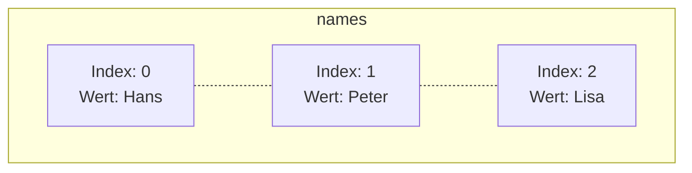

Wenn eine große Menge an Daten verarbeitet werden soll, kann man auf spezielle Datenstruktur-Variablen, sogenannte _Felder_ (Arrays), zurückgreifen. Die einzelnen Speicherplätze in einem Feld werden als Elemente bezeichnet, die über einen Index angesprochen 
werden können.



## Erzeugen von Feldern
Da es sich bei Feldern um Objekte handelt, müssen diese vor Verwendung erzeugt werden. Bei der Erzeugung muss immer die Länge des Feldes (d.h. die Anzahl der Elemente) angegeben werden. Jedes Feld verfügt über das Attribut `length`, welches die Länge des Feldes 
enthält.

```java title="MainClass.java" showLineNumbers
public class MainClass {

  public static void main(String[] args) {
    int[] ids = new int[5];
    System.out.println(Arrays.toString(ids));
    int[] ids2 = {4, 8, 15, 16, 23, 42};
    System.out.println(Arrays.toString(ids2));
  }

}
```

:::note Hinweis
Felder werden zwar mit Hilfe des new-Operators erzeugt, besitzen aber keinen Konstruktor.
:::

## Zugriff auf Feldelemente
Der Zugriff auf die Elemente eines Feldes erfolgt über die Angabe des entsprechenden Index.

```java title="MainClass.java" showLineNumbers
public class MainClass {

  public static void main(String[] args) {
    int[] ids = {4, 8, 15, 16, 23, 42};

    for (int i = 0; i < ids.length; i++) {
      System.out.println(ids[i]);
    }
  }

}
```

:::danger Hinweis
Der Index beginnt bei Java bei 0.
:::

## Der Parameter `String[] args`
Der Parameter `String[] args` der main-Methode ermöglicht es dem Anwender, der ausführbaren Klasse beim Aufruf Informationen mitzugeben.

```java title="MainClass.java" showLineNumbers
public class MainClass {

  public static void main(String[] args) {
    for (int i = 0; i < args.length; i++) {
      System.out.println("args[" + i + "]: " + args[i]);
    }
  }

}
```

## Variable Arugmentlisten (VarArgs)
Variable Argumentlisten (VarArgs) ermöglichen die Definition von Methoden, denen beliebig viele Werte eines Datentyps mitgegeben werden können. Die Parameterliste einer Methode kann allerdings nur eine variable Argumentliste beinhalten und diese muss immer am 
Ende der Parameterliste stehen.

```java title="MainClass.java" showLineNumbers
public class MainClass {

  public static void main(String[] args) {
    printAll("Peter", "Lisa");
    printAll("Heidi", "Franz", "Fritz");
  }

  public static void printAll(String... texts) {
    for (int i = 0; i < texts.length; i++) {
      System.out.println(texts[i]);
    }
  }

}
```

:::note Hinweis
Technisch gesehen handelt es sich bei einer variablen Argumentliste um ein Feld.
:::

## Herausforderungen beim Arbeiten mit Feldern
Das Arbeiten mit Feldern stellt einige Herausforderungen bereit:
- Die Länge eines Feldes muss bereits bei der Initialisierung des Feldes angegeben werden und kann nicht mehr verändert werden
- Beim Hinzufügen eines Elements in ein volles Feld müssen alle Elemente des Feldes in ein neues, größeres Feld kopiert werden
- Beim Einfügen oder Löschen eines Elements müssen alle nachfolgenden Elemente verschoben werden
