import Tabs from '@theme/Tabs';
import TabItem from '@theme/TabItem';

Klassendiagramme sind ein Diagrammtyp der UML und gehören dort zum Bereich der
Strukturdiagramme. Das Klassendiagramm dient zur leicht lesbaren Dokumentation
des Aufbaus von Klassen und deren Beziehungen (Relationen). Klassendiagramme
können Informationen zu den Attributen, den Methoden und weiteren
Klassen-Bestandteilen enthalten.

:::note Hinweis

_UML_ (Unified Modeling Language) ist eine grafische Modellierungssprache zur
Darstellung von Software-Systemen. Sie wurde in den 1990er-Jahren entwickelt und
ist im ISO/IEC 19505 festgelegt. Die Sprache definiert mehrere Diagramme, die
sich in zwei Hauptgruppen aufteilen lassen: Struktur- und Verhaltensdiagramme.

:::

## Darstellung von Klassen

Klassen werden im Klassendiagramm als Rechteck mit verschiedenen Bereichen
(Klassenname, Attribute, Methoden und weitere Klassen-Bestandteile) dargestellt:

- Der Klassenname wird zentriert, fett gedruckt und mit einem Großbuchstaben
  beginnend dargestellt
- Attribute werden nach dem Muster _[Sichtbarkeit]_ _Attributname: Datentyp [=
  Standardwert] [\{Eigenschaft}]_ dargestellt
- Methoden nach dem Muster _[Sichtbarkeit]_ _Methoden-Signatur: Datentyp des
  Rückgabewertes [\{Eigenschaft}]_ dargestellt
- Die Sichtbarkeit von Attributen und Methoden wird durch (farbige) Symbole
  dargestellt:
  - Die Sichtbarkeit `public` wird durch das Symbol _+_ bzw. die Farbe _grün_
    dargestellt
  - Die Sichtbarkeit `protected` wird durch das Symbol _#_ bzw. die Farbe _gelb_
    dargestellt
  - Die Sichtbarkeit `packaged` wird durch das Symbol _~_ bzw. die Farbe _blau_
    dargestellt
  - Die Sichtbarkeit `private` wird durch das Symbol _-_ bzw. die Farbe _rot_
    dargestellt
- Statische Attribute und Methoden werden durch Unterstriche kenntlich gemacht
- Finale Attribute und Methoden werden durch die Eigenschaft _final_ kenntlich
  gemacht
- Abstrakte Methoden werden entweder kursiv dargestellt oder durch die
  Eigenschaft _abstract_ kenntlich gemacht

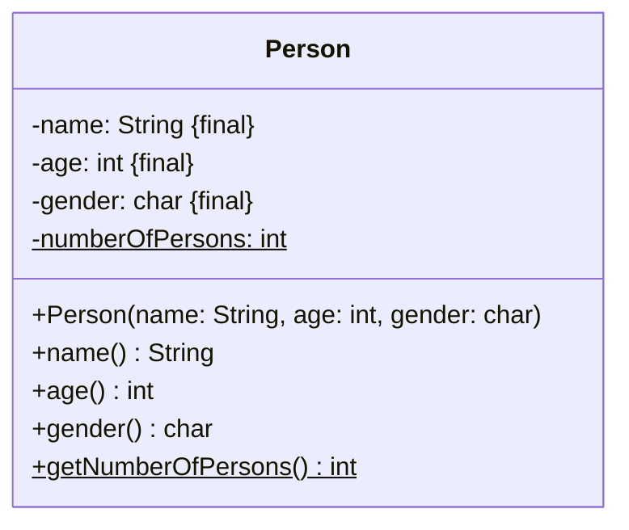

## Darstellung spezieller Klassen

<Tabs>
  <TabItem value="a" label="Aufzählungen" default>

Aufzählungen werden im Klassendiagramm durch den Stereotypen `enumeration`
kenntlich gemacht. Die Aufzählungskonstanten werden in einem zusätzlichen
Bereich aufgeführt. Der Stereotyp impliziert, dass die Aufzählung einen privaten
Konstruktor sowie ggbfs. passende Setter und Getter besitzt.

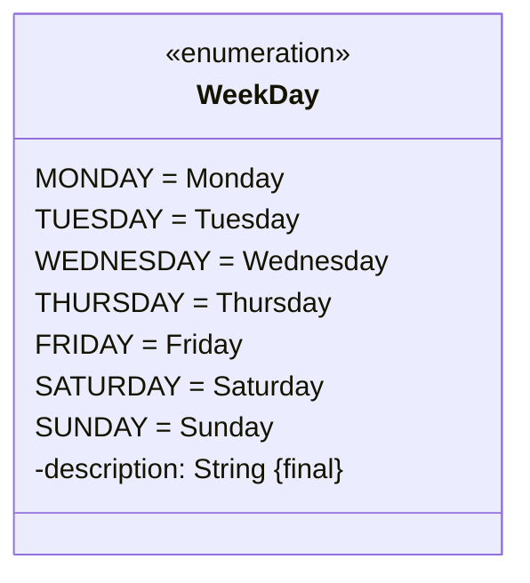

  </TabItem>
  <TabItem value="b" label="Abstrakte und finale Klassen">

Abstrakte und finale Klassen werden durch die Stereotypen `abstract` bzw.
`final` kenntlich gemacht.

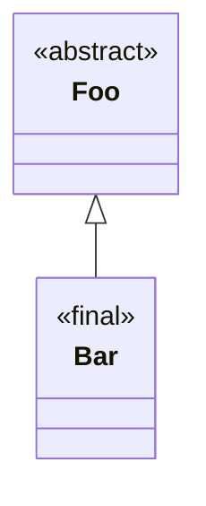

  </TabItem>
  <TabItem value="c" label="Schnittstellen">

Schnittstellen werden im Klassendiagramm durch den Stereotypen `interface`
kenntlich gemacht. Dieser impliziert, dass alle Methoden der Schnittstelle
abstrakt sind.

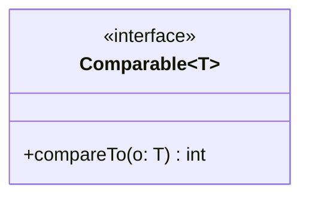

  </TabItem>
  <TabItem value="d" label="Datenklassen">

Datenklassen werden im Klassendiagramm durch den Stereotypen `record` kenntlich
gemacht. Dieser impliziert, dass die Datenklasse einen entsprechenden
Konstruktor, Getter zu allen Attributen sowie entsprechende Implementierungen
für die Object-Methoden besitzt, dass sämtliche Attribute private und
unveränderlich sind und dass die Klasse selbst unveränderlich ist.

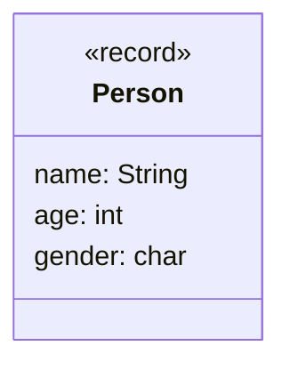

  </TabItem>
  <TabItem value="e" label="Generische Klassen">

Die formalen Typparameter einer generischen Klassen werden in einem zusätzlichen
Rechteck dargestellt.

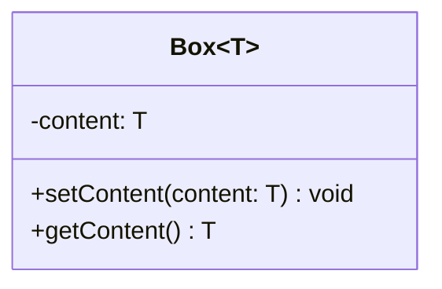

  </TabItem>
</Tabs>

## Darstellung von Assoziationen

Assoziationen stellen allgemeine Relationen zwischen zwei Klassen dar, bei der
eine Klasse eine andere Klasse verwendet. Assoziationen können in eine Richtung
(unidirektional) und in beide Richtungen (bidirektional) vorliegen.

Aggregationen und Kompositionen stellen spezielle Formen von Assoziationen dar,
bei denen ein Objekt der einen Klasse Teil einer anderen Klasse ist. Im
Gegensatz zu Aggregationen hängen bei Kompositionen die Teile von der Existenz
des Ganzen ab. Aggregationen werden daher auch als ist-Teil-von-Relationen,
Kompositionen als existenzabhängige ist-Teil-von-Relationen bezeichnet.

<Tabs>
  <TabItem value="a" label="Assoziationen" default>

Assoziationen werden mit einem offenen Pfeil hin zur verwendeten Klasse
dargestellt.

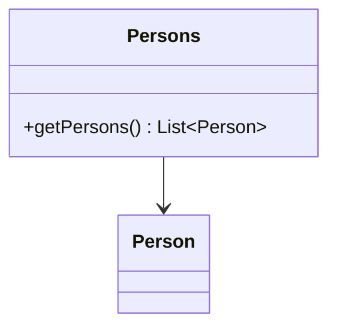

  </TabItem>
  <TabItem value="b" label="Aggregationen">

Aggregationen werden mit einer nicht ausgefüllten Raute hin zur besitzenden
Klasse dargestellt.

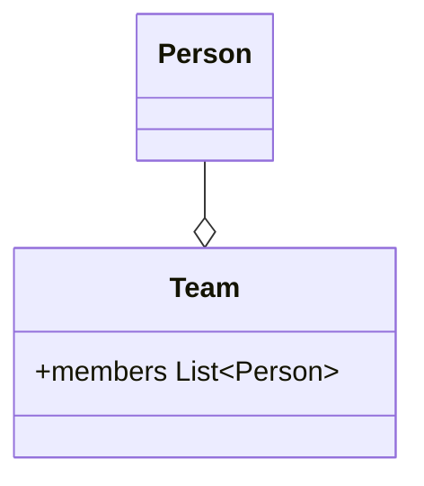

  </TabItem>
  <TabItem value="c" label="Kompositionen">

Kompositionen werden mit einer ausgefüllten Raute hin zur besitzenden Klasse
dargestellt.

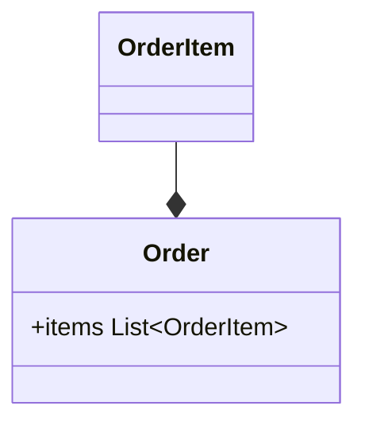

  </TabItem>
</Tabs>

:::note Hinweis

Assoziationen können gerichtet und ungerichtet dargestellt werden.

:::

## Darstellung von Vererbungs-und Realisierungs-Beziehungen

Vererbungs-Beziehungen werden mit einem geschlossenen Pfeil hin zur Oberklasse
sowie einer durchgezogenen Linie dargestellt, Realisierungs-Beziehungen mit
einem geschlossenen Pfeil hin zur Schnittstelle sowie einer gestrichelten Linie.

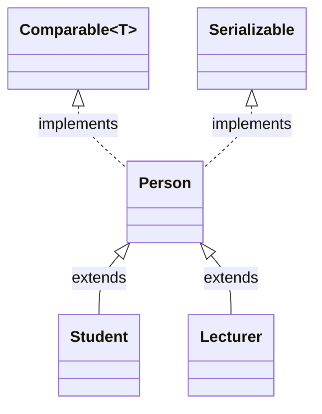

## Darstellung von Multiplizitäten

Die Multiplizität einer Beziehung legt fest, mit wie vielen Objekten der
gegenüberliegenden Klasse ein Objekt in Beziehung stehen kann. Die Multiplizität
wird als Intervall aus nicht-negativen ganzen Zahlen dargestellt und wird in der
Form _[untere Schranke]..[obere Schranke]_ angegeben. Besitzen beide Schranken
den gleichen Wert, muss nur eine der beiden Schranken angegeben werden. Eine
nach oben unbeschränkte Schranke wird mit **\*** angegeben.

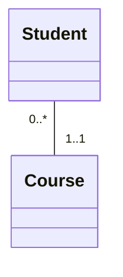
