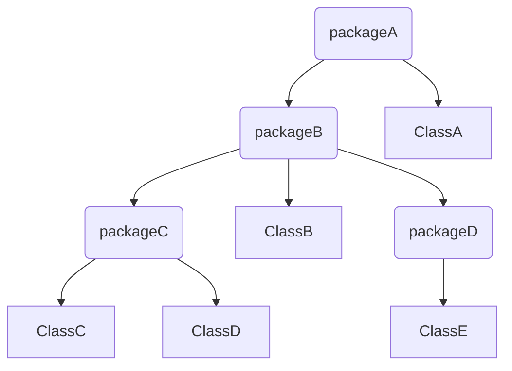

import Tabs from '@theme/Tabs';
import TabItem from '@theme/TabItem';

Klassen stellen den grundlegenden Rahmen für Programme dar. Jede Klasse kann Daten (_Attribute_) und Routinen (_Methoden_) besitzen. Routinen bestehen dabei aus Folgen von verzweigten und sich wiederholenden Anweisungen, wobei Anweisungen wohldefinierte
Befehle darstellen, die der Interpreter zur Laufzeit ausführt. Anweisungen müssen in Java mit dem Semikolon abgeschlossen werden und können zu Anweisungsblöcken zusammengefasst werden, die durch geschweifte Klammern umschlossen werden. Innerhalb eines 
Anweisungsblocks können sich weitere Anweisungsblöcke befinden.

<Tabs>
  <TabItem value="class" label="Klasse" default>

  ```java title="MainClass.java" showLineNumbers
  // highlight-start
  public class MainClass {

    public static void main(String[] args) {
      System.out.println("Winter is Coming");
    }

  }
  // highlight-end
  ```

  </TabItem>
  <TabItem value="method" label="Methode">

  ```java title="MainClass.java" showLineNumbers
  public class MainClass {

    // highlight-start
    public static void main(String[] args) {
      System.out.println("Winter is Coming");
    }
    // highlight-end

  }
  ```

  </TabItem>
  <TabItem value="statement" label="Anweisung">

  ```java title="MainClass.java" showLineNumbers
  public class MainClass {

    public static void main(String[] args) {
    // highlight-start
      System.out.println("Winter is Coming");
    // highlight-end
    }

  }
  ```
  </TabItem>
</Tabs>

## Statische Methoden
Statische Methoden sind abgeschlossene Programmteile, die Parameter enthalten und einen Wert zurückgeben können. Sie müssen mit dem Schlüsselwort `static` gekennzeichnet werden. Bei statischen Methoden, die einen Wert zurückgeben, muss der Datentyp des 
Rückgabewertes angegeben werden; bei statische Methoden, die keinen Wert zurückgeben, das Schlüsselwort `void`. Der Aufruf einer statischen Methode erfolgt über den Klassennamen gefolgt von einem Punkt.

```java title="MainClass.java" showLineNumbers
public class MainClass {

  public static void main(String[] args) {
    MainClass.printStarkMotto();
    MainClass.printText("Winter is Coming");
  }

  public static void printStarkMotto() {
    System.out.println("Winter is Coming");
  }

  public static void printText(String text) {
    System.out.println(text);
  }

}
```

:::note Hinweis
Die statischen Methoden einer Startklasse werden auch als _Unterprogramme_ bezeichnet.
:::

## Die main-Methode
Die Methode `void main(args: String[])` ist eine spezielle Methode in Java und stellt Startpunkt sowie Endpunkt einer Anwendung bzw. eines Programms dar. Nur Klassen mit einer main-Methode können von der Laufzeitumgebung ausgeführt werden. Aus diesem Grund werden 
Klassen mit einer main-Methode auch als _ausführbare Klassen_ oder als _Startklassen_ bezeichnet.

```java title="MainClass.java" showLineNumbers
public class MainClass {

  public static void main(String[] args) {
    System.out.println("Winter is Coming");
  }

}
```

## Kommentare
Kommentare sollen die Lesbarkeit des Programms verbessern. Sie bewirken bei der Ausführung keine Aktion und werden vom Java-Compiler ignoriert. Java kennt einzeilige Kommentare mit `//`, Kommentarblöcke mit `/* */` und Dokumentationskommentare mit `/** */`.

```java title="MainClass.java" showLineNumbers
/**
 * Beschreibung der Klasse
 *
 * @author Autor der Klasse
 * @version Version
 * 
 */
public class MainClass {

  /**
   * Beschreibung der Methode
   *
   * @param args Beschreibung der Parameter
   */
  public static void main(String[] args) {
    /* Kommentarblock */
    System.out.println("Winter is Coming"); // Kommentar
  }

}
```

## Entwicklungspakete
Entwicklungspakete ermöglichen das hierarchische Strukturieren von Klassen. Um die Klassen eines Entwicklungspaketes verwenden zu können, müssen die jeweiligen Klassen explizit mit Hilfe des Schlüsselworts `import` importiert werden.



:::note Hinweis
Die Klassen des Entwicklungspaketes `java.lang` müssen nicht importiert werden.
:::
