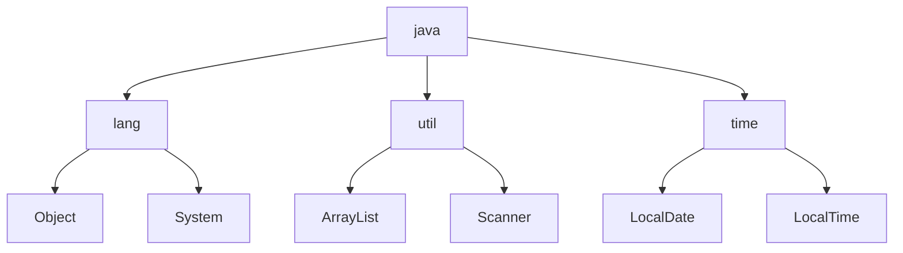

import Tabs from '@theme/Tabs';
import TabItem from '@theme/TabItem';

Klassen sind der grundlegende Rahmen für Programme. Jede Klasse kann Daten
(_Attribute_) und Routinen (_Methoden_) besitzen. Routinen bestehen aus Folgen
von verzweigten und sich wiederholenden Anweisungen, wobei Anweisungen
wohldefinierte Befehle darstellen, die der Interpreter zur Laufzeit ausführt.
Anweisungen müssen in Java mit einem Semikolon abgeschlossen werden und können
zu Anweisungsblöcken zusammengefasst werden, die durch geschweifte Klammern
umschlossen sind. Innerhalb eines Anweisungsblocks können weitere
Anweisungsblöcke enthalten sein.

<Tabs>
  <TabItem value="a" label="Klasse" default>

```java title="MainClass.java" showLineNumbers
// highlight-start
public class MainClass {

   public static void main(String[] args) {
      System.out.println("Winter is Coming");
   }

}
// highlight-end
```

  </TabItem>
  <TabItem value="b" label="Methode">

```java title="MainClass.java" showLineNumbers
public class MainClass {

   // highlight-start
   public static void main(String[] args) {
      System.out.println("Winter is Coming");
   }
   // highlight-end

}
```

  </TabItem>
  <TabItem value="c" label="Anweisung">

```java title="MainClass.java" showLineNumbers
public class MainClass {

   public static void main(String[] args) {
   // highlight-start
      System.out.println("Winter is Coming");
   // highlight-end
   }

}
```

  </TabItem>
</Tabs>

## Statische Methoden

Statische Methoden sind abgeschlossene Programmteile, die Parameter enthalten
und einen Wert zurückgeben können. Sie müssen mit dem Schlüsselwort `static`
gekennzeichnet werden. Bei statischen Methoden, die einen Wert zurückgeben, muss
der Datentyp des Rückgabewerts angegeben werden; bei statischen Methoden, die
keinen Wert zurückgeben, das Schlüsselwort `void`. Der Aufruf einer statischen
Methode erfolgt über den Klassennamen gefolgt von einem Punkt.

```java title="MainClass.java" showLineNumbers
public class MainClass {

   public static void main(String[] args) {
      MainClass.printStarkMotto();
      MainClass.printText("Winter is Coming");
   }

   public static void printStarkMotto() {
      System.out.println("Winter is Coming");
   }

   public static void printText(String text) {
      System.out.println(text);
   }

}
```

:::info

Die statischen Methoden einer Startklasse werden auch als _Unterprogramme_
bezeichnet.

:::

## Die main-Methode

Die Methode `void main(args: String[])` ist eine spezielle Methode in Java und
ist Startpunkt sowie Endpunkt einer Anwendung. Nur Klassen mit einer
main-Methode können von der Laufzeitumgebung ausgeführt werden. Aus diesem Grund
werden Klassen mit einer main-Methode auch als _ausführbare Klassen_ oder als
_Startklassen_ bezeichnet.

```java title="MainClass.java" showLineNumbers
public class MainClass {

   public static void main(String[] args) {
      System.out.println("Winter is Coming");
   }

}
```

## Kommentare und Dokumentation

Kommentare sollen die Lesbarkeit und Verwendbarkeit des Programms verbessern.
Sie bewirken bei der Ausführung keine Aktion und werden vom Java-Compiler
ignoriert. Man unterscheidet dabei zwischen Quellcode-Kommentaren, die einzelne
Anweisungen oder Anweisungsblöcke erklären und Dokumentationskommentaren, die
Beschreiben, wie eine Methode oder einer Klasse verwendet wird (siehe
[Javadoc](./java-api.md#die-javadoc)). In Java werden einzeilige Kommentare mit
`//`, Kommentarblöcke mit `/* */` und Dokumentationskommentare mit `/** */`
erstellt.

```java title="MainClass.java" showLineNumbers
/**
 * Beschreibung der Klasse
 *
 * @author Autor der Klasse
 * @version Version
 *
 */
public class MainClass {

   /**
    * Beschreibung der Methode
    *
    * @param args Beschreibung der Parameter
    */
   public static void main(String[] args) {
      /* Kommentarblock */
      System.out.println("Winter is Coming"); // Kommentar
   }

}
```

:::info

Guter Quellcode sollte immer selbsterklärend sein. Das heißt, dass auf den
Einsatz von Quellcode-Kommentaren i.d.R. verzichtet werden sollte.

:::

## Entwicklungspakete

Entwicklungspakete ermöglichen das hierarchische Strukturieren von Klassen. Um
die Klassen eines Entwicklungspaketes verwenden zu können, müssen sie mit dem
Schlüsselwort `import` importiert werden.



:::info

Die Klassen des Entwicklungspaketes `java.lang` müssen nicht importiert werden.

:::
