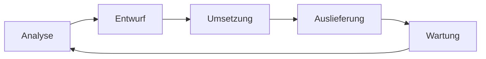
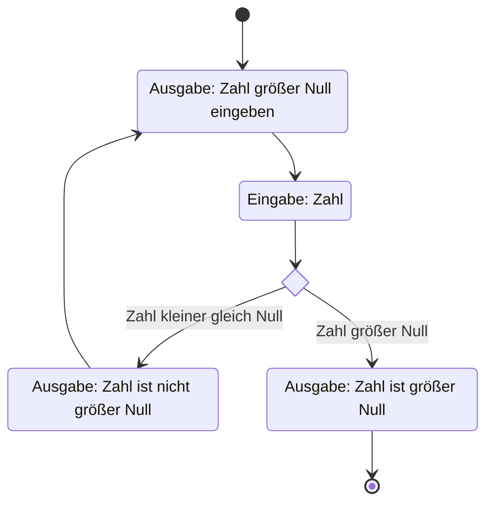
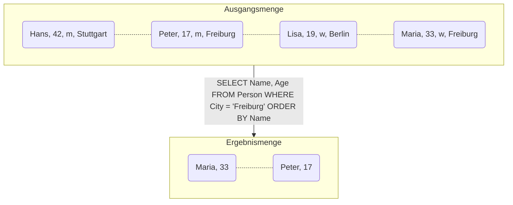
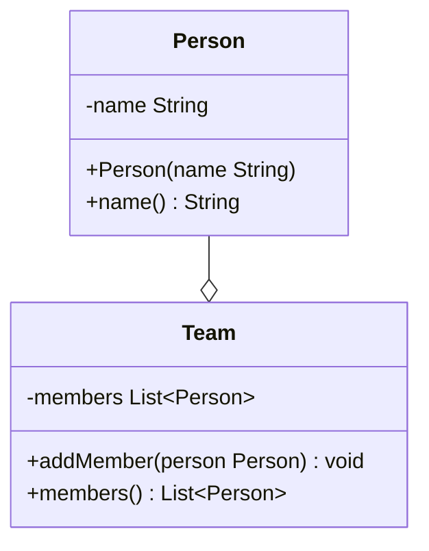
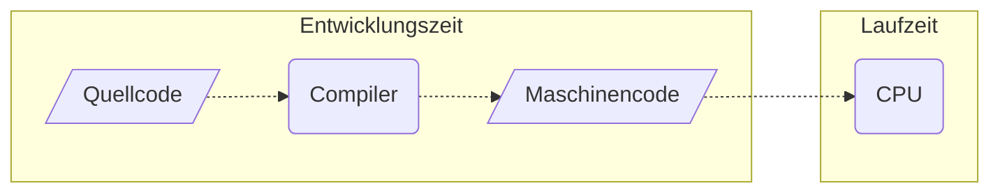
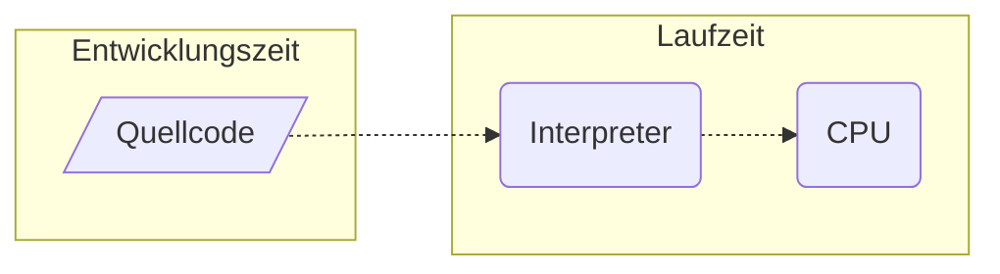
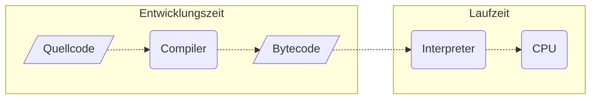

import Tabs from '@theme/Tabs';
import TabItem from '@theme/TabItem';

Als ein Teilbereich der Softwareentwicklung umfasst das Programmieren vor allem
die Umsetzung eines Softwareentwurfes in Quellcode. Generell versteht man unter
Programmieren die Umsetzung von [Algorithmen](algorithms) in lauffähige
Computer-Programme.

:::note Hinweis

Ein Algorithmus ist eine Handlungsvorschrift zur Lösung eines Problems.

:::

## Programmierparadigmen

Unter einem Programmierparadigma versteht man die grundlegende Herangehensweise,
Probleme mit Hilfe einer Programmiersprache zu lösen. Aber auuch wenn
Programmiersprachen oft anhand ihrer grundlegenden Merkmale genau einem
Programmierparadigma zugeordnet werden, unterstützen viele Programmiersprachen
mehrere Programmierparadigmen.

<Tabs>
  <TabItem value="a" label="Imperative Programmierung" default>

Bei der imperativen Programmierung bestehen Programme aus verzweigten und sich
wiederholenden Folgen von Anweisungen, die den Programmablauf steuern.

  </TabItem>
  <TabItem value="b" label="Deklarative Programmierung">

Die deklarative Programmierung stellt einen Gegenentwurf zur imperativen
Programmierung dar, bei der nicht das "Wie", sondern das "Was" im Vordergrund
steht.

  </TabItem>
  <TabItem value="c" label="Objektorientierte Programmierung">

Die ojektorientierte Programmierung baut auf der imperativen Programmierung auf,
setzt den Fokus aber auf abstrakte Datentypen und die Verbindung von Daten und
Routinen.

  </TabItem>
</Tabs>

## Programmausführung

Programme auf einem Computer können auf unterschiedliche Arten ausgeführt
werden: Compilersprachen übersetzen den Quellcode in eine Datei, die vom
jeweiligen Betriebssystem ausgeführt werden kann, Interpretersprachen übersetzen
den Quellcode direkt in den Arbeitsspeicher und führen das Programm sofort aus
und Just-In-Time Compilersprachen (JIT) übersetzen den Quellcode mit Hilfe eines
Compilers zunächst in den sogenannten Bytecode und übersetzen diesen bei der
Ausführung in den Arbeitsspeicher. Compilersprachen wie z.B. C++ sind dabei
deutlich performanter und ermöglichen eine sicherere Entwicklung,
Interpretersprachen wie z.B. PHP sind dagegen plattformunabhängig und
Just-In-Time Compliersprachen vereinen die Vorteile von beiden.

:::note Hinweis

In Java wird der Interpreter als _Java Virtual Machine_ bezeichnet.

:::

<Tabs>
  <TabItem value="a" label="Compilersprachen" default>

  </TabItem>
  <TabItem value="b" label="Interpretersprachen">

  </TabItem>
  <TabItem value="c" label="Just-In-Time Compilersprachen">

  </TabItem>
</Tabs>

## Programmiersprachen

Maschinen sind im Vergleich zu menschlichen Gehirnen sehr primitive Gebilde. Die
Diskrepanz zwischen der menschlichen Denkweise und der Arbeitsweise von
Maschinen bezeichnet mal als _Semantische Lücke_. Programmiersprachen
ermöglichen es, Problemstellungen der realen Welt abstrahiert und
maschinengerecht abzubilden und damit die Semantische Lücke zu verringern. Je
höher die Abstraktion einer Programmiersprache dabei ist, desto mehr kann die
Semantische Lücke verringert werden: Maschinenorientierte Programmiersprachen
(wie z.B. Assembler) abstrahieren kaum und sind daher für den Menschen schwerer
verständlich, problemorientierte Programmiersprachen (wie z.B. Java)
abstrahieren stark und sind daher für den Menschen leichter verständlich.

Die Programmiersprachen Java, Python und JavaScript gehören zu den am weitesten
verbreiteten bzw. beliebtesten Programmiersprachen.

| TIOBE  | RedMonk    | PYPL       |
| ------ | ---------- | ---------- |
| Python | JavaScript | Python     |
| C      | Python     | Java       |
| C++    | Java       | JavaScript |
| Java   | PHP        | C/C#++     |
| C#     | C++        | C#         |

:::note Quellen

Tiobe Programming Community Index Januar 2024, RedMonk Programming Language
Rankings Januar 2023, PopularitY of Programming Language Januar 204

:::
