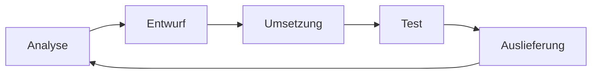
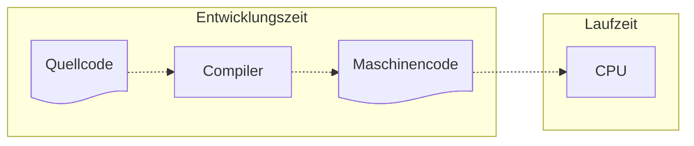
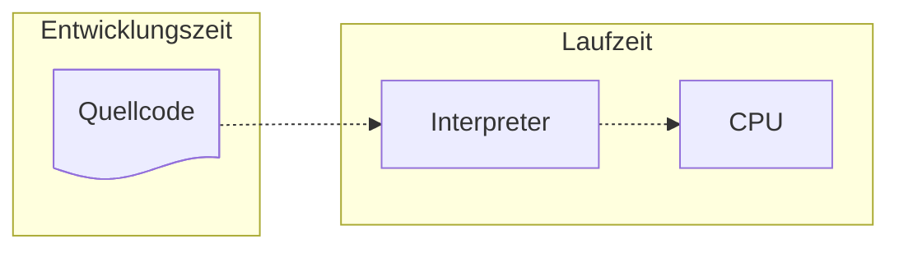
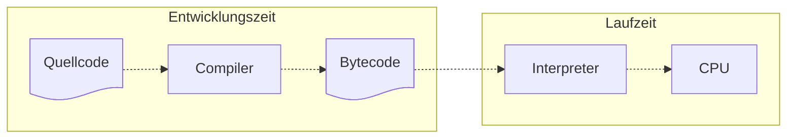

import Tabs from '@theme/Tabs';
import TabItem from '@theme/TabItem';

Als ein Teilbereich der Softwareentwicklung umfasst das Programmieren vor allem
die Umsetzung eines Softwareentwurfes in Quellcode. Generell versteht man unter
Programmieren die Umsetzung von [Algorithmen](algorithms) in lauffähige
Computer-Programme.

:::info Hinweis

Ein Algorithmus ist eine Handlungsvorschrift zur Lösung eines Problems.

:::

## Abstraktionsniveau

Maschinen sind im Vergleich zu menschlichen Gehirnen sehr primitive Gebilde. Die
Diskrepanz zwischen der menschlichen Denkweise und der Arbeitsweise von
Maschinen bezeichnet mal als _Semantische Lücke_. Programmiersprachen
ermöglichen es, Problemstellungen der realen Welt abstrahiert und
maschinengerecht abzubilden und damit die Semantische Lücke zu verringern. Je
höher die Abstraktion einer Programmiersprache dabei ist, desto mehr kann die
Semantische Lücke verringert werden: Maschinenorientierte Programmiersprachen
(z.B. X86-Assembler) abstrahieren kaum und sind daher für den Menschen schwerer
verständlich, problemorientierte Programmiersprachen (z.B. Java) abstrahieren
stark und sind daher für den Menschen leichter verständlich.

|                  | Generation                     | Merkmale                                   | Sprachen                                    |
| ---------------- | ------------------------------ | ------------------------------------------ | ------------------------------------------- |
| Höhere Sprachen  | 5: Sprachen der KI             | Logik- und Regelbasiert                    | Lisp, Prolog                                |
| Höhere Sprachen  | 4: Anwendungsbezogene Sprachen | Domänenspezifisch                          | SQL                                         |
| Höhere Sprachen  | 3: Problemorientierte Sprachen | Datenobjekte, Routinen, Kontrollstrukturen | C, C++, C#, Java, JavaScript, Python        |
| Niedere Sprachen | 2: Assemblersprachen           | Symbolische Befehle                        | X86-Assembler, MIPS-Asembler, ARM-Assembler |
| Niedere Sprachen | 1: Maschinensprache            | Binärcode                                  | -                                           |

## Programmierparadigmen

Unter einem Programmierparadigma versteht man die grundlegende Herangehensweise,
Probleme mit Hilfe einer Programmiersprache zu lösen. Aber auch wenn
Programmiersprachen oft anhand ihrer grundlegenden Merkmale genau einem
Programmierparadigma zugeordnet werden, unterstützen viele Programmiersprachen
mehrere Programmierparadigmen. Generell werden die verschiedenen
Programmierparadigmen oft in zwei große Kategorien eingeteilt: bei imperativen
Programmierparadigmen steht die Frage _Wie soll das Ergebnis erreicht werden?_
im Vordergrund, bei deklarativen Programmierparadigmen die Frage _Was soll das
Ergebnis sein?_. Imperative Programmierparadigmen legen also Schritt für Schritt
fest, wie das Ergebnis erreicht werden soll, deklarative Programmierparadigmen
beschreiben das Ergebnis selbst.

| Programmierparadigmen            | Kategorie                  | Fokus                                                                                                                                                                                                                                                            | Beispielsprachen |
| -------------------------------- | -------------------------- | ---------------------------------------------------------------------------------------------------------------------------------------------------------------------------------------------------------------------------------------------------------------- | ---------------- |
| Prozedurale Programmierung       | Imperative Programmierung  | Routinen werden in Prozeduren gekapselt. Es gibt eine klare Trennung zwischen Daten und Routinen. Routinen stellen dabei wiederverwendbaren Code dar, der aus verzweigten und sich wiederholenden Folgen von Anweisungen besteht, die den Programmablauf steuern | Pascal, C        |
| Objektorientierte Programmierung | Imperative Programmierung  | Objekte verbinden sowohl Daten als auch Routinen. Zentrale Aspekte sind _[Datenkapselung](oo#datenkapselung)_, _[Abstraktion](oo#abstraktion)_, _[Vererbung](inheritance)_ und _[Polymorphie](polymorphy)_                                                       | C++, Java        |
| Funktionale Programmierung       | Deklarative Programmierung | Berechnungen werden als die Auswertung mathematischer Funktionen betrachtet. Seiteneffekte (veränderliche Daten und Zustände) werden vermieden                                                                                                                   | Haskell, Lisp    |
| Logische Programmierung          | Deklarative Programmierung | Fakten und Regeln werden zur logischen Deduktion verwendet. Es wird festgelegt, was bekannt ist, um daraus abzuleiten, was daraus folgt                                                                                                                          | Prolog           |

## Programmausführung

Programme auf einem Computer können auf unterschiedliche Arten ausgeführt
werden: Compilersprachen übersetzen den Quellcode in eine Datei, die vom
jeweiligen Betriebssystem ausgeführt werden kann, Interpretersprachen übersetzen
den Quellcode direkt in den Arbeitsspeicher und führen das Programm sofort aus
und Just-In-Time Compilersprachen (JIT) übersetzen den Quellcode mit Hilfe eines
Compilers zunächst in den sogenannten Bytecode und übersetzen diesen bei der
Ausführung in den Arbeitsspeicher. Compilersprachen wie C und C++ sind dabei
deutlich performanter und ermöglichen eine sicherere Entwicklung,
Interpretersprachen wie JavaScript und Python sind dagegen plattformunabhängig
und Just-In-Time Compliersprachen wie C# und Java vereinen die Vorteile beider
Welten.

<Tabs>
  <TabItem value="a" label="Compilersprachen" default>

  </TabItem>
  <TabItem value="b" label="Interpretersprachen">

  </TabItem>
  <TabItem value="c" label="Just-In-Time Compilersprachen">

  </TabItem>
</Tabs>

:::info Hinweis

In Java wird der Interpreter als _Java Virtual Machine_ bezeichnet.

:::
