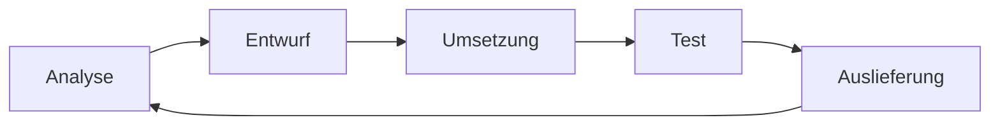
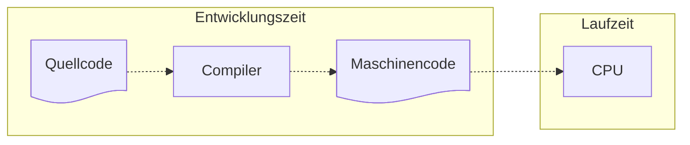
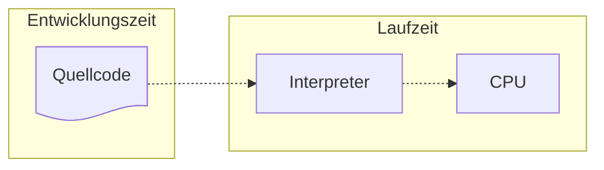
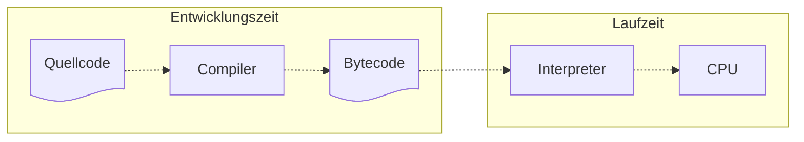

import Tabs from '@theme/Tabs';
import TabItem from '@theme/TabItem';

Als ein Teilbereich der Softwareentwicklung umfasst das Programmieren vor allem
die Umsetzung eines Softwareentwurfs in Quellcode. Allgemein versteht man unter
Programmieren die Umsetzung von [Algorithmen](algorithms) in lauffähige
Programme.

```mermaid
flowchart LR
   Analyse --> Entwurf --> Umsetzung --> Test --> Auslieferung --> Analyse
```

:::info

Ein Algorithmus ist eine Handlungsvorschrift zur Lösung eines Problems.

:::

## Abstraktionsniveau

Maschinen sind im Vergleich zum menschlichen Gehirn sehr primitive Gebilde. Die
Diskrepanz zwischen der menschlichen Denkweise und der Arbeitsweise von
Maschinen bezeichnet man als _Semantische Lücke_. Programmiersprachen
ermöglichen es, Problemstellungen der realen Welt abstrahiert und
maschinengerecht abzubilden und damit diese Lücke zu verringern. Je höher die
Abstraktion einer Programmiersprache ist, desto mehr lässt sich die Semantische
Lücke verringern: Maschinenorientierte Sprachen (z.B. x86-Assembler)
abstrahieren kaum und sind daher für den Menschen schwerer verständlich,
problemorientierte Sprachen (z.B. Java) abstrahieren stark und sind daher
deutlich leichter verständlich.

|                  | Generation                     | Merkmale                                   | Sprachen                                     |
| ---------------- | ------------------------------ | ------------------------------------------ | -------------------------------------------- |
| Höhere Sprachen  | 5: Sprachen der KI             | Logik- und Regelbasiert                    | Lisp, Prolog                                 |
| Höhere Sprachen  | 4: Anwendungsbezogene Sprachen | Domänenspezifisch                          | SQL                                          |
| Höhere Sprachen  | 3: Problemorientierte Sprachen | Datenobjekte, Routinen, Kontrollstrukturen | C, C++, C#, Java, JavaScript, Python         |
| Niedere Sprachen | 2: Assemblersprachen           | Symbolische Befehle                        | X86-Assembler, MIPS-Assembler, ARM-Assembler |
| Niedere Sprachen | 1: Maschinensprache            | Binärcode                                  | -                                            |

## Programmierparadigmen

Unter einem Programmierparadigma versteht man die grundlegende Herangehensweise,
Probleme mit Hilfe einer Programmiersprache zu lösen. Viele Programmiersprachen
unterstützen dabei mehrere Paradigmen gleichzeitig, auch wenn sie oft einem
bestimmten Paradigma zugeordnet werden. Generell werden Programmierparadigmen in
zwei große Kategorien eingeteilt: Bei _imperativen_ Paradigmen steht die Frage
_Wie soll das Ergebnis erreicht werden?_ im Vordergrund, bei _deklarativen_
Paradigmen die Frage _Was soll das Ergebnis sein?_ Imperative Paradigmen legen
also Schritt für Schritt fest, wie ein Ergebnis erreicht wird; deklarative
Paradigmen beschreiben stattdessen das gewünschte Ergebnis.

| Programmierparadigmen            | Kategorie                  | Fokus                                                                                                                                                                                                                                                            | Beispielsprachen |
| -------------------------------- | -------------------------- | ---------------------------------------------------------------------------------------------------------------------------------------------------------------------------------------------------------------------------------------------------------------- | ---------------- |
| Prozedurale Programmierung       | Imperative Programmierung  | Routinen werden in Prozeduren gekapselt. Es gibt eine klare Trennung zwischen Daten und Routinen. Routinen stellen dabei wiederverwendbaren Code dar, der aus verzweigten und sich wiederholenden Folgen von Anweisungen besteht, die den Programmablauf steuern | Pascal, C        |
| Objektorientierte Programmierung | Imperative Programmierung  | Objekte verbinden sowohl Daten als auch Routinen. Zentrale Aspekte sind _[Datenkapselung](oo#datenkapselung)_, _[Abstraktion](oo#abstraktion)_, _[Vererbung](inheritance)_ und _[Polymorphie](polymorphism)_                                                     | C++, Java        |
| Funktionale Programmierung       | Deklarative Programmierung | Berechnungen werden als die Auswertung mathematischer Funktionen betrachtet. Seiteneffekte (veränderliche Daten und Zustände) werden vermieden                                                                                                                   | Haskell, Lisp    |
| Logische Programmierung          | Deklarative Programmierung | Fakten und Regeln werden zur logischen Deduktion verwendet. Es wird festgelegt, was bekannt ist, um daraus abzuleiten, was daraus folgt                                                                                                                          | Prolog           |

## Programmausführung

Programme können auf einem Computer auf unterschiedliche Arten ausgeführt
werden. Bei _Compilersprachen_ wird der Quellcode vor der Ausführung vollständig
in eine ausführbare Datei übersetzt. Bei _Interpretersprachen_ wird der
Quellcode zur Laufzeit direkt ausgeführt, ohne vorherige Übersetzung.
_Just-In-Time- Compilersprachen_ (JIT) kombinieren beide Ansätze: Der Quellcode
wird zunächst in einen plattformunabhängigen Bytecode kompiliert, der dann zur
Laufzeit ausgeführt wird. Compilersprachen wie C und C++ sind dabei besonders
performant, Interpretersprachen wie JavaScript und Python sind
plattformunabhängig und JIT-Sprachen wie C# und Java vereinen die Vorteile
beider Ansätze.

<Tabs>
  <TabItem value="a" label="Compilersprachen" default>

```mermaid
flowchart LR
   sourcecode[Quellcode]@{ shape: doc }
   machinecode[Maschinencode]@{ shape: doc }
   compiler[Compiler]
   cpu[CPU]
   subgraph Entwicklungszeit
      sourcecode -.-> compiler -.-> machinecode
   end
   subgraph Laufzeit
      cpu
   end
   machinecode -.-> cpu
```

  </TabItem>
  <TabItem value="b" label="Interpretersprachen">

```mermaid
flowchart LR
   sourcecode[Quellcode]@{ shape: doc }
   interpreter[Interpreter]
   cpu[CPU]
   subgraph Entwicklungszeit
      sourcecode
   end
   subgraph Laufzeit
      interpreter -.-> cpu
   end
   sourcecode -.-> interpreter
```

  </TabItem>
  <TabItem value="c" label="Just-In-Time Compilersprachen">

```mermaid
flowchart LR
   sourcecode[Quellcode]@{ shape: doc }
   bytecode[Bytecode]@{ shape: doc }
   compiler[Compiler]
   interpreter[Interpreter]
   cpu[CPU]
   subgraph Entwicklungszeit
      sourcecode -.-> compiler -.-> bytecode
   end
   subgraph Laufzeit
      interpreter -.-> cpu
   end
   bytecode -.-> interpreter
```

  </TabItem>
</Tabs>

:::info

In Java wird der Interpreter als _Java Virtual Machine_ bezeichnet.

:::
