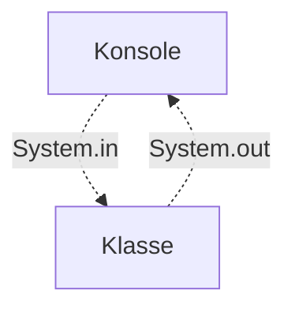

Konsolenanwendungen sind Programme ohne eine grafische Benutzeroberfläche d.h. die Steuerung sowie die Eingabe und Ausgabe erfolgen ausschließlich über textuelle Anweisungen.



## Konsoleneingaben

Die Klasse `Scanner` im Paket `java.util` stellt Methoden zur Verfügung, um Eingaben von der Konsole einzulesen und in entsprechende Datentypen umzuwandeln.

```java title="MainClass.java" showLineNumbers
public class MainClass {

  public static void main(String[] args) {
    Scanner scanner = new Scanner(System.in);
    int i = scanner.nextInt();
    System.out.println(i);
  }

}
```

:::note Hinweis

Dem Konstruktor muss der Standard-Eingabestrom `System.in` als Wert mitgegeben werden.

:::

## Konsolenausgaben

Der Standard-Ausgabestrom `System.out` bietet verschiedene Methoden, um Informationen auf der Konsole auszugeben:

- Bei den print-Methoden wird die Information unverändert und linksbündig ausgegeben
- Bei den println-Methoden wird die Information unverändert und linksbündig ausgegeben. Zusätzlich wird ein Zeilenumbruch ausgeführt
- Bei den printf-Methoden wird die Information formatiert ausgegeben. Die Formatierungsregeln sind nach dem Muster _[flags]\[width][.precision]conversion-character_ aufgebaut

```java title="MainClass.java" showLineNumbers
public class MainClass {

  public static void main(String[] args) {
    System.out.print("Winter is Coming");
    System.out.println("Winter is Coming");
    System.out.printf("%25S", "Winter is Coming");
  }

}
```
