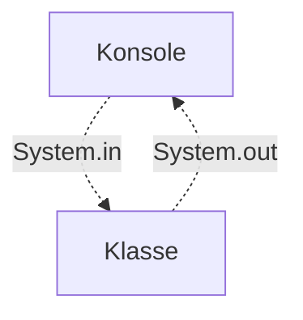

Konsolenanwendungen sind Programme ohne grafische Benutzeroberfläche. Die
Steuerung sowie die Ein- und Ausgabe erfolgen ausschließlich über textuelle
Anweisungen.


```mermaid
flowchart
   konsole[Konsole] -.->|System.in| klasse[Klasse]
   klasse -.->|System.out| konsole
```

## Konsoleneingaben

Die Klasse `Scanner` im Paket `java.util` stellt Methoden bereit, um Eingaben
von der Konsole einzulesen und in entsprechende Datentypen umzuwandeln. Dem
Konstruktor muss dazu der Standard-Eingabestrom `System.in` übergeben werden.

```java title="MainClass.java" showLineNumbers
public class MainClass {

   public static void main(String[] args) {
      Scanner scanner = new Scanner(System.in);
      int i = scanner.nextInt();  // ganze Zahl einlesen
      System.out.println(i);
   }

}
```

Die folgende Tabelle zeigt häufig verwendete Methoden der Klasse `Scanner`.

| Methode         | Rückgabetyp | Beschreibung                                     |
| --------------- | ----------- | ------------------------------------------------ |
| `nextInt()`     | `int`       | Liest die nächste ganze Zahl ein                 |
| `nextDouble()`  | `double`    | Liest die nächste Dezimalzahl ein                |
| `nextBoolean()` | `boolean`   | Liest den nächsten booleschen Wert ein           |
| `next()`        | `String`    | Liest das nächste Wort ein (bis zum Leerzeichen) |
| `nextLine()`    | `String`    | Liest die nächste Zeile ein                      |

:::info

Dem Konstruktor muss der Standard-Eingabestrom `System.in` übergeben werden.

:::

## Konsolenausgaben

Der Standard-Ausgabestrom `System.out` bietet verschiedene Methoden, um
Informationen auf der Konsole auszugeben:

- `print()` — gibt den Text ohne Zeilenumbruch aus
- `println()` — gibt den Text aus und fügt einen Zeilenumbruch an
- `printf()` — gibt den Text formatiert aus; die Formatierungsregeln folgen dem
  Muster `[flags][width][.precision]conversion-character`

```java title="MainClass.java" showLineNumbers
public class MainClass {

   public static void main(String[] args) {
      System.out.print("Winter is Coming");
      System.out.println("Winter is Coming");
      System.out.printf("%25S", "Winter is Coming");
   }

}
```
