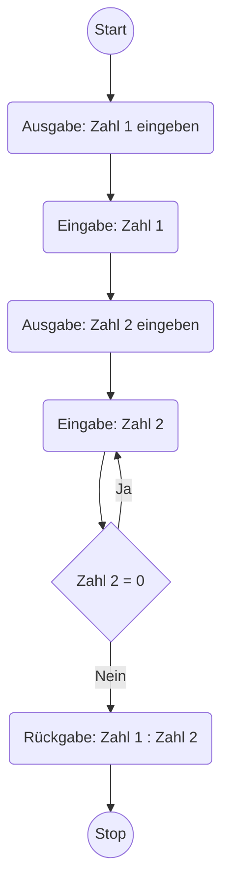

Kontrollstrukturen wie [Verzweigungen](cases.md) und [Schleifen](loops.md) sind wesentliche Bestandteile der Programmierung. Verzweigungen ermöglichen die Ausführung unterschiedlicher Anweisungsblöcke, mit Hilfe von Schleifen können Anweisungsblöcke wiederholt 
ausgeführt werden.

