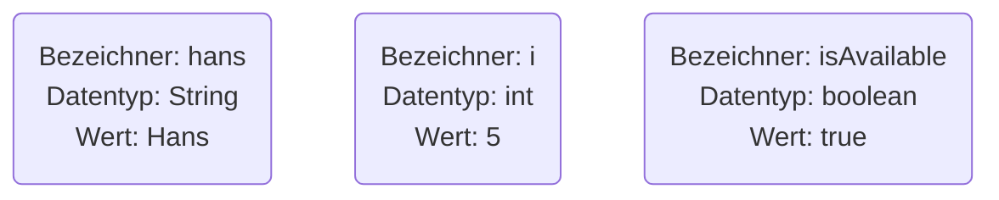
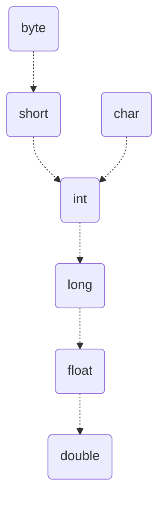

Ein Datenobjekt ist ein Platzhalter, der zur Laufzeit eine bestimmte Stelle des
Arbeitsspeichers belegt. Die Größe des reservierten Speichers ist abhängig vom
gewählten [Datentyp](data-types)). Datenobjekte können mit Werten belegt werden,
Bezeichner ermöglichen das Ansprechen im Programmablauf. Man unterscheidet
zwischen variablen Datenobjekten (_Variablen_) und fixen Datenobjekten
(_Konstanten_ und _Literale_). Konstanten sind fixe Datenobjekte, die über einen
Bezeichner angesprochen werden können. Sie werden mit dem Schlüsselwort `final`
deklariert. Literale sind sogenannte wörtliche Konstanten, d.h. fixe
Datenobjekte ohne Bezeichner. Da Literale über keinen Bezeichner verfügen,
können Sie im Programm nicht angesprochen werden.



## Deklaration von Datenobjekten

Durch Angabe von Datentyp und Bezeichner wird ein Datenobjekt deklariert, d.h.
dem Compiler bekannt gegeben. Deklarationen werden wie jede Anweisung mit einem
Semikolon abgeschlossen. Datenobjekte gleichen Datentyps können mit Komma
getrennt aufgeführt werden.

```java title="MainClass.java" showLineNumbers
public class MainClass {

  public static void main(String[] args) {
    int a, b;
    boolean error;
    char char1;
    String text;
  }

}
```

:::danger Hinweis

Java ist case-sensitiv, unterscheidet also zwischen Groß- und Kleinschreibung.
Um die Lesbarkeit zu erhöhen, sollten Variablen mit einem Kleinbuchstaben
beginnen, wohingegen Konstanten immer in Großbuchstaben geschrieben werden
sollten.

:::

## Initialisierung von Datenobjekten

In Java müssen Datenobjekte vor der ersten Verwendung explizit initialisiert
werden, d.h. mit einem Wert belegt werden. Der Zuweisungsoperator `=` weist dem
Datenobjekt auf der linken Seite den Wert des Ausdrucks auf der rechten Seite
zu.

```java title="MainClass.java" showLineNumbers
public class MainClass {

  public static void main(String[] args) {
    int a = 42, b = a;
    boolean error = true;
    char char1;
    String text;

    char1 = 'M';
    text = "Winter is Coming";
  }

}
```

## Typinferenz bei Datenobjekten

Unter Typinferenz versteht man, dass bei der Deklaration eines Datenobjekts auf
die Angabe eine Datentyps verzichtet werden kann, wenn der Compiler aufgrund der
restlichen Angaben den Typ selbstständig ermitteln kann. Für die Typinferenz
wird das Schlüsselwort `var` verwendet.

```java title="MainClass.java" showLineNumbers
public class MainClass {

  public static void main(String[] args) {
    int i = 5;
    i = "Text"; // Kompilierungsfehler

    var j = 5;
    j = "Text"; // Kompilierungsfehler
  }

}
```

:::danger Hinweis

Mit `var` deklarierte Datenobjekte sind weiterhin statisch typisiert.

:::

## Gültigkeitsbereiche von Datenobjekten

Datenobjekte sind nur innerhalb eines Anweisungsblocks gültig, d.h. man kann nur
innerhalb dieses Programmabschnitts auf das Datenobjekt zugreifen.

```java title="MainClass.java" showLineNumbers
public class MainClass {

  public static void main(String[] args) {
    int a = 1, b;
    b = foo(a);
  }

  public static int foo(int c) {
    int d;
    d = a++; // Kompilierungsfehler
    d = c++;
    return d;
  }

}
```

## Typumwandlung (Type Casting)

Der Cast-Operator `()` erlaubt die explizite Umwandlung eines Datentyps in einen
anderen. Bei Wertzuweisungen findet eine implizite Typumwandlung vom
niederwertigen zum höherwertigen Datentyp statt. Zu beachten ist, dass bei einer
Typumwandlung ein Genauigkeitsverlust stattfinden kann.

```java title="MainClass.java" showLineNumbers
public class MainClass {

  public static void main(String[] args) {
    int a = 14;
    int b = 3;
    double result;

    // implizite Typumwandlung
    result = a / b;
    System.out.println(result);

    // explizite Typumwandlung
    result = (double) a / b;
    System.out.println(result);
  }

}
```

Die Wertigkeit von Datentypen entscheidet darüber, welche Typumwandlungen
möglich sind.



:::note Hinweis

Für den Datentyp `boolean` ist keine Typumwandlung möglich.

:::
