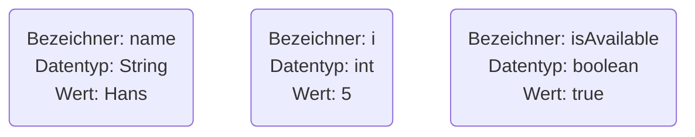
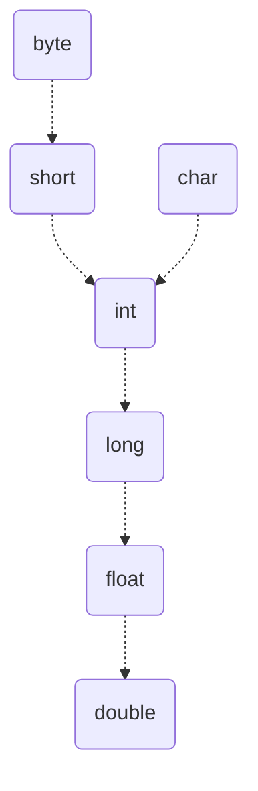

Ein Datenobjekt ist ein Platzhalter, der zur Laufzeit eine bestimmte Stelle im
Arbeitsspeicher belegt. Die Größe des reservierten Speichers hängt vom gewählten
[Datentyp](data-types) ab. Datenobjekte können mit Werten belegt werden;
Bezeichner ermöglichen es, sie im Programmablauf anzusprechen. Man unterscheidet
zwischen variablen Datenobjekten (_Variablen_) und fixen Datenobjekten
(_Konstanten_ und _Literale_). Konstanten sind fixe Datenobjekte mit einem
Bezeichner und werden mit dem Schlüsselwort `final` deklariert. Literale sind
sogenannte wörtliche Konstanten — also fixe Datenobjekte ohne Bezeichner, auf
die daher im Programmcode nicht zugegriffen werden kann.


```mermaid
flowchart
   name(Bezeichner: name
        Datentyp: String
        Wert: Hans)
   i(Bezeichner: i
     Datentyp: int
     Wert: 5)
   isAvailable(Bezeichner: isAvailable
               Datentyp: boolean
               Wert: true)
```

## Deklaration von Datenobjekten

Durch die Angabe von Datentyp und Bezeichner wird ein Datenobjekt deklariert,
d.h. dem Compiler bekannt gemacht. Deklarationen werden wie jede Anweisung mit
einem Semikolon abgeschlossen. Mehrere Datenobjekte desselben Datentyps können
kommagetrennt in einer Zeile deklariert werden.

```java title="MainClass.java" showLineNumbers
public class MainClass {

   public static void main(String[] args) {
      int a, b;
      boolean error;
      char char1;
      String text;
   }

}
```

:::info

Java ist case-sensitiv und unterscheidet also zwischen Groß- und
Kleinschreibung. Zur besseren Lesbarkeit sollten Variablen mit einem
Kleinbuchstaben beginnen, Konstanten hingegen vollständig in Großbuchstaben
geschrieben werden.

:::

## Initialisierung von Datenobjekten

In Java müssen Datenobjekte vor ihrer ersten Verwendung explizit initialisiert,
d.h. mit einem Wert belegt werden. Der Zuweisungsoperator `=` weist dem
Datenobjekt auf der linken Seite den Wert des Ausdrucks auf der rechten Seite
zu.

```java title="MainClass.java" showLineNumbers
public class MainClass {

   public static void main(String[] args) {
      int a = 42, b = a;
      boolean error = true;
      char char1;
      String text;

      char1 = 'M';
      text = "Winter is Coming";
   }

}
```

## Typinferenz bei Datenobjekten

Unter _Typinferenz_ versteht man, dass bei der Deklaration eines Datenobjekts
auf die explizite Angabe eines Datentyps verzichtet werden kann, wenn der
Compiler den Typ anhand der übrigen Angaben selbstständig ermitteln kann. Für
die Typinferenz wird das Schlüsselwort `var` verwendet.

```java title="MainClass.java" showLineNumbers
public class MainClass {

   public static void main(String[] args) {
      int i = 5;
      i = "Text"; // Kompilierungsfehler

      var j = 5;
      j = "Text"; // Kompilierungsfehler: j ist statisch als int typisiert
   }

}
```

:::info

Mit `var` deklarierte Datenobjekte sind weiterhin statisch typisiert.

:::

## Gültigkeitsbereiche von Datenobjekten

Datenobjekte sind nur innerhalb des Anweisungsblocks gültig, in dem sie
deklariert wurden. Außerhalb dieses Blocks kann nicht auf sie zugegriffen
werden.

```java title="MainClass.java" showLineNumbers
public class MainClass {

   public static void main(String[] args) {
      int a = 1, b;
      b = foo(a);
   }

   public static int foo(int c) {
      int d;
      d = a++; // Kompilierungsfehler: a ist hier nicht sichtbar
      d = c++;
      return d;
   }

}
```

## Typumwandlung (Type Casting)

Der Cast-Operator `()` erlaubt die explizite Umwandlung eines Datentyps in einen
anderen. Bei Wertzuweisungen findet außerdem eine implizite Typumwandlung vom
niederwertigen zum höherwertigen Datentyp statt. Zu beachten ist, dass bei einer
Typumwandlung ein Genauigkeitsverlust auftreten kann.

```java title="MainClass.java" showLineNumbers
public class MainClass {

   public static void main(String[] args) {
      int a = 14;
      int b = 3;
      double result;

      // implizite Typumwandlung: Ergebnis ist 4.0, da beide Operanden int sind
      result = a / b;
      System.out.println(result);

      // explizite Typumwandlung: Ergebnis ist 4.666...
      result = (double) a / b;
      System.out.println(result);
   }

}
```

Die Wertigkeit der Datentypen bestimmt, welche Typumwandlungen möglich sind.


```mermaid
flowchart
   byte(byte) -.-> short(short)
   short -.-> int(int)
   char(char) -.-> int
   int -.-> long(long)
   long -.-> float(float)
   float -.-> double(double)
```

:::info

Für den Datentyp `boolean` ist keine Typumwandlung möglich.

:::
