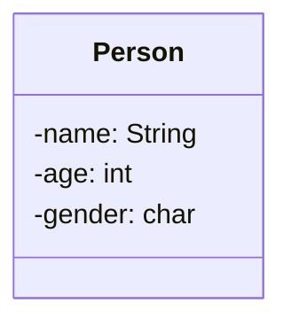

import Tabs from '@theme/Tabs';
import TabItem from '@theme/TabItem';

Datentypen legen neben der Größe des Arbeitsspeichers, die ein Datenobjekt
benötigt, auch die Art der Information fest, die im Datenobjekt gespeichert
werden kann.

<Tabs>
  <TabItem value="a" label="Primitive Datentypen" default>

Primitive Datentypen sind fest in der Programmiersprache verankert und können
durch entsprechende Schlüsselwörter angesprochen werden. Java kennt 8 solcher
primitiver Datentypen.

| Datentyp | Größe  | Wertebereich                                              |
| -------- | ------ | --------------------------------------------------------- |
| boolean  | -      | true, false                                               |
| char     | 2 Byte | \\u0000 bis \\uFFFF                                       |
| byte     | 1 Byte | -128 bis +127                                             |
| short    | 2 Byte | -32.768 bis +32.767                                       |
| int      | 4 Byte | -2.147.483.648 bis +2.147.483.647                         |
| long     | 8 Byte | -9.233.372.036.854.775.808 bis +9.233.372.036.854.775.807 |
| float    | 4 Byte | +/-1,4e-45 bis +/-3,4028235e+38                           |
| double   | 8 Byte | +/-4,9e-324 bis +/-1,7976931348623157e+308                |

  </TabItem>
  <TabItem value="b" label="Strukturierte Datentypen">

Klassen werden auch als strukturierte Datentypen bezeichnet, da sie im Gegensatz
zu primitiven Datentypen beliebig viele, unterschiedlich typisierte Attribute
enthalten können.

:::note Hinweis

Weitere Informationen zu strukturierten Datentypen finden sich im Kapitel
[Objektorientierte Programmierung](oo).

:::

  </TabItem>
  <TabItem value="c" label="Generische Datentypen">

Klassen, die über einen oder mehrere formale Typparameter verfügen, werden als
generische Klassen bezeichnet. Generische Klassen können mit verschiedenen
Datentypen verwendet werden und ermöglichen dadurch die Wiederverwendung von
Code unter Beibehaltung statischer Typsicherheit. Unter Typsicherheit versteht
man, dass Datentypen gemäß ihrer Definition verwendet werden und dabei keine
Typverletzungen auftreten. Bei statisch typisierten Sprachen findet die
Typprüfung bei der Kompilierung statt. Beispiele für generische Klassen sind die
Klasse `ArrayList<E>` sowie die Klasse `HashMap<K, V>`.

:::note Hinweis

Weitere Informationen zu generischen Datentypen finden sich im Kapitel
[Generische Programmierung](generics).

:::

  </TabItem>
  <TabItem value="d" label="Abstrakte Datentypen">

Abstrakte Datentypen sind Sammlungen von Daten samt den dazugehörigen
Operationen wie Einfügen, Löschen etc. Beispiele für abstrakte Datentypen sind
Listen (z.B. die Klassen `ArrayList<E>` und `LinkedList<E>`), Mengen (z.B. die
Klassen `HashSet<E>` und `TreeSet<E>`), Warteschlangen (z.B. die Klassen
`LinkedList<E>` und `PriorityQueue<E>`) sowie Assoziativspeicher (z.B. die
Klassen `HashMap<K, V>` und `TreeMap<K, V>`).

:::note Hinweis

Weitere Informationen zu abstrakten Datentypen finden sich in den Kapiteln
[Feldbasierte Listen (ArrayLists)](array-lists), [Listen](lists),
[Java Collections Framework](java-collections-framework) und
[Assoziativspeicher (Maps)](maps).

:::

  </TabItem>
</Tabs>
