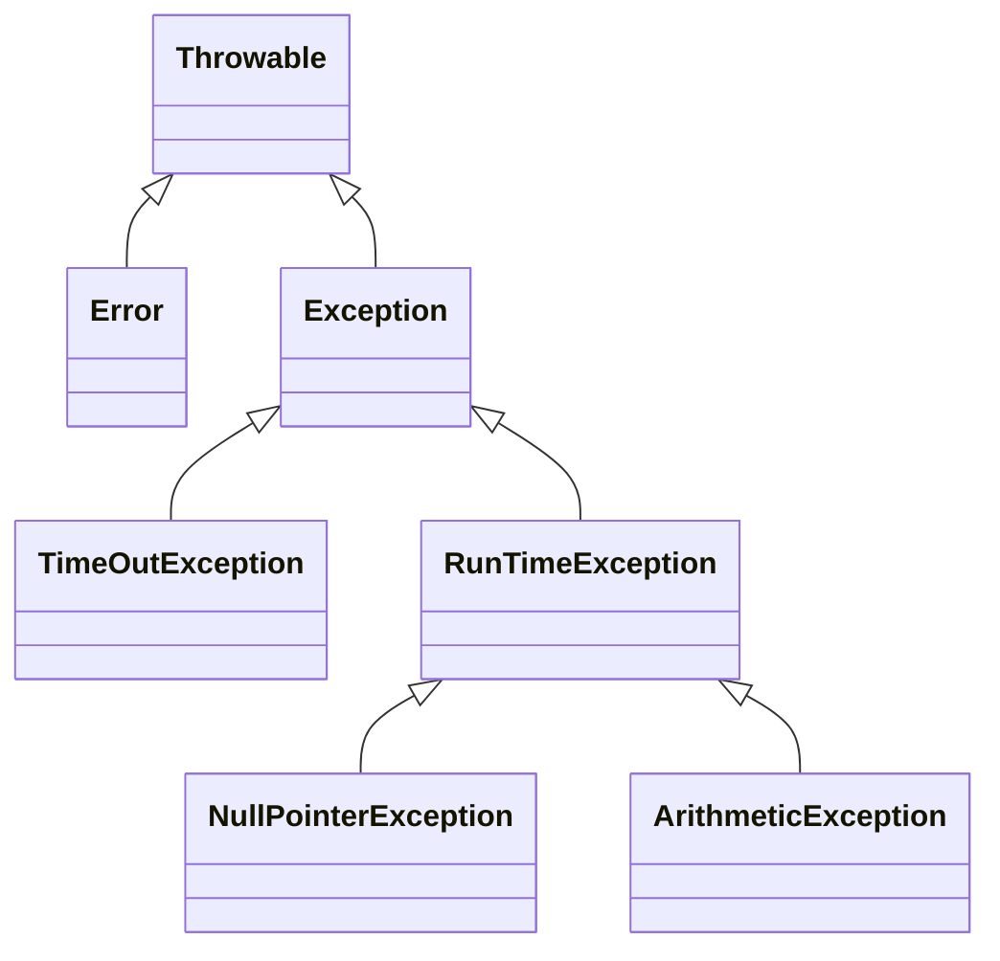

import Tabs from '@theme/Tabs';
import TabItem from '@theme/TabItem';

Programmfehler (Bugs) führen dazu, dass Programme unerwartete Ergebnisse liefern
oder abstürzen. Je komplexer das Programm, desto wichtiger wird eine durchdachte
und konsequente Fehlerbehandlung. Man unterscheidt dabei zwischen verschiedenen
Fehlerarten: Kompilierungsfehler, Logikfehler und Laufzeitfehler.

<Tabs>
  <TabItem value="a" label="Kompilierungsfehler" default>

Kompilierungsfehler sind Programmfehler, die verhindern, dass das Programm
ausgeführt werden kann. Sie können relativ einfach behoben werden, da sie schon
zur Designzeit auftreten und von den meisten Entwicklungsumgebungen direkt
angezeigt werden.

  </TabItem>
  <TabItem value="b" label="Logikfehler">

Verhält sich das Programm nicht wie beabsichtigt, spricht man von Logikfehlern.
Sie sind mit am schwersten zu entdecken und zu beheben. Zur Unterstüzung bei der
Fehlersuche und -behandlung kann unter Anderem der Debugger verwendet werden.
Der Debugger ermöglicht es, Programme zur Laufzeit zu analysieren und zu
steuern. Durch das Setzen von Haltepunkten (Breakpoints) kann die Ausführung des
Programms an beliebiger Stelle angehalten werden. Dadurch lassen sich z.B. die
Inhalte von Datenobjekten überprüfen. Zudem bietet der Debugger die Möglichkeit,
die weitere Ausführung des Programms in der gewünschten Schrittweite
forzuführen.

  </TabItem>
  <TabItem value="c" label="Laufzeitfehler">

Laufzeitfehler treten erst beim Ausführen des Programms auf. Sie entstehen meist
dann, wenn das Programm versucht, eine Operation auszuführen, die nicht
ausgeführt werden kann (z.B. die Division durch Null). Diese Situationen werden
auch als Ausnahmen (Exceptions) bezeichnet. Ausnahmen gewährleisten eine klare
Trennung zwischen funktionalem Code und Code zur Fehlerbehandlung. Die
Fehlerbehandlung erfolgt dabei gemäß dem Ausnahmenbehandlungsprozess: nachdem
eine Ausnahme ausgelöst wurde, kann bzw. muss diese je nach Ausnahmenart vom
Empfänger der Ausnahme entweder behandelt oder weitergeleitet werden
_Catch-or-Throw-Regel_ Man unterscheidet zwischen _geprüften_ (checked) und
_ungeprüften_ (unchecked) Ausnahmen. Geprüfte Ausnahmen müssen, ungeprüfte
Ausnahmen können behandelt bzw. weitergeleitet werden.

  </TabItem>
</Tabs>

## Die Klassenhierarchie der Laufzeitfehler

Die Klasse `Throwable` stellt die Oberklasse aller Laufzeitfehler dar.
Schwerwiegende Fehler (hauptsächlich Probleme in der JVM (Java Virtual Machine))
werden durch Unterklassen der Klasse `Error` abgebildet, geprüfte Ausnahmen
durch Unterklassen der Klasse `Exception` und ungeprüfte Ausnahmen durch
Unterklassen der Klasse `RuntimeException`.



## Definition von Ausnahmenklassen

Eigene Ausnahmenklassen werden durch einfaches Ableiten von einer bestehenden
Ausnahmenklasse definiert. Ausnahmenklassen sollten dabei immer von der Klasse
`Exception` oder einer ihrer Unterklassen abgeleitet werden, nicht von der
Klasse `Error`.

```java title="InvalidValueException.java" showLineNumbers
public class InvalidValueException extends Exception {

   public InvalidValueException() {}

   public InvalidValueException(String message) {}

}
```

## Auslösen von Ausnahmen

Mit dem Schlüsselwort `throw` kann innerhalb einer Methode eine Ausnahme
ausgelöst werden. Die Methode, in der die Ausnahme ausgelöst wird, muss mit dem
Schlüsselwort `throws` die Ausnahmenklasse angeben, die ausgelöst werden kann.

```java title="Computer.java (Auszug)" showLineNumbers
public abstract class Computer {
   ...
   public Computer(String description, Cpu cpu, int memoryInGb) throws InvalidValueException {
      if (memoryInGb <= 0) {
         throw new InvalidValueException();
      }
      this.description = description;
      this.cpu = cpu;
      this.memoryInGb = memoryInGb;
   }
   ...
}
```

## Weiterleiten von Ausnahmen

Ausnahmen können weitergeleitet werden. Hierbei wird die Fehlerbehandlung an die
nächsthöhere Ebene weitergegeben. Um eine Ausnahme weiterzuleiten, muss in der
weiterleitenden Methode mit `throws` die Ausnahme angegeben werden, die
ausgelöst werden kann.

```java title="Notebook.java (Auszug)" showLineNumbers
public final class Notebook extends Computer implements Comparable<Notebook> {
   ...
   public Notebook(String description, Cpu cpu, int memoryInGb, double screenSizeInInches)
         throws InvalidValueException {
      super(description, cpu, memoryInGb);
      this.screenSizeInInches = screenSizeInInches;
   }
   ...
}
```

## Abfangen von Ausnahmen

Mit Hilfe der try-catch-Anweisung können Methoden, die eine Ausnahme auslösen
können, überwacht werden; d.h. die Ausnahmen werden gegebenenfalls abgefangen.
Der try-Block enthält die Anweisungen, die überwacht werden sollen, der
catch-Block enthält die eigentliche Fehlerbehandlung. Als Parameter von `catch`
muss angegeben werden, welche Ausnahme(n) abgefangen werden soll(en).

```java title="MainClass.java" showLineNumbers
public class MainClass {

   public static void main(String[] args) {
      try {
         Notebook notebook = new Notebook("Mein Gaming Laptop", new Cpu(4.7, 8), 32, 16);
      } catch (InvalidValueException e) {
         System.err.println(e.getMessage());
      }
   }

}
```
