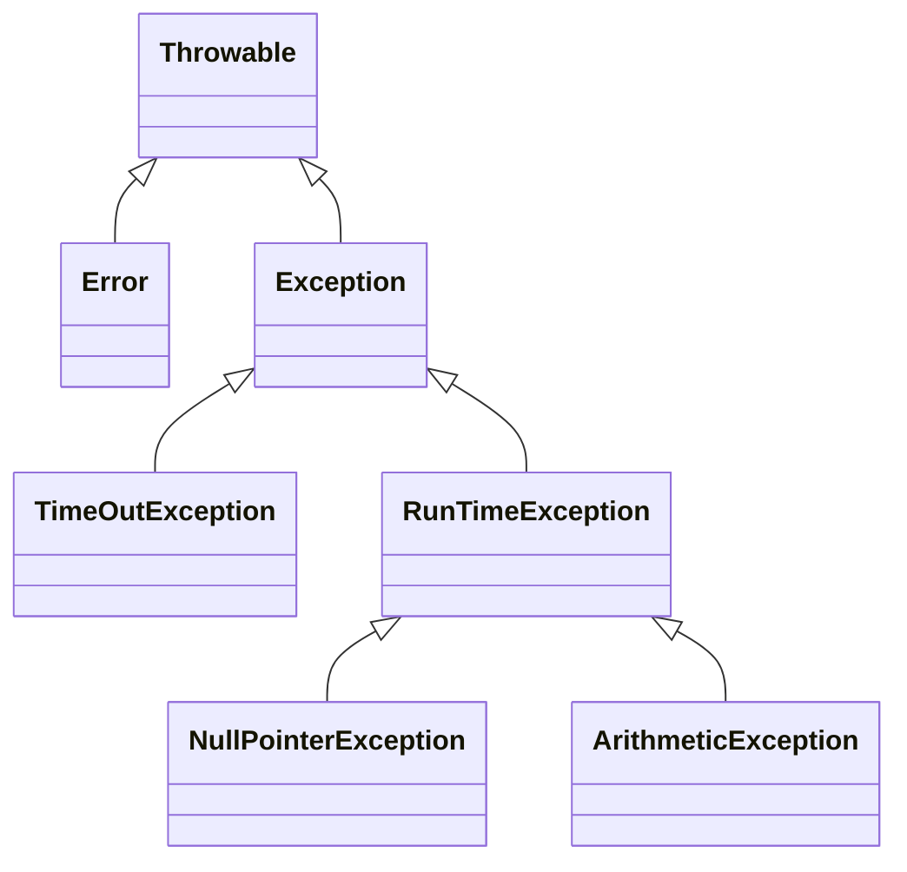

import Tabs from '@theme/Tabs';
import TabItem from '@theme/TabItem';

Programmfehler (Bugs) führen dazu, dass Programme unerwartete Ergebnisse liefern
oder abstürzen. Je komplexer das Programm, desto wichtiger ist eine
strukturierte Fehlerbehandlung. Es gibt drei grundlegende Fehlerarten:
Kompilierungsfehler, Logikfehler und Laufzeitfehler.

<Tabs>
  <TabItem value="a" label="Kompilierungsfehler" default>

Kompilierungsfehler verhindern, dass das Programm übersetzt und ausgeführt
werden kann. Da sie bereits beim Schreiben des Codes auftreten und von
Entwicklungsumgebungen direkt angezeigt werden, lassen sie sich in der Regel
leicht beheben.

  </TabItem>
  <TabItem value="b" label="Logikfehler">

Verhält sich das Programm nicht wie beabsichtigt, spricht man von Logikfehlern.
Sie sind schwer zu entdecken, da das Programm ausgeführt wird, aber falsche
Ergebnisse liefert. Der Debugger kann dabei helfen: Er ermöglicht die
schrittweise Ausführung und das Überprüfen von Variablenwerten zur Laufzeit.

  </TabItem>
  <TabItem value="c" label="Laufzeitfehler">

Laufzeitfehler treten erst beim Ausführen des Programms auf, wenn das Programm
eine Operation versucht, die nicht möglich ist (z.B. Division durch null oder
Zugriff auf ein null-Objekt). Solche Situationen werden als Ausnahmen
(Exceptions) bezeichnet. Die Fehlerbehandlung folgt der _Catch-or-Throw-Regel_:
Eine Ausnahme muss entweder abgefangen (catch) oder weitergeleitet (throw)
werden. Geprüfte (checked) Ausnahmen müssen behandelt werden; ungeprüfte
(unchecked) Ausnahmen können es.

  </TabItem>
</Tabs>

## Die Klassenhierarchie der Laufzeitfehler

`Throwable` ist die Oberklasse aller Laufzeitfehler. Schwerwiegende JVM-Fehler
sind Unterklassen von `Error`. Geprüfte Ausnahmen sind Unterklassen von
`Exception`, ungeprüfte Ausnahmen Unterklassen von `RuntimeException`.


```mermaid
classDiagram
   Throwable <|-- Error
   Throwable <|-- Exception
   Exception <|-- TimeOutException
   Exception <|-- RunTimeException
   RunTimeException <|-- NullPointerException
   RunTimeException <|-- ArithmeticException
```

Eine Übersicht wichtiger Ausnahmenklassen findet sich in der
[Java API](java-api).

## Definition von Ausnahmenklassen

Eigene Ausnahmenklassen werden durch Ableitung von einer bestehenden
Ausnahmenklasse definiert. Es sollte immer von `Exception` oder einer ihrer
Unterklassen abgeleitet werden — nicht von `Error`.

```java title="InvalidValueException.java" showLineNumbers
public class InvalidValueException extends Exception {

   public InvalidValueException() {}

   public InvalidValueException(String message) {}

}
```

## Auslösen von Ausnahmen

Mit dem Schlüsselwort `throw` wird eine Ausnahme ausgelöst. Die auslösende
Methode muss mit `throws` deklarieren, welche geprüften Ausnahmen sie werfen
kann.

```java title="Computer.java (Auszug)" showLineNumbers
public abstract class Computer {
   ...
   public Computer(String description, Cpu cpu, int memoryInGb) throws InvalidValueException {
      if (memoryInGb <= 0) {
         throw new InvalidValueException();
      }
      this.description = description;
      this.cpu = cpu;
      this.memoryInGb = memoryInGb;
   }
   ...
}
```

## Weiterleiten von Ausnahmen

Ausnahmen können an den Aufrufer weitergeleitet werden, anstatt sie direkt zu
behandeln. Die weiterleitende Methode deklariert dafür ebenfalls `throws` mit
der entsprechenden Ausnahmenklasse.

```java title="Notebook.java (Auszug)" showLineNumbers
public final class Notebook extends Computer implements Comparable<Notebook> {
   ...
   public Notebook(String description, Cpu cpu, int memoryInGb, double screenSizeInInches)
         throws InvalidValueException {
      super(description, cpu, memoryInGb);
      this.screenSizeInInches = screenSizeInInches;
   }
   ...
}
```

## Abfangen von Ausnahmen

Die `try-catch`-Anweisung überwacht einen Codeblock auf Ausnahmen. Der
`try`-Block enthält den zu überwachenden Code, der `catch`-Block die
Fehlerbehandlung für eine bestimmte Ausnahmenklasse.

```java title="MainClass.java" showLineNumbers
public class MainClass {

   public static void main(String[] args) {
      try {
         Notebook notebook = new Notebook("Mein Gaming Laptop", new Cpu(4.7, 8), 32, 16);
      } catch (InvalidValueException e) {
         System.err.println(e.getMessage());
      }
   }

}
```

## Der finally-Block

Der optionale `finally`-Block wird nach dem `try`- und allen `catch`-Blöcken
immer ausgeführt — unabhängig davon, ob eine Ausnahme aufgetreten ist oder
nicht. Er eignet sich daher für Aufräumarbeiten wie das Schließen von
Ressourcen.

```java title="MainClass.java" showLineNumbers
public class MainClass {

   public static void main(String[] args) {
      try {
         Notebook notebook = new Notebook("Mein Gaming Laptop", new Cpu(4.7, 8), 32, 16);
      } catch (InvalidValueException e) {
         System.err.println(e.getMessage());
      } finally {
         System.out.println("wird immer ausgeführt");
      }
   }

}
```

Werden Ressourcen wie Dateiströme geöffnet, empfiehlt sich statt `finally` die
_Try-with-Resources_-Anweisung. Klassen, die `AutoCloseable` implementieren,
werden dabei am Ende des `try`-Blocks automatisch geschlossen — auch im
Fehlerfall.

```java title="MainClass.java" showLineNumbers
public class MainClass {

   public static void main(String[] args) {
      try (FileReader reader = new FileReader("data.txt")) {
         // Datei lesen
      } catch (IOException e) {
         System.err.println(e.getMessage());
      }
   }

}
```
