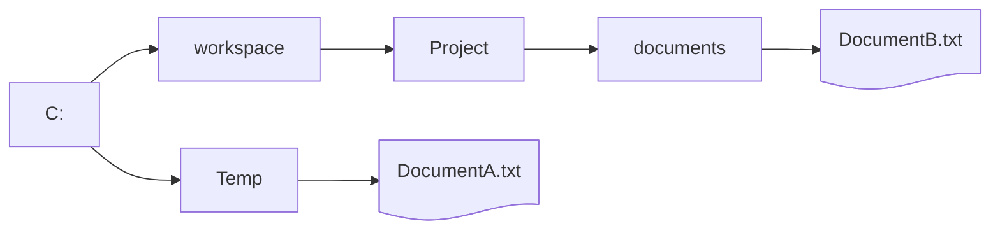

Die Klasse `File` ermöglicht die Arbeit mit Dateien und Verzeichnissen im
Dateisystem. Sie bietet Methoden zum Prüfen, Erstellen und Löschen von Dateien
und Verzeichnissen. Zum Erstellen eines `File`-Objekts wird ein Pfad oder ein
_URI_ (Uniform Resource Identifier) angegeben.

## Lesen von Dateien mit der Klasse _Scanner_

Zum zeilenweisen Lesen einer Datei kann neben den
[Datenstromklassen](io-streams) auch die Klasse `Scanner` verwendet werden.

```java title="MainClass.java" showLineNumbers
public class MainClass {

   public static void main(String[] args) throws FileNotFoundException {
      File file = new File("text.txt");
      Scanner scanner = new Scanner(file);

      while (scanner.hasNextLine()) {
         String line = scanner.nextLine();
         System.out.println(line);
      }

      scanner.close();
   }

}
```

:::info

Nach der letzten Verwendung sollte die Methode `void close()` der Klasse
`Scanner` aufgerufen werden.

:::

## Absolute und relative Pfadangaben

Bei Pfadangaben unterscheidet man zwischen absoluten und relativen Pfaden. Ein
absoluter Pfad beschreibt den vollständigen Weg vom Wurzelverzeichnis bis zur
Zieldatei. Ein relativer Pfad gibt den Weg ausgehend von einem festgelegten
Bezugspunkt an.

:::info

Alle Klassen im Paket `java.io` verwenden als Bezugspunkt das Arbeitsverzeichnis
des Benutzers (Systemeigenschaft `user.dir`).

:::



Die Datei `DocumentA.txt` kann über den absoluten Pfad `C:\Temp\DocumentA.txt`
oder den relativen Pfad `../../Temp/DocumentA.txt` (Bezugspunkt: `Project`)
angesprochen werden. Die Datei `DocumentB.txt` über den absoluten Pfad
`C:\workspace\Project\documents\DocumentB.txt` oder den relativen Pfad
`documents/DocumentB.txt`.
